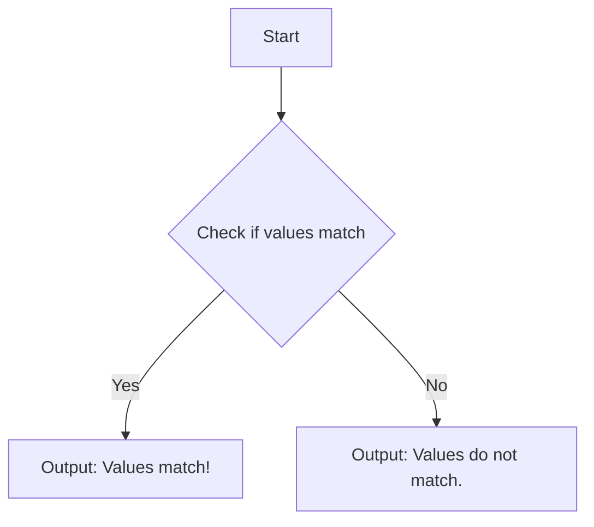
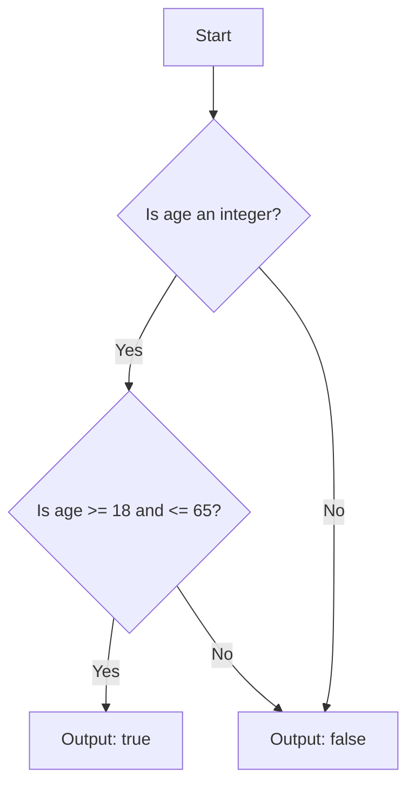

## 3.4. Pattern Matching and Guards in Depth

Pattern matching and guards are two of the most powerful features in Elixir, allowing developers to write expressive and concise code. In this section, we will delve into advanced pattern matching techniques, explore the use of guards to extend pattern matching with conditional logic, and understand the restrictions and best practices associated with these constructs.

### Advanced Pattern Matching

Pattern matching in Elixir is not just a syntactic convenience; it is a fundamental part of the language that allows for elegant and efficient data manipulation. Let's explore some advanced techniques for pattern matching, including matching on complex nested data structures and using the pin operator (`^`) to match against existing bindings.

#### Matching on Complex Nested Data Structures

Elixir's pattern matching capabilities shine when dealing with complex nested data structures. This feature allows you to destructure and extract data from lists, tuples, maps, and structs in a single, readable expression.

Consider the following example, where we have a nested map representing a user profile:

```elixir
defmodule UserProfile do
  def extract_email(%{user: %{contact: %{email: email}}}) do
    email
  end
end

# Usage
profile = %{user: %{contact: %{email: "user@example.com"}}}
IO.puts(UserProfile.extract_email(profile)) # Output: user@example.com
```

In this example, we match the nested structure of the `profile` map to directly extract the `email` field. This approach is both concise and expressive, eliminating the need for multiple lines of code to access deeply nested data.

##### Try It Yourself

Experiment with modifying the structure of the `profile` map. Add additional fields or nest the data further, and update the pattern matching logic to extract different pieces of information.

#### Using the Pin Operator (`^`) to Match Against Existing Bindings

The pin operator (`^`) is used in Elixir to match against existing variable bindings rather than reassigning them. This is particularly useful when you want to ensure that a variable's value remains unchanged during pattern matching.

Here's an example demonstrating the use of the pin operator:

```elixir
defmodule PinExample do
  def check_value(value, ^value) do
    "Values match!"
  end

  def check_value(_, _) do
    "Values do not match."
  end
end

# Usage
IO.puts(PinExample.check_value(10, 10)) # Output: Values match!
IO.puts(PinExample.check_value(10, 20)) # Output: Values do not match.
```

In this example, the pin operator is used to ensure that the second argument matches the existing binding of `value`. If the values do not match, the second clause is executed.

##### Visualizing Pattern Matching with the Pin Operator



This flowchart illustrates the decision-making process when using the pin operator in pattern matching.

### Guards

Guards in Elixir allow you to extend pattern matching with additional conditional logic. They are used to refine matches by adding constraints that must be satisfied for a match to succeed.

#### Extending Pattern Matching with Conditional Logic

Guards are written using the `when` keyword and can include a variety of expressions, such as comparisons, type checks, and arithmetic operations. Here's an example of using guards to match only positive integers:

```elixir
defmodule GuardExample do
  def is_positive(number) when is_integer(number) and number > 0 do
    true
  end

  def is_positive(_) do
    false
  end
end

# Usage
IO.puts(GuardExample.is_positive(5))   # Output: true
IO.puts(GuardExample.is_positive(-3))  # Output: false
IO.puts(GuardExample.is_positive(0))   # Output: false
```

In this example, the guard `when is_integer(number) and number > 0` ensures that the function `is_positive/1` only returns `true` for positive integers.

#### Restrictions on Guard Expressions and How to Work Within Them

Guards in Elixir have certain restrictions. Only a limited set of expressions are allowed, such as:

- Comparisons (`==`, `!=`, `>`, `<`, `>=`, `<=`)
- Boolean operators (`and`, `or`, `not`)
- Type checks (`is_integer/1`, `is_float/1`, `is_atom/1`, etc.)
- Arithmetic operations (`+`, `-`, `*`, `/`)
- The `in` operator for membership tests

These restrictions exist because guards are evaluated in a different context than regular expressions, ensuring they are free of side effects and can be optimized by the compiler.

To work within these restrictions, you can often refactor complex logic into separate functions that return boolean values, which can then be used in guards. Here's an example:

```elixir
defmodule ComplexGuard do
  def is_valid_age(age) when is_integer(age) and age >= 18 and age <= 65 do
    true
  end

  def is_valid_age(_) do
    false
  end
end

# Usage
IO.puts(ComplexGuard.is_valid_age(25))  # Output: true
IO.puts(ComplexGuard.is_valid_age(70))  # Output: false
```

In this example, the guard checks if the `age` is an integer and falls within a specific range.

##### Visualizing Guard Evaluation



This flowchart visualizes the evaluation process of the guard in the `is_valid_age/1` function.

### Key Takeaways

- **Pattern Matching**: Use pattern matching to destructure complex data structures and extract relevant information concisely.
- **Pin Operator**: Utilize the pin operator to match against existing variable bindings, ensuring values remain unchanged.
- **Guards**: Extend pattern matching with guards to add conditional logic, while adhering to the restrictions on guard expressions.
- **Refactoring for Guards**: Refactor complex logic into separate functions to work within guard restrictions and maintain clean, readable code.

### Knowledge Check

- How can you use pattern matching to extract data from nested structures?
- What is the purpose of the pin operator in pattern matching?
- What are some common expressions allowed in guard clauses?
- How can you refactor complex logic to work within guard restrictions?

### Embrace the Journey

Remember, mastering pattern matching and guards in Elixir is a journey. As you continue to explore these features, you'll find new ways to write expressive and efficient code. Keep experimenting, stay curious, and enjoy the journey!

## Quiz: Pattern Matching and Guards in Depth



### Which operator is used to match against existing variable bindings in Elixir?

- [x] The pin operator (`^`)
- [ ] The match operator (`=`)
- [ ] The pipe operator (`|>`)
- [ ] The capture operator (`&`)

> **Explanation:** The pin operator (`^`) is used to match against existing variable bindings in Elixir.

### What is the primary purpose of guards in Elixir?

- [x] To extend pattern matching with conditional logic
- [ ] To destructure complex data structures
- [ ] To optimize code execution
- [ ] To handle exceptions

> **Explanation:** Guards are used to extend pattern matching with additional conditional logic.

### Which of the following expressions is allowed in guard clauses?

- [x] Comparisons (`==`, `!=`, `>`, `<`, `>=`, `<=`)
- [ ] Function calls with side effects
- [ ] List comprehensions
- [ ] Pattern matching

> **Explanation:** Comparisons are allowed in guard clauses, while expressions with side effects, list comprehensions, and pattern matching are not.

### How can you refactor complex logic to work within guard restrictions?

- [x] By creating separate functions that return boolean values
- [ ] By using anonymous functions
- [ ] By using macros
- [ ] By using list comprehensions

> **Explanation:** Refactoring complex logic into separate functions that return boolean values allows you to work within guard restrictions.

### What is the output of the following code: `PinExample.check_value(10, 20)`?

- [ ] Values match!
- [x] Values do not match.
- [ ] Error: unmatched pattern
- [ ] Error: invalid guard expression

> **Explanation:** The pin operator ensures that the second argument matches the existing binding of `value`. Since they do not match, the output is "Values do not match."

### Which keyword is used to introduce guards in Elixir?

- [x] when
- [ ] if
- [ ] else
- [ ] case

> **Explanation:** The `when` keyword is used to introduce guards in Elixir.

### What is the result of using the pin operator incorrectly in a pattern match?

- [x] A pattern match error
- [ ] A syntax error
- [ ] A runtime error
- [ ] A warning

> **Explanation:** Using the pin operator incorrectly in a pattern match results in a pattern match error.

### Which of the following is NOT a restriction on guard expressions?

- [ ] No side effects
- [ ] Limited to certain expressions
- [ ] Cannot use pattern matching
- [x] Can use any Elixir function

> **Explanation:** Guard expressions cannot use any Elixir function; they are limited to certain expressions and must be free of side effects.

### True or False: Guards can be used to destructure complex data structures.

- [ ] True
- [x] False

> **Explanation:** Guards cannot be used to destructure complex data structures; they are used to add conditional logic to pattern matching.

### What is a common use case for the pin operator in Elixir?

- [x] To ensure a variable's value remains unchanged during pattern matching
- [ ] To create anonymous functions
- [ ] To optimize performance
- [ ] To handle exceptions

> **Explanation:** The pin operator is commonly used to ensure that a variable's value remains unchanged during pattern matching.


