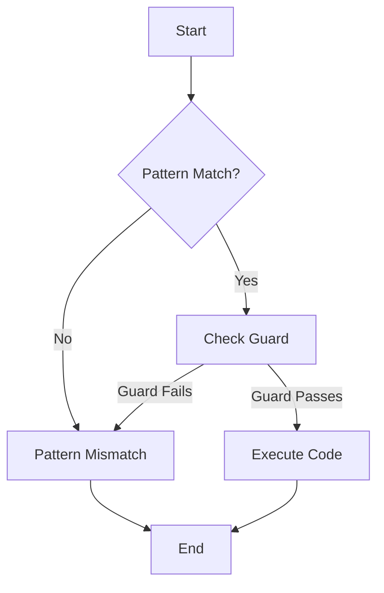

## 3.4. Pattern Matching and Guards in Depth

Pattern matching and guards are two powerful features in Elixir that allow developers to write expressive and concise code. In this section, we will delve deeply into these concepts, exploring advanced techniques and best practices for using them effectively in your Elixir applications.

### Advanced Pattern Matching

Pattern matching is a foundational concept in Elixir, enabling you to destructure and bind variables to values in a clear and declarative manner. Let's explore some advanced aspects of pattern matching, including matching on complex nested data structures and using the pin operator.

#### Matching on Complex Nested Data Structures

Elixir's pattern matching can be applied to complex nested data structures, such as lists, tuples, and maps. This capability allows you to extract specific elements from deeply nested structures with ease.

Consider the following example, where we match against a nested list structure:

```elixir
nested_list = [1, [2, 3], [4, [5, 6]]]

# Match the entire structure
[head, [second | _], [_, [fifth, sixth]]] = nested_list

# head = 1
# second = 2
# fifth = 5
# sixth = 6
```

In this example, we match the first element of the list to `head`, the second element of the second nested list to `second`, and the fifth and sixth elements from the innermost list to `fifth` and `sixth`, respectively.

##### Using Maps in Pattern Matching

Maps are another commonly used data structure in Elixir, and pattern matching can be effectively applied to them as well. Here's an example:

```elixir
person = %{name: "Alice", age: 30, address: %{city: "New York", zip: "10001"}}

# Match specific keys in the map
%{name: name, address: %{city: city}} = person

# name = "Alice"
# city = "New York"
```

By using pattern matching with maps, you can easily extract specific values without having to traverse the entire structure manually.

#### Using the Pin Operator (`^`) to Match Against Existing Bindings

The pin operator (`^`) is a powerful tool in Elixir's pattern matching arsenal. It allows you to match against existing variable bindings, ensuring that a pattern matches a specific value rather than binding a new value.

```elixir
x = 10

# Using the pin operator to match against the existing value of x
case 10 do
  ^x -> "Matched!"
  _ -> "Not Matched!"
end
```

In this example, the pin operator ensures that the pattern matches the existing value of `x`, which is `10`. If the value were different, the pattern would not match.

### Guards

Guards extend pattern matching by allowing you to add conditional logic to your matches. They are particularly useful for refining matches based on additional criteria.

#### Extending Pattern Matching with Conditional Logic

Guards are used in conjunction with pattern matching to impose additional constraints. They are specified using the `when` keyword and can include a variety of expressions, such as comparisons and type checks.

```elixir
defmodule NumberChecker do
  def check_number(number) when is_integer(number) and number > 0 do
    "Positive Integer"
  end

  def check_number(number) when is_integer(number) and number < 0 do
    "Negative Integer"
  end

  def check_number(_number) do
    "Not an Integer"
  end
end
```

In this example, guards are used to check whether a number is a positive or negative integer, or not an integer at all. This allows for more precise control over the function's behavior based on the input.

#### Restrictions on Guard Expressions and How to Work Within Them

Guards in Elixir have certain restrictions. They can only use a limited set of expressions, such as:

- Comparisons (`==`, `!=`, `>`, `<`, `>=`, `<=`)
- Boolean operations (`and`, `or`, `not`)
- Type checks (`is_atom/1`, `is_binary/1`, `is_integer/1`, etc.)
- Arithmetic operations (`+`, `-`, `*`, `/`)
- The `in` operator for membership tests

These restrictions ensure that guards are free of side effects and remain deterministic.

##### Working Within Guard Restrictions

To work within these restrictions, you can often refactor your logic to fit the available expressions. For example, if you need to perform a complex check that isn't allowed in a guard, consider moving that logic into a separate function and using the result in the guard.

```elixir
defmodule EvenChecker do
  def is_even(number) when is_integer(number) do
    rem(number, 2) == 0
  end

  def check_even(number) when is_even(number) do
    "Even"
  end

  def check_even(_number) do
    "Not Even"
  end
end
```

Here, the `is_even/1` function encapsulates the logic for determining if a number is even, allowing it to be used in a guard.

### Visualizing Pattern Matching and Guards

To better understand how pattern matching and guards work together, let's visualize the process using a flowchart.


```mermaid
graph TD;
    A[Start] --> B{Pattern Match?}
    B -->|Yes| C[Check Guard]
    B -->|No| D[Pattern Mismatch]
    C -->|Guard Passes| E[Execute Code]
    C -->|Guard Fails| D
    D --> F[End]
    E --> F
```

In this flowchart, we see that pattern matching occurs first. If the pattern matches, the guard is checked. If the guard passes, the code is executed. If the pattern doesn't match or the guard fails, the process ends with a pattern mismatch.

### Try It Yourself

To solidify your understanding of pattern matching and guards, try modifying the examples provided. Experiment with different data structures, guard expressions, and the use of the pin operator.

### References and Links

For further reading on pattern matching and guards in Elixir, consider the following resources:

- [Elixir's Official Documentation on Pattern Matching](https://elixir-lang.org/getting-started/pattern-matching.html)
- [Elixir's Official Documentation on Guards](https://elixir-lang.org/getting-started/case-cond-and-if.html#guards)

### Knowledge Check

Before moving on, let's review some key takeaways:

- Pattern matching allows you to destructure complex data structures and bind variables to specific values.
- The pin operator (`^`) is used to match against existing variable bindings.
- Guards extend pattern matching by adding conditional logic, allowing for more precise control over matches.
- Guards have restrictions on the types of expressions they can use, ensuring they remain side-effect-free.

### Embrace the Journey

Remember, mastering pattern matching and guards in Elixir is a journey. As you continue to experiment and apply these concepts in your projects, you'll gain a deeper understanding and appreciation for the power and expressiveness they bring to your code.

## Quiz Time!



### What is the primary purpose of pattern matching in Elixir?

- [x] To destructure and bind variables to values in a clear and declarative manner.
- [ ] To execute side-effectful operations.
- [ ] To perform complex mathematical calculations.
- [ ] To handle exceptions and errors.

> **Explanation:** Pattern matching in Elixir is primarily used to destructure and bind variables to values, allowing for clear and declarative code.

### How does the pin operator (`^`) function in pattern matching?

- [x] It matches against existing variable bindings.
- [ ] It creates new variable bindings.
- [ ] It performs arithmetic operations.
- [ ] It checks for type equality.

> **Explanation:** The pin operator (`^`) is used to match against existing variable bindings, ensuring a pattern matches a specific value.

### Which of the following expressions is allowed in a guard?

- [x] is_integer/1
- [ ] IO.puts/1
- [ ] Enum.map/2
- [ ] File.read/1

> **Explanation:** Guards in Elixir can only use a limited set of expressions, including type checks like `is_integer/1`.

### What keyword is used to specify a guard in Elixir?

- [x] when
- [ ] if
- [ ] case
- [ ] cond

> **Explanation:** The `when` keyword is used to specify a guard in Elixir, allowing for additional constraints on pattern matches.

### What happens if a pattern matches but the guard fails?

- [x] The pattern is considered a mismatch.
- [ ] The code executes with a warning.
- [ ] The guard is ignored.
- [ ] The program crashes.

> **Explanation:** If a pattern matches but the guard fails, the pattern is considered a mismatch, and the corresponding code block is not executed.

### Can guards in Elixir perform side-effectful operations?

- [ ] Yes
- [x] No

> **Explanation:** Guards in Elixir cannot perform side-effectful operations. They are restricted to a limited set of expressions to ensure determinism.

### What is the result of using pattern matching on a map with a non-existent key?

- [x] A `MatchError` is raised.
- [ ] The key is automatically added to the map.
- [ ] The value is set to `nil`.
- [ ] The program continues without error.

> **Explanation:** If you attempt to pattern match on a map with a non-existent key, a `MatchError` is raised.

### Which of the following is a valid guard expression?

- [x] number > 0
- [ ] IO.puts("Hello")
- [ ] Enum.reduce(list, 0, &+/2)
- [ ] File.exists?("path/to/file")

> **Explanation:** `number > 0` is a valid guard expression, as it uses a comparison operator, which is allowed in guards.

### How can you work around guard restrictions in Elixir?

- [x] By moving complex logic into a separate function and using the result in the guard.
- [ ] By using macros to bypass restrictions.
- [ ] By using the `cond` keyword instead.
- [ ] By performing I/O operations in the guard.

> **Explanation:** To work around guard restrictions, you can move complex logic into a separate function and use the result in the guard.

### True or False: Pattern matching in Elixir can be used with both lists and maps.

- [x] True
- [ ] False

> **Explanation:** Pattern matching in Elixir can indeed be used with both lists and maps, allowing for powerful data extraction and manipulation.




