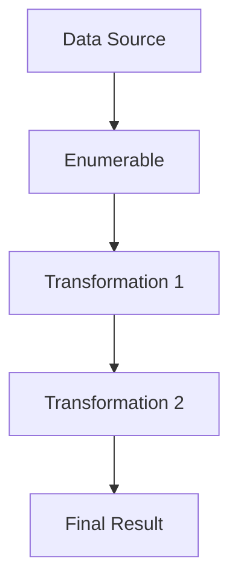

## 3.5. Enumerables and Streams

In Elixir, Enumerables and Streams are powerful abstractions that allow developers to work with collections of data efficiently and expressively. They are essential tools for functional programming, enabling you to process data in a declarative and concise manner. In this section, we will delve into the concepts of Enumerables and Streams, explore their functions, and demonstrate how to use them effectively in your Elixir applications.

### Enumerables

Enumerables in Elixir are collections that implement the `Enumerable` protocol, allowing them to be traversed and manipulated using a set of predefined functions. This protocol is fundamental to Elixir's approach to data processing, providing a consistent interface for working with different data structures like lists, maps, and ranges.

#### Key Functions

The `Enum` module in Elixir provides a rich set of functions for working with Enumerables. Let's explore some of the most commonly used functions:

- **`map/2`**: Transforms each element in a collection by applying a given function.

```elixir
# Example: Doubling each element in a list
list = [1, 2, 3, 4]
doubled = Enum.map(list, fn x -> x * 2 end)
IO.inspect(doubled) # Output: [2, 4, 6, 8]
```

- **`filter/2`**: Filters elements in a collection based on a predicate function.

```elixir
# Example: Filtering even numbers from a list
list = [1, 2, 3, 4, 5, 6]
evens = Enum.filter(list, fn x -> rem(x, 2) == 0 end)
IO.inspect(evens) # Output: [2, 4, 6]
```

- **`reduce/3`**: Reduces a collection to a single value by iteratively applying a function.

```elixir
# Example: Summing all elements in a list
list = [1, 2, 3, 4]
sum = Enum.reduce(list, 0, fn x, acc -> x + acc end)
IO.inspect(sum) # Output: 10
```

- **`all?/2`**: Checks if all elements in a collection satisfy a predicate.

```elixir
# Example: Checking if all numbers are positive
list = [1, 2, 3, 4]
all_positive = Enum.all?(list, fn x -> x > 0 end)
IO.inspect(all_positive) # Output: true
```

- **`any?/2`**: Checks if any element in a collection satisfies a predicate.

```elixir
# Example: Checking if any number is negative
list = [1, -2, 3, 4]
any_negative = Enum.any?(list, fn x -> x < 0 end)
IO.inspect(any_negative) # Output: true
```

#### Working with Maps

Enumerables are not limited to lists. You can also work with maps using the `Enum` module:

```elixir
# Example: Transforming values in a map
map = %{a: 1, b: 2, c: 3}
incremented_map = Enum.map(map, fn {k, v} -> {k, v + 1} end)
IO.inspect(incremented_map) # Output: [a: 2, b: 3, c: 4]
```

### Streams

Streams in Elixir provide a way to work with potentially infinite data sources or large datasets without loading everything into memory at once. They achieve this through lazy evaluation, meaning computations are deferred until the data is actually needed.

#### Creating Streams

You can create streams using the `Stream` module, which provides functions similar to those in `Enum`, but they operate lazily:

- **`Stream.map/2`**: Lazily transforms each element in a collection.

```elixir
# Example: Creating a stream that doubles each element
stream = Stream.map(1..4, fn x -> x * 2 end)
IO.inspect(Enum.to_list(stream)) # Output: [2, 4, 6, 8]
```

- **`Stream.filter/2`**: Lazily filters elements based on a predicate.

```elixir
# Example: Creating a stream of even numbers
stream = Stream.filter(1..6, fn x -> rem(x, 2) == 0 end)
IO.inspect(Enum.to_list(stream)) # Output: [2, 4, 6]
```

#### Infinite Streams

One of the most powerful features of streams is their ability to represent infinite sequences:

```elixir
# Example: Generating an infinite stream of natural numbers
natural_numbers = Stream.iterate(1, &(&1 + 1))
first_ten = Enum.take(natural_numbers, 10)
IO.inspect(first_ten) # Output: [1, 2, 3, 4, 5, 6, 7, 8, 9, 10]
```

#### Composing Streams

Streams can be composed to build complex data processing pipelines:

```elixir
# Example: Composing multiple stream transformations
stream = 1..10
|> Stream.map(&(&1 * 2))
|> Stream.filter(&rem(&1, 3) == 0)

result = Enum.to_list(stream)
IO.inspect(result) # Output: [6, 12, 18]
```

### Performance Considerations

Streams are particularly useful when dealing with large datasets or when performing I/O operations, as they allow you to process data in chunks rather than loading everything into memory. This can lead to significant performance improvements and reduced memory usage.

### Visualizing Enumerables and Streams

To better understand how Enumerables and Streams work, let's visualize the flow of data through a series of transformations:



In this diagram, data flows from the source through a series of transformations, ultimately producing the final result. Streams allow these transformations to be applied lazily, processing data only as needed.

### Try It Yourself

Experiment with the following code examples to deepen your understanding of Enumerables and Streams. Try modifying the functions or data to see how the output changes:

```elixir
# Experiment with different transformations
list = [1, 2, 3, 4, 5]
transformed = list
|> Enum.map(&(&1 * 3))
|> Enum.filter(&(&1 > 5))
IO.inspect(transformed) # Output: [6, 9, 12, 15]

# Create a stream and apply transformations
stream = Stream.cycle([1, 2, 3])
|> Stream.take(10)
|> Stream.map(&(&1 * 2))
result = Enum.to_list(stream)
IO.inspect(result) # Output: [2, 4, 6, 2, 4, 6, 2, 4, 6, 2]
```

### Knowledge Check

- What is the primary difference between Enumerables and Streams in Elixir?
- How does lazy evaluation benefit performance when working with large datasets?
- Can you create an infinite stream in Elixir? If so, how would you limit its output?

### Key Takeaways

- Enumerables provide a consistent interface for traversing and manipulating collections in Elixir.
- Streams enable lazy evaluation, allowing you to work with large or infinite data sources efficiently.
- Both Enumerables and Streams support a wide range of transformations and operations, making them versatile tools for data processing.

### Embrace the Journey

Remember, mastering Enumerables and Streams is just the beginning of your journey with Elixir. As you continue to explore the language, you'll discover even more powerful abstractions and patterns that will enhance your ability to build scalable and performant applications. Keep experimenting, stay curious, and enjoy the journey!

## Quiz: Enumerables and Streams



### What is the primary advantage of using Streams over Enumerables in Elixir?

- [x] Lazy evaluation
- [ ] Faster execution
- [ ] Simpler syntax
- [ ] Better error handling

> **Explanation:** Streams in Elixir provide lazy evaluation, which means they process data only as needed, allowing for efficient handling of large or infinite datasets.

### Which function would you use to transform each element in an Enumerable?

- [x] `Enum.map/2`
- [ ] `Enum.reduce/3`
- [ ] `Enum.filter/2`
- [ ] `Enum.all?/2`

> **Explanation:** `Enum.map/2` is used to apply a transformation function to each element in an Enumerable.

### How can you create an infinite stream of numbers starting from 1?

- [x] `Stream.iterate(1, &(&1 + 1))`
- [ ] `Stream.cycle([1])`
- [ ] `Stream.map(1.., &(&1))`
- [ ] `Stream.filter(1.., &(&1 > 0))`

> **Explanation:** `Stream.iterate/2` can be used to create an infinite stream by repeatedly applying a function to generate the next value.

### What is the result of `Enum.reduce([1, 2, 3], 0, fn x, acc -> x + acc end)`?

- [x] 6
- [ ] 0
- [ ] 3
- [ ] 1

> **Explanation:** `Enum.reduce/3` accumulates the sum of all elements in the list, starting from an initial value of 0.

### Which function checks if all elements in a collection satisfy a given condition?

- [x] `Enum.all?/2`
- [ ] `Enum.any?/2`
- [ ] `Enum.filter/2`
- [ ] `Enum.map/2`

> **Explanation:** `Enum.all?/2` checks if all elements in a collection satisfy a specified predicate function.

### How do you convert a Stream to a list in Elixir?

- [x] `Enum.to_list/1`
- [ ] `Stream.to_list/1`
- [ ] `List.to_stream/1`
- [ ] `Stream.to_enum/1`

> **Explanation:** `Enum.to_list/1` is used to convert a Stream into a list by evaluating all elements.

### What is the output of `Enum.filter([1, 2, 3, 4], fn x -> rem(x, 2) == 0 end)`?

- [x] `[2, 4]`
- [ ] `[1, 3]`
- [ ] `[1, 2, 3, 4]`
- [ ] `[]`

> **Explanation:** `Enum.filter/2` filters elements based on the predicate function, returning only even numbers in this case.

### What does `Stream.cycle([1, 2, 3])` do?

- [x] Creates an infinite stream cycling through `[1, 2, 3]`
- [ ] Creates a finite list `[1, 2, 3]`
- [ ] Reverses the list `[1, 2, 3]`
- [ ] Filters out duplicates from `[1, 2, 3]`

> **Explanation:** `Stream.cycle/1` creates an infinite stream that repeatedly cycles through the given list.

### Can Streams be used to handle I/O operations efficiently?

- [x] True
- [ ] False

> **Explanation:** Streams are ideal for handling I/O operations efficiently because they process data lazily, reducing memory usage.

### Which module provides functions for working with Enumerables in Elixir?

- [x] `Enum`
- [ ] `Stream`
- [ ] `List`
- [ ] `Map`

> **Explanation:** The `Enum` module provides a wide range of functions for working with Enumerables in Elixir.


