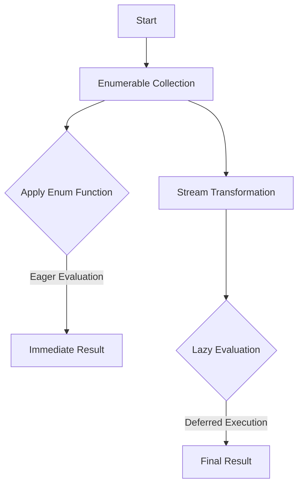

## 3.5. Enumerables and Streams

In the world of Elixir, handling collections of data efficiently is crucial for building scalable and performant applications. Enumerables and Streams are two powerful constructs that enable developers to process data in a functional and efficient manner. In this section, we will delve deep into these concepts, exploring their features, use cases, and best practices.

### Enumerables in Elixir

Enumerables in Elixir provide a set of protocols for traversing and manipulating collections. They are a cornerstone of functional programming in Elixir, allowing developers to apply transformations and aggregations to data in a declarative way.

#### Understanding Enumerables

Enumerables are collections that implement the `Enumerable` protocol. This protocol defines a set of functions that allow iteration over the collection. Common data structures that are enumerables include lists, maps, and ranges.

```elixir
# Example of an Enumerable: List
list = [1, 2, 3, 4, 5]

# Using Enum.map to transform elements
squared = Enum.map(list, fn x -> x * x end)
IO.inspect(squared) # Output: [1, 4, 9, 16, 25]
```

#### Key Functions

Elixir provides a rich set of functions in the `Enum` module to work with enumerables. Let's explore some key functions:

- **`map/2`**: Transforms each element in the collection.
- **`filter/2`**: Selects elements based on a predicate.
- **`reduce/3`**: Aggregates values using an accumulator.
- **`all?/2`**: Checks if all elements satisfy a condition.
- **`any?/2`**: Checks if any element satisfies a condition.

```elixir
# Filtering even numbers
evens = Enum.filter(list, fn x -> rem(x, 2) == 0 end)
IO.inspect(evens) # Output: [2, 4]

# Reducing to sum all elements
sum = Enum.reduce(list, 0, fn x, acc -> x + acc end)
IO.inspect(sum) # Output: 15
```

#### Performance Considerations

Enumerables in Elixir are evaluated eagerly, meaning that operations are performed immediately as they are called. While this is suitable for small to medium-sized collections, it can lead to performance bottlenecks when dealing with large datasets.

### Streams in Elixir

Streams provide a way to handle large or potentially infinite data in a memory-efficient manner. They achieve this through lazy evaluation, which defers computation until the data is actually needed.

#### Understanding Streams

Streams are lazy enumerables that do not compute their values upfront. Instead, they create a series of transformations that are executed only when the data is consumed.

```elixir
# Creating a Stream
stream = Stream.map(1..100_000, fn x -> x * 2 end)

# Consuming the Stream
result = Enum.take(stream, 5)
IO.inspect(result) # Output: [2, 4, 6, 8, 10]
```

#### Key Functions

The `Stream` module provides functions similar to `Enum`, but with lazy semantics:

- **`map/2`**: Lazily transforms elements.
- **`filter/2`**: Lazily selects elements based on a predicate.
- **`take/2`**: Lazily takes a specified number of elements.
- **`cycle/1`**: Repeats the collection indefinitely.

```elixir
# Infinite stream of natural numbers
naturals = Stream.iterate(1, &(&1 + 1))

# Taking the first 10 natural numbers
first_ten = Enum.take(naturals, 10)
IO.inspect(first_ten) # Output: [1, 2, 3, 4, 5, 6, 7, 8, 9, 10]
```

#### Composing Stream Transformations

Streams allow for efficient composition of transformations. By chaining multiple operations, you can build complex data processing pipelines that are both expressive and performant.

```elixir
# Composing stream transformations
stream = 1..10
|> Stream.map(&(&1 * 2))
|> Stream.filter(&rem(&1, 3) == 0)

result = Enum.to_list(stream)
IO.inspect(result) # Output: [6, 12, 18]
```

### Visualizing Enumerables and Streams

To better understand the flow of data through enumerables and streams, let's visualize the process using a flowchart.


```mermaid
flowchart TD
  A[Start] --> B[Enumerable Collection]
  B --> C{Apply Enum Function}
  C -->|Eager Evaluation| D[Immediate Result]
  B --> E[Stream Transformation]
  E --> F{Lazy Evaluation}
  F -->|Deferred Execution| G[Final Result]
```

**Figure 1:** Data flow through Enumerables and Streams in Elixir.

### Practical Use Cases

Enumerables and Streams are versatile tools that can be applied in a variety of scenarios:

- **Data Transformation**: Use `Enum.map/2` and `Stream.map/2` to transform data collections.
- **Filtering**: Apply `Enum.filter/2` and `Stream.filter/2` to select relevant data.
- **Aggregation**: Use `Enum.reduce/3` for summing, counting, or other aggregations.
- **Large Data Handling**: Employ streams to process large datasets without memory overhead.

### Try It Yourself

Experiment with the following code snippets to deepen your understanding of Enumerables and Streams:

1. **Modify the transformation function** in a stream to see how it affects the output.
2. **Create a stream** that generates an infinite sequence of Fibonacci numbers.
3. **Combine multiple streams** and observe how they interact.

### Knowledge Check

- What is the difference between eager and lazy evaluation?
- How can streams help in processing large datasets?
- What are some common functions provided by the `Enum` module?

### References and Further Reading

- [Elixir Enum Documentation](https://hexdocs.pm/elixir/Enum.html)
- [Elixir Stream Documentation](https://hexdocs.pm/elixir/Stream.html)
- [Functional Programming with Elixir](https://elixir-lang.org/getting-started/enumerables-and-streams.html)

### Summary

In this section, we've explored the power of Enumerables and Streams in Elixir. By leveraging these constructs, you can write efficient, expressive, and scalable code. Remember, this is just the beginning. Keep experimenting, stay curious, and enjoy the journey!

## Quiz Time!



### What is the primary advantage of using streams over enumerables in Elixir?

- [x] Lazy evaluation
- [ ] Faster execution
- [ ] Simpler syntax
- [ ] More functions available

> **Explanation:** Streams use lazy evaluation, which defers computation until necessary, making them suitable for large datasets.

### Which function is used to transform each element in an enumerable?

- [ ] filter/2
- [x] map/2
- [ ] reduce/3
- [ ] all?/2

> **Explanation:** The `map/2` function is used to apply a transformation to each element in an enumerable.

### How does `reduce/3` function work in Elixir?

- [ ] It filters elements based on a condition.
- [ ] It transforms each element.
- [x] It aggregates values using an accumulator.
- [ ] It checks if all elements satisfy a condition.

> **Explanation:** `reduce/3` aggregates values by applying a function to each element and an accumulator.

### What is the result of `Enum.take(Stream.iterate(1, &(&1 + 1)), 3)`?

- [x] [1, 2, 3]
- [ ] [1, 1, 1]
- [ ] [2, 3, 4]
- [ ] [0, 1, 2]

> **Explanation:** `Stream.iterate/2` generates an infinite sequence starting from 1, and `Enum.take/2` takes the first three elements.

### Which module provides functions for lazy evaluation in Elixir?

- [ ] Enum
- [x] Stream
- [ ] List
- [ ] Map

> **Explanation:** The `Stream` module provides functions for lazy evaluation in Elixir.

### What does the `filter/2` function do?

- [ ] Transforms each element
- [x] Selects elements based on a predicate
- [ ] Aggregates values
- [ ] Checks if any element satisfies a condition

> **Explanation:** `filter/2` selects elements from a collection based on a given predicate function.

### How can you create an infinite sequence in Elixir?

- [ ] Using Enum.map/2
- [ ] Using Enum.reduce/3
- [x] Using Stream.iterate/2
- [ ] Using List.flatten/1

> **Explanation:** `Stream.iterate/2` can be used to create an infinite sequence by repeatedly applying a function.

### What is the purpose of the `cycle/1` function in streams?

- [x] Repeats the collection indefinitely
- [ ] Filters elements
- [ ] Aggregates values
- [ ] Transforms elements

> **Explanation:** The `cycle/1` function creates a stream that repeats the elements of the collection indefinitely.

### Which function would you use to check if all elements in a collection satisfy a condition?

- [ ] any?/2
- [ ] map/2
- [x] all?/2
- [ ] reduce/3

> **Explanation:** The `all?/2` function checks if all elements in a collection satisfy a given condition.

### True or False: Enumerables in Elixir are evaluated lazily.

- [ ] True
- [x] False

> **Explanation:** Enumerables in Elixir are evaluated eagerly, not lazily.


