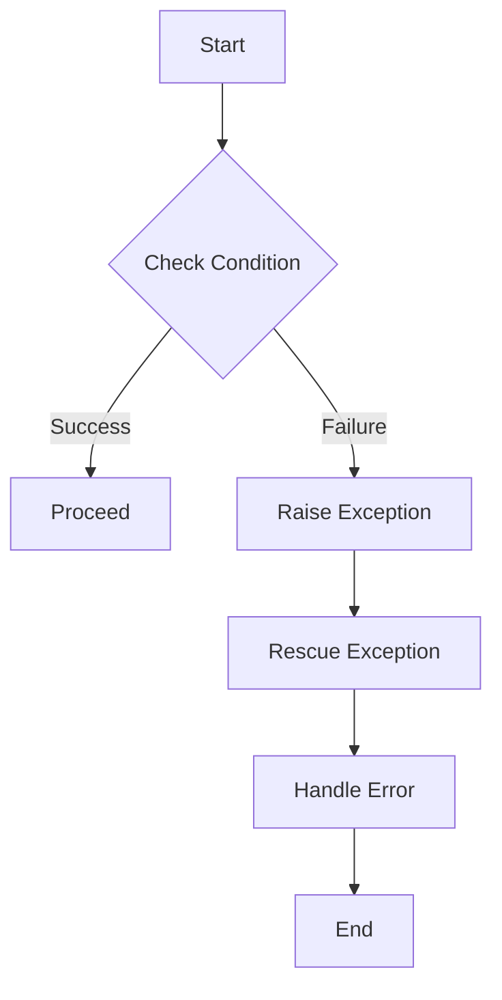

## 3.6. Error Handling and Exceptions

Error handling is a crucial aspect of building robust and reliable applications. In Elixir, a language built on the Erlang VM (BEAM), error handling is designed to be both powerful and intuitive, leveraging the strengths of functional programming and the "let it crash" philosophy. In this section, we will explore how to effectively manage errors and exceptions in Elixir, ensuring your applications are resilient and maintainable.

### Raising Exceptions

In Elixir, exceptions are raised using the `raise` and `throw` constructs. Understanding when and how to use these constructs is essential for effective error handling.

#### Using `raise`

The `raise` function is used to raise exceptions in Elixir. It can be used with a message or an exception struct. Here's a simple example:

```elixir
defmodule Example do
  def divide(a, b) do
    if b == 0 do
      raise ArgumentError, message: "Cannot divide by zero"
    else
      a / b
    end
  end
end

# Usage
Example.divide(10, 0)
```

In this example, if `b` is zero, an `ArgumentError` is raised with a custom message. This is a common pattern for handling invalid arguments or unexpected conditions.

#### Using `throw`

The `throw` construct is less commonly used than `raise` and is typically employed for non-local returns in Elixir. It allows you to exit a function early and handle the exit elsewhere. Here's an example:

```elixir
defmodule Example do
  def find_value(list, value) do
    Enum.each(list, fn x ->
      if x == value do
        throw {:found, x}
      end
    end)
    :not_found
  catch
    {:found, x} -> {:ok, x}
  end
end

# Usage
Example.find_value([1, 2, 3, 4], 3)
```

In this example, `throw` is used to exit the loop early when the value is found. The `catch` block then handles the thrown value.

### Rescuing Exceptions

Handling exceptions in Elixir is done using the `try...rescue` construct. This allows you to catch and manage exceptions, providing a way to recover from errors gracefully.

#### Handling Exceptions with `try...rescue`

The `try...rescue` block is used to catch exceptions and take appropriate action. Here's an example:

```elixir
defmodule Example do
  def safe_divide(a, b) do
    try do
      a / b
    rescue
      ArithmeticError -> {:error, "Division by zero is not allowed"}
    end
  end
end

# Usage
Example.safe_divide(10, 0)
```

In this example, an `ArithmeticError` is caught, and a tuple is returned to indicate an error. This pattern is useful for handling specific exceptions and providing meaningful error messages.

### Best Practices

When it comes to error handling in Elixir, there are several best practices to follow to ensure your code is robust and maintainable.

#### Prefer Using Tagged Tuples Over Exceptions for Expected Errors

In Elixir, it is common to use tagged tuples for handling expected errors instead of relying on exceptions. This approach aligns with the functional programming paradigm and makes error handling explicit. Here's an example:

```elixir
defmodule Example do
  def divide(a, b) do
    if b == 0 do
      {:error, "Cannot divide by zero"}
    else
      {:ok, a / b}
    end
  end
end

# Usage
case Example.divide(10, 0) do
  {:ok, result} -> IO.puts("Result: #{result}")
  {:error, reason} -> IO.puts("Error: #{reason}")
end
```

In this example, the function returns a tagged tuple indicating success or failure. This pattern makes it clear to the caller that they need to handle both cases.

#### Embrace the "Let It Crash" Philosophy

Elixir's "let it crash" philosophy encourages developers to write code that assumes success and lets the system handle failures. This approach is particularly effective in concurrent systems, where processes can be isolated and supervised.

#### Use Supervisors for Fault Tolerance

Supervisors are a key component of Elixir's fault-tolerance model. They monitor processes and restart them if they fail. This allows you to build systems that can recover from errors automatically.

### Visualizing Error Handling in Elixir

To better understand how error handling works in Elixir, let's visualize the process using a flowchart.



This flowchart illustrates the typical flow of error handling in Elixir, from checking conditions to raising and rescuing exceptions.

### References and Links

For further reading on error handling in Elixir, consider the following resources:

- [Elixir Getting Started Guide](https://elixir-lang.org/getting-started/try-catch-and-rescue.html)
- [Elixir Documentation on Error Handling](https://hexdocs.pm/elixir/Kernel.html#raise/1)
- [Functional Programming in Elixir](https://pragprog.com/titles/elixir16/programming-elixir-1-6/)

### Knowledge Check

To reinforce your understanding of error handling in Elixir, consider the following questions:

1. What is the difference between `raise` and `throw` in Elixir?
2. How can you use `try...rescue` to handle exceptions?
3. Why is it recommended to use tagged tuples for expected errors?
4. What is the "let it crash" philosophy, and how does it benefit Elixir applications?
5. How do supervisors contribute to fault tolerance in Elixir?

### Exercises

1. Modify the `Example.divide/2` function to handle division by zero using a tagged tuple.
2. Implement a function that uses `throw` and `catch` to find a value in a list.
3. Create a supervisor that monitors a process and restarts it if it crashes.

### Embrace the Journey

Remember, mastering error handling in Elixir is a journey. As you continue to explore and experiment with these concepts, you'll build more resilient and robust applications. Keep experimenting, stay curious, and enjoy the journey!

## Quiz: Error Handling and Exceptions



### What is the primary purpose of using `raise` in Elixir?

- [x] To raise exceptions for unexpected conditions
- [ ] To handle expected errors
- [ ] To perform non-local returns
- [ ] To define custom error messages

> **Explanation:** `raise` is used to raise exceptions in Elixir, typically for unexpected conditions that need to be addressed.

### How does the `throw` construct differ from `raise`?

- [x] `throw` is used for non-local returns
- [ ] `throw` is used for raising exceptions
- [ ] `throw` is used for handling errors
- [ ] `throw` is used for logging errors

> **Explanation:** `throw` is used for non-local returns, allowing you to exit a function early and handle the exit elsewhere.

### What is the recommended way to handle expected errors in Elixir?

- [x] Using tagged tuples
- [ ] Using `raise`
- [ ] Using `throw`
- [ ] Using `try...rescue`

> **Explanation:** Tagged tuples are recommended for handling expected errors, as they make error handling explicit and align with functional programming principles.

### What does the "let it crash" philosophy encourage?

- [x] Writing code that assumes success and lets the system handle failures
- [ ] Writing code that handles all possible errors
- [ ] Writing code that never crashes
- [ ] Writing code that logs all errors

> **Explanation:** The "let it crash" philosophy encourages writing code that assumes success and relies on the system to handle failures, particularly in concurrent systems.

### How do supervisors contribute to fault tolerance in Elixir?

- [x] By monitoring processes and restarting them if they fail
- [ ] By handling exceptions within processes
- [ ] By logging errors for later analysis
- [ ] By preventing processes from crashing

> **Explanation:** Supervisors monitor processes and restart them if they fail, contributing to the fault tolerance of Elixir applications.

### Which construct is used to catch exceptions in Elixir?

- [x] `try...rescue`
- [ ] `raise`
- [ ] `throw`
- [ ] `catch`

> **Explanation:** `try...rescue` is used to catch exceptions and take appropriate action in Elixir.

### What is a common pattern for handling invalid arguments in Elixir?

- [x] Raising an `ArgumentError` with a custom message
- [ ] Using `throw` to exit the function early
- [ ] Returning `nil`
- [ ] Logging the error and continuing execution

> **Explanation:** Raising an `ArgumentError` with a custom message is a common pattern for handling invalid arguments in Elixir.

### What is the benefit of using tagged tuples for error handling?

- [x] They make error handling explicit and align with functional programming principles
- [ ] They allow for non-local returns
- [ ] They automatically log errors
- [ ] They prevent processes from crashing

> **Explanation:** Tagged tuples make error handling explicit and align with functional programming principles, providing a clear way to handle expected errors.

### True or False: `throw` is commonly used for raising exceptions in Elixir.

- [ ] True
- [x] False

> **Explanation:** `throw` is not commonly used for raising exceptions; it is typically used for non-local returns.

### What is the purpose of the `try...rescue` block in Elixir?

- [x] To catch exceptions and take appropriate action
- [ ] To raise exceptions
- [ ] To perform non-local returns
- [ ] To log errors

> **Explanation:** The `try...rescue` block is used to catch exceptions and take appropriate action in Elixir.


