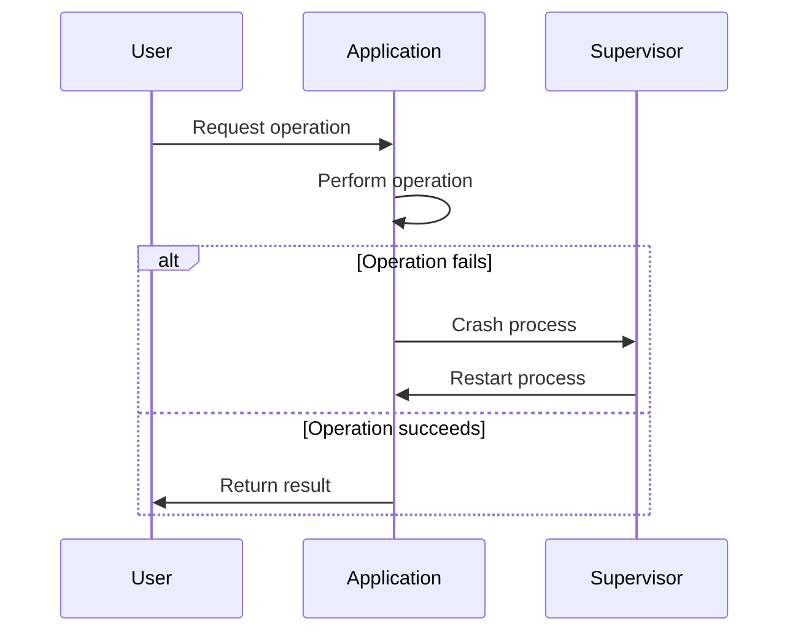

## 3.6. Error Handling and Exceptions

In the world of software development, handling errors gracefully and effectively is crucial for building robust and reliable systems. Elixir, with its roots in the Erlang ecosystem, offers a unique approach to error handling that aligns with its philosophy of building fault-tolerant systems. In this section, we will delve into the intricacies of error handling in Elixir, exploring how to raise and rescue exceptions, best practices for managing errors, and leveraging Elixir's unique features to build resilient applications.

### Raising Exceptions

In Elixir, exceptions are used to signal unexpected conditions or errors that occur during the execution of a program. Understanding how to raise exceptions properly is the first step in mastering error handling.

#### Using `raise`

The `raise` function is used to raise an exception in Elixir. It can be used with a predefined exception or a custom exception. Let's explore how to use `raise` with a simple example:

```elixir
defmodule ErrorExample do
  def divide(a, b) do
    if b == 0 do
      raise ArgumentError, message: "Cannot divide by zero"
    else
      a / b
    end
  end
end

# Usage
ErrorExample.divide(10, 0)
```

In this example, we raise an `ArgumentError` when attempting to divide by zero. The `raise` function takes the exception type and a keyword list with a message.

#### Using `throw`

While `raise` is used for exceptions, `throw` is another mechanism in Elixir used for non-local returns, primarily in cases where you want to exit a block of code early. It's less common than `raise` and is generally used for control flow rather than error handling.

```elixir
defmodule ThrowExample do
  def find_value(list, value) do
    Enum.each(list, fn x ->
      if x == value do
        throw {:found, x}
      end
    end)
    :not_found
  catch
    {:found, x} -> x
  end
end

# Usage
ThrowExample.find_value([1, 2, 3, 4], 3)
```

In this example, `throw` is used to exit the loop early when the value is found, and the `catch` block handles the thrown value.

### Rescuing Exceptions

Once an exception is raised, it can be rescued using the `try...rescue` construct. This allows you to handle errors gracefully and provide fallback logic.

#### Handling Exceptions with `try...rescue`

The `try...rescue` construct is used to catch exceptions and execute alternative code. Here's how it works:

```elixir
defmodule RescueExample do
  def safe_divide(a, b) do
    try do
      a / b
    rescue
      ArithmeticError -> {:error, "Division by zero is not allowed"}
    end
  end
end

# Usage
RescueExample.safe_divide(10, 0)
```

In this example, we use `try...rescue` to catch an `ArithmeticError` and return a tagged tuple indicating an error.

#### Rescuing Specific Exceptions

You can rescue specific exceptions by pattern matching on the exception type. This allows you to handle different types of errors in different ways.

```elixir
defmodule MultiRescueExample do
  def handle_errors do
    try do
      # Some operation that might fail
    rescue
      ArgumentError -> IO.puts("Caught an argument error")
      RuntimeError -> IO.puts("Caught a runtime error")
    end
  end
end
```

In this example, we demonstrate how to rescue multiple types of exceptions using pattern matching.

### Best Practices

When it comes to error handling in Elixir, there are several best practices to consider. These practices will help you write more robust and maintainable code.

#### Prefer Using Tagged Tuples Over Exceptions for Expected Errors

In Elixir, it's common to use tagged tuples to represent expected errors rather than raising exceptions. This approach aligns with the functional programming paradigm and makes it easier to handle errors in a predictable way.

```elixir
defmodule TupleExample do
  def divide(a, b) do
    if b == 0 do
      {:error, "Cannot divide by zero"}
    else
      {:ok, a / b}
    end
  end
end

# Usage
case TupleExample.divide(10, 0) do
  {:ok, result} -> IO.puts("Result: #{result}")
  {:error, reason} -> IO.puts("Error: #{reason}")
end
```

In this example, we return a tagged tuple with `{:ok, result}` or `{:error, reason}` to indicate success or failure.

#### Embrace the "Let It Crash" Philosophy

Elixir and Erlang embrace the "let it crash" philosophy, which encourages developers to let processes fail and rely on supervisors to restart them. This approach simplifies error handling and improves system reliability.

```elixir
defmodule CrashExample do
  def start do
    spawn(fn -> crash() end)
  end

  defp crash do
    raise "Intentional crash"
  end
end

# Usage
CrashExample.start()
```

In this example, we intentionally crash a process and rely on a supervisor to handle the restart.

#### Use `with` for Complex Error Handling

The `with` construct is useful for handling complex error scenarios where multiple operations may fail. It allows you to chain operations and handle errors concisely.

```elixir
defmodule WithExample do
  def process_data(input) do
    with {:ok, data} <- fetch_data(input),
         {:ok, transformed} <- transform_data(data),
         {:ok, result} <- save_data(transformed) do
      {:ok, result}
    else
      {:error, reason} -> {:error, reason}
    end
  end

  defp fetch_data(_), do: {:ok, "data"}
  defp transform_data(_), do: {:ok, "transformed"}
  defp save_data(_), do: {:ok, "saved"}
end

# Usage
WithExample.process_data("input")
```

In this example, `with` is used to chain operations and handle errors in a clean and readable way.

### Visualizing Error Handling in Elixir

To better understand the flow of error handling in Elixir, let's visualize the process using a sequence diagram.


```mermaid
sequenceDiagram
    participant User
    participant Application
    participant Supervisor

    User->>Application: Request operation
    Application->>Application: Perform operation
    alt Operation fails
        Application->>Supervisor: Crash process
        Supervisor->>Application: Restart process
    else Operation succeeds
        Application->>User: Return result
    end
```

This diagram illustrates how an application handles errors by crashing the process and relying on a supervisor to restart it, embodying the "let it crash" philosophy.

### References and Further Reading

- [Elixir Documentation: Error Handling](https://elixir-lang.org/getting-started/try-catch-and-rescue.html)
- [Erlang and Elixir: Let It Crash Philosophy](https://www.erlang.org/doc/design_principles/error_handling.html)
- [Pattern Matching in Elixir](https://elixir-lang.org/getting-started/pattern-matching.html)

### Knowledge Check

- What is the primary purpose of using `raise` in Elixir?
- How does the `try...rescue` construct help in error handling?
- Why is it recommended to use tagged tuples for expected errors?
- What is the "let it crash" philosophy, and how does it benefit error handling?

### Embrace the Journey

Remember, mastering error handling in Elixir is a journey. As you continue to explore and experiment with different techniques, you'll gain a deeper understanding of how to build resilient and fault-tolerant systems. Keep experimenting, stay curious, and enjoy the process!

## Quiz Time!



### What function is used to raise an exception in Elixir?

- [x] raise
- [ ] throw
- [ ] catch
- [ ] rescue

> **Explanation:** The `raise` function is used to raise exceptions in Elixir, signaling unexpected conditions or errors.

### Which construct is used to handle exceptions in Elixir?

- [ ] throw...catch
- [x] try...rescue
- [ ] if...else
- [ ] case...do

> **Explanation:** The `try...rescue` construct is used to catch exceptions and execute alternative code in Elixir.

### What is the recommended approach for handling expected errors in Elixir?

- [ ] Raising exceptions
- [x] Using tagged tuples
- [ ] Using throw
- [ ] Using if statements

> **Explanation:** Using tagged tuples is the recommended approach for handling expected errors in Elixir, as it aligns with the functional programming paradigm.

### What philosophy encourages letting processes fail and relying on supervisors to restart them?

- [ ] Defensive programming
- [ ] Exception handling
- [x] Let it crash
- [ ] Error propagation

> **Explanation:** The "let it crash" philosophy encourages letting processes fail and relying on supervisors to handle restarts, simplifying error handling and improving reliability.

### What construct is useful for handling complex error scenarios with multiple operations?

- [ ] case
- [ ] if
- [x] with
- [ ] cond

> **Explanation:** The `with` construct is useful for handling complex error scenarios where multiple operations may fail, allowing for concise error handling.

### Which function is used for non-local returns in Elixir?

- [ ] raise
- [x] throw
- [ ] rescue
- [ ] catch

> **Explanation:** The `throw` function is used for non-local returns in Elixir, primarily for control flow rather than error handling.

### How can you rescue specific exceptions in Elixir?

- [ ] Using if statements
- [x] Pattern matching on exception types
- [ ] Using throw...catch
- [ ] Using cond

> **Explanation:** You can rescue specific exceptions in Elixir by pattern matching on the exception types within a `rescue` block.

### What is the purpose of the `try` block in Elixir?

- [ ] To raise exceptions
- [x] To execute code that might raise exceptions
- [ ] To handle errors
- [ ] To define functions

> **Explanation:** The `try` block is used to execute code that might raise exceptions, allowing for error handling with `rescue`.

### What is the advantage of using supervisors in Elixir?

- [ ] They prevent all errors
- [x] They restart failed processes
- [ ] They log errors
- [ ] They handle all exceptions

> **Explanation:** Supervisors in Elixir are used to restart failed processes, embodying the "let it crash" philosophy and improving system reliability.

### True or False: The `throw` function is commonly used for error handling in Elixir.

- [ ] True
- [x] False

> **Explanation:** False. The `throw` function is not commonly used for error handling in Elixir; it is primarily used for non-local returns and control flow.




