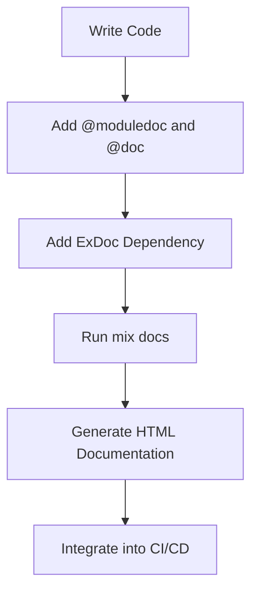

## 3.7. Documentation with ExDoc

In the world of software development, documentation is as crucial as the code itself. It serves as a guide for developers, helping them understand the purpose, functionality, and usage of the code. In Elixir, ExDoc is the go-to tool for generating documentation. This section will delve into the nuances of writing effective documentation using ExDoc, generating HTML documentation, and integrating this process into your build workflow.

### Writing Effective Documentation

Effective documentation is clear, concise, and comprehensive. It should provide enough information for developers to understand the code without overwhelming them with unnecessary details. In Elixir, the `@moduledoc` and `@doc` attributes are essential tools for writing documentation.

#### Using `@moduledoc` and `@doc` Attributes

The `@moduledoc` attribute is used to document modules. It provides an overview of the module's purpose and functionality. Here's how you can use it:

```elixir
defmodule MyModule do
  @moduledoc """
  MyModule is responsible for handling user authentication.

  It provides functions to register, login, and logout users.
  """

  @doc """
  Registers a new user.

  ## Parameters

    - `username`: The username of the new user.
    - `password`: The password for the new user.

  ## Examples

      iex> MyModule.register_user("john_doe", "password123")
      :ok
  """
  def register_user(username, password) do
    # Registration logic here
  end
end
```

In this example, the `@moduledoc` attribute provides a high-level overview of the module, while the `@doc` attribute documents the `register_user/2` function. Notice how the `@doc` attribute includes a description, parameters, and examples. This structure helps other developers understand how to use the function effectively.

#### Including Examples and Detailed Explanations

Examples are a powerful way to illustrate how a function works. They provide context and demonstrate the expected input and output. When writing examples, ensure they are clear and relevant. Use the `iex>` prompt to indicate interactive Elixir shell examples, as shown above.

Detailed explanations are also crucial, especially for complex functions. Break down the logic into understandable parts and explain any non-obvious behavior. This approach not only aids understanding but also helps in maintaining the code in the future.

### Generating Documentation

Once you've written your documentation, the next step is to generate it in a format that's easy to read and navigate. ExDoc excels at this by creating HTML documentation that can be hosted and shared with your team.

#### Creating HTML Docs with ExDoc

To generate HTML documentation with ExDoc, you need to add ExDoc as a dependency in your `mix.exs` file:

```elixir
defp deps do
  [
    {:ex_doc, "~> 0.25", only: :dev, runtime: false}
  ]
end
```

After adding the dependency, run the following command to generate the documentation:

```bash
mix docs
```

This command will create a `doc` directory containing the HTML files. You can open the `index.html` file in a web browser to view the documentation.

ExDoc automatically extracts the `@moduledoc` and `@doc` attributes from your code and formats them into a user-friendly HTML layout. It also includes a search feature, making it easy to find specific modules or functions.

#### Integrating Documentation Generation into the Build Process

Integrating documentation generation into your build process ensures that your documentation is always up-to-date. You can achieve this by adding the `mix docs` command to your build scripts or CI/CD pipelines.

For example, if you're using a CI/CD tool like GitHub Actions, you can create a workflow file to generate documentation on every push:

```yaml
name: Documentation

on:
  push:
    branches:
      - main

jobs:
  build:
    runs-on: ubuntu-latest

    steps:
    - uses: actions/checkout@v2
    - name: Set up Elixir
      uses: actions/setup-elixir@v1
      with:
        elixir-version: '1.12'
        otp-version: '24'
    - name: Install dependencies
      run: mix deps.get
    - name: Generate documentation
      run: mix docs
    - name: Upload documentation
      uses: actions/upload-artifact@v2
      with:
        name: docs
        path: doc/
```

This workflow checks out the code, sets up Elixir, installs dependencies, generates the documentation, and uploads it as an artifact. You can then download the artifact and host it on a documentation server.

### Visualizing the Documentation Process

To better understand the documentation process, let's visualize it using a flowchart. This diagram illustrates the steps involved in writing and generating documentation with ExDoc.



**Figure 1:** The flow of creating documentation with ExDoc.

### Key Considerations

When documenting your Elixir projects, consider the following:

- **Consistency:** Maintain a consistent style and format throughout your documentation. This consistency helps in readability and understanding.
- **Clarity:** Use clear and concise language. Avoid jargon unless it's necessary and well-explained.
- **Completeness:** Ensure that all public modules and functions are documented. Private functions can be documented if they are complex or critical to the module's functionality.
- **Examples:** Provide examples wherever possible. They are invaluable for understanding how to use a function or module.

### Elixir Unique Features

Elixir's metaprogramming capabilities allow you to create custom documentation attributes or even generate documentation dynamically. This feature can be particularly useful for libraries or frameworks that need to document generated code.

### Differences and Similarities

ExDoc is similar to tools like Javadoc or Doxygen in that it generates documentation from comments in the code. However, it is tailored specifically for Elixir and leverages Elixir's strengths, such as pattern matching and functional programming, to provide a more integrated experience.

### Try It Yourself

To get hands-on experience with ExDoc, try modifying the code examples provided. Add new functions to `MyModule` and document them using `@doc`. Then, generate the documentation and view it in your browser. Experiment with different styles and formats to see what works best for your project.

### Knowledge Check

- What are the benefits of using `@moduledoc` and `@doc` attributes in Elixir?
- How does ExDoc generate HTML documentation from Elixir code?
- Why is it important to integrate documentation generation into the build process?

### Embrace the Journey

Remember, documentation is an ongoing process. As your code evolves, so should your documentation. Keep experimenting with different documentation styles and techniques. Stay curious, and enjoy the journey of mastering documentation with ExDoc!

## Quiz: Documentation with ExDoc



### What is the primary purpose of the `@moduledoc` attribute in Elixir?

- [x] To provide an overview of the module's purpose and functionality.
- [ ] To document individual functions within a module.
- [ ] To generate HTML documentation.
- [ ] To define module-level constants.

> **Explanation:** The `@moduledoc` attribute is used to provide a high-level overview of a module, explaining its purpose and functionality.

### How can you include examples in your Elixir documentation?

- [x] By using the `@doc` attribute with `iex>` prompts.
- [ ] By writing examples directly in the code without any attributes.
- [ ] By using the `@example` attribute.
- [ ] By creating a separate examples file.

> **Explanation:** Examples can be included in the documentation using the `@doc` attribute, with `iex>` prompts to indicate interactive Elixir shell examples.

### What command is used to generate HTML documentation with ExDoc?

- [x] `mix docs`
- [ ] `mix generate_docs`
- [ ] `mix html_docs`
- [ ] `mix create_docs`

> **Explanation:** The `mix docs` command is used to generate HTML documentation with ExDoc.

### Why is it beneficial to integrate documentation generation into the build process?

- [x] To ensure documentation is always up-to-date with the code.
- [ ] To reduce the size of the codebase.
- [ ] To automatically fix documentation errors.
- [ ] To improve code execution speed.

> **Explanation:** Integrating documentation generation into the build process ensures that the documentation is always current and reflects the latest changes in the code.

### Which of the following is a key consideration when writing documentation?

- [x] Consistency in style and format.
- [ ] Using as much technical jargon as possible.
- [ ] Documenting only the most complex functions.
- [ ] Avoiding examples to keep documentation concise.

> **Explanation:** Consistency in style and format is crucial for readability and understanding. It's important to avoid unnecessary jargon and provide examples to aid comprehension.

### What is the role of ExDoc in Elixir projects?

- [x] To generate HTML documentation from Elixir code.
- [ ] To compile Elixir code into binaries.
- [ ] To manage dependencies in Elixir projects.
- [ ] To optimize Elixir code for performance.

> **Explanation:** ExDoc is used to generate HTML documentation from Elixir code, making it easier to read and navigate.

### How does ExDoc leverage Elixir's strengths?

- [x] By integrating with Elixir's pattern matching and functional programming.
- [ ] By providing a graphical user interface for documentation.
- [ ] By automatically fixing code errors.
- [ ] By generating documentation in multiple languages.

> **Explanation:** ExDoc leverages Elixir's strengths, such as pattern matching and functional programming, to provide a more integrated documentation experience.

### What is a benefit of providing examples in documentation?

- [x] They help illustrate how a function works.
- [ ] They make the documentation longer.
- [ ] They are required for the documentation to compile.
- [ ] They replace the need for detailed explanations.

> **Explanation:** Examples help illustrate how a function works, providing context and demonstrating expected input and output.

### What is a unique feature of Elixir that can enhance documentation?

- [x] Metaprogramming capabilities for dynamic documentation.
- [ ] Built-in graphical documentation editor.
- [ ] Automatic translation of documentation.
- [ ] Real-time documentation updates.

> **Explanation:** Elixir's metaprogramming capabilities allow for dynamic documentation generation, which can be particularly useful for libraries or frameworks.

### True or False: ExDoc is similar to Javadoc and Doxygen.

- [x] True
- [ ] False

> **Explanation:** ExDoc is similar to tools like Javadoc and Doxygen in that it generates documentation from comments in the code, but it is specifically tailored for Elixir.



By mastering documentation with ExDoc, you not only enhance your code's readability but also contribute to a more maintainable and collaborative development environment. Keep refining your documentation skills, and you'll find that well-documented code is a joy to work with!
