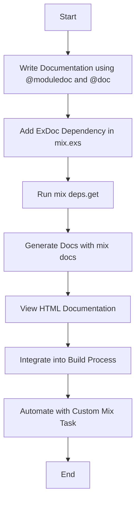

## 3.7. Documentation with ExDoc

In the world of software development, documentation is as crucial as the code itself. It serves as a guide for developers, helping them understand the intricacies of the codebase, facilitating collaboration, and ensuring maintainability. In Elixir, ExDoc is the go-to tool for generating beautiful, comprehensive documentation. In this section, we will delve into how to effectively document your Elixir projects using ExDoc, covering everything from writing effective documentation to generating HTML documentation and integrating it into your build process.

### Writing Effective Documentation

Effective documentation is clear, concise, and comprehensive. In Elixir, the `@moduledoc` and `@doc` attributes are used to annotate modules and functions with documentation. Let's explore how to utilize these attributes to create meaningful documentation.

#### Using `@moduledoc` and `@doc` Attributes

The `@moduledoc` attribute is used to document an entire module. It provides an overview of the module's purpose, its functionalities, and any important details that users need to know. Here's how you can use it:

```elixir
defmodule MathUtils do
  @moduledoc """
  MathUtils provides utility functions for mathematical operations.

  ## Examples

      iex> MathUtils.add(2, 3)
      5

      iex> MathUtils.subtract(5, 3)
      2
  """
  # Module functions go here
end
```

The `@doc` attribute is used to document individual functions within a module. It should include a brief description of the function's purpose, its parameters, return values, and examples of usage. Here’s an example:

```elixir
defmodule MathUtils do
  @moduledoc """
  MathUtils provides utility functions for mathematical operations.
  """

  @doc """
  Adds two numbers.

  ## Parameters

    - a: The first number.
    - b: The second number.

  ## Examples

      iex> MathUtils.add(2, 3)
      5
  """
  def add(a, b) do
    a + b
  end
end
```

#### Including Examples and Detailed Explanations

Including examples in your documentation is essential. It helps users understand how to use the functions and what to expect as output. Use the `## Examples` section to provide illustrative examples. Additionally, provide detailed explanations for complex logic or algorithms to aid comprehension.

### Generating Documentation

Once you've written your documentation using the `@moduledoc` and `@doc` attributes, the next step is to generate HTML documentation using ExDoc. This process is straightforward and can be easily integrated into your build process.

#### Creating HTML Docs with ExDoc

To generate HTML documentation, you'll first need to add ExDoc as a dependency in your `mix.exs` file:

```elixir
defp deps do
  [
    {:ex_doc, "~> 0.25", only: :dev, runtime: false}
  ]
end
```

After adding the dependency, run `mix deps.get` to fetch it. Now, you can generate the documentation by running:

```shell
mix docs
```

This command will create a `doc` directory in your project root, containing the HTML files. You can open the `index.html` file in a browser to view your documentation.

#### Integrating Documentation Generation into the Build Process

Integrating documentation generation into your build process ensures that your documentation is always up-to-date. You can achieve this by adding a custom task in your `mix.exs` file:

```elixir
defp aliases do
  [
    "docs.generate": ["docs", "cmd echo Documentation generated!"]
  ]
end
```

Now, running `mix docs.generate` will generate your documentation and print a confirmation message.

### Visualizing Documentation Workflow

To better understand the workflow of generating documentation with ExDoc, let's visualize the process using a flowchart.


```mermaid
graph TD;
    A[Start] --> B[Write Documentation using @moduledoc and @doc];
    B --> C[Add ExDoc Dependency in mix.exs];
    C --> D[Run mix deps.get];
    D --> E[Generate Docs with mix docs];
    E --> F[View HTML Documentation];
    F --> G[Integrate into Build Process];
    G --> H[Automate with Custom Mix Task];
    H --> I[End];
```

This flowchart illustrates the steps involved in writing and generating documentation with ExDoc.

### References and Links

For more information on ExDoc and Elixir documentation, consider the following resources:

- [ExDoc on HexDocs](https://hexdocs.pm/ex_doc/readme.html)
- [Elixir Documentation Guidelines](https://elixir-lang.org/docs.html)

### Knowledge Check

Let's reinforce what we've learned with some questions:

1. What is the purpose of the `@moduledoc` attribute?
2. How do you generate HTML documentation using ExDoc?
3. Why is it important to include examples in your documentation?

### Embrace the Journey

Remember, documentation is an ongoing process. As your code evolves, so should your documentation. Keep experimenting with different styles and formats to find what works best for your team. Stay curious, and enjoy the journey of mastering documentation with ExDoc!

### Quiz Time!



### What is the primary use of the `@moduledoc` attribute in Elixir?

- [x] To document an entire module
- [ ] To document a single function
- [ ] To generate HTML documentation
- [ ] To handle errors in a module

> **Explanation:** The `@moduledoc` attribute is used to provide documentation for an entire module, offering an overview of its purpose and functionalities.

### Which command is used to generate HTML documentation with ExDoc?

- [x] mix docs
- [ ] mix compile
- [ ] mix test
- [ ] mix run

> **Explanation:** The `mix docs` command is used to generate HTML documentation using ExDoc.

### Why should examples be included in function documentation?

- [x] To help users understand how to use the function
- [ ] To make the documentation longer
- [ ] To confuse users
- [ ] To provide a list of errors

> **Explanation:** Including examples in documentation helps users understand how to use the function correctly and what output to expect.

### How can you integrate documentation generation into the build process?

- [x] By creating a custom Mix task
- [ ] By writing more code
- [ ] By using a different programming language
- [ ] By ignoring the documentation

> **Explanation:** You can integrate documentation generation into the build process by creating a custom Mix task that runs the `mix docs` command.

### What is the purpose of adding ExDoc as a dependency in `mix.exs`?

- [x] To enable the generation of HTML documentation
- [ ] To add more functions to your project
- [ ] To handle errors in your code
- [ ] To improve performance

> **Explanation:** Adding ExDoc as a dependency allows you to generate HTML documentation for your Elixir project.

### True or False: The `@doc` attribute is used to document entire modules.

- [ ] True
- [x] False

> **Explanation:** The `@doc` attribute is used to document individual functions within a module, not entire modules.

### What does the `mix deps.get` command do?

- [x] Fetches all dependencies listed in `mix.exs`
- [ ] Compiles the project
- [ ] Runs tests
- [ ] Generates documentation

> **Explanation:** The `mix deps.get` command fetches all dependencies listed in the `mix.exs` file.

### Which section in documentation is essential for complex logic explanations?

- [x] Detailed explanations
- [ ] Short descriptions
- [ ] Error lists
- [ ] Function names

> **Explanation:** Detailed explanations are crucial for understanding complex logic or algorithms within the documentation.

### What is the outcome of running the `mix docs` command?

- [x] HTML documentation is generated
- [ ] The project is compiled
- [ ] Tests are executed
- [ ] Dependencies are fetched

> **Explanation:** Running the `mix docs` command generates HTML documentation for the project.

### True or False: Documentation should evolve as the codebase changes.

- [x] True
- [ ] False

> **Explanation:** Documentation should be updated and evolve as the codebase changes to ensure it remains accurate and helpful.



By mastering the art of documentation with ExDoc, you enhance not only your code but also the experience of every developer who interacts with your project. Keep refining your skills, and remember that great documentation is a hallmark of great software.
