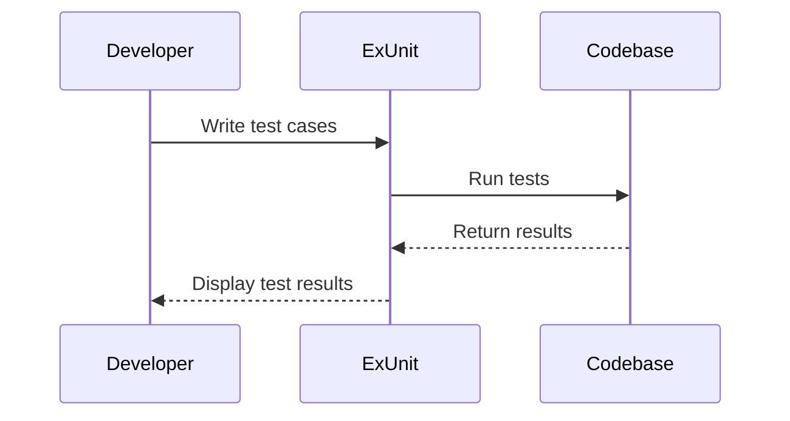

## 3.8. Testing with ExUnit

Testing is a crucial aspect of software development, ensuring that your code behaves as expected and remains maintainable over time. In Elixir, ExUnit is the built-in testing framework that provides a robust and flexible environment for writing and running tests. In this section, we will delve into setting up tests, writing effective test cases, and adopting Test-Driven Development (TDD) practices using ExUnit.

### Setting Up Tests

Before we dive into writing tests, it's essential to set up your testing environment correctly. ExUnit is included with Elixir, so there's no need for additional installations. However, organizing your test files and following naming conventions can significantly enhance the maintainability and readability of your tests.

#### Organizing Test Files and Naming Conventions

1. **Directory Structure**: Place your test files in the `test` directory at the root of your project. This is the default location where ExUnit looks for test files.

2. **File Naming**: Name your test files with the `_test.exs` suffix. This convention helps ExUnit identify which files contain tests.

3. **Module Naming**: Each test file should define a module that corresponds to the module being tested, with `Test` appended to the module name. For example, if you are testing a module named `MyApp.Calculator`, your test module should be `MyApp.CalculatorTest`.

4. **Setup and Teardown**: Use the `setup` and `teardown` callbacks to prepare and clean up the test environment. This ensures that each test runs in isolation and does not affect others.

```elixir
defmodule MyApp.CalculatorTest do
  use ExUnit.Case

  setup do
    # Setup code here
    {:ok, initial_state: %{}}
  end

  teardown do
    # Teardown code here
    :ok
  end
end
```

### Writing Test Cases

Writing effective test cases is at the heart of using ExUnit. ExUnit provides a variety of macros to assert conditions and validate the behavior of your code.

#### Using `assert`, `refute`, and Other ExUnit Macros

1. **`assert` Macro**: Use `assert` to verify that a condition is true. If the condition is false, the test will fail.

```elixir
test "addition works correctly" do
  result = MyApp.Calculator.add(1, 2)
  assert result == 3
end
```

2. **`refute` Macro**: Use `refute` to verify that a condition is false. If the condition is true, the test will fail.

```elixir
test "subtraction does not result in a negative number" do
  result = MyApp.Calculator.subtract(5, 3)
  refute result < 0
end
```

3. **`assert_raise` Macro**: Use `assert_raise` to check if a specific exception is raised.

```elixir
test "division by zero raises an error" do
  assert_raise ArithmeticError, fn ->
    MyApp.Calculator.divide(1, 0)
  end
end
```

4. **`assert_receive` and `refute_receive`**: These macros are useful for testing message passing in concurrent applications.

```elixir
test "process sends a message" do
  send(self(), :hello)
  assert_receive :hello
end
```

### Test-Driven Development

Test-Driven Development (TDD) is a software development approach where tests are written before the actual code. This practice encourages developers to think about the desired behavior of their code and write tests to validate that behavior.

#### Strategies for Writing Tests Before Code

1. **Red-Green-Refactor Cycle**: Start by writing a failing test (Red), then write the minimum amount of code to make the test pass (Green), and finally refactor the code while ensuring the test still passes.

2. **Focus on Behavior**: Write tests that describe the behavior of your code rather than its implementation. This makes your tests more robust to changes in the codebase.

3. **Small, Incremental Steps**: Break down functionality into small, testable units. Write tests for each unit and gradually build up the functionality.

#### Benefits of TDD in Elixir Projects

1. **Improved Code Quality**: TDD encourages writing cleaner, more maintainable code by focusing on the desired behavior.

2. **Reduced Debugging Time**: By catching errors early in the development process, TDD reduces the time spent debugging.

3. **Increased Confidence**: With a comprehensive suite of tests, developers can refactor code with confidence, knowing that any regressions will be caught by the tests.

4. **Documentation**: Tests serve as documentation for the codebase, providing examples of how the code is intended to be used.

### Try It Yourself

To get hands-on experience with ExUnit, try modifying the code examples provided. For instance, add more test cases to the `MyApp.CalculatorTest` module to cover additional scenarios, such as testing multiplication or handling invalid inputs.

### Visualizing the Testing Process

To better understand the flow of testing with ExUnit, let's visualize the process using a sequence diagram.



This diagram illustrates the interaction between the developer, ExUnit, and the codebase during the testing process. The developer writes test cases, ExUnit runs the tests against the codebase, and the results are displayed to the developer.

### References and Links

- [ExUnit Documentation](https://hexdocs.pm/ex_unit/ExUnit.html): Official documentation for ExUnit.
- [Elixir Getting Started Guide](https://elixir-lang.org/getting-started/introduction.html): A comprehensive guide to getting started with Elixir.
- [Test-Driven Development by Example](https://www.amazon.com/Test-Driven-Development-Kent-Beck/dp/0321146530): A classic book on TDD by Kent Beck.

### Knowledge Check

- What are the benefits of using ExUnit for testing in Elixir?
- How does the `assert` macro differ from the `refute` macro?
- What is the purpose of the `setup` and `teardown` callbacks in ExUnit?
- Describe the Red-Green-Refactor cycle in TDD.

### Embrace the Journey

Remember, testing is an integral part of software development, and mastering ExUnit will empower you to write robust, maintainable code. As you continue to explore Elixir, keep experimenting with different testing strategies, stay curious, and enjoy the journey!

## Quiz: Testing with ExUnit



### What is the primary purpose of ExUnit in Elixir?

- [x] To provide a framework for writing and running tests
- [ ] To manage dependencies in Elixir projects
- [ ] To compile Elixir code
- [ ] To handle HTTP requests

> **Explanation:** ExUnit is the built-in testing framework in Elixir, designed to help developers write and run tests.

### Which macro is used to verify that a condition is true in ExUnit?

- [x] `assert`
- [ ] `refute`
- [ ] `assert_raise`
- [ ] `assert_receive`

> **Explanation:** The `assert` macro is used to verify that a condition is true. If the condition is false, the test will fail.

### What is the purpose of the `setup` callback in ExUnit?

- [x] To prepare the test environment before each test
- [ ] To clean up after each test
- [ ] To define test cases
- [ ] To run tests in parallel

> **Explanation:** The `setup` callback is used to prepare the test environment before each test, ensuring tests run in isolation.

### What does TDD stand for?

- [x] Test-Driven Development
- [ ] Test-Driven Design
- [ ] Test-Driven Deployment
- [ ] Test-Driven Debugging

> **Explanation:** TDD stands for Test-Driven Development, a practice where tests are written before the actual code.

### In TDD, what is the first step in the Red-Green-Refactor cycle?

- [x] Write a failing test
- [ ] Write code to pass the test
- [ ] Refactor the code
- [ ] Deploy the application

> **Explanation:** The first step in the Red-Green-Refactor cycle is to write a failing test (Red).

### Which macro is used to check if a specific exception is raised in ExUnit?

- [x] `assert_raise`
- [ ] `assert`
- [ ] `refute`
- [ ] `assert_receive`

> **Explanation:** The `assert_raise` macro is used to check if a specific exception is raised during the execution of a function.

### What is a benefit of using TDD in Elixir projects?

- [x] Improved code quality
- [ ] Slower development process
- [ ] Increased debugging time
- [ ] Reduced test coverage

> **Explanation:** TDD improves code quality by encouraging developers to focus on the desired behavior of their code.

### Which macro is used to verify that a message is received in ExUnit?

- [x] `assert_receive`
- [ ] `assert`
- [ ] `refute`
- [ ] `assert_raise`

> **Explanation:** The `assert_receive` macro is used to verify that a specific message is received by a process.

### What is the default directory for test files in an Elixir project?

- [x] `test`
- [ ] `lib`
- [ ] `src`
- [ ] `priv`

> **Explanation:** The default directory for test files in an Elixir project is the `test` directory.

### True or False: ExUnit is an external library that needs to be installed separately in Elixir projects.

- [ ] True
- [x] False

> **Explanation:** False. ExUnit is included with Elixir and does not need to be installed separately.




