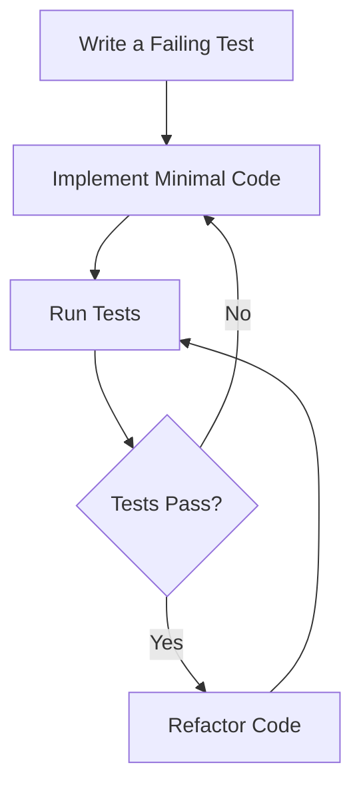

## 3.8. Testing with ExUnit

Testing is a fundamental aspect of software development, ensuring that your code behaves as expected and is robust against future changes. In Elixir, the ExUnit framework provides a powerful and flexible environment for writing and running tests. This section will guide you through setting up tests, writing effective test cases, and embracing test-driven development (TDD) in your Elixir projects.

### Setting Up Tests

Before diving into writing tests, it's essential to establish a well-organized testing environment. Proper organization and naming conventions help maintain clarity and ease of navigation as your codebase grows.

#### Organizing Test Files and Naming Conventions

1. **Directory Structure**: By convention, Elixir projects have a `test` directory at the root level, where all test files reside. This directory mirrors the structure of your `lib` directory, making it easy to locate tests corresponding to specific modules.

2. **Naming Conventions**: Test files should be named after the module they are testing, with `_test.exs` appended. For example, tests for `MyApp.User` would reside in `test/my_app/user_test.exs`.

3. **Test Setup**: Inside each test file, start by defining a module with the `use ExUnit.Case` directive to enable ExUnit's features. You can also set up common test configurations using `setup` and `setup_all` callbacks.

```elixir
defmodule MyApp.UserTest do
  use ExUnit.Case
  alias MyApp.User

  setup do
    # Setup code that runs before each test
    {:ok, user: %User{name: "Alice"}}
  end

  setup_all do
    # Setup code that runs once before all tests
    :ok
  end
end
```

### Writing Test Cases

ExUnit provides a variety of macros to facilitate writing expressive and concise test cases. Understanding these macros is key to leveraging ExUnit's full potential.

#### Using `assert`, `refute`, and Other ExUnit Macros

1. **`assert` Macro**: The `assert` macro is used to verify that a given expression evaluates to true. It's the most commonly used macro in ExUnit.

```elixir
test "the truth" do
  assert 1 + 1 == 2
end
```

2. **`refute` Macro**: The `refute` macro is the opposite of `assert`. It checks that an expression evaluates to false.

```elixir
test "the falsehood" do
  refute 1 + 1 == 3
end
```

3. **`assert_raise` Macro**: Use `assert_raise` to check that a specific exception is raised during the execution of a code block.

```elixir
test "raises an error" do
  assert_raise ArithmeticError, fn ->
    1 / 0
  end
end
```

4. **`assert_receive` Macro**: This macro is used in concurrent testing to assert that a message is received within a specified timeout.

```elixir
test "receives a message" do
  send(self(), :hello)
  assert_receive :hello
end
```

5. **`assert_in_delta` Macro**: Useful for comparing floating-point numbers within a certain delta.

```elixir
test "floating point comparison" do
  assert_in_delta 3.14159, 3.14, 0.01
end
```

### Test-Driven Development (TDD)

Test-driven development is a software development approach where tests are written before the actual code. This methodology encourages better design, reduces bugs, and ensures that the code meets the requirements.

#### Strategies for Writing Tests Before Code

1. **Red-Green-Refactor Cycle**: This is the core of TDD. Start by writing a failing test (Red), implement the minimal code to pass the test (Green), and then refactor the code while keeping the tests green.

2. **Focus on Requirements**: Writing tests first forces you to think about the requirements and expected behavior of the code, leading to a more thoughtful design.

3. **Small, Incremental Steps**: Break down features into small, manageable pieces. Write tests for each piece and implement them one at a time.

4. **Mocking and Stubbing**: Use mocks and stubs to isolate the code under test from external dependencies, ensuring that tests are fast and reliable.

#### Benefits of TDD in Elixir Projects

1. **Improved Code Quality**: TDD encourages writing cleaner, more maintainable code by focusing on requirements and design.

2. **Reduced Bugs**: By writing tests first, you catch bugs early in the development process, reducing the cost of fixing them later.

3. **Refactoring Confidence**: With a comprehensive test suite, you can refactor code with confidence, knowing that any regressions will be caught by the tests.

4. **Documentation**: Tests serve as living documentation, illustrating how the code is supposed to work and providing examples of its usage.

### Code Examples

Let's explore a practical example of using ExUnit in a TDD workflow.

```elixir
defmodule MyApp.Calculator do
  def add(a, b), do: a + b
  def subtract(a, b), do: a - b
end
```

#### Step 1: Write a Failing Test

```elixir
defmodule MyApp.CalculatorTest do
  use ExUnit.Case
  alias MyApp.Calculator

  test "adding two numbers" do
    assert Calculator.add(1, 2) == 3
  end

  test "subtracting two numbers" do
    assert Calculator.subtract(5, 3) == 2
  end
end
```

#### Step 2: Implement the Code

The code above already passes the tests, but let's assume we started with a blank slate and wrote the tests first. The next step would be to implement the `add` and `subtract` functions to make the tests pass.

#### Step 3: Refactor

Once the tests pass, look for opportunities to refactor the code. Ensure that the tests still pass after refactoring.

### Visualizing the TDD Process


```mermaid
graph TD;
    A[Write a Failing Test] --> B[Implement Minimal Code];
    B --> C[Run Tests];
    C --> D{Tests Pass?};
    D -->|No| B;
    D -->|Yes| E[Refactor Code];
    E --> C;
```

*Diagram: The TDD cycle involves writing a failing test, implementing code to pass the test, and then refactoring.*

### Try It Yourself

Experiment with the calculator example by adding more operations like multiplication or division. Write tests for these operations first, and then implement the code to pass the tests. This practice will reinforce the TDD approach.

### References and Links

- [ExUnit Documentation](https://hexdocs.pm/ex_unit/ExUnit.html)
- [Test-Driven Development by Example](https://www.amazon.com/Test-Driven-Development-Kent-Beck/dp/0321146530) by Kent Beck
- [Elixir School - Testing](https://elixirschool.com/en/lessons/basics/testing/)

### Knowledge Check

- What is the primary purpose of the `assert` macro in ExUnit?
- How does TDD improve code quality and reduce bugs?
- Why is it important to organize test files and follow naming conventions?
- What are the benefits of using `assert_receive` in concurrent testing?

### Embrace the Journey

Testing with ExUnit is a rewarding journey that enhances your Elixir projects' robustness and reliability. Remember, this is just the beginning. As you progress, you'll build more complex test suites and explore advanced testing techniques. Keep experimenting, stay curious, and enjoy the journey!

## Quiz Time!



### What is the primary purpose of the `assert` macro in ExUnit?

- [x] To verify that a given expression evaluates to true.
- [ ] To verify that a given expression evaluates to false.
- [ ] To catch exceptions during test execution.
- [ ] To compare floating-point numbers within a delta.

> **Explanation:** The `assert` macro is used to ensure that a specific condition holds true during the test execution.

### Which macro would you use to ensure a specific exception is raised in ExUnit?

- [ ] `assert`
- [ ] `refute`
- [x] `assert_raise`
- [ ] `assert_receive`

> **Explanation:** The `assert_raise` macro is designed to check if a specific exception is raised during the execution of a block of code.

### What is the first step in the TDD cycle?

- [ ] Implement the code.
- [x] Write a failing test.
- [ ] Refactor the code.
- [ ] Deploy the application.

> **Explanation:** The first step in TDD is to write a failing test that defines the desired behavior of the code.

### What is the benefit of organizing test files using naming conventions?

- [x] It makes it easier to locate tests corresponding to specific modules.
- [ ] It reduces the size of the test suite.
- [ ] It speeds up test execution.
- [ ] It eliminates the need for documentation.

> **Explanation:** Naming conventions help maintain clarity and ease of navigation as the codebase grows, making it easier to find and manage tests.

### Which macro is used for comparing floating-point numbers within a certain delta?

- [ ] `assert`
- [ ] `refute`
- [ ] `assert_raise`
- [x] `assert_in_delta`

> **Explanation:** The `assert_in_delta` macro is specifically used for comparing floating-point numbers within a specified delta.

### What does the `setup` callback in ExUnit do?

- [x] It runs setup code before each test.
- [ ] It runs setup code after each test.
- [ ] It runs setup code once before all tests.
- [ ] It runs teardown code after all tests.

> **Explanation:** The `setup` callback is used to run code before each individual test, allowing for test-specific setup.

### How does TDD benefit refactoring?

- [x] It provides a safety net by ensuring that tests catch regressions.
- [ ] It makes code refactoring unnecessary.
- [ ] It automatically refactors code.
- [ ] It reduces the need for documentation.

> **Explanation:** TDD provides a comprehensive test suite that acts as a safety net, allowing developers to refactor code confidently.

### What is the role of mocks and stubs in TDD?

- [x] To isolate the code under test from external dependencies.
- [ ] To speed up test execution.
- [ ] To replace the need for documentation.
- [ ] To automatically generate test cases.

> **Explanation:** Mocks and stubs are used to isolate the unit under test from external dependencies, ensuring that tests are focused and reliable.

### What is the purpose of the `setup_all` callback in ExUnit?

- [ ] It runs setup code before each test.
- [ ] It runs teardown code after each test.
- [x] It runs setup code once before all tests.
- [ ] It runs teardown code after all tests.

> **Explanation:** The `setup_all` callback is used to run code once before all tests in a test module, useful for expensive setup operations.

### True or False: ExUnit can be used to test concurrent Elixir applications.

- [x] True
- [ ] False

> **Explanation:** ExUnit supports testing concurrent applications with features like `assert_receive` for message assertions.




