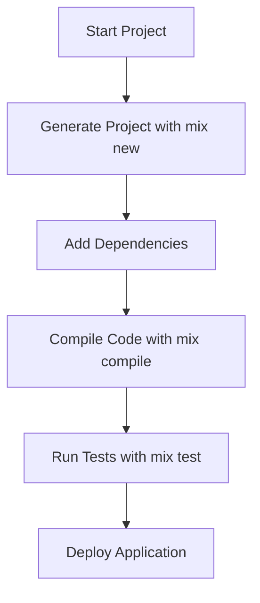

## 3.9. Mix: The Build Tool

Mix is the cornerstone of Elixir project management and build automation. It provides a rich set of features for creating, managing, and maintaining Elixir projects. As expert software engineers and architects, understanding Mix is crucial for leveraging Elixir's full potential in building scalable and maintainable applications.

### Creating and Managing Projects

#### Generating New Projects with `mix new`

Mix simplifies the process of starting new projects with the `mix new` command. This command sets up a new Elixir project with a standard directory structure and essential files.

```bash
$ mix new my_project
```

This command creates a new directory named `my_project` with the following structure:

```
my_project/
├── lib/
│   └── my_project.ex
├── test/
│   └── my_project_test.exs
├── mix.exs
└── README.md
```

- **lib/**: Contains the main application code.
- **test/**: Holds the test files.
- **mix.exs**: The project configuration file, where dependencies and project settings are defined.

**Key Points:**

- **Project Structure**: Mix enforces a consistent project structure, which is crucial for maintainability and collaboration.
- **Configuration**: The `mix.exs` file is the heart of your project configuration, defining dependencies, application settings, and more.

#### Customizing Project Generation

Mix allows customization of project generation through options like `--module` and `--app`.

```bash
$ mix new my_project --module MyCustomModule --app my_custom_app
```

- **--module**: Specifies the main module name.
- **--app**: Sets the application name used in the `mix.exs` file.

### Mix Tasks

Mix tasks are commands that automate various aspects of project management, from compiling code to running tests.

#### Built-in Tasks

Mix comes with several built-in tasks that streamline common development workflows.

- **`mix compile`**: Compiles the project source code.
- **`mix test`**: Runs the test suite.
- **`mix deps.get`**: Fetches project dependencies.
- **`mix format`**: Formats the code according to Elixir's style guide.

**Example: Running Tests**

```bash
$ mix test
```

This command executes all test files in the `test/` directory, providing feedback on test results.

#### Writing Custom Mix Tasks

Custom Mix tasks extend Mix's functionality, allowing automation of project-specific tasks.

**Creating a Custom Task**

1. **Define the Task Module**

Create a new module in the `lib/mix/tasks/` directory. The module name should follow the `Mix.Tasks` namespace.

```elixir
defmodule Mix.Tasks.Hello do
  use Mix.Task

  @shortdoc "Prints Hello, World!"

  def run(_) do
    IO.puts("Hello, World!")
  end
end
```

2. **Run the Custom Task**

```bash
$ mix hello
```

This command executes the `run/1` function, printing "Hello, World!" to the console.

**Key Points:**

- **Namespace**: Custom tasks must be defined under the `Mix.Tasks` namespace.
- **Documentation**: Use `@shortdoc` for a brief description, which appears in the task list.

### Advanced Mix Features

#### Managing Dependencies

Mix handles dependencies through the `mix.exs` file, using Hex, Elixir's package manager.

**Adding Dependencies**

Edit the `mix.exs` file to include new dependencies.

```elixir
defp deps do
  [
    {:ecto, "~> 3.0"},
    {:phoenix, "~> 1.5"}
  ]
end
```

Run `mix deps.get` to fetch the specified dependencies.

#### Environment Management

Mix supports different environments (e.g., `:dev`, `:test`, `:prod`) to tailor configurations for various stages of development.

**Setting Environment Variables**

Use the `MIX_ENV` variable to specify the environment.

```bash
$ MIX_ENV=prod mix compile
```

This command compiles the project in the production environment.

#### Mix Aliases

Mix aliases allow grouping multiple tasks into a single command, enhancing workflow efficiency.

**Defining Aliases**

Add aliases in the `mix.exs` file.

```elixir
defp aliases do
  [
    "setup": ["deps.get", "ecto.setup"],
    "test": ["ecto.create --quiet", "ecto.migrate", "test"]
  ]
end
```

Run the alias with:

```bash
$ mix setup
```

### Visualizing Mix Workflow

To better understand how Mix orchestrates project tasks, let's visualize the workflow using a Mermaid.js flowchart.



**Diagram Explanation:**

- **Start Project**: Initiates with `mix new`.
- **Add Dependencies**: Managed through `mix.exs`.
- **Compile Code**: Ensures code is ready for execution.
- **Run Tests**: Validates code functionality.
- **Deploy Application**: Final step in the development cycle.

### Best Practices with Mix

- **Consistent Structure**: Adhere to Mix's project structure for clarity and collaboration.
- **Automate with Custom Tasks**: Use custom tasks to automate repetitive processes.
- **Leverage Aliases**: Simplify complex workflows with Mix aliases.
- **Environment-Specific Configurations**: Tailor configurations for different environments to optimize performance and security.

### Try It Yourself

Experiment with Mix by creating a new project and adding custom tasks. Modify the project structure, add dependencies, and explore Mix's capabilities.

**Challenge:**

- Create a new Mix project.
- Add a custom task that prints the current date and time.
- Use Mix aliases to automate the setup process.

### References and Further Reading

- [Elixir Mix Documentation](https://hexdocs.pm/mix/Mix.html)
- [Hex Package Manager](https://hex.pm/)

### Knowledge Check

- What command is used to generate a new Elixir project?
- How do you add a new dependency to a Mix project?
- What is the purpose of Mix aliases?

### Embrace the Journey

Remember, mastering Mix is a journey. As you explore its features, you'll discover new ways to enhance your development workflow. Keep experimenting, stay curious, and enjoy the journey!

## Quiz: Mix: The Build Tool



### What command is used to generate a new Elixir project?

- [x] mix new
- [ ] mix create
- [ ] mix init
- [ ] mix start

> **Explanation:** The `mix new` command is used to generate a new Elixir project with a standard directory structure.

### How do you add a new dependency to a Mix project?

- [x] Edit the deps function in mix.exs
- [ ] Use mix add dependency
- [ ] Modify the lib directory
- [ ] Create a new file in the test directory

> **Explanation:** Dependencies are added by editing the `deps` function in the `mix.exs` file.

### What is the purpose of Mix aliases?

- [x] To group multiple tasks into a single command
- [ ] To create new Elixir modules
- [ ] To manage project dependencies
- [ ] To compile the project

> **Explanation:** Mix aliases allow you to group multiple tasks into a single command, streamlining workflows.

### Which environment variable is used to specify the Mix environment?

- [x] MIX_ENV
- [ ] ENV_MIX
- [ ] MIX_VAR
- [ ] ENVIRONMENT_MIX

> **Explanation:** The `MIX_ENV` variable is used to specify the environment for Mix tasks.

### What is the primary configuration file for a Mix project?

- [x] mix.exs
- [ ] config.exs
- [ ] project.exs
- [ ] deps.exs

> **Explanation:** The `mix.exs` file is the primary configuration file for a Mix project, defining dependencies and settings.

### How can you run tests in a Mix project?

- [x] mix test
- [ ] mix run tests
- [ ] mix execute tests
- [ ] mix check

> **Explanation:** The `mix test` command runs the test suite in a Mix project.

### What is the role of the lib directory in a Mix project?

- [x] Contains the main application code
- [ ] Holds configuration files
- [ ] Stores test files
- [ ] Manages dependencies

> **Explanation:** The `lib` directory contains the main application code in a Mix project.

### How do you fetch dependencies in a Mix project?

- [x] mix deps.get
- [ ] mix fetch
- [ ] mix install
- [ ] mix update

> **Explanation:** The `mix deps.get` command fetches the dependencies specified in the `mix.exs` file.

### What is the purpose of the test directory in a Mix project?

- [x] Holds the test files
- [ ] Contains configuration settings
- [ ] Stores application code
- [ ] Manages project dependencies

> **Explanation:** The `test` directory holds the test files for the project.

### True or False: Mix can only be used for Elixir projects.

- [ ] True
- [x] False

> **Explanation:** While Mix is primarily used for Elixir projects, it can also manage other types of projects, such as Nerves projects for IoT applications.


