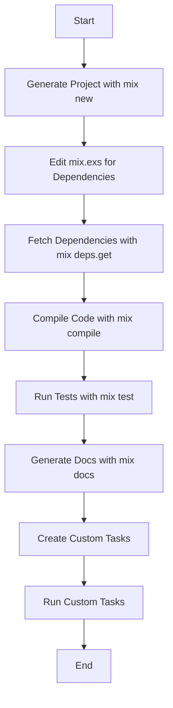

## 3.9. Mix: The Build Tool

Mix is an integral part of the Elixir ecosystem, providing a rich set of features for creating, managing, and automating Elixir projects. As expert software engineers and architects, understanding Mix's capabilities will empower you to build robust, scalable applications efficiently. In this section, we will delve into the core functionalities of Mix, explore its tasks, and demonstrate how to extend its capabilities with custom tasks.

### Creating and Managing Projects

Mix simplifies project creation and management, allowing developers to focus on writing code rather than dealing with boilerplate setup. Let's explore how to create and manage Elixir projects using Mix.

#### Generating New Projects with `mix new`

To start a new Elixir project, Mix provides the `mix new` command. This command sets up a new project with a predefined structure, including directories for source code, tests, and configuration files. Here's how you can create a new project:

```bash
$ mix new my_project
```

This command generates the following directory structure:

```
my_project/
  ├── lib/
  │   └── my_project.ex
  ├── test/
  │   └── my_project_test.exs
  ├── mix.exs
  ├── README.md
  ├── .gitignore
  └── test/test_helper.exs
```

- **lib/**: Contains the main application code.
- **test/**: Contains test files for the application.
- **mix.exs**: The project configuration file, where dependencies and other settings are defined.

The `mix.exs` file is crucial as it defines the project's metadata, dependencies, and configuration. Let's take a closer look at this file:

```elixir
defmodule MyProject.MixProject do
  use Mix.Project

  def project do
    [
      app: :my_project,
      version: "0.1.0",
      elixir: "~> 1.12",
      start_permanent: Mix.env() == :prod,
      deps: deps()
    ]
  end

  def application do
    [
      extra_applications: [:logger]
    ]
  end

  defp deps do
    []
  end
end
```

- **project/0**: Specifies project metadata like the application name, version, and Elixir version.
- **application/0**: Lists additional applications to start when the project runs.
- **deps/0**: Defines project dependencies.

#### Managing Dependencies

Mix provides a straightforward way to manage dependencies. You can specify dependencies in the `deps/0` function within `mix.exs`. For example, to add the `Plug` library, you would modify the `deps/0` function as follows:

```elixir
defp deps do
  [
    {:plug, "~> 1.12"}
  ]
end
```

To install the dependencies, run:

```bash
$ mix deps.get
```

Mix will fetch and compile the specified dependencies, making them available for use in your project.

### Mix Tasks

Mix comes with a variety of built-in tasks to streamline development workflows. These tasks cover common operations such as compiling code, running tests, and generating documentation. Let's explore some of the essential Mix tasks.

#### Built-in Tasks

**1. Compiling Code with `mix compile`**

The `mix compile` task compiles your Elixir code and its dependencies. It's a fundamental task that you will use frequently during development. To compile your project, simply run:

```bash
$ mix compile
```

This command compiles all source files in the `lib/` directory and any dependencies listed in `mix.exs`.

**2. Running Tests with `mix test`**

Testing is a crucial aspect of software development, and Mix makes it easy to run tests with the `mix test` task. By default, Mix looks for test files in the `test/` directory. To execute all tests, run:

```bash
$ mix test
```

Mix provides detailed output, showing which tests passed or failed, along with any errors or failures.

**3. Generating Documentation with `mix docs`**

Documentation is vital for maintaining and understanding codebases. Mix integrates with the `ExDoc` library to generate HTML documentation for your project. First, add `ExDoc` to your dependencies:

```elixir
defp deps do
  [
    {:ex_doc, "~> 0.25", only: :dev, runtime: false}
  ]
end
```

Then, run the following command to generate documentation:

```bash
$ mix docs
```

This command creates a `doc/` directory containing the generated documentation, which you can view in a web browser.

#### Writing Custom Mix Tasks

Mix's extensibility allows you to create custom tasks tailored to your project's needs. Custom tasks can automate repetitive tasks, enforce coding standards, or integrate with external tools.

**Creating a Custom Mix Task**

To create a custom Mix task, follow these steps:

1. Create a new module in the `lib/mix/tasks/` directory. The module name should follow the pattern `Mix.Tasks.TaskName`.
2. Use the `Mix.Task` behaviour and implement the `run/1` function.

Here's an example of a custom Mix task that prints "Hello, Mix!":

```elixir
defmodule Mix.Tasks.Hello do
  use Mix.Task

  @shortdoc "Prints Hello, Mix!"

  def run(_) do
    IO.puts("Hello, Mix!")
  end
end
```

Save this file as `lib/mix/tasks/hello.ex`. You can now run the custom task with:

```bash
$ mix hello
```

**Passing Arguments to Custom Tasks**

Custom tasks can accept arguments, allowing for more flexible behavior. Modify the `run/1` function to handle arguments:

```elixir
defmodule Mix.Tasks.Greet do
  use Mix.Task

  @shortdoc "Greets a person"

  def run([name]) do
    IO.puts("Hello, #{name}!")
  end
end
```

Run this task with an argument:

```bash
$ mix greet Elixir
```

This command outputs: `Hello, Elixir!`

### Visualizing Mix's Role in Project Management

To better understand Mix's role in managing Elixir projects, let's visualize the workflow using a Mermaid.js diagram.


```mermaid
graph TD;
    A[Start] --> B[Generate Project with mix new];
    B --> C[Edit mix.exs for Dependencies];
    C --> D[Fetch Dependencies with mix deps.get];
    D --> E[Compile Code with mix compile];
    E --> F[Run Tests with mix test];
    F --> G[Generate Docs with mix docs];
    G --> H[Create Custom Tasks];
    H --> I[Run Custom Tasks];
    I --> J[End];
```

This diagram illustrates the typical workflow of using Mix to create, manage, and automate Elixir projects.

### References and Links

- [Elixir Mix Documentation](https://hexdocs.pm/mix/Mix.html)
- [ExDoc Documentation](https://hexdocs.pm/ex_doc/readme.html)
- [Elixir Getting Started Guide](https://elixir-lang.org/getting-started/introduction.html)

### Knowledge Check

Let's pause for a moment and reflect on what we've learned. Consider the following questions:

1. How does Mix simplify project creation and management in Elixir?
2. What are some common tasks you can perform with Mix?
3. How can you extend Mix's functionality with custom tasks?

### Embrace the Journey

Remember, mastering Mix is just the beginning of your journey with Elixir. As you continue to explore and experiment, you'll discover new ways to leverage Mix to streamline your development workflow. Stay curious, keep experimenting, and enjoy the journey!

### Quiz Time!



### What is the primary purpose of Mix in Elixir?

- [x] To create, manage, and automate Elixir projects
- [ ] To compile Erlang code
- [ ] To manage databases
- [ ] To serve web pages

> **Explanation:** Mix is a build tool that simplifies the creation, management, and automation of Elixir projects.

### Which command is used to generate a new Elixir project with Mix?

- [x] `mix new`
- [ ] `mix create`
- [ ] `mix init`
- [ ] `mix start`

> **Explanation:** The `mix new` command generates a new Elixir project with a predefined structure.

### How do you add a dependency to an Elixir project using Mix?

- [x] By modifying the `deps/0` function in `mix.exs`
- [ ] By creating a `dependencies.txt` file
- [ ] By running `mix add`
- [ ] By editing the `mix.lock` file

> **Explanation:** Dependencies are specified in the `deps/0` function within the `mix.exs` file.

### What command is used to run tests in an Elixir project?

- [x] `mix test`
- [ ] `mix check`
- [ ] `mix run`
- [ ] `mix verify`

> **Explanation:** The `mix test` command runs all tests in the `test/` directory.

### How can you generate documentation for an Elixir project using Mix?

- [x] By running `mix docs`
- [ ] By creating a `docs/` directory
- [ ] By using `mix generate`
- [ ] By editing the `README.md`

> **Explanation:** The `mix docs` command generates HTML documentation using the `ExDoc` library.

### What is the correct way to create a custom Mix task?

- [x] Define a module in `lib/mix/tasks/` using `Mix.Task`
- [ ] Add a function to `mix.exs`
- [ ] Create a script in `scripts/`
- [ ] Edit the `mix.lock` file

> **Explanation:** Custom Mix tasks are defined as modules in `lib/mix/tasks/` using the `Mix.Task` behaviour.

### Which function in `mix.exs` specifies project dependencies?

- [x] `deps/0`
- [ ] `project/0`
- [ ] `application/0`
- [ ] `config/0`

> **Explanation:** The `deps/0` function lists the dependencies for the project.

### How can you pass arguments to a custom Mix task?

- [x] By modifying the `run/1` function to handle arguments
- [ ] By editing `mix.exs`
- [ ] By using a configuration file
- [ ] By setting environment variables

> **Explanation:** Custom tasks can accept arguments by modifying the `run/1` function to handle them.

### What directory contains the main application code in a Mix project?

- [x] `lib/`
- [ ] `src/`
- [ ] `app/`
- [ ] `code/`

> **Explanation:** The `lib/` directory contains the main application code in a Mix project.

### True or False: Mix can only be used for Elixir projects.

- [ ] True
- [x] False

> **Explanation:** While Mix is primarily used for Elixir projects, it can also manage Erlang projects and integrate with other tools.



By mastering Mix, you'll unlock the full potential of Elixir's development environment, enabling you to create efficient, scalable applications with ease. Keep experimenting, stay curious, and enjoy the journey!
