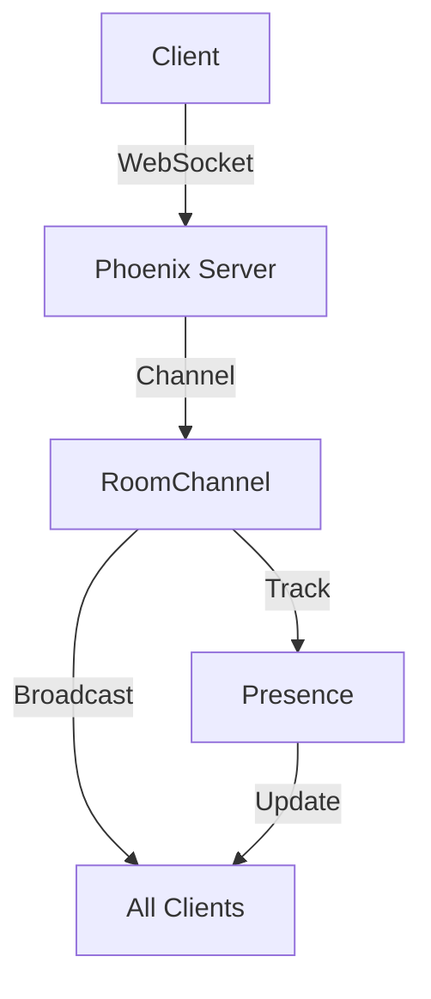

## 30.1. Building a Real-Time Chat Application

In this section, we will delve into the process of building a real-time chat application using Elixir and the Phoenix framework. This case study will guide you through the essential components and design patterns necessary to create a scalable, fault-tolerant chat system capable of handling high concurrency and ensuring reliable message delivery.

### Requirements

Before we dive into the implementation, let's outline the key requirements for our chat application:

- **Instant Messaging**: Users should be able to send and receive messages instantly.
- **User Presence**: Display the online status of users in real-time.
- **Scalability**: The system should handle a large number of concurrent users efficiently.

### Technologies Used

To meet these requirements, we will leverage the following technologies:

- **Phoenix Channels**: For real-time, bidirectional communication between clients and the server.
- **Phoenix Presence**: To track user presence and broadcast state changes.
- **WebSockets**: For persistent connections that enable real-time data exchange.

### Implementation Highlights

#### Establishing Bidirectional Communication

The backbone of our chat application is the ability to establish bidirectional communication between the client and server. Phoenix Channels provide an abstraction over WebSockets, making it easier to manage real-time connections.

```elixir
defmodule ChatWeb.UserSocket do
  use Phoenix.Socket

  ## Channels
  channel "room:*", ChatWeb.RoomChannel

  # Transport
  transport :websocket, Phoenix.Transports.WebSocket

  def connect(%{"token" => token}, socket) do
    # Authenticate user and assign user_id to socket
    case authenticate_user(token) do
      {:ok, user_id} -> {:ok, assign(socket, :user_id, user_id)}
      :error -> :error
    end
  end

  def id(socket), do: "users_socket:#{socket.assigns.user_id}"
end
```

In this example, we define a `UserSocket` module that handles WebSocket connections. The `connect/2` function authenticates the user and assigns a `user_id` to the socket, which is crucial for tracking user presence and managing connections.

#### Handling User State and Message Broadcasting

Once the connection is established, we need to handle user state and broadcast messages to all participants in a chat room. This is achieved using Phoenix Channels and Presence.

```elixir
defmodule ChatWeb.RoomChannel do
  use Phoenix.Channel

  alias ChatWeb.Presence

  def join("room:" <> room_id, _params, socket) do
    send(self(), :after_join)
    {:ok, assign(socket, :room_id, room_id)}
  end

  def handle_info(:after_join, socket) do
    Presence.track(socket, socket.assigns.user_id, %{
      online_at: inspect(System.system_time(:seconds))
    })
    push(socket, "presence_state", Presence.list(socket))
    {:noreply, socket}
  end

  def handle_in("new_msg", %{"body" => body}, socket) do
    broadcast!(socket, "new_msg", %{user: socket.assigns.user_id, body: body})
    {:noreply, socket}
  end
end
```

In the `RoomChannel` module, we handle user joining and message broadcasting. The `join/3` function assigns the room ID to the socket, and `handle_info/2` tracks user presence using the `Presence` module. The `handle_in/3` function broadcasts new messages to all users in the room.

#### Challenges

Building a real-time chat application comes with its own set of challenges:

- **Managing High User Concurrency**: As the number of users increases, the system must efficiently manage connections and message delivery.
- **Ensuring Message Delivery and Ordering**: Messages should be delivered reliably and in the correct order, even under high load.

### Visualizing the Architecture

To better understand the architecture of our chat application, let's visualize the components and their interactions using a Mermaid.js diagram.



**Diagram Description**: This diagram illustrates the flow of data in our chat application. Clients connect to the Phoenix server via WebSockets, which are managed by the `UserSocket` module. The `RoomChannel` handles message broadcasting and user presence tracking, ensuring that all clients receive updates in real-time.

### Code Examples and Exercises

Now that we've covered the core concepts, let's explore some code examples and exercises to reinforce your understanding.

#### Code Example: Implementing a Simple Chat Room

Here's a complete example of a simple chat room using Phoenix Channels and Presence:

```elixir
defmodule ChatWeb.UserSocket do
  use Phoenix.Socket

  channel "room:*", ChatWeb.RoomChannel
  transport :websocket, Phoenix.Transports.WebSocket

  def connect(%{"token" => token}, socket) do
    case authenticate_user(token) do
      {:ok, user_id} -> {:ok, assign(socket, :user_id, user_id)}
      :error -> :error
    end
  end

  def id(socket), do: "users_socket:#{socket.assigns.user_id}"
end

defmodule ChatWeb.RoomChannel do
  use Phoenix.Channel

  alias ChatWeb.Presence

  def join("room:" <> room_id, _params, socket) do
    send(self(), :after_join)
    {:ok, assign(socket, :room_id, room_id)}
  end

  def handle_info(:after_join, socket) do
    Presence.track(socket, socket.assigns.user_id, %{
      online_at: inspect(System.system_time(:seconds))
    })
    push(socket, "presence_state", Presence.list(socket))
    {:noreply, socket}
  end

  def handle_in("new_msg", %{"body" => body}, socket) do
    broadcast!(socket, "new_msg", %{user: socket.assigns.user_id, body: body})
    {:noreply, socket}
  end
end
```

**Try It Yourself**: Modify the code to add a feature that allows users to send private messages to each other. Consider how you might handle user authentication and message routing.

### Knowledge Check

- **Question**: How does Phoenix Presence help in managing user state in a chat application?
- **Question**: What are the benefits of using WebSockets for real-time communication?

### Key Takeaways

- **Phoenix Channels** provide a powerful abstraction for managing real-time connections and message broadcasting.
- **Presence** is essential for tracking user state and ensuring that all participants are aware of each other's status.
- **Scalability** and **fault tolerance** are critical considerations when building a chat application, especially under high concurrency.

### Embrace the Journey

Building a real-time chat application is a rewarding experience that showcases the power of Elixir and Phoenix. As you continue to explore and experiment, remember that this is just the beginning. Keep pushing the boundaries of what's possible, stay curious, and enjoy the journey!

## Quiz: Building a Real-Time Chat Application



### What is the primary purpose of Phoenix Channels in a chat application?

- [x] To manage real-time, bidirectional communication
- [ ] To store user data
- [ ] To handle HTTP requests
- [ ] To manage database connections

> **Explanation:** Phoenix Channels are used to manage real-time, bidirectional communication between clients and the server.

### How does Phoenix Presence help in a chat application?

- [x] By tracking user presence and broadcasting state changes
- [ ] By storing chat messages
- [ ] By handling HTTP requests
- [ ] By managing database connections

> **Explanation:** Phoenix Presence is used to track user presence and broadcast state changes to all connected clients.

### What transport mechanism does Phoenix use for real-time communication?

- [x] WebSockets
- [ ] HTTP
- [ ] TCP
- [ ] UDP

> **Explanation:** Phoenix uses WebSockets for real-time communication, providing a persistent connection between the client and server.

### What is the role of the `UserSocket` module in a Phoenix application?

- [x] To handle WebSocket connections and authenticate users
- [ ] To manage database connections
- [ ] To store user data
- [ ] To handle HTTP requests

> **Explanation:** The `UserSocket` module handles WebSocket connections and authenticates users, assigning a unique ID to each socket.

### Which function is used to broadcast messages to all clients in a Phoenix Channel?

- [x] `broadcast!`
- [ ] `send`
- [ ] `push`
- [ ] `emit`

> **Explanation:** The `broadcast!` function is used to send messages to all clients connected to a channel.

### What is a key challenge when building a real-time chat application?

- [x] Managing high user concurrency
- [ ] Handling HTTP requests
- [ ] Storing user data
- [ ] Managing database connections

> **Explanation:** Managing high user concurrency is a key challenge in real-time chat applications, requiring efficient handling of connections and message delivery.

### How can you ensure message delivery and ordering in a chat application?

- [x] By using Phoenix Channels and Presence
- [ ] By storing messages in a database
- [ ] By using HTTP requests
- [ ] By managing database connections

> **Explanation:** Phoenix Channels and Presence help ensure message delivery and ordering by managing real-time connections and tracking user state.

### What is the benefit of using WebSockets for a chat application?

- [x] They provide a persistent connection for real-time data exchange
- [ ] They handle HTTP requests
- [ ] They store user data
- [ ] They manage database connections

> **Explanation:** WebSockets provide a persistent connection that enables real-time data exchange between the client and server.

### True or False: Phoenix Channels can only be used for chat applications.

- [ ] True
- [x] False

> **Explanation:** False. Phoenix Channels can be used for any application requiring real-time communication, not just chat applications.

### What is the purpose of the `handle_in` function in a Phoenix Channel?

- [x] To handle incoming messages from clients
- [ ] To manage database connections
- [ ] To store user data
- [ ] To handle HTTP requests

> **Explanation:** The `handle_in` function is used to handle incoming messages from clients and perform actions such as broadcasting messages.


