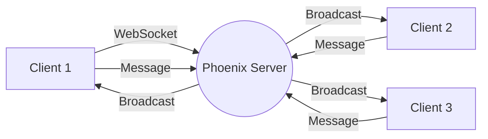

## 30.1. Building a Real-Time Chat Application

In this section, we delve into the intricacies of building a real-time chat application using Elixir and the Phoenix Framework. This case study will guide you through the process of implementing instant messaging, managing user presence, and ensuring scalability. We'll leverage Phoenix Channels and WebSockets to establish bidirectional communication and handle the complexities of user state and message broadcasting.

### Requirements

To build a robust real-time chat application, we need to address the following requirements:

- **Instant Messaging**: Enable users to send and receive messages instantly.
- **User Presence**: Track and display user presence status in real-time.
- **Scalability**: Ensure the application can handle a growing number of users and messages efficiently.

### Technologies Used

- **Phoenix Channels**: Facilitate real-time communication between clients and the server.
- **Presence**: Manage and track user presence across different channels.
- **WebSockets**: Establish a persistent connection for real-time data exchange.

### Implementation Highlights

#### Establishing Bidirectional Communication

To enable real-time messaging, we need to establish a bidirectional communication channel between the client and the server. Phoenix Channels provide an abstraction over WebSockets, making it easier to implement this functionality.

```elixir
defmodule ChatAppWeb.UserSocket do
  use Phoenix.Socket

  ## Channels
  channel "room:*", ChatAppWeb.RoomChannel

  # Socket params are passed from the client and can
  # be used to verify and authenticate a user. After
  # verification, you can put default assigns into
  # the socket that will be set for all channels, ie
  # socket.assigns.user_id = user_id
  #
  # To deny connection, return `:error`.
  #
  # See `Phoenix.Token` documentation for examples in
  # performing token verification on connect.
  def connect(_params, socket, _connect_info) do
    {:ok, socket}
  end

  def id(_socket), do: nil
end
```

In the above code, we define a `UserSocket` module that uses Phoenix's `Socket` behavior. We specify a channel pattern `room:*` that matches any topic starting with "room:". This allows us to handle multiple chat rooms dynamically.

#### Handling User State and Message Broadcasting

Managing user state and broadcasting messages to all participants in a chat room is crucial for a seamless chat experience.

```elixir
defmodule ChatAppWeb.RoomChannel do
  use Phoenix.Channel

  def join("room:" <> room_id, _params, socket) do
    send(self(), :after_join)
    {:ok, assign(socket, :room_id, room_id)}
  end

  def handle_info(:after_join, socket) do
    broadcast!(socket, "user_joined", %{user: socket.assigns.user_id})
    {:noreply, socket}
  end

  def handle_in("message:new", %{"body" => body}, socket) do
    broadcast!(socket, "message:new", %{body: body, user: socket.assigns.user_id})
    {:noreply, socket}
  end
end
```

In the `RoomChannel` module, we define the `join` function to handle user connections to a chat room. We broadcast a `user_joined` event when a user joins and handle incoming messages with the `handle_in` function, broadcasting them to all connected clients.

#### Managing User Presence

The Phoenix Presence module allows us to track user presence across channels, providing real-time updates on who is online.

```elixir
defmodule ChatAppWeb.Presence do
  use Phoenix.Presence,
    otp_app: :chat_app,
    pubsub_server: ChatApp.PubSub
end
```

To use Presence, we define a module that uses `Phoenix.Presence`. This module tracks user presence and can be queried to get the current state of online users.

### Challenges

#### Managing High User Concurrency

Handling a large number of concurrent users is a common challenge in real-time applications. Elixir's lightweight processes and the BEAM VM's concurrency model make it well-suited for this task. However, careful design is necessary to ensure efficient resource usage and avoid bottlenecks.

#### Ensuring Message Delivery and Ordering

Ensuring that messages are delivered in the correct order and without loss is critical for a reliable chat application. Phoenix Channels provide mechanisms for message ordering and delivery guarantees, but network issues and client-side handling must also be considered.

### Visualizing the Architecture

Below is a diagram illustrating the architecture of our real-time chat application, including the flow of messages between clients and the server.


```mermaid
graph LR
    A[Client 1] -- WebSocket --> B((Phoenix Server))
    A -- Message --> B
    B -- Broadcast --> A
    B -- Broadcast --> C[Client 2]
    B -- Broadcast --> D[Client 3]
    C -- Message --> B
    D -- Message --> B
```

### Try It Yourself

To experiment with the code, try modifying the `RoomChannel` to include additional features such as:

- **Typing Indicators**: Notify other users when someone is typing.
- **Read Receipts**: Indicate when a message has been read.
- **Private Messaging**: Allow users to send direct messages to each other.

### References and Links

- [Phoenix Framework Official Documentation](https://hexdocs.pm/phoenix/)
- [Elixir Lang Website](https://elixir-lang.org/)
- [WebSockets on MDN](https://developer.mozilla.org/en-US/docs/Web/API/WebSockets_API)

### Knowledge Check

1. What is the role of Phoenix Channels in a real-time chat application?
2. How does the Presence module help in managing user states?
3. What are some challenges in handling high user concurrency?
4. Explain the importance of message ordering in a chat application.
5. How can you extend the chat application to include private messaging?

### Embrace the Journey

Building a real-time chat application is just the beginning. As you progress, you'll discover more about Elixir's capabilities and the power of the Phoenix Framework. Keep experimenting, stay curious, and enjoy the journey!

## Quiz Time!



### What is the primary purpose of Phoenix Channels in a real-time chat application?

- [x] Facilitate real-time communication between clients and the server.
- [ ] Manage user authentication and authorization.
- [ ] Handle database transactions.
- [ ] Generate HTML templates.

> **Explanation:** Phoenix Channels are used to establish real-time communication between clients and the server, enabling instant messaging and updates.

### How does the Presence module assist in a chat application?

- [x] Tracks and manages user presence across channels.
- [ ] Encrypts messages for secure communication.
- [ ] Handles database connections.
- [ ] Generates user interface components.

> **Explanation:** The Presence module tracks user presence, providing real-time updates on who is online and managing user states.

### What is a key challenge in managing high user concurrency in chat applications?

- [x] Efficient resource usage and avoiding bottlenecks.
- [ ] Designing complex user interfaces.
- [ ] Implementing advanced encryption algorithms.
- [ ] Handling large media files.

> **Explanation:** Managing high user concurrency requires careful design to ensure efficient resource usage and avoid bottlenecks, especially in real-time applications.

### Why is message ordering important in a chat application?

- [x] Ensures messages are delivered in the correct sequence.
- [ ] Reduces server load and improves performance.
- [ ] Enhances user authentication.
- [ ] Simplifies database schema design.

> **Explanation:** Message ordering is crucial to ensure that messages are delivered in the correct sequence, maintaining the flow of conversation.

### What feature can be added to a chat application to enhance user experience?

- [x] Typing indicators.
- [ ] Complex database queries.
- [ ] Advanced encryption algorithms.
- [ ] Static HTML pages.

> **Explanation:** Typing indicators enhance user experience by notifying users when someone is typing, making the chat feel more interactive.

### Which technology is used to establish a persistent connection for real-time data exchange?

- [x] WebSockets.
- [ ] HTTP.
- [ ] FTP.
- [ ] SMTP.

> **Explanation:** WebSockets are used to establish a persistent connection between the client and server for real-time data exchange.

### What is a potential modification to the RoomChannel for additional functionality?

- [x] Implementing read receipts.
- [ ] Creating static HTML templates.
- [ ] Managing database migrations.
- [ ] Handling email notifications.

> **Explanation:** Implementing read receipts in the RoomChannel can provide additional functionality by indicating when a message has been read.

### What is an advantage of using Elixir's lightweight processes in a chat application?

- [x] Efficient handling of concurrent users.
- [ ] Simplified user interface design.
- [ ] Enhanced encryption capabilities.
- [ ] Reduced need for database indexing.

> **Explanation:** Elixir's lightweight processes efficiently handle concurrent users, making it well-suited for real-time applications like chat.

### How can message broadcasting be achieved in a Phoenix Channel?

- [x] Using the broadcast! function.
- [ ] By directly modifying the database.
- [ ] Through HTTP requests.
- [ ] By sending emails.

> **Explanation:** The `broadcast!` function is used in Phoenix Channels to broadcast messages to all connected clients.

### Is it possible to track user presence without the Presence module?

- [ ] True
- [x] False

> **Explanation:** While it is technically possible to track user presence without the Presence module, it would require implementing custom logic that the module already provides efficiently.


