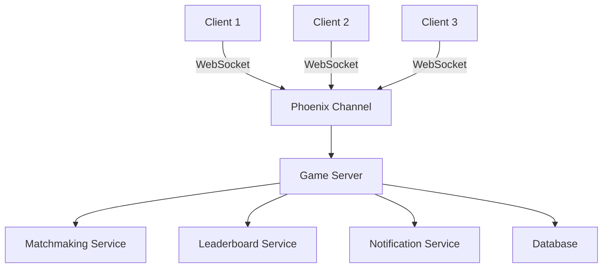

## 30.10. Gaming and Multimedia Applications

In the realm of gaming and multimedia applications, the need for real-time data processing, low latency, and high scalability is paramount. Elixir, with its functional programming paradigm and robust concurrency model, offers a compelling solution for building backend services that meet these demands. In this section, we will explore how Elixir's design patterns and features can be leveraged to create efficient, scalable, and real-time gaming and multimedia applications.

### Introduction to Gaming and Multimedia with Elixir

Gaming and multimedia applications often require complex backend services to handle tasks such as matchmaking, leaderboards, and multiplayer synchronization. These services must operate with minimal latency to ensure a seamless user experience. Elixir, built on the Erlang VM (BEAM), provides a powerful platform for developing such applications, thanks to its support for lightweight processes, fault tolerance, and distributed computing.

#### Key Concepts

- **Concurrency and Parallelism**: Elixir's ability to handle thousands of concurrent processes makes it ideal for real-time applications.
- **Fault Tolerance**: The "let it crash" philosophy ensures that systems can recover from failures without affecting the overall application.
- **Scalability**: Elixir's distributed nature allows applications to scale horizontally across multiple nodes.

### Backend Services for Gaming and Multimedia

#### Matchmaking

Matchmaking is a critical component of multiplayer games, where players are paired based on skill level, preferences, or other criteria. Elixir's pattern matching and concurrency features make it well-suited for implementing efficient matchmaking algorithms.

```elixir
defmodule Matchmaker do
  def find_match(players) do
    players
    |> Enum.group_by(& &1.skill_level)
    |> Enum.map(fn {skill, group} -> 
      {skill, Enum.chunk_every(group, 2)}
    end)
  end
end

# Example usage
players = [
  %{id: 1, skill_level: 5},
  %{id: 2, skill_level: 5},
  %{id: 3, skill_level: 3},
  %{id: 4, skill_level: 3}
]

Matchmaker.find_match(players)
```

In this example, players are grouped by skill level, and pairs are formed within each group. This approach can be extended to include additional criteria such as latency or region.

#### Leaderboards

Leaderboards are essential for tracking player progress and fostering competition. Elixir's ETS (Erlang Term Storage) provides an efficient way to store and retrieve leaderboard data.

```elixir
defmodule Leaderboard do
  def start_link do
    :ets.new(:leaderboard, [:named_table, :public, :set])
  end

  def add_score(player_id, score) do
    :ets.insert(:leaderboard, {player_id, score})
  end

  def get_top_scores(limit) do
    :ets.tab2list(:leaderboard)
    |> Enum.sort_by(&elem(&1, 1), :desc)
    |> Enum.take(limit)
  end
end

# Example usage
Leaderboard.start_link()
Leaderboard.add_score(1, 1500)
Leaderboard.add_score(2, 2000)
Leaderboard.get_top_scores(10)
```

This implementation uses ETS to store player scores and retrieve the top scores efficiently. ETS tables are in-memory and provide fast access, making them suitable for real-time applications.

#### Multiplayer Synchronization

Synchronizing game state across multiple players is a challenging task, especially in real-time multiplayer games. Elixir's GenServer and PubSub patterns can be used to manage game state and broadcast updates to players.

```elixir
defmodule GameServer do
  use GenServer

  def start_link(initial_state) do
    GenServer.start_link(__MODULE__, initial_state, name: __MODULE__)
  end

  def init(state) do
    {:ok, state}
  end

  def handle_call({:update_state, new_state}, _from, _state) do
    {:reply, :ok, new_state}
  end

  def update_state(new_state) do
    GenServer.call(__MODULE__, {:update_state, new_state})
  end
end

defmodule GamePubSub do
  use Phoenix.PubSub

  def broadcast_update(state) do
    Phoenix.PubSub.broadcast(__MODULE__, "game_updates", state)
  end
end

# Example usage
{:ok, _} = GameServer.start_link(%{score: 0})
GameServer.update_state(%{score: 10})
GamePubSub.broadcast_update(%{score: 10})
```

In this example, a GenServer is used to manage the game state, and Phoenix PubSub is used to broadcast updates to connected clients. This pattern ensures that all players receive the latest game state in real-time.

### Performance Needs in Gaming and Multimedia

#### Low Latency

Low latency is crucial in gaming and multimedia applications to ensure a smooth user experience. Elixir's lightweight processes and message-passing model help minimize latency by allowing tasks to be processed concurrently.

#### Real-Time Data Exchange

Real-time data exchange is essential for features such as live streaming, chat, and multiplayer interactions. Elixir's support for WebSockets and channels in the Phoenix framework enables efficient real-time communication.

```elixir
defmodule ChatChannel do
  use Phoenix.Channel

  def join("room:lobby", _message, socket) do
    {:ok, socket}
  end

  def handle_in("new_msg", %{"body" => body}, socket) do
    broadcast!(socket, "new_msg", %{body: body})
    {:noreply, socket}
  end
end
```

This example demonstrates a simple chat application using Phoenix channels. Messages are broadcast to all connected clients in real-time, providing an interactive experience.

### Examples of Gaming and Multimedia Applications

#### Multiplayer Online Games

Multiplayer online games require robust backend services to handle player interactions, game state synchronization, and real-time communication. Elixir's concurrency model and distributed nature make it an excellent choice for building scalable multiplayer game servers.

#### Interactive Media Platforms

Interactive media platforms, such as live streaming services and virtual reality experiences, demand low latency and high throughput. Elixir's ability to handle concurrent connections and process large volumes of data in real-time makes it well-suited for these applications.

### Design Patterns for Gaming and Multimedia

#### Actor Model

The Actor Model is a concurrency pattern that treats "actors" as the fundamental units of computation. In Elixir, processes can be thought of as actors, each with its own state and behavior. This model is particularly useful in gaming and multimedia applications, where multiple entities (e.g., players, NPCs) need to interact concurrently.

```elixir
defmodule Player do
  defstruct [:id, :position]

  def move(%Player{id: id, position: position}, direction) do
    new_position = update_position(position, direction)
    IO.puts("Player #{id} moved to #{inspect(new_position)}")
    %Player{id: id, position: new_position}
  end

  defp update_position({x, y}, :up), do: {x, y + 1}
  defp update_position({x, y}, :down), do: {x, y - 1}
  defp update_position({x, y}, :left), do: {x - 1, y}
  defp update_position({x, y}, :right), do: {x + 1, y}
end

# Example usage
player = %Player{id: 1, position: {0, 0}}
Player.move(player, :up)
```

In this example, each player is represented as an actor with its own state and behavior. The `move` function updates the player's position based on the given direction.

#### PubSub Pattern

The PubSub pattern is used to broadcast messages to multiple subscribers. In gaming and multimedia applications, this pattern is useful for sending updates to clients, such as game state changes or chat messages.

```elixir
defmodule NotificationService do
  use Phoenix.PubSub

  def notify(event, message) do
    Phoenix.PubSub.broadcast(__MODULE__, event, message)
  end
end

# Example usage
NotificationService.notify("game_event", %{type: "score_update", score: 100})
```

This example demonstrates a simple notification service that broadcasts messages to subscribers. The PubSub pattern ensures that all clients receive updates in real-time.

### Elixir's Unique Features for Gaming and Multimedia

#### Lightweight Processes

Elixir's lightweight processes are ideal for handling concurrent tasks in gaming and multimedia applications. Each process runs independently, allowing for efficient parallelism and fault isolation.

#### Fault Tolerance

Elixir's fault tolerance features, such as supervisors and the "let it crash" philosophy, ensure that applications can recover from failures without affecting the overall system. This is crucial in gaming and multimedia applications, where downtime can lead to a poor user experience.

#### Distributed Computing

Elixir's support for distributed computing allows applications to scale across multiple nodes, providing the necessary resources to handle large numbers of concurrent users.

### Visualizing Elixir's Role in Gaming and Multimedia

Below is a diagram illustrating the architecture of a typical multiplayer game server built with Elixir.



**Diagram Description**: This diagram shows how multiple clients connect to a Phoenix channel via WebSockets. The channel communicates with the game server, which interacts with various services such as matchmaking, leaderboards, and notifications. The game server also connects to a database for persistent storage.

### Design Considerations

- **Scalability**: Ensure that the application can handle an increasing number of users by distributing the load across multiple nodes.
- **Latency**: Minimize latency by optimizing network communication and using efficient data structures.
- **Fault Tolerance**: Implement robust error handling and recovery mechanisms to maintain system stability.

### Differences and Similarities with Other Patterns

- **Actor Model vs. Object-Oriented Patterns**: The Actor Model focuses on concurrency and state isolation, whereas object-oriented patterns emphasize encapsulation and inheritance.
- **PubSub vs. Observer Pattern**: Both patterns involve broadcasting messages to subscribers, but PubSub is more suitable for distributed systems due to its decoupled architecture.

### Try It Yourself

Experiment with the code examples provided in this section. Try modifying the matchmaking algorithm to include additional criteria, or implement a new feature in the game server, such as player statistics tracking. By experimenting with these examples, you'll gain a deeper understanding of how Elixir can be used to build robust gaming and multimedia applications.

### Knowledge Check

- What are the key benefits of using Elixir for gaming and multimedia applications?
- How does the Actor Model differ from traditional object-oriented patterns?
- What role does the PubSub pattern play in real-time applications?

### Conclusion

Elixir's unique features and design patterns make it an excellent choice for building gaming and multimedia applications. Its ability to handle concurrent processes, recover from failures, and scale across multiple nodes ensures that applications can meet the demanding requirements of real-time, interactive experiences. As you continue to explore Elixir, remember to experiment with different patterns and techniques to find the best solutions for your specific use cases.

## Quiz: Gaming and Multimedia Applications



### What is a key advantage of using Elixir for gaming applications?

- [x] Concurrency and fault tolerance
- [ ] Object-oriented design
- [ ] High memory usage
- [ ] Complex syntax

> **Explanation:** Elixir's concurrency and fault tolerance make it ideal for gaming applications.

### Which Elixir feature is crucial for real-time data exchange?

- [x] WebSockets and channels
- [ ] Static typing
- [ ] Inheritance
- [ ] Monolithic architecture

> **Explanation:** WebSockets and channels enable efficient real-time communication in Elixir.

### How does Elixir's "let it crash" philosophy benefit gaming applications?

- [x] Ensures system stability by recovering from failures
- [ ] Increases code complexity
- [ ] Reduces performance
- [ ] Limits scalability

> **Explanation:** The "let it crash" philosophy allows systems to recover from failures, maintaining stability.

### What pattern is used to broadcast messages to multiple subscribers in Elixir?

- [x] PubSub pattern
- [ ] Singleton pattern
- [ ] Factory pattern
- [ ] Observer pattern

> **Explanation:** The PubSub pattern is used to broadcast messages to multiple subscribers in Elixir.

### Which Elixir feature allows applications to scale across multiple nodes?

- [x] Distributed computing
- [ ] Static typing
- [ ] Inheritance
- [ ] Monolithic architecture

> **Explanation:** Elixir's support for distributed computing allows applications to scale across multiple nodes.

### What is the primary role of a GenServer in Elixir?

- [x] Manage state and handle requests
- [ ] Provide static typing
- [ ] Implement inheritance
- [ ] Increase code complexity

> **Explanation:** A GenServer manages state and handles requests in Elixir applications.

### How does Elixir's lightweight processes benefit gaming applications?

- [x] Enable efficient parallelism and fault isolation
- [ ] Increase memory usage
- [ ] Limit scalability
- [ ] Reduce performance

> **Explanation:** Lightweight processes enable efficient parallelism and fault isolation in Elixir.

### What is a common use case for the Actor Model in gaming applications?

- [x] Managing concurrent entities like players and NPCs
- [ ] Implementing static typing
- [ ] Increasing code complexity
- [ ] Reducing scalability

> **Explanation:** The Actor Model is used to manage concurrent entities like players and NPCs in gaming applications.

### Which pattern is more suitable for distributed systems, PubSub or Observer?

- [x] PubSub
- [ ] Observer
- [ ] Singleton
- [ ] Factory

> **Explanation:** The PubSub pattern is more suitable for distributed systems due to its decoupled architecture.

### True or False: Elixir's ETS is suitable for real-time applications due to its fast access.

- [x] True
- [ ] False

> **Explanation:** ETS provides fast access, making it suitable for real-time applications.


