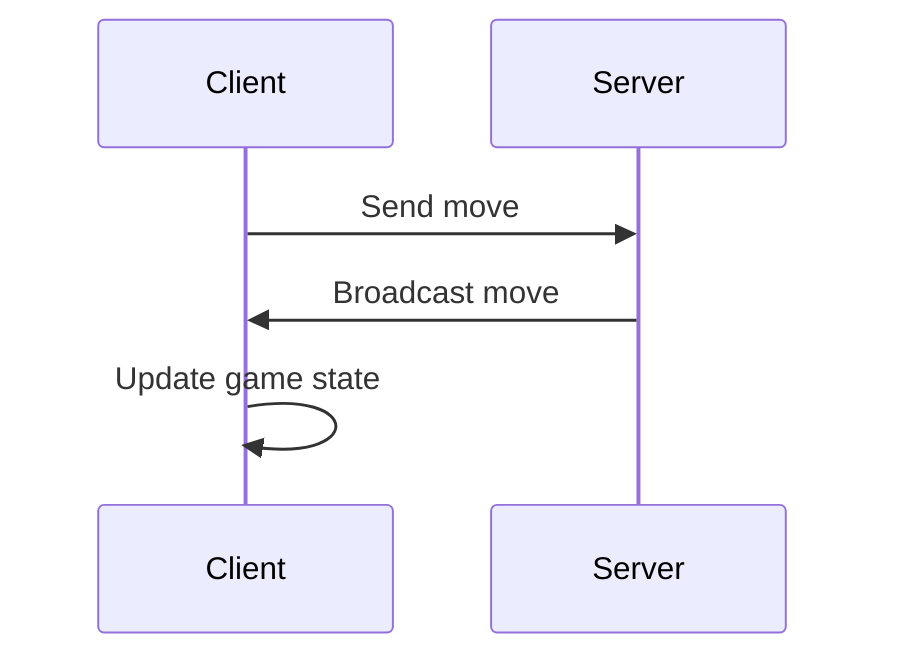

## 30.10. Gaming and Multimedia Applications

In the realm of gaming and multimedia applications, performance and real-time data exchange are paramount. Elixir, with its robust concurrency model and the OTP (Open Telecom Platform) framework, offers unique advantages for building scalable, fault-tolerant systems. This section delves into how Elixir can be leveraged for backend services in gaming, focusing on matchmaking, leaderboards, and multiplayer synchronization. We will also explore the performance needs of these applications, such as low latency and real-time data exchange, and provide practical examples of multiplayer online games and interactive media platforms.

### The Role of Elixir in Gaming and Multimedia

Elixir is a functional, concurrent language built on the Erlang VM (BEAM), which is renowned for its ability to handle thousands of concurrent processes with ease. This makes it an excellent choice for gaming and multimedia applications where real-time performance and scalability are critical.

#### Key Features of Elixir for Gaming

- **Concurrency**: Elixir's lightweight processes allow for efficient handling of concurrent tasks, which is essential for real-time gaming applications.
- **Fault Tolerance**: The OTP framework provides tools for building resilient systems that can recover from failures, ensuring high availability.
- **Scalability**: Elixir applications can easily scale to handle increasing loads, making them suitable for large-scale multiplayer games.
- **Real-Time Communication**: With tools like Phoenix Channels, Elixir facilitates real-time communication between clients and servers.

### Backend Services in Gaming

Backend services are the backbone of modern gaming applications. They handle critical tasks such as matchmaking, managing leaderboards, and synchronizing multiplayer sessions. Let's explore how Elixir can be used to implement these services.

#### Matchmaking

Matchmaking is the process of pairing players together in a multiplayer game. It requires efficient algorithms to ensure players are matched based on skill level, latency, and other factors.

```elixir
defmodule Matchmaker do
  use GenServer

  # Start the GenServer
  def start_link(_) do
    GenServer.start_link(__MODULE__, %{}, name: __MODULE__)
  end

  # Handle incoming player requests
  def handle_call({:match, player}, _from, state) do
    # Logic to find a suitable match
    match = find_match(player, state)
    {:reply, match, state}
  end

  defp find_match(player, state) do
    # Implement matchmaking logic here
  end
end
```

In this example, we use a GenServer to manage matchmaking requests. The `handle_call` function processes incoming player requests and finds suitable matches.

#### Leaderboards

Leaderboards are a crucial feature in many games, allowing players to compete for high scores. Elixir's concurrency model enables efficient updates and queries.

```elixir
defmodule Leaderboard do
  use GenServer

  def start_link(_) do
    GenServer.start_link(__MODULE__, %{}, name: __MODULE__)
  end

  def handle_call({:update_score, player, score}, _from, state) do
    new_state = Map.update(state, player, score, fn old_score -> max(old_score, score) end)
    {:reply, :ok, new_state}
  end

  def handle_call({:get_leaderboard}, _from, state) do
    sorted_leaderboard = Enum.sort_by(state, fn {_player, score} -> -score end)
    {:reply, sorted_leaderboard, state}
  end
end
```

Here, a GenServer is used to maintain the leaderboard state. Scores are updated and retrieved using concurrent processes, ensuring high performance.

#### Multiplayer Synchronization

Synchronizing the state of a multiplayer game across different clients is challenging. Elixir's real-time capabilities, combined with Phoenix Channels, provide an effective solution.

```elixir
defmodule GameChannel do
  use Phoenix.Channel

  def join("game:lobby", _message, socket) do
    {:ok, socket}
  end

  def handle_in("move", %{"player" => player, "move" => move}, socket) do
    broadcast!(socket, "move", %{"player" => player, "move" => move})
    {:noreply, socket}
  end
end
```

In this example, Phoenix Channels are used to broadcast player moves to all connected clients, ensuring synchronized gameplay.

### Performance Needs: Low Latency and Real-Time Data Exchange

Performance is a critical aspect of gaming and multimedia applications. Elixir's design allows for low-latency operations and real-time data exchange, which are essential for a seamless user experience.

#### Low Latency

Low latency is crucial in gaming to ensure that player actions are reflected in real-time. Elixir's lightweight processes and message-passing model enable rapid communication between components.

```elixir
defmodule LatencyTest do
  def measure_latency do
    start_time = :os.system_time(:millisecond)
    # Simulate a game action
    :timer.sleep(10)
    end_time = :os.system_time(:millisecond)
    end_time - start_time
  end
end
```

This simple example measures the latency of a simulated game action, demonstrating Elixir's ability to handle time-sensitive operations efficiently.

#### Real-Time Data Exchange

Real-time data exchange is vital for synchronizing game state and providing players with up-to-date information. Elixir's Phoenix framework excels at handling real-time communication.

```elixir
defmodule RealTimeData do
  use Phoenix.Channel

  def join("data:updates", _message, socket) do
    {:ok, socket}
  end

  def handle_in("update", payload, socket) do
    broadcast!(socket, "update", payload)
    {:noreply, socket}
  end
end
```

This example shows how Phoenix Channels can be used to broadcast real-time data updates to clients, ensuring that everyone stays in sync.

### Examples of Gaming and Multimedia Applications

Let's explore some practical examples of how Elixir can be used in gaming and multimedia applications.

#### Multiplayer Online Games

Multiplayer online games require robust backend services to manage player interactions, game state, and real-time communication. Elixir's concurrency model and OTP framework provide the necessary tools for building such systems.

- **Example Game**: A real-time strategy game where players compete to control territories.
- **Backend Services**: Matchmaking, leaderboards, game state synchronization.
- **Performance Needs**: Low latency, high throughput, real-time updates.

#### Interactive Media Platforms

Interactive media platforms, such as live streaming services, require efficient data processing and real-time communication.

- **Example Platform**: A live streaming service where viewers can interact with streamers.
- **Backend Services**: Real-time chat, viewer analytics, content delivery.
- **Performance Needs**: High concurrency, low latency, real-time data processing.

### Design Considerations

When building gaming and multimedia applications with Elixir, there are several design considerations to keep in mind:

- **Scalability**: Design your system to handle increasing loads by leveraging Elixir's concurrency model and OTP framework.
- **Fault Tolerance**: Use OTP's supervision trees to build resilient systems that can recover from failures.
- **Real-Time Communication**: Utilize Phoenix Channels for efficient real-time communication between clients and servers.
- **Performance Optimization**: Profile your application to identify bottlenecks and optimize performance-critical paths.

### Elixir's Unique Features

Elixir's unique features, such as its concurrency model, fault tolerance, and real-time capabilities, make it an excellent choice for gaming and multimedia applications. By leveraging these features, you can build scalable, high-performance systems that deliver a seamless user experience.

### Differences and Similarities with Other Languages

While Elixir shares some similarities with other functional languages, its concurrency model and OTP framework set it apart. Compared to languages like JavaScript or Python, Elixir offers superior performance for real-time applications due to its lightweight processes and message-passing model.

### Try It Yourself

To get hands-on experience with Elixir in gaming and multimedia applications, try modifying the provided code examples. Experiment with different matchmaking algorithms, leaderboard structures, and real-time communication patterns. This will help you gain a deeper understanding of how Elixir can be used to build high-performance systems.

### Visualizing Real-Time Communication

To better understand how real-time communication works in Elixir, let's visualize the process using a Mermaid.js sequence diagram.


```mermaid
sequenceDiagram
    participant Client
    participant Server
    Client->>Server: Send move
    Server->>Client: Broadcast move
    Client->>Client: Update game state
```

This diagram illustrates the flow of real-time communication in a multiplayer game. The client sends a move to the server, which broadcasts it to all connected clients, ensuring synchronized gameplay.

### Knowledge Check

To reinforce your understanding of Elixir in gaming and multimedia applications, consider the following questions:

1. What are the key features of Elixir that make it suitable for gaming applications?
2. How does Elixir's concurrency model benefit real-time data exchange?
3. What are some design considerations when building gaming applications with Elixir?
4. How can Phoenix Channels be used to implement real-time communication?
5. What are the performance needs of gaming and multimedia applications?

### Embrace the Journey

Remember, this is just the beginning. As you delve deeper into Elixir and its applications in gaming and multimedia, you'll uncover new possibilities and challenges. Keep experimenting, stay curious, and enjoy the journey!

## Quiz Time!



### What makes Elixir suitable for gaming applications?

- [x] Concurrency and fault tolerance
- [ ] Object-oriented programming
- [ ] Lack of real-time capabilities
- [ ] High memory usage

> **Explanation:** Elixir's concurrency model and fault tolerance make it ideal for gaming applications requiring real-time performance.

### How does Elixir handle real-time data exchange?

- [x] Through lightweight processes and message-passing
- [ ] By using heavy threads
- [ ] With synchronous I/O operations
- [ ] By blocking processes

> **Explanation:** Elixir uses lightweight processes and message-passing for efficient real-time data exchange.

### What is a key consideration when designing gaming applications with Elixir?

- [x] Scalability and fault tolerance
- [ ] Using synchronous communication
- [ ] Ignoring real-time requirements
- [ ] High memory consumption

> **Explanation:** Scalability and fault tolerance are crucial when designing gaming applications with Elixir.

### How can Phoenix Channels be utilized in gaming applications?

- [x] For real-time communication between clients and servers
- [ ] To block client requests
- [ ] For batch processing
- [ ] To increase latency

> **Explanation:** Phoenix Channels facilitate real-time communication, essential for gaming applications.

### What is a common performance need in gaming applications?

- [x] Low latency and real-time updates
- [ ] High latency
- [ ] Slow data processing
- [ ] Synchronous operations

> **Explanation:** Gaming applications require low latency and real-time updates for smooth performance.

### What is the role of GenServer in Elixir?

- [x] Managing state and handling requests
- [ ] Blocking processes
- [ ] Increasing latency
- [ ] Ignoring state management

> **Explanation:** GenServer is used to manage state and handle requests efficiently in Elixir applications.

### How does Elixir's OTP framework contribute to gaming applications?

- [x] By providing tools for building fault-tolerant systems
- [ ] By increasing complexity
- [ ] By reducing concurrency
- [ ] By blocking real-time communication

> **Explanation:** The OTP framework provides tools for building fault-tolerant systems, crucial for gaming applications.

### What is a benefit of using Elixir's lightweight processes?

- [x] Efficient handling of concurrent tasks
- [ ] Increased memory usage
- [ ] Blocking operations
- [ ] Slower performance

> **Explanation:** Elixir's lightweight processes efficiently handle concurrent tasks, enhancing performance.

### How can you measure latency in an Elixir application?

- [x] By using :os.system_time and :timer.sleep
- [ ] By blocking processes
- [ ] By using heavy threads
- [ ] By ignoring time measurements

> **Explanation:** :os.system_time and :timer.sleep can be used to measure latency in Elixir applications.

### Elixir is built on which virtual machine?

- [x] BEAM
- [ ] JVM
- [ ] CLR
- [ ] Dalvik

> **Explanation:** Elixir is built on the BEAM virtual machine, known for its concurrency and fault-tolerance capabilities.



By exploring Elixir's capabilities in gaming and multimedia applications, you can harness its power to create high-performance, real-time systems. Keep experimenting and learning to unlock the full potential of Elixir in your projects.
