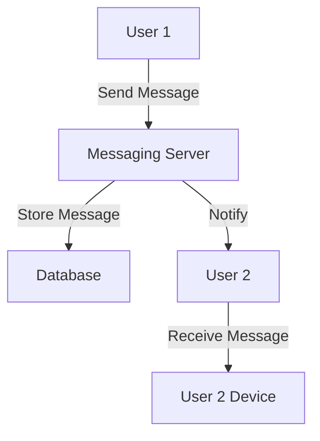

## 30.11. Elixir in Telecommunications

The telecommunications industry is a cornerstone of modern society, enabling real-time communication across the globe. As the demand for reliable, scalable, and efficient communication systems grows, so does the need for robust software solutions. Elixir, with its roots in Erlang and the BEAM virtual machine, offers a compelling choice for building telecommunications applications. In this section, we will explore how Elixir is being utilized in telecommunications, focusing on its use cases, advantages, and industry adoption.

### Use Cases in Telecommunications

Elixir's high concurrency and fault-tolerant capabilities make it an ideal choice for various telecommunications applications. Let's delve into some of the key use cases:

#### Messaging Systems

Messaging systems are at the heart of telecommunications, enabling instant communication between users. Elixir's lightweight processes and message-passing capabilities allow for the development of scalable and efficient messaging systems.

**Example: Building a Simple Messaging System**

```elixir
defmodule MessagingSystem do
  use GenServer

  # Client API
  def start_link(initial_state \\ %{}) do
    GenServer.start_link(__MODULE__, initial_state, name: __MODULE__)
  end

  def send_message(to, message) do
    GenServer.cast(__MODULE__, {:send_message, to, message})
  end

  def get_messages do
    GenServer.call(__MODULE__, :get_messages)
  end

  # Server Callbacks
  def init(initial_state) do
    {:ok, initial_state}
  end

  def handle_cast({:send_message, to, message}, state) do
    IO.puts("Sending message to #{to}: #{message}")
    {:noreply, Map.update(state, to, [message], &[message | &1])}
  end

  def handle_call(:get_messages, _from, state) do
    {:reply, state, state}
  end
end

# Start the messaging system
{:ok, _pid} = MessagingSystem.start_link()

# Send a message
MessagingSystem.send_message("user1", "Hello, World!")

# Retrieve messages
IO.inspect(MessagingSystem.get_messages())
```

In this example, we use a GenServer to manage messages. The `send_message/2` function allows sending messages, while `get_messages/0` retrieves all messages. This simple system can be expanded to include features like message persistence, user authentication, and more.

#### Call Routing

Call routing is another critical component of telecommunications. Elixir's ability to handle numerous concurrent connections makes it suitable for implementing efficient call routing systems.

**Example: Call Routing with Elixir**

```elixir
defmodule CallRouter do
  use GenServer

  # Client API
  def start_link(initial_routes \\ %{}) do
    GenServer.start_link(__MODULE__, initial_routes, name: __MODULE__)
  end

  def add_route(number, destination) do
    GenServer.cast(__MODULE__, {:add_route, number, destination})
  end

  def route_call(number) do
    GenServer.call(__MODULE__, {:route_call, number})
  end

  # Server Callbacks
  def init(initial_routes) do
    {:ok, initial_routes}
  end

  def handle_cast({:add_route, number, destination}, routes) do
    {:noreply, Map.put(routes, number, destination)}
  end

  def handle_call({:route_call, number}, _from, routes) do
    destination = Map.get(routes, number, "Unknown")
    {:reply, destination, routes}
  end
end

# Start the call router
{:ok, _pid} = CallRouter.start_link()

# Add a route
CallRouter.add_route("1234", "Operator")

# Route a call
IO.puts("Routing call to: #{CallRouter.route_call("1234")}")
```

This example demonstrates a basic call routing system using a GenServer. The `add_route/2` function adds a new route, while `route_call/1` determines the destination for a given number. This system can be extended to support dynamic routing, load balancing, and more.

#### VoIP Applications

Voice over IP (VoIP) applications require handling real-time audio data efficiently. Elixir's concurrency model and real-time capabilities make it a strong candidate for building VoIP solutions.

**Example: VoIP Call Handling**

```elixir
defmodule VoIPCall do
  use GenServer

  # Client API
  def start_link(call_id, participants) do
    GenServer.start_link(__MODULE__, {call_id, participants}, name: via_tuple(call_id))
  end

  defp via_tuple(call_id), do: {:via, Registry, {VoIPRegistry, call_id}}

  def add_participant(call_id, participant) do
    GenServer.cast(via_tuple(call_id), {:add_participant, participant})
  end

  def remove_participant(call_id, participant) do
    GenServer.cast(via_tuple(call_id), {:remove_participant, participant})
  end

  # Server Callbacks
  def init({call_id, participants}) do
    {:ok, %{call_id: call_id, participants: participants}}
  end

  def handle_cast({:add_participant, participant}, state) do
    IO.puts("Adding participant: #{participant}")
    {:noreply, update_in(state.participants, &[participant | &1])}
  end

  def handle_cast({:remove_participant, participant}, state) do
    IO.puts("Removing participant: #{participant}")
    {:noreply, update_in(state.participants, &List.delete(&1, participant))}
  end
end

# Start a VoIP call
{:ok, _pid} = VoIPCall.start_link("call_1", ["Alice", "Bob"])

# Add a participant
VoIPCall.add_participant("call_1", "Charlie")

# Remove a participant
VoIPCall.remove_participant("call_1", "Alice")
```

In this example, we use a GenServer to manage a VoIP call, allowing participants to be added or removed dynamically. This system can be expanded to include audio processing, call recording, and more.

### Advantages of Elixir in Telecommunications

Elixir offers several advantages for telecommunications applications, primarily due to its concurrency model and fault-tolerant design.

#### High Concurrency

Elixir's concurrency model, inherited from Erlang, allows it to handle thousands of lightweight processes simultaneously. This capability is crucial for telecommunications applications, which often require managing numerous concurrent connections.

#### Fault Tolerance

Telecommunications systems must be reliable and resilient to failures. Elixir's "let it crash" philosophy and supervision trees provide a robust framework for building fault-tolerant applications.

#### Scalability

Elixir's ability to scale horizontally across multiple nodes makes it suitable for large-scale telecommunications systems. This scalability ensures that applications can handle increasing loads without compromising performance.

#### Real-Time Capabilities

Elixir's real-time capabilities, combined with its concurrency model, make it ideal for applications that require low-latency communication, such as VoIP and messaging systems.

### Industry Adoption

Several companies in the telecommunications industry have adopted Elixir to build reliable and scalable communication services. Let's explore some examples:

#### WhatsApp

WhatsApp, a leading messaging platform, leverages Erlang (Elixir's predecessor) to handle billions of messages daily. The platform's success demonstrates the power of the BEAM virtual machine for building scalable messaging systems.

#### Discord

Discord, a popular communication platform for gamers, uses Elixir to manage its real-time messaging and voice services. Elixir's concurrency model allows Discord to handle millions of concurrent users efficiently.

#### Ericsson

Ericsson, a major player in the telecommunications industry, has utilized Erlang and Elixir to build robust communication systems. The company's adoption of these technologies highlights their effectiveness in telecommunications.

### Visualizing Elixir's Role in Telecommunications

To better understand Elixir's role in telecommunications, let's visualize a typical architecture for a messaging system using Mermaid.js:



**Diagram Description:** This diagram illustrates a simple messaging system architecture. User 1 sends a message to the Messaging Server, which stores the message in a database and notifies User 2. User 2 then receives the message on their device.

### Key Takeaways

- Elixir's high concurrency and fault-tolerant capabilities make it an ideal choice for telecommunications applications.
- Use cases include messaging systems, call routing, and VoIP applications.
- Elixir's real-time capabilities and scalability ensure reliable communication services.
- Industry adoption by companies like WhatsApp, Discord, and Ericsson highlights Elixir's effectiveness in telecommunications.

### Try It Yourself

Experiment with the code examples provided in this section. Try adding new features, such as message persistence or dynamic call routing, to enhance the functionality of the systems. Remember, this is just the beginning. As you progress, you'll build more complex and interactive telecommunications applications. Keep experimenting, stay curious, and enjoy the journey!

## Quiz: Elixir in Telecommunications



### What makes Elixir suitable for telecommunications applications?

- [x] High concurrency capabilities
- [ ] Object-oriented programming
- [ ] Lack of fault tolerance
- [ ] Limited scalability

> **Explanation:** Elixir's high concurrency capabilities, inherited from Erlang, make it suitable for telecommunications applications that require managing numerous concurrent connections.

### Which of the following is a key advantage of Elixir in telecommunications?

- [x] Fault tolerance
- [ ] Low-level programming
- [ ] Manual memory management
- [ ] Lack of real-time capabilities

> **Explanation:** Elixir's fault tolerance, achieved through its "let it crash" philosophy and supervision trees, is a key advantage in building reliable telecommunications systems.

### What is a common use case for Elixir in telecommunications?

- [x] Messaging systems
- [ ] Image processing
- [ ] Video editing
- [ ] Game development

> **Explanation:** Messaging systems are a common use case for Elixir in telecommunications, leveraging its concurrency and real-time capabilities.

### How does Elixir handle numerous concurrent connections efficiently?

- [x] Lightweight processes
- [ ] Heavyweight threads
- [ ] Single-threaded execution
- [ ] Blocking I/O operations

> **Explanation:** Elixir handles numerous concurrent connections efficiently using lightweight processes, allowing it to manage thousands of processes simultaneously.

### Which company uses Elixir for real-time messaging and voice services?

- [x] Discord
- [ ] Facebook
- [ ] Twitter
- [ ] Instagram

> **Explanation:** Discord uses Elixir to manage its real-time messaging and voice services, benefiting from Elixir's concurrency model.

### What is the "let it crash" philosophy in Elixir?

- [x] Allowing processes to fail and restart
- [ ] Preventing any process failures
- [ ] Manually handling all errors
- [ ] Ignoring process failures

> **Explanation:** The "let it crash" philosophy in Elixir involves allowing processes to fail and restart, ensuring system reliability and fault tolerance.

### Which of the following is NOT a feature of Elixir beneficial for telecommunications?

- [ ] High concurrency
- [ ] Fault tolerance
- [ ] Real-time capabilities
- [x] Manual memory management

> **Explanation:** Manual memory management is not a feature of Elixir; its garbage collection and memory management are handled automatically by the BEAM VM.

### What is a key component of a messaging system in Elixir?

- [x] GenServer
- [ ] GenStage
- [ ] GenEvent
- [ ] GenStateMachine

> **Explanation:** GenServer is a key component of a messaging system in Elixir, providing a framework for managing state and handling messages.

### How does Elixir achieve scalability in telecommunications applications?

- [x] Horizontal scaling across multiple nodes
- [ ] Vertical scaling on a single node
- [ ] Manual process management
- [ ] Single-threaded execution

> **Explanation:** Elixir achieves scalability through horizontal scaling across multiple nodes, allowing applications to handle increasing loads efficiently.

### True or False: Elixir is only suitable for small-scale telecommunications applications.

- [ ] True
- [x] False

> **Explanation:** False. Elixir is suitable for both small-scale and large-scale telecommunications applications, thanks to its scalability and concurrency capabilities.



Remember, the journey of mastering Elixir in telecommunications is ongoing. Keep exploring, experimenting, and building innovative solutions. The telecommunications industry is ever-evolving, and with Elixir, you have the tools to create the future of communication.
