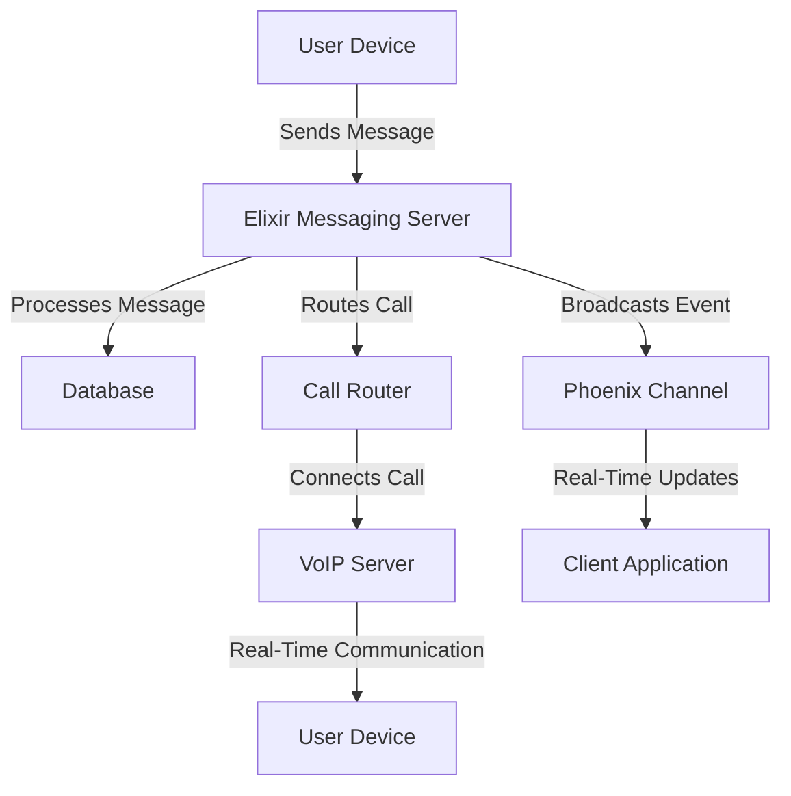

## 30.11. Elixir in Telecommunications

The telecommunications industry demands systems that can handle vast amounts of concurrent connections while maintaining reliability and low latency. Elixir, with its roots in the Erlang ecosystem, offers a compelling solution for these requirements through its high-concurrency capabilities, fault tolerance, and scalability. In this section, we will explore the use cases, advantages, and industry adoption of Elixir in telecommunications, providing insights into how this functional programming language is transforming the sector.

### Use Cases in Telecommunications

Elixir's unique features make it particularly well-suited for several telecommunications applications. Let's delve into some of the primary use cases:

#### Messaging Systems

Messaging systems in telecommunications require the ability to handle millions of messages concurrently while ensuring delivery reliability and low latency. Elixir's lightweight processes and the Actor model enable developers to build efficient messaging systems that can scale horizontally.

**Example: Building a Messaging System**

```elixir
defmodule MessagingServer do
  use GenServer

  # Client API
  def start_link(_) do
    GenServer.start_link(__MODULE__, %{}, name: __MODULE__)
  end

  def send_message(to, message) do
    GenServer.call(__MODULE__, {:send_message, to, message})
  end

  # Server Callbacks
  def init(state) do
    {:ok, state}
  end

  def handle_call({:send_message, to, message}, _from, state) do
    # Simulate message sending logic
    IO.puts("Sending message to #{to}: #{message}")
    {:reply, :ok, state}
  end
end

# Start the server and send a message
{:ok, _pid} = MessagingServer.start_link(nil)
MessagingServer.send_message("user@example.com", "Hello, World!")
```

In this example, we define a simple messaging server using Elixir's `GenServer` behavior. The server can handle multiple message requests concurrently, showcasing Elixir's ability to manage high-concurrency tasks effortlessly.

#### Call Routing

Call routing in telecommunications involves directing calls to the appropriate destinations based on various criteria such as availability, location, and user preferences. Elixir's pattern matching and functional paradigm simplify the implementation of complex routing logic.

**Example: Implementing Call Routing Logic**

```elixir
defmodule CallRouter do
  def route_call(%{location: location, time: time}) do
    case {location, time} do
      {"US", _} -> "Route to US server"
      {"EU", _} -> "Route to EU server"
      {_, time} when time < 8 -> "Route to night shift"
      _ -> "Route to default server"
    end
  end
end

# Test the routing logic
IO.puts(CallRouter.route_call(%{location: "US", time: 10})) # Output: Route to US server
IO.puts(CallRouter.route_call(%{location: "EU", time: 3}))  # Output: Route to night shift
```

This example demonstrates how Elixir's pattern matching can be used to implement straightforward call routing logic, making it easier to manage and extend.

#### VoIP Applications

Voice over IP (VoIP) applications require real-time communication capabilities with minimal latency. Elixir's concurrency model and the BEAM VM's ability to handle large numbers of simultaneous connections make it an excellent choice for developing VoIP services.

**Example: Real-Time Communication with Phoenix Channels**

```elixir
defmodule VoIPChannel do
  use Phoenix.Channel

  def join("call:lobby", _message, socket) do
    {:ok, socket}
  end

  def handle_in("new_call", %{"to" => to, "from" => from}, socket) do
    broadcast!(socket, "call_started", %{to: to, from: from})
    {:noreply, socket}
  end
end

# Client-side code to join the channel and handle events
let socket = new Phoenix.Socket("/socket", {params: {userToken: "123"}})
socket.connect()

let channel = socket.channel("call:lobby", {})
channel.join()
  .receive("ok", resp => { console.log("Joined successfully", resp) })
  .receive("error", resp => { console.log("Unable to join", resp) })

channel.on("call_started", payload => {
  console.log("Call started", payload)
})
```

In this example, we use Phoenix Channels to implement a basic VoIP application. The server broadcasts call events to all connected clients, enabling real-time communication.

### Advantages of Using Elixir in Telecommunications

Elixir offers several advantages that make it an ideal choice for telecommunications applications:

- **High Concurrency**: Elixir's lightweight processes allow for the creation of millions of concurrent connections, making it perfect for handling the high demands of telecommunications systems.
- **Fault Tolerance**: Built on the Erlang VM, Elixir inherits robust fault tolerance capabilities, ensuring that systems remain operational even in the event of failures.
- **Scalability**: Elixir applications can scale horizontally across multiple nodes, accommodating increasing loads without sacrificing performance.
- **Low Latency**: The BEAM VM's ability to handle concurrent processes efficiently results in low-latency communication, crucial for real-time applications like VoIP.
- **Ease of Maintenance**: Elixir's functional programming paradigm and pattern matching simplify codebases, making them easier to maintain and extend.

### Industry Adoption

Several companies in the telecommunications industry have adopted Elixir to build reliable and scalable communication services. Let's explore a few examples:

- **WhatsApp**: Although primarily built on Erlang, WhatsApp's architecture demonstrates the power of the BEAM VM in handling millions of concurrent users, a capability that Elixir shares.
- **Discord**: This popular communication platform uses Elixir for its real-time chat infrastructure, benefiting from Elixir's concurrency and fault tolerance.
- **AdRoll**: The advertising platform uses Elixir for its real-time bidding system, leveraging Elixir's ability to handle high-concurrency workloads.

These examples highlight Elixir's growing presence in the telecommunications sector, driven by its ability to meet the industry's demanding requirements.

### Design Considerations

When using Elixir for telecommunications applications, consider the following design considerations:

- **Process Management**: Utilize Elixir's supervision trees to manage processes effectively, ensuring fault tolerance and system reliability.
- **Distributed Systems**: Leverage Elixir's distributed capabilities to build systems that can scale across multiple nodes, providing resilience and load balancing.
- **Real-Time Communication**: Use Phoenix Channels for implementing real-time features, such as messaging and VoIP services, to take advantage of Elixir's low-latency capabilities.
- **Security**: Implement robust security measures, such as encryption and authentication, to protect communication data and ensure user privacy.

### Elixir Unique Features

Elixir brings several unique features to the table that are particularly beneficial for telecommunications applications:

- **OTP Framework**: The Open Telecom Platform (OTP) provides a set of libraries and design principles for building concurrent and fault-tolerant systems, making it a perfect fit for telecommunications.
- **Pattern Matching**: Elixir's pattern matching simplifies complex logic, such as call routing and message processing, enhancing code readability and maintainability.
- **Functional Programming**: Elixir's functional paradigm encourages immutability and pure functions, reducing side effects and improving system reliability.

### Differences and Similarities

While Elixir shares many similarities with Erlang due to its common runtime, it offers a more modern syntax and additional features, such as macros and the pipe operator, which enhance developer productivity. Understanding these differences can help you choose the right tool for your telecommunications projects.

### Visualizing Elixir's Role in Telecommunications

To better understand how Elixir fits into the telecommunications landscape, let's visualize a typical architecture for a telecommunications application using Elixir.


```mermaid
graph TD;
    A[User Device] -->|Sends Message| B[Elixir Messaging Server];
    B -->|Processes Message| C[Database];
    B -->|Routes Call| D[Call Router];
    D -->|Connects Call| E[VoIP Server];
    E -->|Real-Time Communication| F[User Device];
    B -->|Broadcasts Event| G[Phoenix Channel];
    G -->|Real-Time Updates| H[Client Application];
```

**Diagram Description**: This diagram illustrates a telecommunications architecture using Elixir. User devices send messages to an Elixir messaging server, which processes the messages and interacts with a database. The server also routes calls through a call router and connects calls via a VoIP server. Real-time communication is facilitated by Phoenix Channels, providing updates to client applications.

### Try It Yourself

To deepen your understanding of Elixir in telecommunications, try modifying the provided code examples. Experiment with different routing logic, message formats, and real-time features. Consider implementing additional functionalities, such as user authentication or message persistence, to enhance the applications.

### Knowledge Check

Before moving on, test your understanding of Elixir's role in telecommunications with the following questions:

1. What are the primary use cases for Elixir in telecommunications?
2. How does Elixir's concurrency model benefit messaging systems?
3. What advantages does Elixir offer for VoIP applications?
4. How can Elixir's pattern matching be used in call routing?
5. What are some design considerations when using Elixir for telecommunications?

### Summary

In this section, we've explored how Elixir's high concurrency, fault tolerance, and scalability make it an ideal choice for telecommunications applications. We've examined use cases such as messaging systems, call routing, and VoIP services, and highlighted industry adoption examples. By leveraging Elixir's unique features and design considerations, developers can build reliable and efficient communication systems that meet the demanding requirements of the telecommunications industry.

Remember, this is just the beginning. As you continue to explore Elixir's capabilities, you'll discover even more ways to harness its power for telecommunications and beyond. Keep experimenting, stay curious, and enjoy the journey!

## Quiz Time!



### What is one of the primary use cases for Elixir in telecommunications?

- [x] Messaging systems
- [ ] Video streaming
- [ ] Image processing
- [ ] Data mining

> **Explanation:** Messaging systems are a primary use case for Elixir in telecommunications due to its high concurrency capabilities.

### How does Elixir's concurrency model benefit telecommunications applications?

- [x] By allowing millions of concurrent connections
- [ ] By reducing memory usage
- [ ] By simplifying code syntax
- [ ] By enhancing security features

> **Explanation:** Elixir's concurrency model allows for millions of concurrent connections, which is crucial for telecommunications applications.

### Which Elixir feature is particularly useful for implementing call routing logic?

- [x] Pattern matching
- [ ] Macros
- [ ] Supervisors
- [ ] Protocols

> **Explanation:** Pattern matching is particularly useful for implementing call routing logic due to its ability to simplify complex conditions.

### What is a key advantage of using Elixir for VoIP applications?

- [x] Low latency communication
- [ ] High memory consumption
- [ ] Complex syntax
- [ ] Limited scalability

> **Explanation:** Elixir provides low latency communication, which is a key advantage for VoIP applications.

### Which company is known for using Elixir in its real-time chat infrastructure?

- [x] Discord
- [ ] Netflix
- [ ] Amazon
- [ ] Facebook

> **Explanation:** Discord uses Elixir for its real-time chat infrastructure, benefiting from its concurrency and fault tolerance.

### What is an important design consideration when building telecommunications applications with Elixir?

- [x] Process management with supervision trees
- [ ] Using mutable state
- [ ] Avoiding pattern matching
- [ ] Limiting the number of processes

> **Explanation:** Process management with supervision trees is important for ensuring fault tolerance and reliability in telecommunications applications.

### How does Elixir's functional programming paradigm benefit telecommunications systems?

- [x] By reducing side effects and improving reliability
- [ ] By increasing code complexity
- [ ] By limiting concurrency
- [ ] By enhancing mutable state management

> **Explanation:** Elixir's functional programming paradigm reduces side effects and improves reliability, which is beneficial for telecommunications systems.

### What is a unique feature of Elixir that aids in building concurrent systems?

- [x] OTP Framework
- [ ] Mutable state
- [ ] Complex syntax
- [ ] Limited scalability

> **Explanation:** The OTP Framework is a unique feature of Elixir that aids in building concurrent and fault-tolerant systems.

### Which diagramming tool is used to visualize Elixir's role in telecommunications?

- [x] Mermaid.js
- [ ] UML
- [ ] Visio
- [ ] Balsamiq

> **Explanation:** Mermaid.js is used to create diagrams that visualize Elixir's role in telecommunications within this guide.

### True or False: Elixir's pattern matching can simplify call routing logic.

- [x] True
- [ ] False

> **Explanation:** True. Elixir's pattern matching simplifies call routing logic by allowing developers to handle complex conditions more easily.




