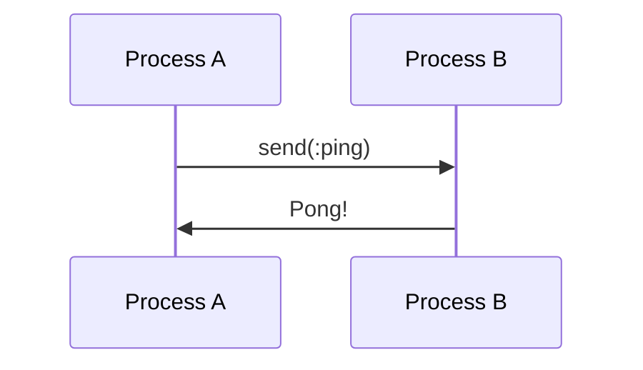

## 30.12. Lessons Learned and Best Practices from the Field

In this section, we delve into the practical insights gained from implementing Elixir design patterns in real-world projects. We will explore adoption strategies, common challenges, and success factors that have emerged from the field. This guide aims to provide expert software engineers and architects with actionable advice to enhance their Elixir projects.

### Adoption Strategies

Adopting Elixir and its design patterns requires a strategic approach to ensure a smooth transition and successful implementation. Here are some key strategies:

#### Training Teams

1. **Start with Fundamentals**: Begin by training teams on the fundamentals of Elixir and functional programming. This includes understanding immutability, pattern matching, and concurrency.

2. **Leverage Online Resources**: Utilize online courses, tutorials, and documentation to provide a comprehensive learning experience. Websites like [Elixir School](https://elixirschool.com/) and [Exercism](https://exercism.org/tracks/elixir) offer excellent resources.

3. **Hands-On Workshops**: Conduct hands-on workshops where team members can practice writing Elixir code and implementing design patterns. This practical approach helps solidify theoretical knowledge.

4. **Pair Programming**: Encourage pair programming sessions where experienced Elixir developers work alongside newcomers. This fosters knowledge sharing and accelerates learning.

5. **Mentorship Programs**: Establish mentorship programs where seasoned Elixir developers guide and support less experienced team members.

#### Starting with Small Projects

1. **Pilot Projects**: Initiate small pilot projects to experiment with Elixir and its design patterns. This allows teams to gain confidence and experience without the pressure of large-scale implementations.

2. **Incremental Adoption**: Gradually introduce Elixir into existing projects by identifying components that can benefit from Elixir's strengths, such as concurrency and fault tolerance.

3. **Proof of Concepts**: Develop proof of concept applications to demonstrate the capabilities and benefits of Elixir to stakeholders.

4. **Iterative Development**: Adopt an iterative development approach, allowing teams to learn and adapt as they progress through the project.

5. **Feedback Loops**: Establish feedback loops to gather insights and continuously improve the adoption process.

### Common Challenges

Implementing Elixir design patterns can present several challenges. Here are some common ones and strategies to overcome them:

#### Overcoming Initial Learning Curves

1. **Complex Syntax**: Elixir's syntax can be challenging for developers accustomed to imperative or object-oriented languages. Provide ample resources and practice opportunities to ease the transition.

2. **Functional Paradigm Shift**: Embracing functional programming requires a shift in mindset. Encourage developers to think in terms of functions and data transformations.

3. **Concurrency Model**: Elixir's concurrency model, based on the Actor model, may be unfamiliar. Offer training on processes, message passing, and OTP (Open Telecom Platform) principles.

4. **Tooling and Ecosystem**: Familiarize teams with Elixir's tooling, such as Mix, ExUnit, and Hex, to streamline development and dependency management.

5. **Community Engagement**: Encourage participation in the Elixir community through forums, meetups, and conferences to learn from others' experiences.

#### Integrating with Existing Systems

1. **Interoperability with Erlang**: Leverage Elixir's seamless interoperability with Erlang to integrate with existing Erlang-based systems.

2. **Legacy Systems**: Identify components of legacy systems that can be incrementally replaced or enhanced with Elixir.

3. **Data Migration**: Plan and execute data migration strategies to ensure a smooth transition to Elixir-based systems.

4. **API Compatibility**: Ensure API compatibility between Elixir and existing systems to facilitate communication and data exchange.

5. **Testing and Validation**: Implement comprehensive testing and validation processes to ensure the reliability and correctness of integrated systems.

### Success Factors

Several factors contribute to the successful implementation of Elixir design patterns. Here are some key success factors:

#### Strong Community Support

1. **Active Community**: Elixir boasts a vibrant and active community that provides support, resources, and collaboration opportunities.

2. **Open Source Contributions**: Encourage contributions to open source Elixir projects to foster innovation and knowledge sharing.

3. **Community Resources**: Leverage community resources such as libraries, frameworks, and tools to accelerate development.

4. **Knowledge Sharing**: Participate in community forums, blogs, and social media to share knowledge and learn from others' experiences.

5. **Mentorship and Guidance**: Seek mentorship and guidance from experienced Elixir developers within the community.

#### Embracing Functional Programming Concepts

1. **Immutability**: Embrace immutability to enhance code reliability and maintainability. Immutable data structures prevent unintended side effects.

2. **Pattern Matching**: Utilize pattern matching to simplify code and improve readability. Pattern matching allows for concise and expressive code.

3. **Higher-Order Functions**: Leverage higher-order functions to create reusable and composable code. Functions like `map`, `reduce`, and `filter` enable powerful data transformations.

4. **Concurrency**: Harness Elixir's concurrency model to build scalable and fault-tolerant systems. Processes and message passing enable concurrent execution.

5. **Error Handling**: Adopt Elixir's "let it crash" philosophy for error handling. Design systems to recover gracefully from failures.

### Code Examples

Let's explore some code examples that illustrate the application of Elixir design patterns and best practices.

#### Example 1: Using Pattern Matching

```elixir
defmodule Math do
  # Pattern matching in function definitions
  def add({a, b}), do: a + b

  def subtract({a, b}), do: a - b
end

IO.puts Math.add({5, 3})       # Output: 8
IO.puts Math.subtract({5, 3})  # Output: 2
```

**Explanation**: This example demonstrates the use of pattern matching in function definitions. The `add` and `subtract` functions match tuples and perform arithmetic operations.

#### Example 2: Leveraging Higher-Order Functions

```elixir
defmodule ListUtils do
  # Using higher-order functions
  def apply_to_list(list, func) do
    Enum.map(list, func)
  end
end

double = fn x -> x * 2 end
IO.inspect ListUtils.apply_to_list([1, 2, 3], double)  # Output: [2, 4, 6]
```

**Explanation**: This example showcases the use of higher-order functions. The `apply_to_list` function takes a list and a function as arguments, applying the function to each element of the list.

#### Example 3: Implementing Concurrency with Processes

```elixir
defmodule ConcurrencyExample do
  def start do
    spawn(fn -> loop() end)
  end

  defp loop do
    receive do
      :ping -> IO.puts("Pong!")
    end

    loop()
  end
end

pid = ConcurrencyExample.start()
send(pid, :ping)  # Output: Pong!
```

**Explanation**: This example demonstrates concurrency using processes. The `start` function spawns a new process that listens for messages and responds with "Pong!" when it receives a `:ping` message.

### Visualizing Elixir's Concurrency Model

To better understand Elixir's concurrency model, let's visualize the process communication using a sequence diagram.



**Description**: This sequence diagram illustrates the communication between two processes, A and B. Process A sends a `:ping` message to Process B, which responds with "Pong!".

### References and Links

- [Elixir School](https://elixirschool.com/): A comprehensive resource for learning Elixir.
- [Exercism](https://exercism.org/tracks/elixir): A platform for practicing Elixir through coding exercises.
- [Elixir Forum](https://elixirforum.com/): A community forum for discussing Elixir-related topics.

### Knowledge Check

1. **What are some strategies for adopting Elixir in a development team?**
   - Training teams, starting with small projects, and leveraging community resources.

2. **What are common challenges when implementing Elixir design patterns?**
   - Overcoming initial learning curves and integrating with existing systems.

3. **What factors contribute to the successful implementation of Elixir design patterns?**
   - Strong community support and embracing functional programming concepts.

### Embrace the Journey

Remember, adopting Elixir and its design patterns is a journey. As you progress, you'll build more robust and scalable systems. Keep experimenting, stay curious, and enjoy the process!

### Quiz: Lessons Learned and Best Practices from the Field



### What is a key strategy for adopting Elixir in a development team?

- [x] Training teams on Elixir fundamentals
- [ ] Avoiding community resources
- [ ] Starting with large projects
- [ ] Ignoring functional programming concepts

> **Explanation:** Training teams on Elixir fundamentals is crucial for successful adoption.

### What is a common challenge when implementing Elixir design patterns?

- [x] Overcoming initial learning curves
- [ ] Lack of community support
- [ ] Abundance of resources
- [ ] Simple syntax

> **Explanation:** Overcoming initial learning curves is a common challenge when implementing Elixir design patterns.

### What contributes to the successful implementation of Elixir design patterns?

- [x] Strong community support
- [ ] Avoiding functional programming concepts
- [ ] Ignoring concurrency
- [ ] Lack of mentorship

> **Explanation:** Strong community support is a key factor in the successful implementation of Elixir design patterns.

### What is the benefit of starting with small projects when adopting Elixir?

- [x] Allows teams to gain confidence and experience
- [ ] Increases pressure on teams
- [ ] Requires large-scale implementations
- [ ] Discourages experimentation

> **Explanation:** Starting with small projects allows teams to gain confidence and experience without the pressure of large-scale implementations.

### How can Elixir's concurrency model be described?

- [x] Based on the Actor model
- [ ] Similar to imperative languages
- [ ] Lacking message passing
- [ ] Not suitable for fault tolerance

> **Explanation:** Elixir's concurrency model is based on the Actor model, which supports message passing and fault tolerance.

### What is a key success factor in implementing Elixir design patterns?

- [x] Embracing functional programming concepts
- [ ] Avoiding community engagement
- [ ] Ignoring immutability
- [ ] Overcomplicating code

> **Explanation:** Embracing functional programming concepts is essential for successful implementation.

### What is the role of pattern matching in Elixir?

- [x] Simplifies code and improves readability
- [ ] Complicates code
- [ ] Reduces expressiveness
- [ ] Increases side effects

> **Explanation:** Pattern matching simplifies code and improves readability by allowing concise and expressive code.

### How can higher-order functions benefit Elixir code?

- [x] Create reusable and composable code
- [ ] Increase code complexity
- [ ] Reduce data transformations
- [ ] Limit code reuse

> **Explanation:** Higher-order functions create reusable and composable code, enabling powerful data transformations.

### What is the "let it crash" philosophy in Elixir?

- [x] Design systems to recover gracefully from failures
- [ ] Avoid error handling
- [ ] Ignore system failures
- [ ] Prevent system recovery

> **Explanation:** The "let it crash" philosophy encourages designing systems to recover gracefully from failures.

### True or False: Elixir's syntax is similar to imperative languages.

- [ ] True
- [x] False

> **Explanation:** Elixir's syntax is different from imperative languages, as it is based on functional programming principles.


