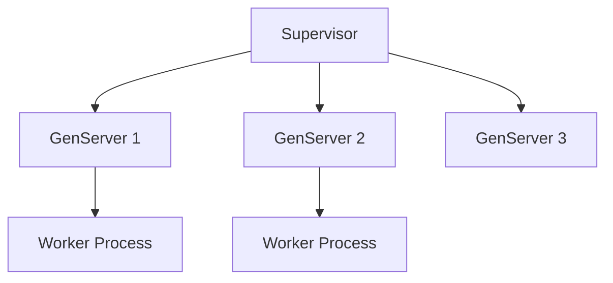

## 30.12. Lessons Learned and Best Practices from the Field

In the rapidly evolving landscape of software engineering, Elixir has emerged as a powerful tool for building scalable, fault-tolerant systems. This section delves into the lessons learned and best practices gleaned from real-world Elixir projects. We will explore adoption strategies, common challenges, and success factors that have proven effective in harnessing the full potential of Elixir.

### Adoption Strategies

Adopting a new technology stack like Elixir can be daunting, especially for teams accustomed to different paradigms. However, with careful planning and execution, the transition can be smooth and rewarding.

#### Training Teams

One of the first steps in adopting Elixir is to invest in training your team. Elixir's functional programming paradigm can be a significant shift for those used to object-oriented languages. Here are some strategies to facilitate this transition:

- **Workshops and Bootcamps**: Organize hands-on workshops and bootcamps focused on Elixir's core concepts and design patterns. This immersive approach helps team members learn by doing, which is often more effective than theoretical learning alone.

- **Pair Programming**: Encourage pair programming sessions where experienced Elixir developers work alongside those new to the language. This collaborative approach accelerates learning and fosters knowledge sharing.

- **Online Courses and Resources**: Leverage online courses and resources such as [Elixir School](https://elixirschool.com/) and [Exercism](https://exercism.org/tracks/elixir) to provide structured learning paths for your team.

- **Reading Groups**: Form reading groups to study key texts, such as "Programming Elixir" by Dave Thomas. Discussing chapters and exercises as a group can clarify complex topics and promote deeper understanding.

#### Starting with Small Projects

When introducing Elixir to your organization, it's wise to start with small, non-critical projects. This allows your team to experiment and learn without the pressure of delivering a mission-critical application. Consider the following steps:

- **Pilot Projects**: Choose a small project that can benefit from Elixir's strengths, such as a real-time chat application or a microservice handling concurrent requests.

- **Iterative Development**: Use an iterative development approach to gradually introduce Elixir components into existing systems. This reduces risk and allows for incremental learning.

- **Feedback Loops**: Establish feedback loops to gather insights from the team about their experiences with Elixir. Use this feedback to refine your adoption strategy and address any concerns.

### Common Challenges

Adopting Elixir is not without its challenges. Understanding these obstacles and how to overcome them is crucial for a successful transition.

#### Overcoming Initial Learning Curves

The shift to functional programming and the concurrent nature of Elixir can be challenging for developers accustomed to imperative or object-oriented languages. Here are some strategies to ease this transition:

- **Conceptual Mapping**: Help developers map familiar concepts from their previous languages to Elixir. For example, explain how Elixir's processes can be seen as lightweight threads or actors.

- **Pattern Matching Practice**: Encourage regular practice with pattern matching, a fundamental concept in Elixir. Provide exercises that require developers to solve problems using pattern matching to build proficiency.

- **Recursion and Tail Call Optimization**: Recursion is a core concept in functional programming. Provide examples and exercises that demonstrate how to write efficient recursive functions in Elixir.

- **The "Let It Crash" Philosophy**: Introduce the "let it crash" philosophy early on. Explain how Elixir's supervisors can handle failures gracefully, allowing developers to focus on writing robust code without worrying about every possible failure scenario.

#### Integrating with Existing Systems

Integrating Elixir with existing systems can be challenging, especially when dealing with legacy codebases. Here are some strategies to facilitate integration:

- **Interoperability with Erlang**: Leverage Elixir's seamless interoperability with Erlang to integrate with existing Erlang systems. This allows you to reuse existing Erlang libraries and components.

- **Microservices Architecture**: Consider adopting a microservices architecture to isolate Elixir components. This allows you to introduce Elixir incrementally without disrupting the entire system.

- **APIs and Protocols**: Use APIs and protocols to facilitate communication between Elixir and other systems. This decouples components and allows for easier integration.

- **Gradual Migration**: Plan a gradual migration strategy for legacy systems. Identify components that can be rewritten in Elixir and prioritize them based on their impact and complexity.

### Success Factors

Several factors contribute to the successful adoption and implementation of Elixir in software projects. These include leveraging community support, embracing functional programming concepts, and focusing on performance and scalability.

#### Strong Community Support

The Elixir community is known for its vibrant and supportive nature. Engaging with the community can provide valuable insights and resources for your projects. Here are some ways to tap into this support:

- **Online Forums and Communities**: Participate in online forums and communities such as the [Elixir Forum](https://elixirforum.com/) and [Stack Overflow](https://stackoverflow.com/questions/tagged/elixir) to ask questions, share experiences, and learn from others.

- **Open Source Contributions**: Encourage your team to contribute to open source Elixir projects. This not only helps the community but also provides valuable learning opportunities for your team.

- **Meetups and Conferences**: Attend Elixir meetups and conferences to network with other developers and learn about the latest trends and best practices in the Elixir ecosystem.

#### Embracing Functional Programming Concepts

Elixir's functional programming paradigm offers several advantages, including immutability, first-class functions, and pattern matching. Embracing these concepts can lead to more robust and maintainable code. Here are some best practices:

- **Immutability**: Emphasize the importance of immutability in Elixir. Encourage developers to write functions that do not modify their inputs and instead return new data structures.

- **First-Class Functions**: Leverage first-class functions to create flexible and reusable code. Encourage the use of higher-order functions and function composition to solve complex problems.

- **Pattern Matching**: Use pattern matching extensively to simplify code and improve readability. Encourage developers to use pattern matching in function definitions, case statements, and data destructuring.

- **Pipelines and Function Composition**: Encourage the use of pipelines and function composition to create clear and concise code. This approach promotes a declarative style that is easy to read and understand.

#### Performance and Scalability

Elixir is designed for performance and scalability, making it an excellent choice for building high-concurrency applications. Here are some best practices to maximize these benefits:

- **Concurrency and Parallelism**: Leverage Elixir's lightweight processes and the BEAM VM's concurrency model to build highly concurrent applications. Use tools like `GenServer` and `Task` to manage processes and tasks efficiently.

- **Fault Tolerance**: Design your applications with fault tolerance in mind. Use supervisors to monitor processes and restart them in case of failure. This ensures that your application remains resilient and available.

- **Load Testing and Optimization**: Conduct load testing to identify performance bottlenecks and optimize your code. Use tools like `Benchee` for benchmarking and `Observer` for monitoring system performance.

- **Distributed Systems**: Take advantage of Elixir's support for distributed systems to build applications that can scale horizontally across multiple nodes. Use libraries like `Phoenix` and `Ecto` to build scalable web applications and data layers.

### Code Examples and Diagrams

To illustrate these concepts, let's explore some code examples and diagrams that demonstrate best practices in Elixir.

#### Example: Using Pattern Matching in Function Definitions

```elixir
defmodule Math do
  # Define a function to calculate the factorial of a number using pattern matching
  def factorial(0), do: 1
  def factorial(n) when n > 0 do
    n * factorial(n - 1)
  end
end

IO.puts Math.factorial(5) # Output: 120
```

In this example, we use pattern matching to define a recursive function for calculating the factorial of a number. The base case is defined with a pattern match for `0`, and the recursive case uses a guard to ensure `n` is positive.

#### Diagram: Visualizing Elixir's Supervision Tree


```mermaid
graph TD;
    A[Supervisor] --> B[GenServer 1]
    A --> C[GenServer 2]
    A --> D[GenServer 3]
    B --> E[Worker Process]
    C --> F[Worker Process]
```

This diagram illustrates a simple supervision tree in Elixir. The supervisor monitors three `GenServer` processes, each of which manages its own worker process. If any process fails, the supervisor can restart it to maintain system stability.

### Try It Yourself

Encourage experimentation by modifying the code examples provided. For instance, try implementing a different recursive function using pattern matching, or create a supervision tree with additional layers of processes.

### Knowledge Check

To reinforce learning, consider the following questions:

- What are the key benefits of using Elixir's functional programming paradigm?
- How can pattern matching improve code readability and maintainability?
- What strategies can help overcome the initial learning curve when adopting Elixir?

### Conclusion

Adopting Elixir and its design patterns can transform the way you build software, leading to more scalable, maintainable, and resilient applications. By following the lessons learned and best practices outlined in this guide, you can navigate the challenges of adoption and unlock the full potential of Elixir.

Remember, this is just the beginning. As you progress, you'll discover new ways to leverage Elixir's strengths and build innovative solutions. Keep experimenting, stay curious, and enjoy the journey!

## Quiz Time!



### What is a key strategy for adopting Elixir in an organization?

- [x] Starting with small, non-critical projects
- [ ] Immediately replacing all existing systems
- [ ] Avoiding any training for the team
- [ ] Implementing Elixir in isolation without feedback

> **Explanation:** Starting with small, non-critical projects allows teams to experiment and learn without the pressure of delivering a mission-critical application.

### How can teams overcome the initial learning curve of Elixir?

- [x] By organizing workshops and bootcamps
- [ ] By avoiding any functional programming concepts
- [ ] By using Elixir only for non-concurrent applications
- [ ] By ignoring community resources

> **Explanation:** Organizing workshops and bootcamps provides hands-on learning experiences that help teams understand Elixir's core concepts and design patterns.

### What is a benefit of Elixir's "let it crash" philosophy?

- [x] It allows developers to focus on writing robust code without worrying about every possible failure scenario.
- [ ] It encourages writing code that is prone to frequent crashes.
- [ ] It eliminates the need for any error handling.
- [ ] It discourages the use of supervisors.

> **Explanation:** The "let it crash" philosophy leverages supervisors to handle failures gracefully, allowing developers to focus on writing robust code.

### How does pattern matching improve code readability?

- [x] By simplifying code and making it more declarative
- [ ] By increasing the complexity of function definitions
- [ ] By eliminating the need for any conditional logic
- [ ] By making code harder to understand

> **Explanation:** Pattern matching simplifies code by making it more declarative and easier to read, especially in function definitions and case statements.

### What is a key advantage of Elixir's concurrency model?

- [x] Lightweight processes that enable high concurrency
- [ ] Processes that consume significant system resources
- [ ] A single-threaded execution model
- [ ] Lack of support for parallelism

> **Explanation:** Elixir's lightweight processes enable high concurrency, allowing applications to handle many tasks simultaneously without significant resource consumption.

### How can teams leverage community support when adopting Elixir?

- [x] By participating in online forums and contributing to open source projects
- [ ] By avoiding any interaction with the community
- [ ] By only using proprietary resources
- [ ] By not attending any meetups or conferences

> **Explanation:** Engaging with the Elixir community through forums, open source contributions, and events provides valuable insights and resources.

### What is a best practice for integrating Elixir with existing systems?

- [x] Using APIs and protocols to facilitate communication
- [ ] Replacing all existing systems immediately
- [ ] Avoiding any integration with existing systems
- [ ] Using Elixir only for standalone applications

> **Explanation:** Using APIs and protocols decouples components and allows for easier integration with existing systems.

### What is an effective way to introduce Elixir to a team?

- [x] Encouraging pair programming with experienced developers
- [ ] Forcing all team members to learn Elixir independently
- [ ] Avoiding any form of collaboration
- [ ] Implementing Elixir without any training

> **Explanation:** Pair programming with experienced developers accelerates learning and fosters knowledge sharing within the team.

### How can Elixir's functional programming concepts lead to more maintainable code?

- [x] By emphasizing immutability and first-class functions
- [ ] By encouraging mutable state and side effects
- [ ] By avoiding any use of higher-order functions
- [ ] By relying on imperative programming techniques

> **Explanation:** Emphasizing immutability and first-class functions leads to more maintainable code by reducing side effects and promoting modularity.

### True or False: Elixir's support for distributed systems allows applications to scale horizontally across multiple nodes.

- [x] True
- [ ] False

> **Explanation:** Elixir's support for distributed systems enables applications to scale horizontally, allowing them to run across multiple nodes for improved performance and fault tolerance.


