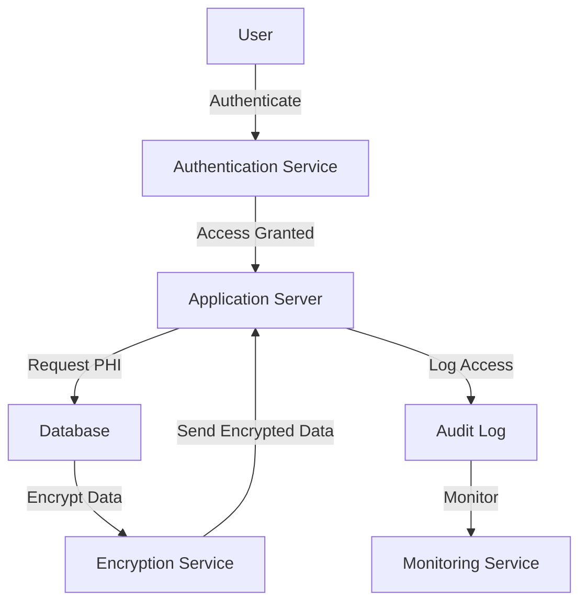

## 30.13.1. Building HIPAA-Compliant Systems

In the realm of healthcare applications, ensuring compliance with the Health Insurance Portability and Accountability Act (HIPAA) is paramount. This section delves into the intricacies of building HIPAA-compliant systems using Elixir, a language renowned for its concurrency and fault-tolerance capabilities. We'll explore the regulatory landscape, design principles, and Elixir's unique features that make it an excellent choice for healthcare applications.

### Understanding HIPAA Regulations

HIPAA is a U.S. law designed to provide privacy standards to protect patients' medical records and other health information. It encompasses several key rules:

- **Privacy Rule**: Governs the use and disclosure of Protected Health Information (PHI).
- **Security Rule**: Sets standards for the protection of electronic PHI (ePHI).
- **Enforcement Rule**: Establishes procedures for investigations and penalties for non-compliance.

For software developers, understanding these rules is crucial to designing systems that handle PHI responsibly.

### Designing for Compliance

When building a HIPAA-compliant system, it's essential to incorporate compliance requirements into the architecture from the outset. This proactive approach ensures that all PHI is handled according to regulatory standards.

#### Incorporating HIPAA Requirements

1. **Data Minimization**: Only collect and retain the minimum necessary PHI.
2. **Data Segmentation**: Separate PHI from other data to limit exposure.
3. **Encryption**: Implement strong encryption protocols for data at rest and in transit.
4. **Access Controls**: Use role-based access control (RBAC) to limit PHI access.

#### System Architecture

Designing a compliant system involves creating an architecture that supports secure data handling and robust access controls. Here's a high-level overview of a HIPAA-compliant architecture:



**Diagram Description**: This diagram illustrates a typical flow in a HIPAA-compliant system, where user authentication, data encryption, and audit logging are integral components.

### Secure Data Storage and Transmission

Ensuring the security of PHI involves implementing encryption protocols and using secure databases.

#### Encryption Protocols

- **Data at Rest**: Use AES-256 encryption for storing PHI in databases.
- **Data in Transit**: Implement TLS 1.2 or higher for secure data transmission.

#### Secure Databases

Choose databases that offer built-in encryption and compliance-friendly features. Consider using cloud services that are HIPAA-compliant, such as AWS or Azure.

### Access Controls and Authentication

Implementing strict access controls is vital to limit PHI exposure.

#### User Authentication

- **Multi-Factor Authentication (MFA)**: Require users to provide two or more verification factors.
- **OAuth 2.0**: Use OAuth 2.0 for secure user authentication and authorization.

#### Role-Based Access Control (RBAC)

Define roles and permissions to ensure that users only access the PHI necessary for their role.

### Audit Trails and Monitoring

Maintaining detailed logs and monitoring system access is crucial for compliance.

#### Logging

- **Access Logs**: Record all access to PHI, including user ID, timestamp, and action taken.
- **Change Logs**: Track changes to PHI, including who made the change and what was altered.

#### Monitoring

Implement tools to detect and alert on suspicious activities, such as unauthorized access attempts or data breaches.

### Incident Response Planning

Prepare for potential data breaches by developing a comprehensive incident response plan.

#### Procedures

- **Detection**: Implement systems to detect breaches quickly.
- **Containment**: Limit the impact of a breach by isolating affected systems.
- **Eradication**: Remove the cause of the breach and restore systems to normal operation.

#### Communication

Develop a communication plan for notifying affected parties and authorities in the event of a breach.

### Elixir's Role

Elixir's concurrency and fault-tolerance make it an excellent choice for building reliable healthcare applications.

#### Concurrency and Fault-Tolerance

Leverage Elixir's lightweight processes and OTP principles to build robust supervision trees for critical processes.

#### OTP Principles

Use OTP behaviors like GenServer and Supervisor to manage state and handle failures gracefully.

### Compliance Testing and Certification

Engage with third-party auditors to validate HIPAA compliance and regularly update systems to adapt to changes in regulations.

#### Testing

- **Penetration Testing**: Conduct regular penetration tests to identify vulnerabilities.
- **Compliance Audits**: Work with auditors to ensure systems meet HIPAA standards.

### Try It Yourself

Experiment with the following code snippet to implement a basic encryption mechanism in Elixir:

```elixir
defmodule Encryption do
  @moduledoc """
  A simple module for encrypting and decrypting data.
  """

  @key :crypto.strong_rand_bytes(32)

  def encrypt(data) do
    :crypto.block_encrypt(:aes_gcm, @key, <<>>, data)
  end

  def decrypt(encrypted_data) do
    :crypto.block_decrypt(:aes_gcm, @key, <<>>, encrypted_data)
  end
end

# Try encrypting and decrypting a sample string
encrypted = Encryption.encrypt("Sensitive PHI data")
IO.puts("Encrypted: #{Base.encode64(encrypted)}")

decrypted = Encryption.decrypt(encrypted)
IO.puts("Decrypted: #{decrypted}")
```

**Code Explanation**: This Elixir module demonstrates basic encryption and decryption using AES-GCM. Modify the `@key` and test with different data to explore encryption techniques.

### Knowledge Check

- What are the key components of a HIPAA-compliant system architecture?
- How does Elixir's concurrency model benefit healthcare applications?
- What are the best practices for implementing access controls in a HIPAA-compliant system?

### Embrace the Journey

Building HIPAA-compliant systems is a challenging yet rewarding endeavor. As you continue to refine your skills, remember that compliance is an ongoing process. Stay informed about regulatory changes, and leverage Elixir's powerful features to create secure, reliable healthcare applications. Keep experimenting, stay curious, and enjoy the journey!

## Quiz: Building HIPAA-Compliant Systems



### What is the primary purpose of HIPAA?

- [x] To protect patients' medical records and health information
- [ ] To regulate healthcare pricing
- [ ] To standardize medical procedures
- [ ] To manage healthcare insurance policies

> **Explanation:** HIPAA is designed to protect patients' medical records and other health information.

### Which rule under HIPAA governs the use and disclosure of PHI?

- [x] Privacy Rule
- [ ] Security Rule
- [ ] Enforcement Rule
- [ ] Breach Notification Rule

> **Explanation:** The Privacy Rule governs the use and disclosure of Protected Health Information (PHI).

### What encryption protocol is recommended for data in transit?

- [x] TLS 1.2 or higher
- [ ] SSL 3.0
- [ ] DES
- [ ] MD5

> **Explanation:** TLS 1.2 or higher is recommended for secure data transmission.

### Which Elixir feature is beneficial for building reliable healthcare applications?

- [x] Concurrency and fault-tolerance
- [ ] Object-oriented programming
- [ ] Manual memory management
- [ ] Static typing

> **Explanation:** Elixir's concurrency and fault-tolerance are beneficial for building reliable applications.

### What is the role of audit logs in a HIPAA-compliant system?

- [x] To record system access and data manipulation
- [ ] To store PHI
- [ ] To encrypt data
- [ ] To manage user authentication

> **Explanation:** Audit logs record system access and data manipulation for compliance and monitoring.

### How can role-based access control (RBAC) enhance security?

- [x] By limiting PHI access based on user roles
- [ ] By encrypting data
- [ ] By logging user activities
- [ ] By providing multi-factor authentication

> **Explanation:** RBAC limits access to PHI based on user roles, enhancing security.

### What should be included in an incident response plan?

- [x] Detection, containment, eradication, and communication procedures
- [ ] Only detection procedures
- [ ] Only communication procedures
- [ ] Only containment procedures

> **Explanation:** An incident response plan should include detection, containment, eradication, and communication procedures.

### Why is compliance testing important?

- [x] To validate HIPAA compliance and identify vulnerabilities
- [ ] To encrypt data
- [ ] To manage user authentication
- [ ] To store PHI

> **Explanation:** Compliance testing validates HIPAA compliance and helps identify vulnerabilities.

### What is the benefit of using third-party auditors for HIPAA compliance?

- [x] They provide an objective assessment of compliance
- [ ] They encrypt data
- [ ] They manage user authentication
- [ ] They store PHI

> **Explanation:** Third-party auditors provide an objective assessment of compliance.

### True or False: Elixir's OTP principles are not useful for building healthcare applications.

- [ ] True
- [x] False

> **Explanation:** Elixir's OTP principles are highly useful for building reliable and fault-tolerant healthcare applications.


