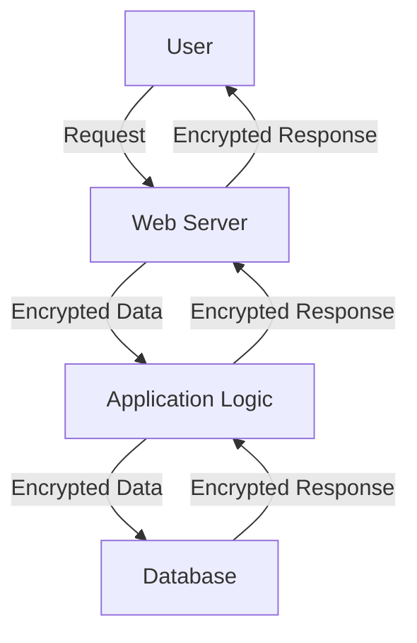

## 30.13.1. Building HIPAA-Compliant Systems

In today's digital age, the healthcare sector is increasingly reliant on technology to manage sensitive patient data. As a result, ensuring compliance with the Health Insurance Portability and Accountability Act (HIPAA) is paramount for any software system handling Protected Health Information (PHI). This guide will explore how to build HIPAA-compliant systems using Elixir, focusing on design patterns, security measures, and compliance strategies.

### Understanding HIPAA Regulations

HIPAA is a U.S. law designed to protect patient health information. It consists of several key rules:

- **Privacy Rule**: Establishes standards for the protection of PHI, ensuring that individuals' medical records and other personal health information are properly protected while allowing the flow of health information needed to provide high-quality healthcare.
- **Security Rule**: Sets standards for the security of electronic PHI (ePHI), including administrative, physical, and technical safeguards.
- **Enforcement Rule**: Provides standards for the enforcement of all the administrative simplification rules.

Understanding these principles is crucial for developers to ensure that their applications meet compliance requirements.

### Designing for Compliance

When designing a system for HIPAA compliance, it's essential to incorporate regulatory requirements into the architecture from the outset. Here are some key considerations:

- **Data Minimization**: Only collect and retain the minimum necessary PHI.
- **De-identification**: Whenever possible, remove identifying information from data sets.
- **Data Segregation**: Keep PHI separate from other types of data to simplify compliance efforts.

#### Incorporating HIPAA Requirements into System Architecture

Design your system with compliance in mind from the ground up. This includes:

- **Secure Data Handling**: Ensure that all PHI is encrypted both at rest and in transit.
- **Access Controls**: Implement role-based access controls (RBAC) to limit who can view or modify PHI.
- **Audit Mechanisms**: Maintain detailed logs of who accesses PHI and when.

### Secure Data Storage and Transmission

Protecting PHI requires robust security measures for both data storage and transmission.

#### Implementing Encryption Protocols

Use strong encryption protocols to safeguard PHI:

- **Data at Rest**: Encrypt data stored in databases or file systems using industry-standard algorithms like AES-256.
- **Data in Transit**: Use TLS (Transport Layer Security) to encrypt data transmitted over networks.

#### Using Secure Databases and Compliance-Friendly Cloud Services

Choose databases and cloud services that offer built-in compliance features:

- **Database Security**: Opt for databases with encryption, access controls, and audit logging capabilities.
- **Cloud Compliance**: Select cloud providers that are HIPAA-compliant and offer Business Associate Agreements (BAAs).

### Access Controls and Authentication

Strict access controls are vital to protect PHI from unauthorized access.

#### Employing User Authentication Mechanisms

Implement robust authentication mechanisms:

- **Multi-Factor Authentication (MFA)**: Require multiple forms of verification for access.
- **Single Sign-On (SSO)**: Simplify user management while maintaining security.

#### Role-Based Access Control (RBAC)

Limit PHI exposure by assigning permissions based on user roles:

- **Least Privilege Principle**: Users should only have access to the data necessary for their role.
- **Access Reviews**: Regularly review and update access permissions.

### Audit Trails and Monitoring

Maintaining audit trails and monitoring access to PHI is crucial for compliance.

#### Maintaining Detailed Logs

Keep comprehensive logs of all access and modifications to PHI:

- **Log Retention**: Store logs securely for the required retention period.
- **Log Analysis**: Use tools to analyze logs for suspicious activity.

#### Implementing Monitoring Tools

Deploy monitoring tools to detect and alert on potential security breaches:

- **Intrusion Detection Systems (IDS)**: Monitor network traffic for signs of unauthorized access.
- **Anomaly Detection**: Use machine learning to identify unusual patterns.

### Incident Response Planning

Prepare for potential data breaches with a robust incident response plan.

#### Preparing Procedures for Data Breaches

Develop clear procedures for responding to security incidents:

- **Incident Response Team**: Assemble a team responsible for managing incidents.
- **Response Plan**: Document steps for identifying, containing, and mitigating breaches.

#### Communication Plans

Establish communication plans for notifying affected parties and authorities:

- **Breach Notification**: Notify affected individuals and regulatory bodies promptly.
- **Public Relations**: Manage public communication to maintain trust.

### Elixir's Role in Building HIPAA-Compliant Systems

Elixir's features make it an excellent choice for building reliable healthcare applications.

#### Leveraging Elixir's Concurrency and Fault-Tolerance

Elixir's concurrency model and fault-tolerance capabilities are well-suited for healthcare applications:

- **Concurrency**: Handle multiple requests simultaneously with lightweight processes.
- **Fault-Tolerance**: Use OTP principles to build robust supervision trees for critical processes.

#### Using OTP Principles

Implement OTP design patterns to enhance reliability:

- **Supervision Trees**: Ensure system resilience by supervising processes.
- **GenServer**: Use GenServer for managing state and handling requests.

### Compliance Testing and Certification

Regular testing and certification are essential to maintain HIPAA compliance.

#### Engaging with Third-Party Auditors

Work with third-party auditors to validate compliance:

- **Compliance Audits**: Conduct regular audits to identify and address gaps.
- **Certification**: Obtain certifications to demonstrate compliance.

#### Regularly Updating Systems

Keep systems up-to-date with the latest security patches and regulatory changes:

- **Patch Management**: Regularly apply security patches to software and systems.
- **Regulatory Updates**: Stay informed about changes in HIPAA regulations.

### Code Example: Implementing Encryption in Elixir

Let's explore a simple code example demonstrating how to implement encryption in Elixir using the `:crypto` module.

```elixir
defmodule HIPAAEncryption do
  @moduledoc """
  A module to demonstrate encryption for HIPAA compliance.
  """

  @key :crypto.strong_rand_bytes(32) # Generate a 256-bit key
  @iv :crypto.strong_rand_bytes(16)  # Generate a 128-bit IV

  @doc """
  Encrypts the given plaintext using AES-256-CBC.
  """
  def encrypt(plaintext) do
    :crypto.block_encrypt(:aes_cbc256, @key, @iv, pad(plaintext))
  end

  @doc """
  Decrypts the given ciphertext using AES-256-CBC.
  """
  def decrypt(ciphertext) do
    ciphertext
    |> :crypto.block_decrypt(:aes_cbc256, @key, @iv)
    |> unpad()
  end

  defp pad(plaintext) do
    pad_length = 16 - rem(byte_size(plaintext), 16)
    plaintext <> :binary.copy(<<pad_length>>, pad_length)
  end

  defp unpad(plaintext) do
    pad_length = :binary.last(plaintext)
    :binary.part(plaintext, 0, byte_size(plaintext) - pad_length)
  end
end
```

In this example, we use AES-256-CBC encryption to protect sensitive data. The `:crypto` module provides the necessary functions for encryption and decryption. Remember to securely store and manage encryption keys.

### Try It Yourself

- Modify the code to use a different encryption algorithm, such as AES-128-CBC.
- Implement a function to generate and rotate encryption keys periodically.

### Visualizing Secure Data Flow

Let's visualize the secure data flow in a HIPAA-compliant system using a Mermaid.js diagram.


```mermaid
flowchart TD
    A[User] -->|Request| B[Web Server]
    B -->|Encrypted Data| C[Application Logic]
    C -->|Encrypted Data| D[Database]
    D -->|Encrypted Response| C
    C -->|Encrypted Response| B
    B -->|Encrypted Response| A
```

**Diagram Description**: This diagram illustrates the flow of encrypted data between the user, web server, application logic, and database, ensuring that PHI is protected at every stage.

### Knowledge Check

- Explain the importance of encryption in HIPAA compliance.
- Describe the role of audit trails in maintaining compliance.

### Embrace the Journey

Building HIPAA-compliant systems is a challenging yet rewarding endeavor. By leveraging Elixir's strengths and adhering to regulatory requirements, we can create secure and reliable healthcare applications. Remember, compliance is an ongoing process that requires continuous monitoring and adaptation to changes in regulations.

### References and Links

- [HIPAA Journal](https://www.hipaajournal.com/)
- [Elixir Lang](https://elixir-lang.org/)
- [NIST Encryption Standards](https://csrc.nist.gov/)

## Quiz Time!



### What is the primary purpose of HIPAA?

- [x] To protect patient health information
- [ ] To streamline healthcare billing processes
- [ ] To promote healthcare innovation
- [ ] To regulate pharmaceutical companies

> **Explanation:** HIPAA is primarily designed to protect patient health information.

### Which rule of HIPAA focuses on the security of electronic PHI?

- [ ] Privacy Rule
- [x] Security Rule
- [ ] Enforcement Rule
- [ ] Breach Notification Rule

> **Explanation:** The Security Rule sets standards for the security of electronic PHI.

### What is the least privilege principle?

- [x] Users should only have access to the data necessary for their role
- [ ] Users should have access to all data
- [ ] Users should have no access to data
- [ ] Users should have access to data based on their seniority

> **Explanation:** The least privilege principle ensures users only have access to the data necessary for their role.

### What is the purpose of audit trails in HIPAA compliance?

- [x] To maintain detailed logs of system access and data manipulation
- [ ] To encrypt data at rest
- [ ] To provide user authentication
- [ ] To manage encryption keys

> **Explanation:** Audit trails help maintain detailed logs of system access and data manipulation.

### Which Elixir feature is particularly beneficial for building reliable healthcare applications?

- [x] Concurrency and fault-tolerance
- [ ] Object-oriented programming
- [ ] Manual memory management
- [ ] Lack of concurrency support

> **Explanation:** Elixir's concurrency and fault-tolerance features make it well-suited for reliable applications.

### What is the role of encryption in HIPAA compliance?

- [x] To protect PHI by making it unreadable without a key
- [ ] To simplify user authentication
- [ ] To enhance data logging
- [ ] To increase data redundancy

> **Explanation:** Encryption protects PHI by making it unreadable without a key.

### What is the purpose of role-based access control (RBAC)?

- [x] To limit PHI exposure by assigning permissions based on user roles
- [ ] To encrypt data in transit
- [ ] To manage encryption keys
- [ ] To simplify user authentication

> **Explanation:** RBAC limits PHI exposure by assigning permissions based on user roles.

### Which tool can be used to monitor network traffic for unauthorized access?

- [x] Intrusion Detection Systems (IDS)
- [ ] Encryption algorithms
- [ ] Role-based access control
- [ ] Audit trails

> **Explanation:** Intrusion Detection Systems (IDS) monitor network traffic for unauthorized access.

### What should be included in an incident response plan?

- [x] Steps for identifying, containing, and mitigating breaches
- [ ] Encryption keys
- [ ] User authentication methods
- [ ] Data redundancy strategies

> **Explanation:** An incident response plan includes steps for identifying, containing, and mitigating breaches.

### True or False: Compliance is a one-time effort that does not require ongoing monitoring.

- [ ] True
- [x] False

> **Explanation:** Compliance is an ongoing process that requires continuous monitoring and adaptation to changes in regulations.



By following these guidelines and leveraging Elixir's capabilities, you can build robust, HIPAA-compliant systems that protect sensitive healthcare data and ensure regulatory compliance. Keep experimenting, stay curious, and enjoy the journey of building secure healthcare applications!
