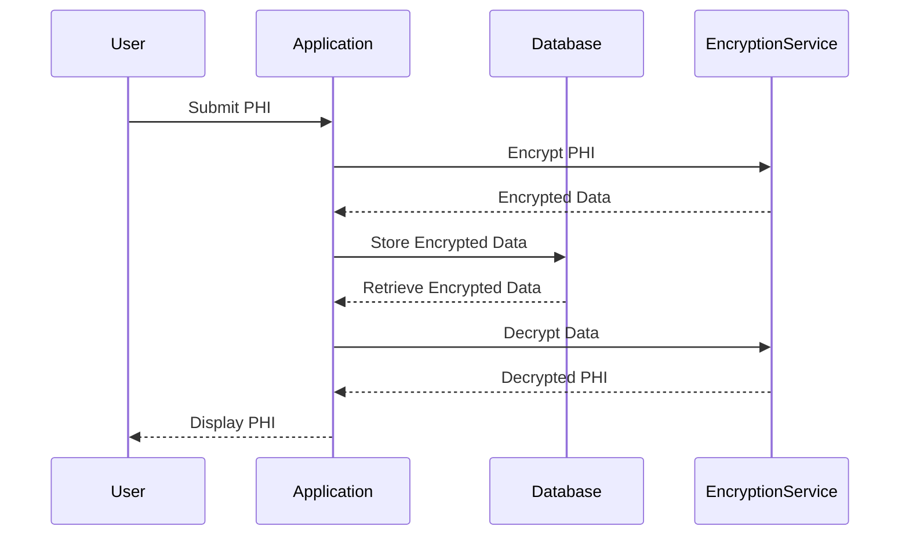

## 30.13.2. Handling Medical Data Securely

In the realm of healthcare applications, the secure handling of medical data is paramount. As developers and architects, we must ensure that sensitive patient information is protected from unauthorized access and breaches. This section delves into advanced techniques and best practices for securely handling medical data in Elixir applications, focusing on encryption, secure communication, and compliance with healthcare regulations.

### Data Encryption Techniques

Data encryption is a critical component of securing medical data. In Elixir, we can leverage libraries such as `comeonin` and `bcrypt_elixir` to encrypt and hash sensitive information effectively.

#### Utilizing Elixir Libraries for Encryption

**Comeonin and bcrypt_elixir**

The `comeonin` library provides a simple and secure way to hash passwords in Elixir applications. It supports various hashing algorithms, including bcrypt, which is widely used for its robustness against brute-force attacks.

```elixir
# Import the Comeonin.Bcrypt module
import Comeonin.Bcrypt

# Hash a password
hashed_password = hashpwsalt("my_secret_password")

# Verify a password
is_valid = checkpw("my_secret_password", hashed_password)

# Output the result
IO.puts("Password is valid: #{is_valid}")
```

**Best Practices for Key Management and Storage**

1. **Use Environment Variables**: Store encryption keys in environment variables rather than hardcoding them into your application code.
2. **Rotate Keys Regularly**: Implement a key rotation policy to minimize the risk of key compromise.
3. **Access Control**: Limit access to encryption keys to only those components that require them.

### Secure Communication Channels

Securing communication channels is essential to protect data in transit. Implementing SSL/TLS encryption and using secure protocols for API integrations are fundamental practices.

#### Implementing SSL/TLS Encryption

SSL/TLS encryption ensures that data transmitted over the network is secure and cannot be intercepted by unauthorized parties.

```elixir
# Configure SSL for a Phoenix application
config :my_app, MyApp.Endpoint,
  https: [
    port: 443,
    cipher_suite: :strong,
    keyfile: System.get_env("SSL_KEY_PATH"),
    certfile: System.get_env("SSL_CERT_PATH")
  ]
```

#### Using Secure Protocols

- **HTTPS**: Always use HTTPS for web applications to encrypt data between the client and server.
- **SFTP**: Use SFTP for secure file transfers, ensuring that sensitive data is encrypted during transmission.

### PHI Minimization

Protected Health Information (PHI) minimization involves collecting only the necessary patient information to reduce risk. Anonymizing or de-identifying data when possible is also crucial.

#### Collecting Necessary Information

- **Data Minimization Principle**: Only collect data that is essential for the intended purpose.
- **Anonymization**: Remove personally identifiable information (PII) from datasets when full identification is not required.

### Secure Coding Practices

Secure coding practices help prevent vulnerabilities that could lead to data breaches. Validating and sanitizing user inputs is a fundamental step in this process.

#### Validating and Sanitizing Inputs

```elixir
# Example of input validation in a Phoenix controller
def create(conn, %{"user" => user_params}) do
  changeset = User.changeset(%User{}, user_params)

  if changeset.valid? do
    # Proceed with creating the user
  else
    # Handle validation errors
  end
end
```

#### Avoiding Common Vulnerabilities

- **Injection Attacks**: Use parameterized queries to prevent SQL injection.
- **Cross-Site Scripting (XSS)**: Sanitize user inputs and escape outputs to prevent XSS attacks.

### Process Isolation and Supervision

Running sensitive operations in isolated processes and using supervisors to recover from failures without data loss are key strategies in Elixir.

#### Isolating Sensitive Operations

```elixir
# Example of running a sensitive operation in a separate process
Task.start(fn ->
  # Perform sensitive operation
end)
```

#### Using Supervisors

Supervisors in Elixir provide a way to monitor and restart processes in case of failure, ensuring system reliability.

```elixir
# Define a supervisor in a Phoenix application
defmodule MyApp.Supervisor do
  use Supervisor

  def start_link(_) do
    Supervisor.start_link(__MODULE__, :ok, name: __MODULE__)
  end

  def init(:ok) do
    children = [
      # List of worker processes
    ]

    Supervisor.init(children, strategy: :one_for_one)
  end
end
```

### Regular Security Audits

Conducting regular security audits, including code reviews and vulnerability assessments, is essential to identify and mitigate potential security issues.

#### Code Reviews and Vulnerability Assessments

- **Automated Tools**: Use tools like Credo and Dialyzer for static code analysis.
- **Manual Reviews**: Conduct peer reviews to catch security issues that automated tools might miss.

### Compliance with International Standards

Adhering to international standards such as GDPR and understanding regional healthcare regulations is crucial for legal compliance.

#### GDPR Compliance

- **Data Subject Rights**: Implement mechanisms for data subjects to access, rectify, and delete their data.
- **Data Protection Impact Assessments (DPIAs)**: Conduct DPIAs to assess the impact of data processing activities on privacy.

### Visualizing Secure Medical Data Handling

To better understand the flow of secure medical data handling, let's visualize the process using a sequence diagram.



**Diagram Description**: This sequence diagram illustrates the process of securely handling medical data. The user submits PHI, which is encrypted by the application before being stored in the database. When needed, the data is retrieved, decrypted, and displayed to the user.

### Knowledge Check

Let's test your understanding of secure medical data handling in Elixir applications.

1. **What is the purpose of using `comeonin` and `bcrypt_elixir` in Elixir applications?**
   - [ ] To manage database connections
   - [x] To hash and encrypt sensitive data
   - [ ] To handle HTTP requests
   - [ ] To perform data validation

2. **Why is it important to use SSL/TLS encryption for network communications?**
   - [ ] To improve application performance
   - [x] To secure data in transit
   - [ ] To reduce server load
   - [ ] To simplify API integrations

3. **What is the principle of data minimization?**
   - [ ] Collecting as much data as possible
   - [x] Collecting only necessary data
   - [ ] Storing data indefinitely
   - [ ] Sharing data with third parties

4. **How can you prevent SQL injection attacks in Elixir applications?**
   - [ ] By using raw SQL queries
   - [x] By using parameterized queries
   - [ ] By disabling user inputs
   - [ ] By encrypting all data

5. **What is the role of supervisors in Elixir applications?**
   - [ ] To manage database connections
   - [x] To monitor and restart processes
   - [ ] To handle HTTP requests
   - [ ] To perform data validation

### Embrace the Journey

Remember, securing medical data is a continuous journey. As you progress, you'll encounter new challenges and opportunities to enhance your skills. Keep experimenting, stay curious, and enjoy the journey!

## Quiz: Handling Medical Data Securely



### What is the primary purpose of using `comeonin` and `bcrypt_elixir` in Elixir applications?

- [x] To hash and encrypt sensitive data
- [ ] To manage database connections
- [ ] To handle HTTP requests
- [ ] To perform data validation

> **Explanation:** `comeonin` and `bcrypt_elixir` are used for hashing and encrypting sensitive data, such as passwords, to enhance security.

### Why is SSL/TLS encryption important for network communications?

- [x] To secure data in transit
- [ ] To improve application performance
- [ ] To reduce server load
- [ ] To simplify API integrations

> **Explanation:** SSL/TLS encryption ensures that data transmitted over the network is secure and cannot be intercepted by unauthorized parties.

### What does the principle of data minimization entail?

- [x] Collecting only necessary data
- [ ] Collecting as much data as possible
- [ ] Storing data indefinitely
- [ ] Sharing data with third parties

> **Explanation:** Data minimization involves collecting only the data that is necessary for the intended purpose, reducing the risk of data breaches.

### How can SQL injection attacks be prevented in Elixir applications?

- [x] By using parameterized queries
- [ ] By using raw SQL queries
- [ ] By disabling user inputs
- [ ] By encrypting all data

> **Explanation:** Parameterized queries prevent SQL injection attacks by separating SQL code from data inputs.

### What is the function of supervisors in Elixir applications?

- [x] To monitor and restart processes
- [ ] To manage database connections
- [ ] To handle HTTP requests
- [ ] To perform data validation

> **Explanation:** Supervisors in Elixir monitor processes and restart them in case of failure, ensuring system reliability.

### What is a key benefit of using environment variables for key management?

- [x] They keep keys out of the source code
- [ ] They improve application performance
- [ ] They simplify database queries
- [ ] They enhance user experience

> **Explanation:** Environment variables keep sensitive information, like encryption keys, out of the source code, enhancing security.

### Why should encryption keys be rotated regularly?

- [x] To minimize the risk of key compromise
- [ ] To improve application performance
- [ ] To simplify key management
- [ ] To enhance user experience

> **Explanation:** Regular key rotation minimizes the risk of key compromise, maintaining data security.

### What is the purpose of anonymizing data?

- [x] To remove personally identifiable information
- [ ] To increase data storage
- [ ] To enhance data visualization
- [ ] To simplify data processing

> **Explanation:** Anonymizing data involves removing personally identifiable information to protect privacy.

### How does using HTTPS benefit web applications?

- [x] It encrypts data between the client and server
- [ ] It reduces server load
- [ ] It simplifies API integrations
- [ ] It improves application performance

> **Explanation:** HTTPS encrypts data between the client and server, ensuring secure communication.

### True or False: Regular security audits are unnecessary if automated tools are used.

- [ ] True
- [x] False

> **Explanation:** Regular security audits, including manual reviews, are necessary to catch security issues that automated tools might miss.


