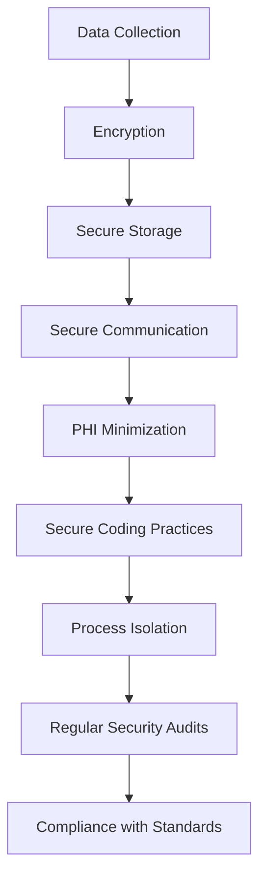

## 30.13.2. Handling Medical Data Securely

Handling medical data securely is paramount in healthcare applications, where sensitive information such as patient health records must be protected from unauthorized access and breaches. This section explores various techniques and best practices for securing medical data using Elixir, a functional programming language known for its robustness and fault tolerance. We will cover data encryption techniques, secure communication channels, PHI minimization, secure coding practices, process isolation, regular security audits, and compliance with international standards.

### Data Encryption Techniques

Data encryption is a critical component of securing medical data. It ensures that even if data is intercepted, it cannot be read without the proper decryption key. In Elixir, several libraries facilitate encryption and hashing.

#### Utilizing Elixir Libraries for Encryption and Hashing

- **Comeonin and Bcrypt_elixir**: These libraries provide a simple API for hashing passwords and other sensitive data. They are widely used for their ease of use and security features.

```elixir
# Example of hashing a password using bcrypt_elixir
defmodule SecureData do
  def hash_password(password) do
    {:ok, hash} = Bcrypt.hash_pwd_salt(password)
    hash
  end

  def verify_password(password, hash) do
    Bcrypt.verify_pass(password, hash)
  end
end

# Usage
hashed_password = SecureData.hash_password("my_secure_password")
is_valid = SecureData.verify_password("my_secure_password", hashed_password)
```

- **Key Management and Storage**: Proper key management is essential for maintaining the security of encrypted data. Use secure storage solutions like AWS KMS or HashiCorp Vault to store encryption keys securely.

#### Best Practices for Key Management

1. **Rotate Keys Regularly**: Regular key rotation reduces the risk of key compromise.
2. **Use Hardware Security Modules (HSMs)**: HSMs provide a secure environment for key generation and storage.
3. **Limit Key Access**: Restrict access to keys to only those processes and individuals who absolutely need it.

### Secure Communication Channels

Secure communication channels are vital for protecting data in transit. Implementing SSL/TLS encryption ensures that data exchanged over networks is secure.

#### Implementing SSL/TLS Encryption

- **SSL/TLS for Network Communications**: Use libraries like `ssl` in Elixir to establish secure connections.

```elixir
# Example of establishing a secure connection using SSL
:ssl.start()
{:ok, socket} = :ssl.connect('example.com', 443, [])
```

- **Secure Protocols for API Integrations**: Always use secure protocols such as HTTPS and SFTP for API integrations to prevent data interception.

### PHI Minimization

Protected Health Information (PHI) minimization is a strategy to reduce the amount of sensitive data collected and stored, thereby reducing risk.

#### Collecting Only Necessary Information

- **Data Minimization Principle**: Only collect data that is necessary for the intended purpose. This reduces the potential impact of a data breach.

#### Anonymizing or De-identifying Data

- **Techniques for Anonymization**: Use techniques such as pseudonymization, where identifiable information is replaced with pseudonyms, to protect patient identities.

### Secure Coding Practices

Secure coding practices help prevent vulnerabilities that could be exploited by attackers.

#### Validating and Sanitizing User Inputs

- **Preventing Injection Attacks**: Always validate and sanitize user inputs to prevent SQL injection, XSS, and other injection attacks.

```elixir
# Example of input validation
defmodule InputValidation do
  def sanitize_input(input) do
    # Remove potentially harmful characters
    String.replace(input, ~r/[<>]/, "")
  end
end
```

#### Avoiding Common Vulnerabilities

- **OWASP Top Ten**: Familiarize yourself with the OWASP Top Ten vulnerabilities and implement measures to prevent them.

### Process Isolation and Supervision

Process isolation and supervision are key features of Elixir that enhance security by isolating sensitive operations and recovering from failures.

#### Running Sensitive Operations in Isolated Processes

- **Isolated Processes**: Run sensitive operations in separate processes to prevent them from affecting the entire system if compromised.

#### Using Supervisors for Recovery

- **Supervision Trees**: Use Elixir's Supervisor module to automatically restart failed processes, ensuring system resilience.

```elixir
# Example of a simple supervisor
defmodule MyApp.Supervisor do
  use Supervisor

  def start_link(_) do
    Supervisor.start_link(__MODULE__, :ok, name: __MODULE__)
  end

  def init(:ok) do
    children = [
      {MyApp.Worker, []}
    ]

    Supervisor.init(children, strategy: :one_for_one)
  end
end
```

### Regular Security Audits

Regular security audits are essential for identifying and mitigating vulnerabilities.

#### Conducting Code Reviews and Vulnerability Assessments

- **Code Reviews**: Regularly review code to identify potential security issues.
- **Vulnerability Assessments**: Use tools like `Dialyzer` and `Credo` to perform static analysis and identify vulnerabilities.

#### Keeping Dependencies Up-to-Date

- **Dependency Management**: Regularly update dependencies to patch known vulnerabilities. Use tools like `Hex` to manage dependencies effectively.

### Compliance with International Standards

Compliance with international standards ensures that your application meets legal and regulatory requirements.

#### Adhering to GDPR

- **GDPR Compliance**: Implement measures to protect the data of European data subjects, such as data encryption and access controls.

#### Understanding Regional Healthcare Regulations

- **HIPAA and Others**: Familiarize yourself with regional regulations such as HIPAA in the United States and implement necessary controls.

### Visualizing Secure Data Handling

Below is a diagram illustrating the secure data handling process, from encryption to secure communication and compliance.


```mermaid
flowchart TD
    A[Data Collection] --> B[Encryption]
    B --> C[Secure Storage]
    C --> D[Secure Communication]
    D --> E[PHI Minimization]
    E --> F[Secure Coding Practices]
    F --> G[Process Isolation]
    G --> H[Regular Security Audits]
    H --> I[Compliance with Standards]
```

**Diagram Description**: This flowchart represents the secure data handling process in healthcare applications. It begins with data collection, followed by encryption, secure storage, secure communication, PHI minimization, secure coding practices, process isolation, regular security audits, and compliance with standards.

### Try It Yourself

Experiment with the provided code examples by modifying them to suit your specific use case. For instance, try changing the hashing algorithm or implementing additional security measures in the input validation function.

### References and Links

- [OWASP Top Ten](https://owasp.org/www-project-top-ten/)
- [Elixir Bcrypt Library](https://hexdocs.pm/bcrypt_elixir/readme.html)
- [SSL in Elixir](https://erlang.org/doc/man/ssl.html)
- [GDPR Compliance](https://gdpr.eu/)

### Knowledge Check

1. What is the primary purpose of data encryption in healthcare applications?
2. How does Elixir's supervision tree enhance system resilience?
3. Why is PHI minimization important in handling medical data?
4. What are some common vulnerabilities identified by OWASP?
5. How can you ensure secure communication between services?

### Embrace the Journey

Remember, securing medical data is a continuous process. As you implement these practices, you'll build more secure and compliant healthcare applications. Keep learning, stay vigilant, and enjoy the journey!

## Quiz Time!



### What is the primary purpose of data encryption in healthcare applications?

- [x] To protect data from unauthorized access
- [ ] To increase data processing speed
- [ ] To enhance data visualization
- [ ] To simplify data management

> **Explanation:** Data encryption is primarily used to protect sensitive information from unauthorized access, ensuring that even if data is intercepted, it cannot be read without the proper decryption key.

### How does Elixir's supervision tree enhance system resilience?

- [x] By automatically restarting failed processes
- [ ] By increasing the speed of data processing
- [ ] By reducing memory usage
- [ ] By simplifying code structure

> **Explanation:** Elixir's supervision tree automatically restarts failed processes, ensuring that the system remains resilient and continues to function even in the event of failures.

### Why is PHI minimization important in handling medical data?

- [x] To reduce the potential impact of a data breach
- [ ] To increase the amount of data collected
- [ ] To simplify data processing
- [ ] To enhance data visualization

> **Explanation:** PHI minimization reduces the potential impact of a data breach by limiting the amount of sensitive information collected and stored.

### What are some common vulnerabilities identified by OWASP?

- [x] SQL injection and cross-site scripting
- [ ] Data encryption and hashing
- [ ] Secure communication protocols
- [ ] Memory optimization techniques

> **Explanation:** OWASP identifies common vulnerabilities such as SQL injection and cross-site scripting that developers should be aware of and protect against.

### How can you ensure secure communication between services?

- [x] By using SSL/TLS encryption
- [ ] By increasing data processing speed
- [ ] By simplifying code structure
- [ ] By reducing memory usage

> **Explanation:** Secure communication between services can be ensured by using SSL/TLS encryption, which protects data in transit from being intercepted.

### What is a key benefit of using Elixir for healthcare applications?

- [x] Fault tolerance and process isolation
- [ ] Increased data visualization capabilities
- [ ] Simplified user interface design
- [ ] Enhanced memory usage

> **Explanation:** Elixir's fault tolerance and process isolation features make it an ideal choice for building robust healthcare applications that require high reliability.

### Which Elixir library is commonly used for password hashing?

- [x] Bcrypt_elixir
- [ ] Phoenix
- [ ] Ecto
- [ ] Plug

> **Explanation:** The `bcrypt_elixir` library is commonly used for password hashing in Elixir applications due to its ease of use and security features.

### What is the role of key management in data encryption?

- [x] To securely store and manage encryption keys
- [ ] To increase data processing speed
- [ ] To enhance data visualization
- [ ] To simplify code structure

> **Explanation:** Key management involves securely storing and managing encryption keys, which are crucial for maintaining the security of encrypted data.

### Why should dependencies be kept up-to-date in Elixir applications?

- [x] To patch known vulnerabilities
- [ ] To increase data processing speed
- [ ] To enhance data visualization
- [ ] To simplify code structure

> **Explanation:** Keeping dependencies up-to-date ensures that known vulnerabilities are patched, reducing the risk of security breaches.

### True or False: Anonymizing data involves replacing identifiable information with pseudonyms.

- [x] True
- [ ] False

> **Explanation:** Anonymizing data involves replacing identifiable information with pseudonyms or other non-identifiable markers to protect patient identities.


