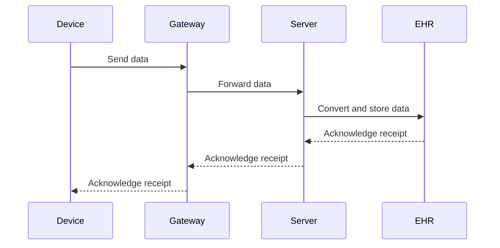

## 30.13.3. Integration with Medical Devices and IoT

In the rapidly evolving landscape of healthcare technology, integrating medical devices with IoT (Internet of Things) systems is crucial for delivering real-time patient data and enhancing medical outcomes. Elixir, with its robust concurrency model and fault-tolerant design, is uniquely positioned to address the challenges of interfacing with medical devices and IoT. In this section, we will explore the various aspects of integrating medical devices with IoT using Elixir, including communication protocols, real-time data processing, edge computing, security, and data standardization.

### Interfacing with Medical Devices

#### Understanding Communication Protocols

Medical devices often communicate using standardized protocols such as HL7 (Health Level 7), FHIR (Fast Healthcare Interoperability Resources), and DICOM (Digital Imaging and Communications in Medicine). These protocols ensure that data is exchanged in a consistent and interoperable manner across different systems.

- **HL7**: A set of international standards for the exchange, integration, sharing, and retrieval of electronic health information. It is widely used in healthcare environments to facilitate communication between various systems.
- **FHIR**: A newer standard developed by HL7, FHIR is designed to enable easier and faster data exchange. It uses modern web technologies such as RESTful APIs and JSON/XML data formats.
- **DICOM**: Primarily used for handling, storing, printing, and transmitting information in medical imaging.

#### Parsing and Generating Messages

Elixir provides powerful libraries and tools for parsing and generating messages in these protocols. For instance, the `ex_hl7` library can be used to handle HL7 messages, while `ex_fhir` supports FHIR resources.

```elixir
# Example: Parsing an HL7 message
defmodule HL7Parser do
  def parse_message(hl7_string) do
    {:ok, message} = ExHL7.parse(hl7_string)
    message
  end
end

# Example: Generating a FHIR resource
defmodule FHIRResource do
  def create_patient_resource do
    %FHIR.Patient{
      id: "123",
      name: [%{given: ["John"], family: "Doe"}],
      gender: "male",
      birthDate: "1980-01-01"
    }
  end
end
```

### IoT Connectivity

#### Connecting to Wearable Devices and Sensors

IoT connectivity involves interfacing with a variety of devices, including wearable health monitors, sensors, and home health devices. These devices often use protocols like MQTT, CoAP, or Bluetooth for communication.

- **MQTT**: A lightweight messaging protocol for small sensors and mobile devices, optimized for high-latency or unreliable networks.
- **CoAP**: A protocol designed for constrained devices and networks, similar to HTTP but optimized for IoT.
- **Bluetooth**: A wireless technology standard for exchanging data over short distances.

#### Managing Diverse Device Ecosystems

Elixir's concurrency model allows for efficient management of diverse device ecosystems. By leveraging processes and message passing, Elixir can handle multiple device connections simultaneously.

```elixir
# Example: Connecting to an MQTT broker
defmodule IoTConnector do
  use Tortoise

  def start_link do
    Tortoise.Supervisor.start_child(
      client_id: "device_123",
      handler: {MyHandler, []},
      server: {Tortoise.Transport.Tcp, host: 'broker.hivemq.com', port: 1883}
    )
  end
end
```

### Real-Time Data Processing

#### Handling Streaming Data with GenStage and Flow

Elixir's GenStage and Flow libraries provide powerful abstractions for handling streaming data. These libraries are particularly useful for building backpressure-aware data processing pipelines.

- **GenStage**: A framework for exchanging data between stages in a pipeline, with support for backpressure.
- **Flow**: Built on top of GenStage, Flow provides higher-level abstractions for parallel data processing.

```elixir
# Example: Processing streaming data with Flow
defmodule DataPipeline do
  use Flow

  def start_pipeline do
    Flow.from_enumerable(1..1000)
    |> Flow.map(&(&1 * 2))
    |> Flow.filter(&rem(&1, 2) == 0)
    |> Flow.run()
  end
end
```

#### Building Pipelines for Data Ingestion and Transformation

Elixir's pattern matching and functional programming paradigm make it ideal for building data ingestion and transformation pipelines. By leveraging these features, developers can create efficient and maintainable data processing workflows.

### Edge Computing with Nerves

#### Deploying Elixir Applications on Medical Hardware

Nerves is a framework for building embedded systems with Elixir. It allows developers to deploy Elixir applications directly on medical hardware, enabling edge computing capabilities.

- **Edge Computing**: Processing data at the edge of the network, closer to the source of data, to reduce latency and bandwidth usage.

```elixir
# Example: Nerves project setup
defmodule MyNervesApp do
  use Nerves

  def start do
    IO.puts("Hello from Nerves!")
  end
end
```

#### Benefits of Processing Data at the Edge

Processing data at the edge can significantly reduce latency, which is crucial for time-sensitive medical applications. It also reduces the amount of data that needs to be transmitted to central servers, saving bandwidth and improving privacy.

### Security in IoT Environments

#### Implementing Device Authentication and Secure Firmware Updates

Security is a critical concern in IoT environments. Elixir provides libraries and tools for implementing secure device authentication and firmware updates.

- **Device Authentication**: Ensuring that only authorized devices can connect to the network.
- **Secure Firmware Updates**: Protecting against unauthorized firmware modifications.

```elixir
# Example: Implementing device authentication
defmodule DeviceAuth do
  def authenticate(device_id, token) do
    # Verify the device ID and token
    :ok
  end
end
```

#### Protecting Against IoT-Specific Threats

IoT devices are vulnerable to various threats, including unauthorized access and data interception. Implementing robust security measures is essential to protect sensitive medical data.

### Data Standardization and Interoperability

#### Converting Device Data into Standardized Formats

To ensure interoperability with Electronic Health Record (EHR) systems, device data must be converted into standardized formats. Elixir's pattern matching and data transformation capabilities make it well-suited for this task.

```elixir
# Example: Converting device data to FHIR format
defmodule DataConverter do
  def to_fhir(device_data) do
    %FHIR.Observation{
      id: device_data.id,
      status: "final",
      code: %{coding: [%{system: "http://loinc.org", code: "1234-5"}]},
      valueQuantity: %{value: device_data.value, unit: "mmHg"}
    }
  end
end
```

#### Ensuring Compatibility with Healthcare Information Exchanges

Healthcare information exchanges (HIEs) facilitate the sharing of health information across organizations. Ensuring compatibility with HIEs is crucial for seamless data exchange.

### Monitoring and Maintenance

#### Remote Device Management and Diagnostics

Elixir's robust concurrency model and fault-tolerant design make it ideal for remote device management and diagnostics. By leveraging these features, developers can build systems that monitor device health and diagnose issues in real-time.

#### Automated Alerts for Device Malfunctions

Automated alerts can notify healthcare providers of device malfunctions or anomalies in patient data, enabling timely intervention.

```elixir
# Example: Sending automated alerts
defmodule AlertSystem do
  def send_alert(device_id, issue) do
    IO.puts("Alert: Device #{device_id} has an issue: #{issue}")
  end
end
```

### Visualizing the Integration Process

To better understand the integration process, let's visualize the flow of data from medical devices to healthcare systems using a sequence diagram.



### Conclusion

Integrating medical devices with IoT using Elixir offers numerous benefits, including real-time data processing, edge computing capabilities, and robust security measures. By leveraging Elixir's unique features, developers can build scalable and fault-tolerant systems that enhance healthcare delivery. As you continue to explore the possibilities of Elixir in healthcare applications, remember to stay curious and keep experimenting with new ideas and technologies.

## Quiz: Integration with Medical Devices and IoT



### Which protocol is primarily used for medical imaging data exchange?

- [ ] HL7
- [ ] FHIR
- [x] DICOM
- [ ] MQTT

> **Explanation:** DICOM is the standard protocol for handling, storing, and transmitting medical imaging information.

### What is the primary benefit of edge computing in medical IoT applications?

- [x] Reduced latency
- [ ] Increased data storage
- [ ] Enhanced graphics processing
- [ ] Lower power consumption

> **Explanation:** Edge computing reduces latency by processing data closer to the source, which is crucial for time-sensitive medical applications.

### Which Elixir library is used for handling HL7 messages?

- [ ] ExFHIR
- [x] ExHL7
- [ ] Tortoise
- [ ] Nerves

> **Explanation:** ExHL7 is an Elixir library specifically designed for parsing and generating HL7 messages.

### What is the role of GenStage in Elixir?

- [ ] Managing device authentication
- [x] Handling streaming data with backpressure
- [ ] Converting data formats
- [ ] Sending automated alerts

> **Explanation:** GenStage is a framework for building data processing pipelines with support for backpressure.

### Which protocol is commonly used for lightweight messaging in IoT?

- [ ] HTTP
- [x] MQTT
- [ ] FTP
- [ ] SMTP

> **Explanation:** MQTT is a lightweight messaging protocol optimized for small sensors and mobile devices.

### What is the purpose of the Nerves framework in Elixir?

- [ ] Data encryption
- [ ] Device authentication
- [x] Building embedded systems
- [ ] Real-time analytics

> **Explanation:** Nerves is a framework for building embedded systems with Elixir, enabling edge computing capabilities.

### How does Elixir handle multiple device connections efficiently?

- [ ] By using a single-threaded model
- [x] Through its concurrency model and message passing
- [ ] By prioritizing connections
- [ ] By using external libraries

> **Explanation:** Elixir's concurrency model and message passing allow it to efficiently manage multiple device connections.

### What is a key feature of FHIR?

- [ ] It uses binary data formats
- [x] It employs RESTful APIs and JSON/XML
- [ ] It is only used for imaging data
- [ ] It is a proprietary standard

> **Explanation:** FHIR uses modern web technologies like RESTful APIs and JSON/XML for easier and faster data exchange.

### Which of the following is a security concern in IoT environments?

- [ ] High latency
- [ ] Data redundancy
- [x] Unauthorized access
- [ ] Low bandwidth

> **Explanation:** Unauthorized access is a significant security concern in IoT environments, requiring robust authentication measures.

### True or False: Elixir's pattern matching is beneficial for data transformation tasks.

- [x] True
- [ ] False

> **Explanation:** Elixir's pattern matching is highly effective for data transformation, allowing for concise and readable code.


