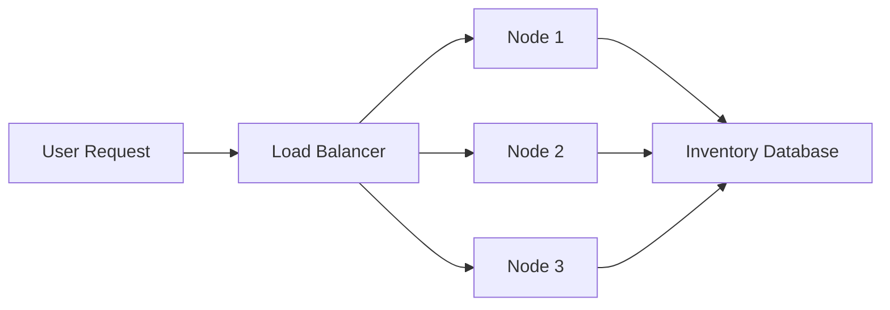
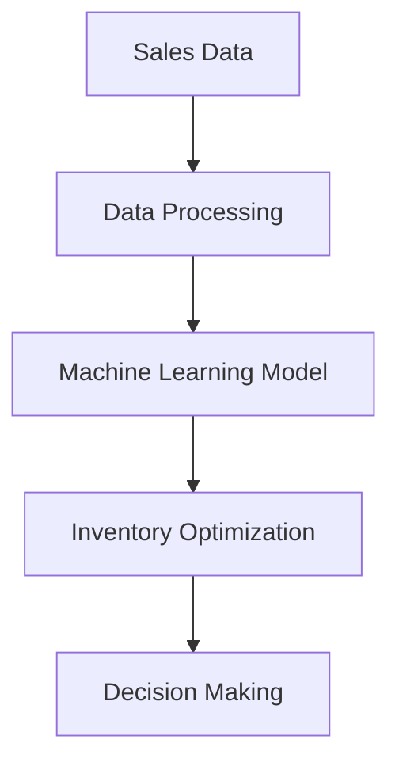

## 30.14.1. Real-Time Inventory Management

In the fast-paced world of e-commerce, real-time inventory management is crucial for maintaining customer satisfaction and operational efficiency. Elixir, with its robust concurrency model and fault-tolerant design, offers unique advantages for building scalable and responsive inventory systems. This section delves into the challenges, strategies, and technologies involved in implementing real-time inventory management using Elixir.

### Challenges in Inventory Management

Inventory management in e-commerce involves synchronizing stock levels across multiple sales channels and warehouses, handling reservations during high-traffic events, and ensuring data consistency. Let's explore these challenges in detail:

- **Synchronizing Inventory Across Multiple Sales Channels and Warehouses**: E-commerce platforms often sell products through various channels, including online stores, marketplaces, and physical locations. Keeping inventory data synchronized across these channels is essential to prevent overselling and ensure accurate stock levels.

- **Handling Inventory Reservations During High-Traffic Events**: Events like flash sales and holiday promotions can lead to sudden spikes in traffic and demand. Managing inventory reservations efficiently during these periods is critical to avoid stockouts and customer dissatisfaction.

### Concurrent Updates and Consistency

Elixir's concurrency model, based on the Actor model, is well-suited for managing simultaneous inventory operations. Here's how you can leverage Elixir's features to ensure consistency:

- **Utilizing Elixir's Concurrency Model**: Elixir processes are lightweight and can handle thousands of concurrent operations. By using processes to manage inventory updates, you can ensure that operations are isolated and do not interfere with each other.

- **Implementing Optimistic vs. Pessimistic Locking Strategies**: Choose between optimistic and pessimistic locking based on your application's needs. Optimistic locking assumes that conflicts are rare and checks for conflicts before committing changes, while pessimistic locking prevents conflicts by locking resources during operations.

#### Code Example: Optimistic Locking

```elixir
defmodule Inventory do
  def update_stock(item_id, quantity) do
    case Repo.get(Item, item_id) do
      nil -> {:error, :not_found}
      item ->
        changeset = Item.changeset(item, %{stock: item.stock - quantity})
        
        case Repo.update(changeset) do
          {:ok, _item} -> {:ok, :updated}
          {:error, _changeset} -> {:error, :conflict}
        end
    end
  end
end
```

In this example, we use Ecto to implement optimistic locking by checking the current stock level before updating it.

### Event-Driven Architecture

An event-driven architecture allows systems to react to changes in real-time, making it ideal for inventory management. Here's how you can implement it in Elixir:

- **Employing Message Queues and PubSub Patterns**: Use message queues like RabbitMQ or Kafka to propagate inventory changes across the system. Elixir's `Phoenix.PubSub` can be used to broadcast events to interested subscribers.

- **Reacting to Inventory Events in Real-Time**: Set up event handlers to listen for inventory changes and update stock levels accordingly. This ensures that all parts of the system have the latest information.

#### Code Example: Event Handling with PubSub

```elixir
defmodule Inventory.EventHandler do
  use GenServer

  def start_link(_) do
    GenServer.start_link(__MODULE__, %{}, name: __MODULE__)
  end

  def init(state) do
    Phoenix.PubSub.subscribe(MyApp.PubSub, "inventory:updates")
    {:ok, state}
  end

  def handle_info({:inventory_update, item_id, quantity}, state) do
    # Update inventory logic here
    {:noreply, state}
  end
end
```

This example demonstrates how to set up a GenServer to listen for inventory update events using `Phoenix.PubSub`.

### Scalability Considerations

Scalability is a key concern for e-commerce platforms, especially during peak times. Here's how to design a scalable inventory management system:

- **Designing the System to Handle Spikes in Activity**: Use Elixir's concurrency and distributed capabilities to handle increased loads. Implement load balancing and horizontal scaling to distribute traffic across multiple nodes.

- **Implementing Distributed Systems**: Use Elixir's built-in support for distributed systems to manage larger datasets and higher loads. This involves setting up clusters of nodes that can communicate and share data efficiently.

#### Diagram: Distributed Inventory Management System



This diagram illustrates a distributed inventory management system where user requests are balanced across multiple nodes, each interacting with a shared inventory database.

### Integration with Supply Chain Systems

Integrating with supply chain systems is essential for automating processes like restocking and order fulfillment. Here's how to achieve this in Elixir:

- **Connecting with Suppliers, Dropshippers, and Logistics Providers**: Use APIs and webhooks to communicate with external systems. This allows for real-time updates and seamless integration with supply chain partners.

- **Automating Purchase Orders and Restocking**: Implement logic to automatically generate purchase orders when inventory levels fall below a certain threshold. This ensures that stock is replenished in a timely manner.

#### Code Example: Automating Restocking

```elixir
defmodule Inventory.Restock do
  def check_and_restock(item_id) do
    case Repo.get(Item, item_id) do
      nil -> {:error, :not_found}
      item when item.stock < item.reorder_level ->
        # Trigger restock process
        send_restock_order(item)
        {:ok, :restock_triggered}
      _ -> {:ok, :sufficient_stock}
    end
  end

  defp send_restock_order(item) do
    # Logic to send restock order to supplier
  end
end
```

This code checks inventory levels and triggers a restock order if necessary.

### Analytics and Forecasting

Analytics and forecasting play a crucial role in optimizing inventory management. Here's how to leverage data for better decision-making:

- **Collecting Data for Demand Forecasting and Trend Analysis**: Use Elixir's data processing capabilities to collect and analyze sales data. This helps in predicting future demand and identifying trends.

- **Utilizing Machine Learning for Inventory Optimization**: Integrate machine learning models to optimize inventory levels and reduce waste. This can involve predicting demand patterns and adjusting stock levels accordingly.

#### Diagram: Data Flow for Inventory Analytics



This diagram shows the data flow for inventory analytics, from collecting sales data to making informed decisions based on machine learning insights.

### Try It Yourself

To deepen your understanding, try modifying the code examples provided. For instance, implement a pessimistic locking strategy or experiment with different event handling techniques using `Phoenix.PubSub`. Consider setting up a small-scale distributed system using Elixir nodes to see how they interact in real-time.

### Knowledge Check

- How does Elixir's concurrency model benefit real-time inventory management?
- What are the differences between optimistic and pessimistic locking?
- How can event-driven architecture improve inventory accuracy?
- What strategies can be used to scale an inventory management system?
- How can machine learning be applied to inventory optimization?

### Embrace the Journey

Remember, mastering real-time inventory management in Elixir is a journey. As you progress, you'll build more complex and efficient systems. Keep experimenting, stay curious, and enjoy the journey!

### Quiz: Real-Time Inventory Management



### What is a key benefit of using Elixir's concurrency model for inventory management?

- [x] It allows handling thousands of concurrent operations efficiently.
- [ ] It simplifies database schema design.
- [ ] It eliminates the need for data validation.
- [ ] It reduces the need for network security.

> **Explanation:** Elixir's concurrency model, based on lightweight processes, allows handling numerous concurrent operations efficiently, which is crucial for real-time inventory management.

### Which locking strategy assumes that conflicts are rare?

- [x] Optimistic locking
- [ ] Pessimistic locking
- [ ] Exclusive locking
- [ ] Shared locking

> **Explanation:** Optimistic locking assumes conflicts are rare and checks for conflicts before committing changes, unlike pessimistic locking, which locks resources during operations.

### What role do message queues play in an event-driven architecture?

- [x] They propagate inventory changes across the system.
- [ ] They store inventory data permanently.
- [ ] They handle user authentication.
- [ ] They manage network traffic.

> **Explanation:** Message queues are used to propagate inventory changes across the system, ensuring all parts have the latest information.

### How can Elixir's distributed capabilities be utilized in inventory management?

- [x] By setting up clusters of nodes to manage larger datasets and higher loads.
- [ ] By simplifying the user interface design.
- [ ] By reducing the number of required APIs.
- [ ] By eliminating the need for a database.

> **Explanation:** Elixir's distributed capabilities allow setting up clusters of nodes that can communicate and share data efficiently, crucial for managing larger datasets and higher loads.

### What is a benefit of integrating machine learning into inventory management?

- [x] It helps in predicting demand patterns and optimizing stock levels.
- [ ] It eliminates the need for human oversight.
- [ ] It reduces the cost of goods sold.
- [ ] It simplifies the supply chain.

> **Explanation:** Integrating machine learning helps in predicting demand patterns and optimizing stock levels, leading to reduced waste and improved efficiency.

### What is the purpose of using `Phoenix.PubSub` in inventory management?

- [x] To broadcast events to interested subscribers.
- [ ] To manage user sessions.
- [ ] To store inventory data.
- [ ] To handle payment processing.

> **Explanation:** `Phoenix.PubSub` is used to broadcast events to interested subscribers, ensuring real-time updates in inventory management.

### How can you automate restocking in an inventory management system?

- [x] By implementing logic to generate purchase orders when inventory levels fall below a threshold.
- [ ] By manually checking inventory levels daily.
- [ ] By using a spreadsheet to track stock.
- [ ] By relying on customer feedback.

> **Explanation:** Automating restocking involves implementing logic to generate purchase orders when inventory levels fall below a certain threshold, ensuring timely replenishment.

### What is a challenge of synchronizing inventory across multiple sales channels?

- [x] Preventing overselling and ensuring accurate stock levels.
- [ ] Reducing the number of sales channels.
- [ ] Increasing the price of goods.
- [ ] Simplifying the checkout process.

> **Explanation:** Synchronizing inventory across multiple sales channels is challenging because it involves preventing overselling and ensuring accurate stock levels.

### How does event-driven architecture contribute to inventory management?

- [x] It allows systems to react to changes in real-time.
- [ ] It simplifies the database schema.
- [ ] It reduces the need for user authentication.
- [ ] It eliminates the need for data validation.

> **Explanation:** Event-driven architecture allows systems to react to changes in real-time, making it ideal for maintaining accurate inventory levels.

### True or False: Pessimistic locking prevents conflicts by locking resources during operations.

- [x] True
- [ ] False

> **Explanation:** Pessimistic locking prevents conflicts by locking resources during operations, ensuring that no other operations can interfere.



By understanding and implementing these concepts, you can build a robust, real-time inventory management system using Elixir that meets the demands of modern e-commerce platforms.
