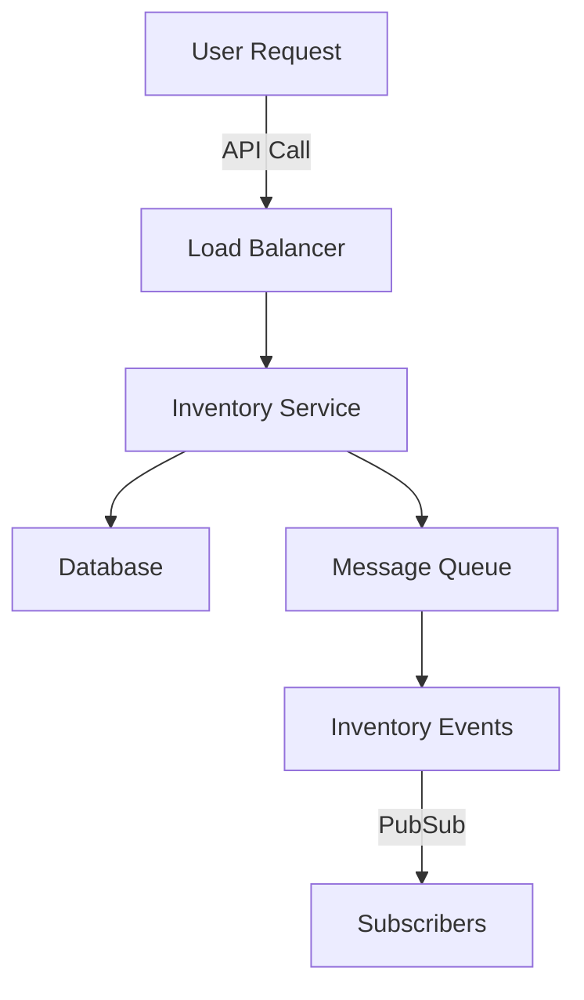

## 30.14.1. Real-Time Inventory Management

In the fast-paced world of e-commerce, real-time inventory management is crucial for maintaining accurate stock levels, optimizing supply chain operations, and ensuring customer satisfaction. This section explores how Elixir, with its robust concurrency model and functional programming paradigm, can be leveraged to build scalable, fault-tolerant inventory management systems.

### Challenges in Inventory Management

Inventory management in e-commerce involves several challenges, including synchronizing inventory across multiple sales channels and warehouses and handling inventory reservations during high-traffic events. Let's delve into these challenges:

- **Synchronizing Inventory Across Multiple Channels**: Managing inventory across various platforms (e.g., online stores, physical stores, marketplaces) requires real-time updates to prevent overselling or stockouts.
- **Handling Inventory Reservations**: During high-traffic events like flash sales, the system must efficiently manage inventory reservations to ensure accurate stock levels and customer satisfaction.

### Concurrent Updates and Consistency

Elixir's concurrency model is ideal for managing simultaneous inventory operations, ensuring data consistency and integrity. Here, we explore the use of optimistic and pessimistic locking strategies.

#### Optimistic vs. Pessimistic Locking

- **Optimistic Locking**: Assumes that conflicts are rare and checks for data integrity only at the time of update. If a conflict is detected, the transaction is retried.
- **Pessimistic Locking**: Locks the data when a transaction begins, preventing other transactions from modifying it until the lock is released.

**Code Example: Optimistic Locking in Elixir**

```elixir
defmodule Inventory do
  def update_stock(item_id, quantity) do
    Repo.transaction(fn ->
      item = Repo.get!(Item, item_id)

      # Check current version to ensure no other transaction has modified it
      if item.version == expected_version do
        changeset = Item.changeset(item, %{quantity: item.quantity - quantity, version: item.version + 1})
        Repo.update!(changeset)
      else
        raise "Version mismatch"
      end
    end)
  end
end
```

In this example, we use a version field to implement optimistic locking. The transaction checks the version before updating the stock, ensuring no other transaction has modified the item.

#### Utilizing Elixir's Concurrency Model

Elixir's lightweight processes and message-passing capabilities make it well-suited for handling concurrent updates. By leveraging GenServer and other OTP behaviors, we can efficiently manage inventory operations.

**Code Example: Using GenServer for Inventory Management**

```elixir
defmodule InventoryManager do
  use GenServer

  def start_link(initial_stock) do
    GenServer.start_link(__MODULE__, initial_stock, name: __MODULE__)
  end

  def init(initial_stock) do
    {:ok, initial_stock}
  end

  def handle_call({:reserve_stock, item_id, quantity}, _from, state) do
    case Map.get(state, item_id) do
      nil -> {:reply, {:error, :not_found}, state}
      stock when stock >= quantity ->
        new_state = Map.update!(state, item_id, &(&1 - quantity))
        {:reply, {:ok, new_state[item_id]}, new_state}
      _ -> {:reply, {:error, :insufficient_stock}, state}
    end
  end
end
```

### Event-Driven Architecture

Implementing an event-driven architecture allows for real-time propagation of inventory changes. By employing message queues and PubSub patterns, we can react to inventory events efficiently.

#### Employing Message Queues and PubSub Patterns

Message queues and PubSub systems enable decoupled communication between components, allowing inventory changes to be propagated in real-time.

**Code Example: Using Phoenix.PubSub for Inventory Events**

```elixir
defmodule InventoryEvents do
  use Phoenix.PubSub

  def publish_event(event) do
    Phoenix.PubSub.broadcast(MyApp.PubSub, "inventory:events", event)
  end

  def handle_event(event) do
    # React to the event, e.g., update UI, notify users
  end
end
```

#### Reacting to Inventory Events

By subscribing to inventory events, different parts of the system can react in real-time, ensuring accurate stock levels and timely updates.

### Scalability Considerations

Real-time inventory management systems must be designed to handle spikes in activity, especially during promotions or sales events. Let's explore how Elixir's distributed nature can help achieve this.

#### Designing for Scalability

- **Distributed Systems**: Elixir's built-in support for distributed systems allows for horizontal scaling, distributing the load across multiple nodes.
- **Load Balancing**: Implementing load balancers can help manage traffic spikes, ensuring consistent performance.

**Diagram: Real-Time Inventory Management Architecture**


```mermaid
graph TD;
    A[User Request] -->|API Call| B[Load Balancer];
    B --> C[Inventory Service];
    C --> D[Database];
    C --> E[Message Queue];
    E --> F[Inventory Events];
    F -->|PubSub| G[Subscribers];
```

*This diagram illustrates a typical architecture for a real-time inventory management system, highlighting the flow from user requests to inventory updates.*

### Integration with Supply Chain Systems

Integrating with supply chain systems is crucial for automating purchase orders and restocking based on inventory thresholds. Let's explore how Elixir can facilitate this integration.

#### Connecting with Suppliers and Logistics Providers

- **APIs and Webhooks**: Use APIs and webhooks to communicate with suppliers and logistics providers, ensuring seamless data exchange.
- **Automated Restocking**: Implement logic to automatically generate purchase orders when inventory levels fall below a certain threshold.

**Code Example: Automating Purchase Orders**

```elixir
defmodule SupplyChainIntegration do
  def check_inventory_levels do
    # Fetch current inventory levels
    inventory = InventoryRepo.all()

    Enum.each(inventory, fn item ->
      if item.quantity < item.reorder_threshold do
        generate_purchase_order(item)
      end
    end)
  end

  defp generate_purchase_order(item) do
    # Logic to create and send purchase order to supplier
  end
end
```

### Analytics and Forecasting

Collecting data for demand forecasting and trend analysis is essential for optimizing inventory levels and reducing costs. Machine learning can be used to enhance these capabilities.

#### Utilizing Machine Learning for Inventory Optimization

- **Demand Forecasting**: Use historical data to predict future demand, adjusting inventory levels accordingly.
- **Trend Analysis**: Analyze sales trends to identify patterns and optimize stock levels.

**Code Example: Simple Demand Forecasting**

```elixir
defmodule DemandForecasting do
  def forecast_demand(sales_data) do
    # Simple moving average for demand forecasting
    Enum.chunk_every(sales_data, 3, 1, :discard)
    |> Enum.map(&Enum.sum(&1) / length(&1))
  end
end
```

### Knowledge Check

- Explain the difference between optimistic and pessimistic locking.
- How can Elixir's concurrency model be leveraged for inventory management?
- Describe the role of event-driven architecture in real-time inventory management.

### Embrace the Journey

Remember, building a real-time inventory management system is a complex but rewarding endeavor. As you progress, you'll gain valuable insights into concurrency, scalability, and integration. Keep experimenting, stay curious, and enjoy the journey!

### Quiz Time!



### What is a key challenge in real-time inventory management?

- [x] Synchronizing inventory across multiple sales channels
- [ ] Managing a single sales channel
- [ ] Avoiding the use of message queues
- [ ] Using only pessimistic locking

> **Explanation:** Synchronizing inventory across multiple sales channels is a significant challenge in real-time inventory management.

### How does Elixir's concurrency model help in inventory management?

- [x] By managing simultaneous inventory operations
- [ ] By avoiding concurrent processes
- [ ] By using shared mutable state
- [ ] By implementing synchronous updates only

> **Explanation:** Elixir's concurrency model allows for managing simultaneous inventory operations through lightweight processes.

### What is optimistic locking?

- [x] A strategy that assumes conflicts are rare and checks for integrity at update time
- [ ] A strategy that locks data at the beginning of a transaction
- [ ] A strategy that uses pessimistic assumptions
- [ ] A strategy that avoids version checks

> **Explanation:** Optimistic locking assumes conflicts are rare and checks for data integrity only at the time of update.

### What is the role of event-driven architecture in inventory management?

- [x] To propagate inventory changes in real-time
- [ ] To avoid real-time updates
- [ ] To use synchronous communication only
- [ ] To handle updates manually

> **Explanation:** Event-driven architecture allows for real-time propagation of inventory changes.

### How can Elixir handle spikes in activity?

- [x] By using distributed systems and load balancing
- [ ] By avoiding distributed systems
- [ ] By using only a single server
- [ ] By implementing synchronous communication

> **Explanation:** Elixir can handle spikes in activity through distributed systems and load balancing.

### What is a benefit of integrating with supply chain systems?

- [x] Automating purchase orders and restocking
- [ ] Avoiding automation
- [ ] Using manual processes only
- [ ] Ignoring inventory thresholds

> **Explanation:** Integration with supply chain systems allows for automating purchase orders and restocking.

### What is a simple method for demand forecasting?

- [x] Simple moving average
- [ ] Complex neural networks only
- [ ] Manual calculations
- [ ] Ignoring historical data

> **Explanation:** A simple moving average is a straightforward method for demand forecasting.

### What is the purpose of message queues in inventory management?

- [x] To enable decoupled communication between components
- [ ] To couple all components tightly
- [ ] To avoid communication
- [ ] To handle updates manually

> **Explanation:** Message queues enable decoupled communication between components, allowing for real-time updates.

### What is the role of PubSub in inventory management?

- [x] To broadcast inventory events to subscribers
- [ ] To avoid broadcasting events
- [ ] To handle updates manually
- [ ] To use only synchronous communication

> **Explanation:** PubSub is used to broadcast inventory events to subscribers, enabling real-time updates.

### True or False: Real-time inventory management can benefit from machine learning for demand forecasting.

- [x] True
- [ ] False

> **Explanation:** Machine learning can enhance demand forecasting by analyzing historical data to predict future demand.




