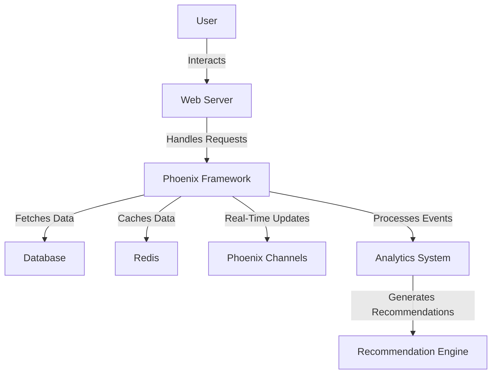

## 30.14.2. High-Performance Shopping Carts

In the fast-paced world of e-commerce, providing a seamless and responsive shopping experience is crucial. A high-performance shopping cart is at the heart of this experience, ensuring that users can add, remove, and update items with minimal latency. In this section, we will explore how to leverage Elixir and its ecosystem to build shopping carts that are not only fast and responsive but also scalable and resilient.

### Fast and Responsive User Experience

A fast and responsive user experience is paramount in e-commerce. Users expect instant feedback when interacting with a shopping cart. Let's delve into strategies to achieve this:

#### Minimizing Latency in Cart Operations

To minimize latency, we need to focus on efficient database queries and caching mechanisms. Here are some strategies:

- **Efficient Database Queries**: Use Ecto, Elixir's database wrapper and query generator, to write optimized queries. Index your database tables appropriately to speed up read operations.
  
  ```elixir
  def get_cart_items(user_id) do
    from(c in Cart, where: c.user_id == ^user_id, preload: [:items])
    |> Repo.all()
  end
  ```

- **Caching**: Implement caching to reduce database load and improve response times. Use tools like Redis or ETS (Erlang Term Storage) for caching frequently accessed data.

  ```elixir
  def get_cart_from_cache(user_id) do
    case :ets.lookup(:cart_cache, user_id) do
      [] -> fetch_and_cache_cart(user_id)
      [{_user_id, cart}] -> cart
    end
  end
  ```

#### Using Phoenix Channels for Instant Cart Updates

Phoenix Channels provide a powerful way to push real-time updates to clients. This is particularly useful for keeping the shopping cart in sync across multiple devices.

- **Setup a Channel**: Create a channel to handle cart updates.

  ```elixir
  defmodule MyAppWeb.CartChannel do
    use Phoenix.Channel

    def join("cart:" <> cart_id, _params, socket) do
      {:ok, socket}
    end

    def handle_in("update_cart", %{"item" => item}, socket) do
      # Update cart logic
      broadcast!(socket, "cart_updated", %{item: item})
      {:noreply, socket}
    end
  end
  ```

- **Client-Side Integration**: Use JavaScript to listen for updates and modify the DOM accordingly.

  ```javascript
  let socket = new Phoenix.Socket("/socket", {params: {userToken: "123"}})
  socket.connect()

  let channel = socket.channel("cart:123", {})
  channel.join()
    .receive("ok", resp => { console.log("Joined successfully", resp) })
    .receive("error", resp => { console.log("Unable to join", resp) })

  channel.on("cart_updated", payload => {
    updateCartUI(payload.item)
  })
  ```

### State Management Strategies

Managing the state of a shopping cart efficiently is crucial for ensuring data consistency and integrity. Let's explore different strategies:

#### Server-Side Sessions vs. Client-Side Storage

Deciding between server-side sessions and client-side storage depends on your application's requirements:

- **Server-Side Sessions**: Store cart data on the server, ensuring data consistency and security. Use Phoenix's session management to handle this.

  ```elixir
  plug :fetch_session

  def add_to_cart(conn, %{"item_id" => item_id}) do
    cart = get_session(conn, :cart) || []
    updated_cart = [item_id | cart]
    put_session(conn, :cart, updated_cart)
  end
  ```

- **Client-Side Storage**: Store cart data in the browser using cookies or local storage for quick access. Ensure data is encrypted and validated on the server.

  ```javascript
  function addToCart(itemId) {
    let cart = JSON.parse(localStorage.getItem('cart')) || []
    cart.push(itemId)
    localStorage.setItem('cart', JSON.stringify(cart))
  }
  ```

- **Hybrid Approach**: Combine both methods to leverage the benefits of each. Use client-side storage for quick access and server-side sessions for data integrity.

#### Ensuring Data Consistency and Integrity

To maintain data consistency, implement transactional operations and validations:

- **Transactional Operations**: Use Ecto's transactions to ensure atomic operations.

  ```elixir
  Repo.transaction(fn ->
    Repo.insert!(%CartItem{cart_id: cart_id, item_id: item_id})
    Repo.update!(%Inventory{item_id: item_id, quantity: quantity - 1})
  end)
  ```

- **Data Validations**: Validate data at both the client and server sides to prevent invalid operations.

  ```elixir
  def changeset(cart_item, attrs) do
    cart_item
    |> cast(attrs, [:item_id, :quantity])
    |> validate_required([:item_id, :quantity])
    |> validate_number(:quantity, greater_than: 0)
  end
  ```

### Scalability

Scalability is essential for handling high traffic volumes, especially during peak shopping seasons. Let's explore strategies to achieve scalability:

#### Load Balancing Across Multiple Nodes

Distribute traffic across multiple nodes to handle high loads. Use tools like Nginx or HAProxy for load balancing.

- **Nginx Configuration**: Set up Nginx to distribute traffic to multiple Elixir nodes.

  ```nginx
  upstream myapp {
    server 127.0.0.1:4000;
    server 127.0.0.1:4001;
  }

  server {
    listen 80;
    location / {
      proxy_pass http://myapp;
    }
  }
  ```

#### Distributed Caches for Session Management

Use distributed caches like Redis to manage sessions across nodes, ensuring data consistency and availability.

- **Redis Session Store**: Configure your Phoenix application to use Redis for session storage.

  ```elixir
  config :my_app, MyAppWeb.Endpoint,
    session_store: :redis,
    session_options: [key: "_my_app_key", signing_salt: "secret"]
  ```

### Personalization

Personalization enhances the shopping experience by tailoring it to individual users. Let's explore how to implement personalization:

#### Tailoring the Shopping Experience

Use user data and preferences to personalize the shopping experience:

- **User Profiles**: Store user preferences and purchase history to recommend products.

  ```elixir
  def get_recommendations(user_id) do
    user = Repo.get(User, user_id)
    # Logic to fetch recommendations based on user preferences
  end
  ```

- **Dynamic Content**: Use Phoenix LiveView to render personalized content dynamically.

  ```elixir
  defmodule MyAppWeb.ProductLive do
    use Phoenix.LiveView

    def render(assigns) do
      ~L"""
      <div>
        <h1>Recommended for you</h1>
        <%= for product <- @recommended_products do %>
          <p><%= product.name %></p>
        <% end %>
      </div>
      """
    end

    def mount(_params, _session, socket) do
      {:ok, assign(socket, recommended_products: fetch_recommendations())}
    end
  end
  ```

#### Implementing Recommendation Engines

Leverage real-time analytics to power recommendation engines:

- **Real-Time Analytics**: Use tools like Apache Kafka or RabbitMQ to process user events and generate recommendations.

  ```elixir
  def handle_event("add_to_cart", %{"item_id" => item_id}, socket) do
    # Send event to analytics system
    Analytics.track_event(:add_to_cart, %{item_id: item_id, user_id: socket.assigns.user_id})
    {:noreply, socket}
  end
  ```

### Testing and Optimization

Testing and optimization are crucial for ensuring a smooth user experience. Let's explore strategies for testing and optimizing shopping carts:

#### A/B Testing Different Cart Workflows

Conduct A/B testing to determine the most effective cart workflows and UI designs:

- **A/B Testing Frameworks**: Use tools like Split or Optimizely to conduct A/B tests.

  ```elixir
  defmodule MyAppWeb.CartController do
    use MyAppWeb, :controller

    def show(conn, _params) do
      if A/B.test("cart_design") == :variant_a do
        render(conn, "cart_a.html")
      else
        render(conn, "cart_b.html")
      end
    end
  end
  ```

#### Monitoring Performance Metrics

Monitor performance metrics to identify bottlenecks and optimize accordingly:

- **Performance Monitoring Tools**: Use tools like New Relic or AppSignal to monitor application performance.

  ```elixir
  defmodule MyAppWeb.Metrics do
    use Prometheus.PlugExporter
  end
  ```

### Resilience and Fault Tolerance

Designing systems to handle failures gracefully is crucial for maintaining a seamless user experience. Let's explore strategies for resilience and fault tolerance:

#### Handling Failures Gracefully

Implement retries and fallback mechanisms to handle service outages:

- **Retries and Circuit Breakers**: Use libraries like Fuse to implement circuit breakers.

  ```elixir
  defmodule MyAppWeb.CartService do
    use Fuse

    def add_to_cart(item_id, user_id) do
      with :ok <- Fuse.run(:cart_service, fn -> do_add_to_cart(item_id, user_id) end) do
        :ok
      else
        :error -> {:error, "Service unavailable"}
      end
    end
  end
  ```

- **Fallback Mechanisms**: Provide alternative solutions when services are unavailable.

  ```elixir
  def fetch_product_details(product_id) do
    case ExternalService.get_product(product_id) do
      {:ok, product} -> product
      {:error, _reason} -> fetch_product_from_cache(product_id)
    end
  end
  ```

### Try It Yourself

To deepen your understanding, try modifying the code examples provided. Experiment with different caching strategies, implement additional personalization features, or set up a simple A/B testing framework. Remember, the best way to learn is by doing!

### Visualizing Shopping Cart Architecture

Below is a diagram illustrating the architecture of a high-performance shopping cart system using Elixir:



### References and Links

- [Phoenix Framework Documentation](https://hexdocs.pm/phoenix/)
- [Ecto Documentation](https://hexdocs.pm/ecto/)
- [Redis Documentation](https://redis.io/documentation)
- [Apache Kafka Documentation](https://kafka.apache.org/documentation/)
- [RabbitMQ Documentation](https://www.rabbitmq.com/documentation.html)

### Knowledge Check

- What are the benefits of using Phoenix Channels for real-time updates in a shopping cart?
- How can caching improve the performance of a shopping cart application?
- What are the advantages of using a hybrid approach for state management in shopping carts?
- How can A/B testing help optimize shopping cart workflows?
- Why is it important to implement retries and fallback mechanisms in e-commerce applications?

### Embrace the Journey

Building a high-performance shopping cart is a complex task, but with the right tools and strategies, you can create an exceptional user experience. Remember, this is just the beginning. As you continue to explore Elixir and its ecosystem, you'll discover even more ways to enhance your applications. Keep experimenting, stay curious, and enjoy the journey!

## Quiz: High-Performance Shopping Carts



### What is the primary benefit of using Phoenix Channels in a shopping cart application?

- [x] Real-time updates across devices
- [ ] Improved database performance
- [ ] Enhanced security
- [ ] Simplified codebase

> **Explanation:** Phoenix Channels enable real-time updates, ensuring that changes in the shopping cart are instantly reflected across all connected devices.

### Which caching solution is recommended for managing sessions in a distributed Elixir application?

- [ ] ETS
- [x] Redis
- [ ] Mnesia
- [ ] PostgreSQL

> **Explanation:** Redis is commonly used for session management in distributed systems due to its speed and ability to handle large volumes of data.

### What is a key advantage of using server-side sessions for shopping cart data?

- [x] Enhanced data security
- [ ] Faster client-side access
- [ ] Reduced server load
- [ ] Simplified client-side code

> **Explanation:** Server-side sessions enhance data security by keeping sensitive information on the server rather than the client.

### How can A/B testing improve a shopping cart's user experience?

- [x] By identifying the most effective workflows and designs
- [ ] By reducing server load
- [ ] By increasing database performance
- [ ] By simplifying code maintenance

> **Explanation:** A/B testing allows developers to compare different versions of a workflow or design to determine which one provides the best user experience.

### What is the purpose of implementing circuit breakers in a shopping cart application?

- [x] To handle service outages gracefully
- [ ] To improve database performance
- [ ] To enhance user interface design
- [ ] To simplify code structure

> **Explanation:** Circuit breakers help manage service outages by preventing repeated failed requests and providing fallback options.

### Which tool is used for monitoring performance metrics in Elixir applications?

- [ ] Redis
- [ ] Phoenix
- [x] New Relic
- [ ] Ecto

> **Explanation:** New Relic is a popular tool for monitoring performance metrics in Elixir applications, helping identify bottlenecks and optimize performance.

### What is a benefit of using a hybrid approach for state management in shopping carts?

- [x] Combines quick access with data integrity
- [ ] Reduces server-side processing
- [ ] Simplifies client-side code
- [ ] Enhances security

> **Explanation:** A hybrid approach leverages the benefits of both client-side and server-side storage, providing quick access while maintaining data integrity.

### How does real-time analytics contribute to personalization in shopping carts?

- [x] By generating recommendations based on user behavior
- [ ] By improving database performance
- [ ] By enhancing security
- [ ] By simplifying code maintenance

> **Explanation:** Real-time analytics analyze user behavior to generate personalized recommendations, enhancing the shopping experience.

### What is the role of Redis in a high-performance shopping cart system?

- [x] Caching frequently accessed data
- [ ] Handling real-time updates
- [ ] Processing user events
- [ ] Generating recommendations

> **Explanation:** Redis is used for caching frequently accessed data, reducing database load and improving response times.

### True or False: Phoenix LiveView can be used to render personalized content dynamically.

- [x] True
- [ ] False

> **Explanation:** Phoenix LiveView allows developers to render personalized content dynamically, enhancing the user experience with real-time updates.


