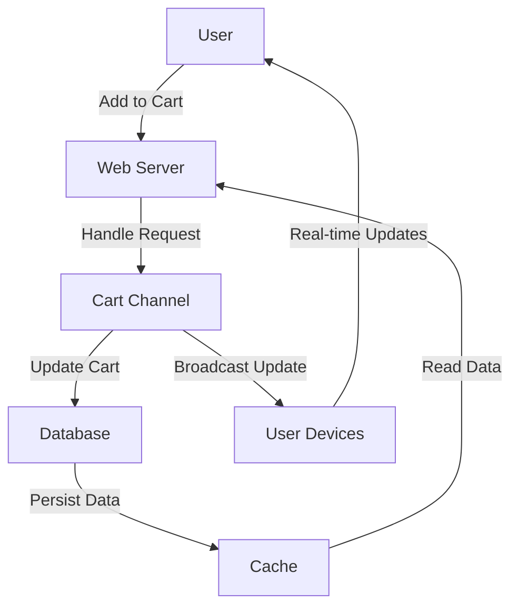

## 30.14.2. High-Performance Shopping Carts

In the world of e-commerce, the shopping cart is a critical component that directly impacts the user experience and conversion rates. A high-performance shopping cart must be fast, responsive, and capable of handling a large number of concurrent users without compromising on functionality. In this section, we will explore how Elixir, with its concurrent and fault-tolerant nature, can be used to build robust shopping cart systems that meet these demands. We'll cover strategies for minimizing latency, managing state, ensuring scalability, personalizing user experiences, testing, optimizing performance, and maintaining resilience.

### Fast and Responsive User Experience

A fast and responsive shopping cart is essential for keeping users engaged and reducing cart abandonment rates. Here are some strategies to achieve this:

#### Minimizing Latency in Cart Operations

1. **Efficient Database Queries**: Optimize database queries to ensure they are fast and efficient. Use indexes, query caching, and avoid N+1 query problems. Elixir's Ecto library can help in writing efficient queries.

2. **Caching**: Implement caching strategies to reduce the load on the database. Use in-memory caches like ETS (Erlang Term Storage) or distributed caches like Redis to store frequently accessed data.

3. **Phoenix Channels**: Utilize Phoenix Channels to provide real-time cart updates. This allows for instant synchronization of cart data across multiple devices and users.

```elixir
defmodule MyAppWeb.CartChannel do
  use Phoenix.Channel

  def join("cart:" <> cart_id, _message, socket) do
    {:ok, socket}
  end

  def handle_in("add_item", %{"item_id" => item_id}, socket) do
    # Add item to cart logic here
    broadcast!(socket, "cart_updated", %{item_id: item_id})
    {:noreply, socket}
  end
end
```

### State Management Strategies

Effective state management is crucial for maintaining data consistency and integrity in shopping cart operations.

#### Server-Side vs. Client-Side Storage

- **Server-Side Sessions**: Store cart data on the server, which ensures data consistency and security. This approach is suitable for applications where security is a priority.

- **Client-Side Storage**: Use client-side storage like cookies or local storage for temporary cart data. This can reduce server load but may have security implications.

- **Hybrid Approach**: Combine both server-side and client-side storage to balance performance and security.

#### Ensuring Data Consistency

- Use transactions to ensure atomicity in cart operations.
- Implement optimistic locking to handle concurrent updates to cart data.

### Scalability

Scalability is essential for handling high traffic volumes, especially during peak shopping seasons.

#### Load Balancing

- Distribute traffic across multiple nodes using load balancers. This helps in managing high traffic and ensures the application remains responsive.

#### Distributed Caching

- Use distributed caches like Redis to manage session data across multiple nodes. This ensures that cart data is consistent and available even if a node fails.

### Personalization

Personalization enhances the shopping experience by tailoring it to individual user preferences.

#### Recommendation Engines

- Implement recommendation engines that use user data and real-time analytics to suggest products. This can be achieved using machine learning models or collaborative filtering techniques.

### Testing and Optimization

Continuous testing and optimization are necessary to maintain high performance.

#### A/B Testing

- Conduct A/B testing to evaluate different cart workflows and UI designs. This helps in identifying the most effective design for user engagement.

#### Performance Monitoring

- Monitor performance metrics such as response times, error rates, and system load to identify and address bottlenecks.

### Resilience and Fault Tolerance

Designing systems to handle failures gracefully is critical for maintaining a seamless user experience.

#### Handling Failures

- Implement retries and fallback mechanisms to handle service outages. This ensures that users can continue shopping even if some services are temporarily unavailable.

#### Fault-Tolerant Design

- Use Elixir's OTP (Open Telecom Platform) to build fault-tolerant systems. Supervisors can be used to restart failed processes automatically.

```elixir
defmodule MyApp.CartSupervisor do
  use Supervisor

  def start_link(init_arg) do
    Supervisor.start_link(__MODULE__, init_arg, name: __MODULE__)
  end

  def init(_init_arg) do
    children = [
      {MyApp.CartServer, []}
    ]

    Supervisor.init(children, strategy: :one_for_one)
  end
end
```

### Visualizing the Architecture

To better understand the architecture of a high-performance shopping cart, let's visualize the components and their interactions.


```mermaid
graph TD;
    A[User] -->|Add to Cart| B[Web Server];
    B -->|Handle Request| C[Cart Channel];
    C -->|Update Cart| D[Database];
    C -->|Broadcast Update| E[User Devices];
    D -->|Persist Data| F[Cache];
    E -->|Real-time Updates| A;
    F -->|Read Data| B;
```

**Diagram Description**: This diagram illustrates the flow of a shopping cart operation. Users interact with the web server, which handles requests and communicates with the cart channel. The cart channel updates the database and broadcasts updates to user devices for real-time synchronization. The cache is used to read and persist data efficiently.

### Try It Yourself

Experiment with the code examples provided by:

- Modifying the `handle_in` function in the `CartChannel` to include additional cart operations like removing items or updating quantities.
- Implementing a simple caching mechanism using ETS or Redis to store cart data temporarily.
- Adding error handling and retry logic to the `CartSupervisor` to improve fault tolerance.

### Key Takeaways

- A high-performance shopping cart requires efficient database queries, caching, and real-time updates.
- State management can be handled through server-side, client-side, or hybrid approaches.
- Scalability is achieved through load balancing and distributed caching.
- Personalization enhances user experience through recommendation engines.
- Continuous testing and optimization help maintain performance.
- Resilience is ensured through fault-tolerant design and error handling.

### Embrace the Journey

Building a high-performance shopping cart is a journey that involves continuous learning and improvement. As you implement these strategies, remember to keep experimenting, stay curious, and enjoy the process of creating seamless shopping experiences for users.

## Quiz Time!



### What is a key benefit of using Phoenix Channels in shopping cart applications?

- [x] Real-time cart updates across devices
- [ ] Improved database indexing
- [ ] Enhanced security for user data
- [ ] Reduced server load

> **Explanation:** Phoenix Channels allow for real-time updates, ensuring that changes to the cart are instantly reflected across all user devices.

### Which storage approach combines both server-side and client-side storage?

- [ ] Server-Side Sessions
- [ ] Client-Side Storage
- [x] Hybrid Approach
- [ ] Distributed Storage

> **Explanation:** A hybrid approach uses both server-side and client-side storage to balance performance and security.

### What is the primary purpose of using distributed caches like Redis in shopping cart applications?

- [ ] To store user credentials
- [x] To manage session data across nodes
- [ ] To enhance UI design
- [ ] To perform complex calculations

> **Explanation:** Distributed caches like Redis are used to manage session data across multiple nodes, ensuring data consistency and availability.

### How can recommendation engines enhance the shopping experience?

- [x] By suggesting products based on user data
- [ ] By improving database performance
- [ ] By reducing server costs
- [ ] By increasing page load times

> **Explanation:** Recommendation engines use user data to suggest products, personalizing the shopping experience.

### What is a key strategy for ensuring data consistency in cart operations?

- [ ] Using client-side storage
- [ ] Implementing caching
- [x] Using transactions
- [ ] Reducing server load

> **Explanation:** Transactions ensure atomicity in cart operations, maintaining data consistency.

### Which Elixir feature is used to build fault-tolerant systems?

- [ ] Ecto
- [x] OTP
- [ ] Phoenix Channels
- [ ] ETS

> **Explanation:** OTP (Open Telecom Platform) provides tools for building fault-tolerant systems, such as supervisors for process management.

### What is the purpose of A/B testing in shopping cart applications?

- [ ] To reduce server load
- [ ] To improve database queries
- [x] To evaluate different workflows and designs
- [ ] To enhance security

> **Explanation:** A/B testing helps evaluate different cart workflows and UI designs to identify the most effective options for user engagement.

### What is a common method for handling service outages in shopping cart applications?

- [x] Implementing retries and fallback mechanisms
- [ ] Increasing server capacity
- [ ] Using client-side storage
- [ ] Enhancing UI design

> **Explanation:** Implementing retries and fallback mechanisms ensures that users can continue shopping even during service outages.

### Which strategy is essential for handling high traffic volumes in shopping cart applications?

- [ ] Using client-side storage
- [ ] Enhancing UI design
- [x] Load balancing
- [ ] Reducing server costs

> **Explanation:** Load balancing distributes traffic across multiple nodes, ensuring the application remains responsive during high traffic periods.

### True or False: Personalization in shopping carts is primarily about improving database performance.

- [ ] True
- [x] False

> **Explanation:** Personalization focuses on tailoring the shopping experience to individual user preferences, not on improving database performance.


