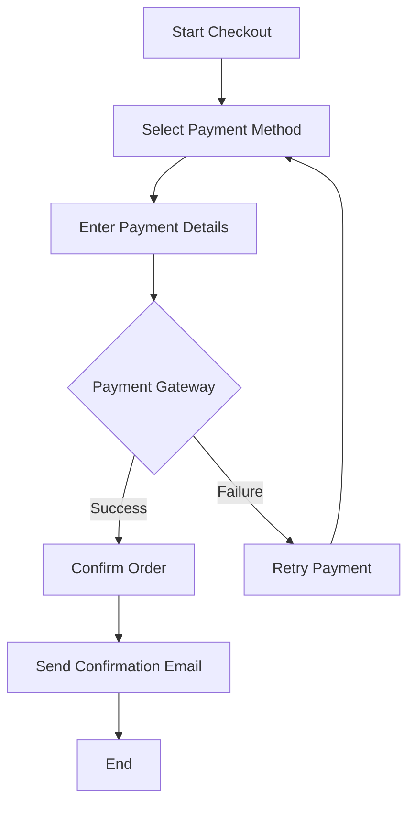

## 30.14.3. Payment Processing and Security

In the realm of e-commerce, payment processing and security are paramount. This section delves into the intricacies of integrating payment systems within Elixir applications, ensuring compliance with industry standards, and implementing robust security measures. We will explore how to connect to popular payment gateways, maintain PCI DSS compliance, handle secure transactions, prevent fraud, manage financial transactions post-purchase, and enhance the user experience during checkout.

### Integration with Payment Gateways

Integrating with payment gateways is a critical step in enabling e-commerce transactions. Elixir, with its robust concurrency model and fault-tolerance, is well-suited for handling the complexities of payment processing.

#### Connecting to Services like Stripe, PayPal, and Braintree

To connect to payment gateways such as Stripe, PayPal, and Braintree, you need to utilize their APIs. These services provide comprehensive documentation and SDKs to facilitate integration.

**Example: Integrating Stripe with Elixir**

```elixir
defmodule MyApp.Payment do
  @moduledoc """
  Module for handling payment processing with Stripe.
  """

  @stripe_api_key System.get_env("STRIPE_API_KEY")

  def charge_customer(amount, currency, customer_id) do
    case Stripe.Charges.create(%{
      amount: amount,
      currency: currency,
      customer: customer_id
    }, @stripe_api_key) do
      {:ok, charge} -> {:ok, charge}
      {:error, error} -> {:error, error}
    end
  end
end
```

In this example, we define a module `MyApp.Payment` that uses the Stripe API to charge a customer. The `charge_customer/3` function takes the amount, currency, and customer ID as parameters and returns a tuple indicating success or failure.

**Try It Yourself:**

- Modify the code to handle different currencies.
- Implement a function to refund a charge using the Stripe API.

#### Handling Various Payment Methods

Modern e-commerce platforms must support a variety of payment methods, including credit cards, digital wallets, and buy-now-pay-later options. This requires a flexible architecture that can accommodate different payment providers and methods.

**Example: Supporting Multiple Payment Methods**

```elixir
defmodule MyApp.PaymentGateway do
  @moduledoc """
  Module for handling multiple payment methods.
  """

  def process_payment(:credit_card, params) do
    # Logic for processing credit card payments
  end

  def process_payment(:paypal, params) do
    # Logic for processing PayPal payments
  end

  def process_payment(:digital_wallet, params) do
    # Logic for processing digital wallet payments
  end
end
```

In this example, the `MyApp.PaymentGateway` module defines a `process_payment/2` function that handles different payment methods based on the first argument.

### Compliance with Payment Card Industry Data Security Standard (PCI DSS)

Compliance with PCI DSS is crucial for any business handling payment data. The standard outlines security measures to protect cardholder data.

#### Understanding PCI DSS Compliance Levels

PCI DSS compliance is divided into levels based on transaction volume. Understanding these levels helps determine the necessary compliance requirements.

- **Level 1:** Over 6 million transactions annually.
- **Level 2:** 1 to 6 million transactions annually.
- **Level 3:** 20,000 to 1 million transactions annually.
- **Level 4:** Fewer than 20,000 transactions annually.

#### Strategies to Reduce PCI Scope

Reducing PCI scope can simplify compliance efforts. Strategies include:

- **Tokenization:** Replace sensitive card data with a token that can be used in place of the actual data.
- **Hosted Payment Pages:** Use third-party hosted payment pages to handle transactions, keeping sensitive data off your servers.

**Example: Implementing Tokenization**

```elixir
defmodule MyApp.Tokenization do
  @moduledoc """
  Module for handling tokenization of payment data.
  """

  def tokenize_card(card_data) do
    # Logic to send card data to a tokenization service
    # and receive a token in return
  end
end
```

### Secure Transaction Handling

Ensuring secure transactions involves implementing HTTPS, strict transport security, and proper error handling.

#### Implementing HTTPS and Strict Transport Security

HTTPS encrypts data in transit, protecting it from interception. Strict Transport Security (HSTS) ensures that browsers only connect to your server over HTTPS.

**Example: Enforcing HTTPS in Phoenix**

```elixir
# In your endpoint configuration
config :my_app, MyAppWeb.Endpoint,
  https: [
    port: 443,
    cipher_suite: :strong,
    keyfile: System.get_env("SSL_KEY_PATH"),
    certfile: System.get_env("SSL_CERT_PATH")
  ]
```

#### Proper Error Handling and Logging

Error handling should ensure that sensitive information is not exposed in logs or error messages.

**Example: Secure Error Handling**

```elixir
defmodule MyApp.ErrorHandler do
  @moduledoc """
  Module for handling errors securely.
  """

  def handle_error(error) do
    Logger.error("An error occurred: #{inspect(error)}")
    {:error, "An unexpected error occurred. Please try again later."}
  end
end
```

### Fraud Prevention Mechanisms

Fraud prevention is essential to protect both the business and its customers. This can involve using third-party services or building custom solutions.

#### Using Third-Party Services

Services like Sift, Riskified, and Stripe Radar offer fraud detection and prevention tools.

#### Building Custom Solutions

Custom solutions can analyze transaction patterns and user behavior to assess risk.

**Example: Basic Fraud Detection**

```elixir
defmodule MyApp.FraudDetection do
  @moduledoc """
  Module for detecting fraudulent activities.
  """

  def detect_fraud(transaction) do
    # Analyze transaction patterns and user behavior
    # Return :ok or {:error, reason}
  end
end
```

### Refunds, Chargebacks, and Disputes

Managing financial transactions after a purchase is crucial for customer satisfaction and compliance.

#### Efficient Management of Refunds and Chargebacks

Implement systems to handle refunds and chargebacks efficiently, keeping accurate records for disputes.

**Example: Handling Refunds**

```elixir
defmodule MyApp.Refunds do
  @moduledoc """
  Module for handling refunds.
  """

  def process_refund(transaction_id) do
    # Logic to process a refund for the given transaction ID
  end
end
```

### Global Commerce Considerations

Supporting international commerce involves handling multiple currencies, regional regulations, and taxes.

#### Supporting International Currencies

Implement currency conversion and support for multiple currencies.

**Example: Currency Conversion**

```elixir
defmodule MyApp.CurrencyConverter do
  @moduledoc """
  Module for converting currencies.
  """

  def convert(amount, from_currency, to_currency) do
    # Logic to convert amount from one currency to another
  end
end
```

#### Complying with Regional Regulations

Ensure compliance with regional regulations, such as GDPR in Europe.

### User Experience in Checkout

A streamlined checkout process reduces cart abandonment and enhances user satisfaction.

#### Streamlining the Payment Process

Implement features like saved payment methods and one-click purchasing to enhance the user experience.

**Example: One-Click Purchasing**

```elixir
defmodule MyApp.OneClickPurchase do
  @moduledoc """
  Module for handling one-click purchases.
  """

  def purchase(user_id, product_id) do
    # Logic to process a one-click purchase for the user
  end
end
```

### Visualizing Payment Processing Workflow

To better understand the payment processing workflow, let's visualize it using a flowchart.



**Diagram Description:** This flowchart illustrates the payment processing workflow, from starting the checkout process to confirming the order and sending a confirmation email.

### Knowledge Check

- What are the key components of integrating a payment gateway in Elixir?
- How can tokenization help reduce PCI DSS compliance scope?
- What are some strategies for preventing fraud in e-commerce transactions?
- How can you enhance the user experience during the checkout process?

### Embrace the Journey

Remember, mastering payment processing and security in Elixir is a journey. As you continue to explore and implement these concepts, you'll build more secure and efficient e-commerce platforms. Keep experimenting, stay curious, and enjoy the journey!

## Quiz: Payment Processing and Security



### What is the primary benefit of using tokenization in payment processing?

- [x] Reduces PCI DSS compliance scope
- [ ] Increases transaction speed
- [ ] Enhances user experience
- [ ] Simplifies currency conversion

> **Explanation:** Tokenization replaces sensitive card data with a token, reducing the PCI DSS compliance scope.

### Which of the following is a common payment gateway used in e-commerce?

- [x] Stripe
- [ ] MongoDB
- [ ] Redis
- [ ] Docker

> **Explanation:** Stripe is a popular payment gateway used for processing online payments.

### What is the purpose of HTTPS in secure transaction handling?

- [x] Encrypts data in transit
- [ ] Increases server speed
- [ ] Simplifies code deployment
- [ ] Enhances user interface

> **Explanation:** HTTPS encrypts data in transit, protecting it from interception.

### What is a key strategy for preventing fraud in e-commerce?

- [x] Analyzing transaction patterns
- [ ] Increasing server bandwidth
- [ ] Reducing product prices
- [ ] Simplifying checkout forms

> **Explanation:** Analyzing transaction patterns helps detect and prevent fraudulent activities.

### How can you enhance the user experience during checkout?

- [x] Implementing one-click purchasing
- [ ] Increasing checkout steps
- [x] Saving payment methods
- [ ] Removing product descriptions

> **Explanation:** Implementing one-click purchasing and saving payment methods streamline the checkout process.

### What is a common method for handling refunds in e-commerce?

- [x] Processing refunds through the payment gateway
- [ ] Sending cash by mail
- [ ] Offering store credit only
- [ ] Ignoring refund requests

> **Explanation:** Refunds are typically processed through the payment gateway used for the original transaction.

### Which of the following is a consideration for global commerce?

- [x] Supporting international currencies
- [ ] Increasing local taxes
- [x] Complying with regional regulations
- [ ] Reducing product variety

> **Explanation:** Supporting international currencies and complying with regional regulations are key considerations for global commerce.

### What is the role of strict transport security (HSTS) in secure transactions?

- [x] Ensures browsers connect over HTTPS
- [ ] Increases server storage
- [ ] Simplifies code updates
- [ ] Enhances graphic design

> **Explanation:** HSTS ensures that browsers only connect to your server over HTTPS, enhancing security.

### How can you handle multiple payment methods in Elixir?

- [x] Using a flexible architecture
- [ ] Hardcoding each method
- [ ] Limiting to one method
- [ ] Ignoring user preferences

> **Explanation:** A flexible architecture allows for the integration of multiple payment methods.

### True or False: PCI DSS compliance is optional for e-commerce platforms.

- [ ] True
- [x] False

> **Explanation:** PCI DSS compliance is mandatory for any business handling payment data.


