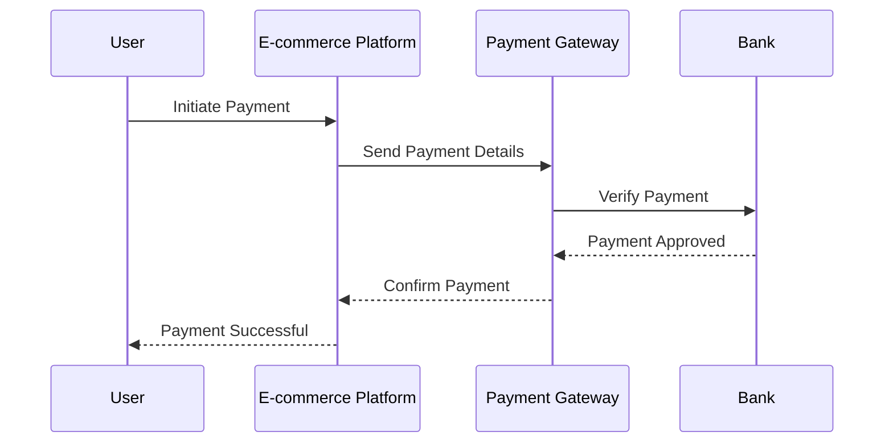

## 30.14.3. Payment Processing and Security

In the ever-evolving world of e-commerce, payment processing and security are paramount. As an expert software engineer or architect, mastering these aspects in Elixir can set you apart in building robust, secure, and efficient e-commerce platforms. This section delves into the intricacies of integrating with payment gateways, ensuring compliance with the Payment Card Industry Data Security Standard (PCI DSS), handling secure transactions, implementing fraud prevention mechanisms, and addressing global commerce considerations. Let's explore these topics in detail.

### Integration with Payment Gateways

Integrating with payment gateways like Stripe, PayPal, and Braintree is a fundamental aspect of e-commerce platforms. These services provide APIs that allow you to handle various payment methods, including credit cards, digital wallets, and buy-now-pay-later options.

#### Connecting to Payment Gateways

To connect to a payment gateway, you typically need to:

1. **Register and Obtain API Credentials**: Sign up with the payment gateway and obtain the necessary API keys or tokens for authentication.
2. **Understand API Documentation**: Familiarize yourself with the gateway's API documentation to understand the endpoints, request/response formats, and authentication mechanisms.
3. **Implement API Calls**: Use Elixir's HTTP client libraries, such as `HTTPoison` or `Tesla`, to make API calls for processing payments.

Here's an example of integrating with Stripe using `Tesla`:

```elixir
defmodule MyApp.StripeClient do
  use Tesla

  plug Tesla.Middleware.BaseUrl, "https://api.stripe.com"
  plug Tesla.Middleware.Headers, [{"Authorization", "Bearer #{System.get_env("STRIPE_SECRET_KEY")}"}]
  plug Tesla.Middleware.JSON

  def create_charge(amount, currency, source, description) do
    post("/v1/charges", %{
      amount: amount,
      currency: currency,
      source: source,
      description: description
    })
  end
end

# Usage
{:ok, response} = MyApp.StripeClient.create_charge(5000, "usd", "tok_visa", "Sample Charge")
```

**Try It Yourself**: Modify the example to handle different currencies or add additional metadata to the charge request.

#### Handling Various Payment Methods

Modern e-commerce platforms must support a variety of payment methods to cater to diverse customer preferences. This includes:

- **Credit and Debit Cards**: The most common payment method, requiring secure handling of card information.
- **Digital Wallets**: Services like Apple Pay, Google Pay, and PayPal offer convenient payment options for users.
- **Buy-Now-Pay-Later**: Options like Klarna or Afterpay allow customers to pay in installments.

**Key Consideration**: Ensure that your platform's payment flow is flexible enough to accommodate new payment methods as they become popular.

### Compliance with Payment Card Industry Data Security Standard (PCI DSS)

PCI DSS compliance is crucial for any platform handling payment data. It ensures that cardholder information is processed, stored, and transmitted securely.

#### Understanding PCI DSS Compliance Levels

PCI DSS has different levels of compliance based on transaction volume and the nature of your business. It's essential to understand which level applies to your platform:

- **Level 1**: Merchants processing over 6 million transactions annually.
- **Level 2**: Merchants processing 1 to 6 million transactions annually.
- **Level 3**: Merchants processing 20,000 to 1 million transactions annually.
- **Level 4**: Merchants processing fewer than 20,000 transactions annually.

**Strategy**: Aim to reduce your PCI DSS scope by leveraging tokenization and hosted payment pages, which shift the burden of compliance to the payment gateway.

#### Strategies to Reduce PCI Scope

- **Tokenization**: Replace card details with a token that can be used for future transactions without storing sensitive data.
- **Hosted Payment Pages**: Redirect users to a secure page hosted by the payment gateway for entering payment details.

### Secure Transaction Handling

Secure transaction handling is vital to protect sensitive payment information and maintain customer trust.

#### Implementing HTTPS and Strict Transport Security

Ensure that all data transmission between your platform and users is encrypted using HTTPS. Implement HTTP Strict Transport Security (HSTS) to enforce secure connections.

```elixir
# In your Phoenix endpoint configuration
config :my_app, MyAppWeb.Endpoint,
  url: [host: "example.com", scheme: "https"],
  force_ssl: [hsts: true]
```

**Key Point**: Regularly update your SSL/TLS certificates and configure your server to use strong ciphers.

#### Error Handling and Logging

Implement robust error handling to gracefully manage transaction failures without exposing sensitive information. Ensure that logs do not contain any cardholder data.

```elixir
defmodule MyApp.PaymentProcessor do
  def process_payment(params) do
    case MyApp.StripeClient.create_charge(params) do
      {:ok, response} -> {:success, response}
      {:error, reason} -> handle_error(reason)
    end
  end

  defp handle_error(reason) do
    Logger.error("Payment processing failed: #{inspect(reason)}")
    {:error, "Payment could not be processed"}
  end
end
```

### Fraud Prevention Mechanisms

Fraud prevention is critical in safeguarding your platform from fraudulent activities and financial losses.

#### Using Third-Party Services

Consider integrating third-party services like Sift or Riskified, which offer advanced fraud detection algorithms and machine learning models.

#### Building Custom Solutions

Analyze transaction patterns and user behavior to build custom fraud detection solutions. Implement risk assessment strategies to flag suspicious activities.

```elixir
defmodule MyApp.FraudDetection do
  def assess_risk(transaction) do
    # Analyze transaction patterns and user behavior
    if suspicious_activity?(transaction) do
      {:flagged, "Potential fraud detected"}
    else
      {:clear, "Transaction approved"}
    end
  end

  defp suspicious_activity?(transaction) do
    # Custom logic to detect fraud
    transaction.amount > 10000 && transaction.location != "expected_location"
  end
end
```

### Refunds, Chargebacks, and Disputes

Efficiently managing refunds, chargebacks, and disputes is crucial for maintaining customer satisfaction and minimizing financial losses.

#### Managing After-Purchase Transactions

Implement processes to handle refunds and chargebacks promptly. Keep accurate records to resolve disputes with customers and payment providers.

```elixir
defmodule MyApp.RefundProcessor do
  def process_refund(transaction_id) do
    # Logic to initiate a refund
    {:ok, "Refund processed for transaction #{transaction_id}"}
  end
end
```

**Key Consideration**: Maintain transparency with customers about refund policies and timelines.

### Global Commerce Considerations

Supporting international commerce involves handling multiple currencies, complying with regional regulations, and calculating taxes and duties.

#### Supporting International Currencies

Use payment gateways that support multi-currency transactions. Implement currency conversion features to display prices in the user's local currency.

```elixir
defmodule MyApp.CurrencyConverter do
  def convert(amount, from_currency, to_currency) do
    # Logic to convert currency using exchange rates
    {:ok, converted_amount}
  end
end
```

#### Complying with Regional Regulations

Stay informed about regional regulations affecting e-commerce, such as GDPR in Europe or CCPA in California. Ensure your platform complies with these laws.

### User Experience in Checkout

A seamless checkout experience is vital to reduce cart abandonment and increase conversion rates.

#### Streamlining the Payment Process

Simplify the checkout process by minimizing the number of steps required to complete a purchase. Offer features like saved payment methods and one-click purchasing.

```elixir
defmodule MyApp.Checkout do
  def process_order(order) do
    # Logic to streamline checkout
    {:ok, "Order processed successfully"}
  end
end
```

**Key Point**: Continuously test and optimize the checkout flow to enhance user experience.

### Visualizing Payment Processing Workflow

To better understand the flow of payment processing in an e-commerce platform, let's visualize the workflow using a sequence diagram:


```mermaid
sequenceDiagram
    participant User
    participant E-commerce Platform
    participant Payment Gateway
    participant Bank

    User->>E-commerce Platform: Initiate Payment
    E-commerce Platform->>Payment Gateway: Send Payment Details
    Payment Gateway->>Bank: Verify Payment
    Bank-->>Payment Gateway: Payment Approved
    Payment Gateway-->>E-commerce Platform: Confirm Payment
    E-commerce Platform-->>User: Payment Successful
```

**Diagram Description**: This sequence diagram illustrates the interaction between the user, e-commerce platform, payment gateway, and bank during the payment process.

### References and Further Reading

- [Stripe API Documentation](https://stripe.com/docs/api)
- [PayPal Developer Documentation](https://developer.paypal.com/docs/api/overview/)
- [PCI DSS Quick Reference Guide](https://www.pcisecuritystandards.org/documents/PCI_DSS-QRG-v3_2_1.pdf)
- [OWASP Secure Coding Practices](https://owasp.org/www-project-secure-coding-practices-quick-reference-guide/)

### Knowledge Check

- **Question**: What are the benefits of using tokenization in payment processing?
- **Exercise**: Implement a basic fraud detection function that flags transactions exceeding a certain amount.

### Embrace the Journey

Remember, mastering payment processing and security in Elixir is a journey. As you progress, you'll build more secure and efficient e-commerce platforms. Keep experimenting, stay curious, and enjoy the journey!

## Quiz Time!



### What is the primary benefit of using hosted payment pages?

- [x] Reduces PCI DSS compliance scope
- [ ] Increases transaction speed
- [ ] Provides better user analytics
- [ ] Lowers transaction fees

> **Explanation:** Hosted payment pages shift the burden of PCI DSS compliance to the payment gateway, reducing the scope for the merchant.

### Which Elixir library is commonly used for making HTTP requests to payment gateways?

- [x] Tesla
- [ ] Ecto
- [ ] Phoenix
- [ ] Logger

> **Explanation:** Tesla is a popular HTTP client library in Elixir used for making API requests.

### How can you ensure secure data transmission in your e-commerce platform?

- [x] Implement HTTPS and HSTS
- [ ] Use plain HTTP
- [ ] Store passwords in plain text
- [ ] Disable SSL certificates

> **Explanation:** Implementing HTTPS and HSTS ensures that data is transmitted securely over the network.

### What is a key strategy to reduce PCI DSS compliance scope?

- [x] Use tokenization
- [ ] Store credit card information locally
- [ ] Increase transaction volume
- [ ] Use plain text storage

> **Explanation:** Tokenization replaces sensitive card information with a token, reducing the need to store card data.

### Which of the following is a common fraud prevention mechanism?

- [x] Analyzing transaction patterns
- [ ] Ignoring user behavior
- [ ] Disabling security features
- [ ] Using weak passwords

> **Explanation:** Analyzing transaction patterns helps in identifying suspicious activities and preventing fraud.

### What should you do to handle refunds efficiently?

- [x] Implement a clear refund process
- [ ] Ignore refund requests
- [ ] Delay refund processing
- [ ] Store refund data insecurely

> **Explanation:** Implementing a clear refund process ensures customer satisfaction and efficient handling of refunds.

### How can you support international commerce in your platform?

- [x] Support multi-currency transactions
- [ ] Only accept local currency
- [ ] Ignore regional regulations
- [ ] Disable currency conversion

> **Explanation:** Supporting multi-currency transactions allows customers to pay in their local currency, enhancing user experience.

### What is the purpose of using third-party fraud detection services?

- [x] To detect and prevent fraudulent activities
- [ ] To increase transaction fees
- [ ] To slow down payment processing
- [ ] To reduce user engagement

> **Explanation:** Third-party fraud detection services use advanced algorithms to identify and prevent fraudulent transactions.

### Which of the following is a best practice for logging in payment processing?

- [x] Avoid logging sensitive information
- [ ] Log all cardholder data
- [ ] Store logs in plain text
- [ ] Share logs publicly

> **Explanation:** Avoid logging sensitive information to protect cardholder data and comply with security standards.

### True or False: PCI DSS compliance is optional for e-commerce platforms.

- [ ] True
- [x] False

> **Explanation:** PCI DSS compliance is mandatory for any platform handling payment data to ensure secure processing.


