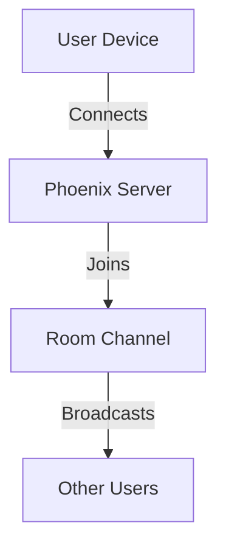
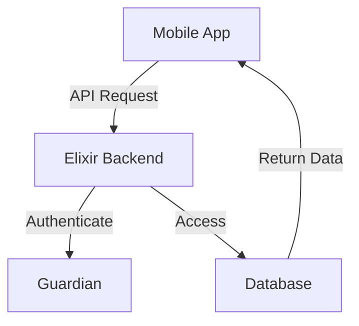
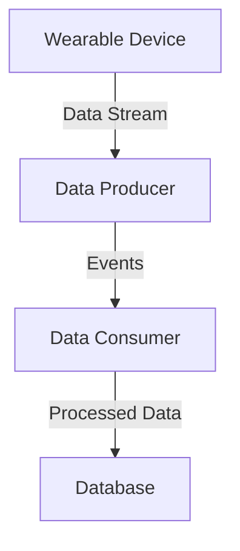

## 30.15. Case Studies of Mobile Apps Powered by Elixir

In the rapidly evolving landscape of mobile app development, Elixir has emerged as a powerful tool for building robust, scalable, and efficient backend systems. This section delves into real-world case studies of mobile apps powered by Elixir, highlighting the design patterns and architectural decisions that make them successful. We will explore how Elixir's features are leveraged to provide robust backend APIs, real-time data capabilities, and optimization strategies for mobile applications.

### 1. Introduction to Elixir in Mobile App Development

Elixir, a functional programming language built on the Erlang VM, is renowned for its concurrency, fault tolerance, and scalability. These features make it an excellent choice for mobile app backends, where real-time data processing, high availability, and efficient resource utilization are critical.

#### 1.1. Why Choose Elixir for Mobile Backends?

- **Concurrency and Scalability**: Elixir's lightweight processes and the Actor model enable handling thousands of concurrent connections, essential for mobile apps with high user engagement.
- **Fault Tolerance**: The "Let It Crash" philosophy and OTP (Open Telecom Platform) provide robust error handling and recovery mechanisms.
- **Real-Time Capabilities**: Tools like Phoenix Channels facilitate real-time communication, crucial for features like live updates and push notifications.

### 2. Case Study 1: Real-Time Messaging App

#### 2.1. Overview

Our first case study examines a real-time messaging app that leverages Elixir's strengths to deliver seamless communication between users. The app's backend is built using the Phoenix framework, which is known for its real-time capabilities.

#### 2.2. Design Patterns and Architecture

- **Backend APIs**: The app uses RESTful APIs for user authentication and data retrieval, while Phoenix Channels handle real-time messaging.
- **Real-Time Data**: Phoenix Channels enable instant message delivery and read receipts.
- **Optimization**: The app employs caching strategies to reduce latency and improve performance.

#### 2.3. Code Example: Real-Time Messaging with Phoenix Channels

```elixir
defmodule ChatAppWeb.UserSocket do
  use Phoenix.Socket

  channel "room:*", ChatAppWeb.RoomChannel

  def connect(%{"token" => token}, socket, _connect_info) do
    case verify_user(token) do
      {:ok, user_id} ->
        {:ok, assign(socket, :user_id, user_id)}
      {:error, _reason} ->
        :error
    end
  end

  def id(_socket), do: nil
end

defmodule ChatAppWeb.RoomChannel do
  use Phoenix.Channel

  def join("room:" <> room_id, _params, socket) do
    {:ok, assign(socket, :room_id, room_id)}
  end

  def handle_in("new_message", %{"body" => body}, socket) do
    broadcast!(socket, "new_message", %{body: body, user_id: socket.assigns.user_id})
    {:noreply, socket}
  end
end
```

**Explanation**: This code defines a Phoenix Channel for real-time messaging. The `UserSocket` module handles user connections, while the `RoomChannel` module manages message broadcasting within a chat room.

#### 2.4. Visualizing the Architecture



**Diagram Description**: This flowchart illustrates how user devices connect to the Phoenix server, join a room channel, and broadcast messages to other users.

### 3. Case Study 2: Mobile Banking Application

#### 3.1. Overview

The second case study focuses on a mobile banking application that requires high security, real-time transaction updates, and efficient data handling. Elixir's capabilities are harnessed to meet these demands.

#### 3.2. Design Patterns and Architecture

- **Backend APIs**: Secure RESTful APIs are used for account management and transaction processing.
- **Real-Time Data**: Phoenix Channels provide real-time transaction notifications and balance updates.
- **Optimization**: The app uses ETS (Erlang Term Storage) for caching frequently accessed data, reducing database load.

#### 3.3. Code Example: Secure API with Guardian

```elixir
defmodule BankingAppWeb.AuthPipeline do
  use Guardian.Plug.Pipeline, otp_app: :banking_app,
    module: BankingApp.Guardian,
    error_handler: BankingAppWeb.AuthErrorHandler

  plug Guardian.Plug.VerifyHeader, realm: "Bearer"
  plug Guardian.Plug.EnsureAuthenticated
  plug Guardian.Plug.LoadResource
end

defmodule BankingAppWeb.TransactionController do
  use BankingAppWeb, :controller

  plug BankingAppWeb.AuthPipeline

  def create(conn, %{"transaction" => transaction_params}) do
    with {:ok, transaction} <- BankingApp.create_transaction(transaction_params) do
      conn
      |> put_status(:created)
      |> render("show.json", transaction: transaction)
    end
  end
end
```

**Explanation**: This code snippet demonstrates how to secure API endpoints using Guardian, an authentication library for Elixir. The `AuthPipeline` module ensures that requests are authenticated before accessing the `TransactionController`.

#### 3.4. Visualizing the Architecture



**Diagram Description**: This diagram shows the flow of an API request from the mobile app to the Elixir backend, where it is authenticated and processed before accessing the database.

### 4. Case Study 3: Fitness Tracking App

#### 4.1. Overview

The third case study explores a fitness tracking app that collects and processes real-time data from wearable devices. Elixir's concurrency model is ideal for handling the high volume of data streams.

#### 4.2. Design Patterns and Architecture

- **Backend APIs**: GraphQL APIs are used for flexible data queries and mutations.
- **Real-Time Data**: GenStage is employed to process data streams from wearables in real-time.
- **Optimization**: The app uses Flow for parallel data processing, ensuring efficient resource utilization.

#### 4.3. Code Example: Data Processing with GenStage

```elixir
defmodule FitnessApp.DataProducer do
  use GenStage

  def start_link(initial) do
    GenStage.start_link(__MODULE__, initial, name: __MODULE__)
  end

  def init(initial) do
    {:producer, initial}
  end

  def handle_demand(demand, state) do
    events = fetch_data(state, demand)
    {:noreply, events, state}
  end
end

defmodule FitnessApp.DataConsumer do
  use GenStage

  def start_link() do
    GenStage.start_link(__MODULE__, :ok, name: __MODULE__)
  end

  def init(:ok) do
    {:consumer, :ok}
  end

  def handle_events(events, _from, state) do
    process_data(events)
    {:noreply, [], state}
  end
end
```

**Explanation**: This code defines a GenStage pipeline with a `DataProducer` that generates events and a `DataConsumer` that processes them. This setup is ideal for handling real-time data streams.

#### 4.4. Visualizing the Architecture



**Diagram Description**: This diagram illustrates the flow of data from wearable devices to the Elixir backend, where it is processed and stored in the database.

### 5. Key Takeaways

- **Elixir's Concurrency Model**: Ideal for handling real-time data and high user engagement.
- **Robust Backend APIs**: Secure and scalable APIs are crucial for mobile app success.
- **Optimization Techniques**: Caching, parallel processing, and efficient data handling improve performance.

### 6. Try It Yourself

Experiment with the provided code examples by modifying them to suit different use cases. For instance, try adding new features to the messaging app or optimizing the data processing pipeline in the fitness app.

### 7. Further Reading

- [Phoenix Framework Documentation](https://hexdocs.pm/phoenix/overview.html)
- [Guardian Authentication Library](https://hexdocs.pm/guardian/readme.html)
- [GenStage and Flow](https://hexdocs.pm/gen_stage/GenStage.html)

## Quiz: Case Studies of Mobile Apps Powered by Elixir



### Which feature of Elixir makes it ideal for handling real-time data in mobile apps?

- [x] Concurrency model
- [ ] Object-oriented programming
- [ ] Static typing
- [ ] Manual memory management

> **Explanation:** Elixir's concurrency model, based on lightweight processes, is ideal for handling real-time data efficiently.

### What is the primary use of Phoenix Channels in mobile app backends?

- [x] Real-time communication
- [ ] Data storage
- [ ] Authentication
- [ ] Logging

> **Explanation:** Phoenix Channels are used for real-time communication, enabling features like live updates and push notifications.

### Which library is used for authentication in the mobile banking app case study?

- [x] Guardian
- [ ] Devise
- [ ] JWT
- [ ] OAuth

> **Explanation:** Guardian is an authentication library for Elixir, used to secure API endpoints in the mobile banking app.

### What is the purpose of GenStage in the fitness tracking app?

- [x] Data stream processing
- [ ] User authentication
- [ ] UI rendering
- [ ] Database management

> **Explanation:** GenStage is used for processing data streams, making it suitable for handling real-time data from wearable devices.

### Which design pattern is employed for secure API development in the banking app?

- [x] Authentication pipeline
- [ ] Singleton pattern
- [ ] Factory pattern
- [ ] Observer pattern

> **Explanation:** The authentication pipeline pattern is used to secure API endpoints, ensuring only authenticated requests are processed.

### What is the benefit of using ETS in mobile app backends?

- [x] Caching frequently accessed data
- [ ] Real-time communication
- [ ] User interface design
- [ ] Authentication

> **Explanation:** ETS (Erlang Term Storage) is used for caching frequently accessed data, reducing database load and improving performance.

### How does the fitness tracking app handle parallel data processing?

- [x] Using Flow
- [ ] Using Phoenix Channels
- [ ] Using Guardian
- [ ] Using ETS

> **Explanation:** Flow is used for parallel data processing, ensuring efficient resource utilization in the fitness tracking app.

### What is the role of GraphQL in the fitness tracking app?

- [x] Flexible data queries and mutations
- [ ] Real-time communication
- [ ] Authentication
- [ ] Caching

> **Explanation:** GraphQL is used for flexible data queries and mutations, allowing clients to request exactly the data they need.

### Which feature of Elixir enhances fault tolerance in mobile app backends?

- [x] "Let It Crash" philosophy
- [ ] Object-oriented programming
- [ ] Static typing
- [ ] Manual memory management

> **Explanation:** Elixir's "Let It Crash" philosophy enhances fault tolerance by allowing processes to fail and recover gracefully.

### True or False: Elixir is not suitable for building scalable mobile app backends.

- [ ] True
- [x] False

> **Explanation:** False. Elixir is highly suitable for building scalable mobile app backends due to its concurrency model and fault tolerance.



Remember, this is just the beginning. As you progress, you'll build more complex and interactive mobile applications. Keep experimenting, stay curious, and enjoy the journey!
