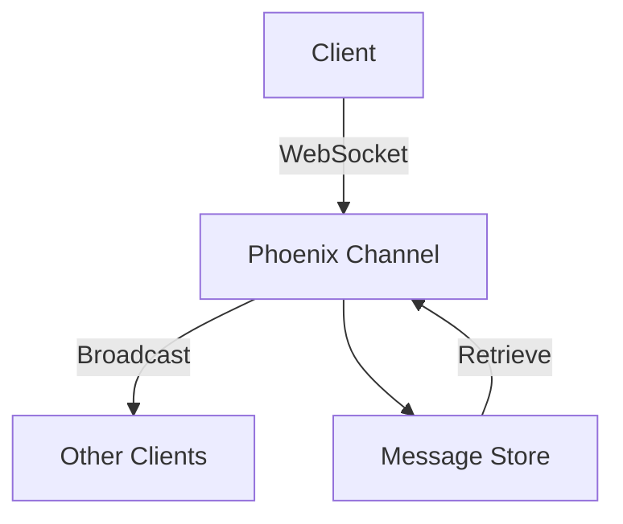
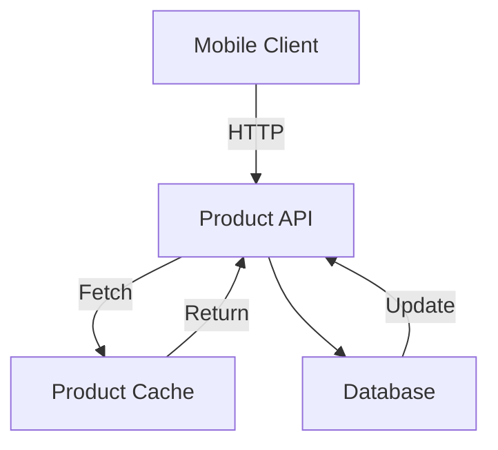
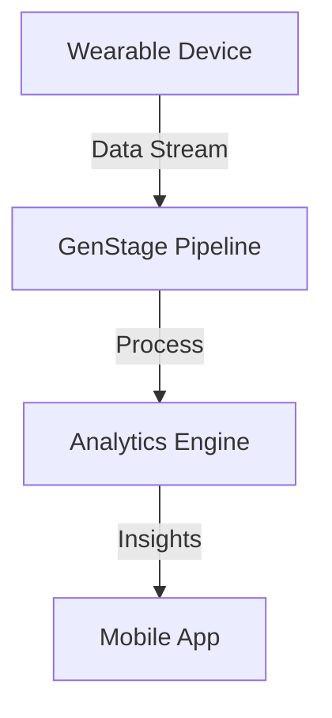

## 30.15. Case Studies of Mobile Apps Powered by Elixir

In this section, we will delve into several case studies that illustrate how Elixir has been utilized to power mobile applications. We will explore the design patterns and architectural decisions that enable robust backend APIs, real-time data handling, and optimization for mobile environments. These case studies will provide insights into the practical application of Elixir in the mobile domain, showcasing its strengths in building scalable and efficient systems.

### Introduction to Elixir in Mobile Development

Elixir, with its functional programming paradigm and robust concurrency model, is well-suited for building backend services that support mobile applications. Its ability to handle numerous concurrent connections makes it an ideal choice for applications that require real-time data updates and push notifications. Additionally, Elixir's fault-tolerant nature ensures high availability, a crucial factor for mobile applications that need to operate seamlessly across various network conditions.

### Case Study 1: Chat Application with Real-Time Updates

#### Overview

Our first case study focuses on a chat application that requires real-time message delivery and user presence tracking. The application leverages Elixir's Phoenix framework to provide a scalable backend that supports thousands of simultaneous users.

#### Architecture

The architecture of the chat application is designed to handle real-time communication efficiently. It employs Phoenix Channels, a feature of the Phoenix framework, to manage WebSocket connections and broadcast messages to connected clients.

```elixir
defmodule ChatWeb.RoomChannel do
  use Phoenix.Channel

  def join("room:" <> room_id, _params, socket) do
    {:ok, assign(socket, :room_id, room_id)}
  end

  def handle_in("new_message", %{"body" => body}, socket) do
    broadcast!(socket, "new_message", %{body: body})
    {:noreply, socket}
  end
end
```

**Key Features:**

- **Real-Time Messaging:** Using Phoenix Channels, messages are broadcast instantly to all participants in a chat room.
- **User Presence Tracking:** Phoenix Presence is used to track users entering and leaving chat rooms, providing real-time updates on user availability.

#### Design Patterns

- **Observer Pattern:** Implemented using Phoenix PubSub to notify clients of new messages.
- **Strategy Pattern:** Different strategies for message delivery based on user status (online/offline).

#### Challenges and Solutions

- **Scalability:** Ensuring the system can handle a large number of concurrent connections was achieved by leveraging Elixir's lightweight processes.
- **Fault Tolerance:** The "Let It Crash" philosophy was embraced, with supervisors restarting failed processes to maintain system stability.

#### Visualizing the Architecture


```mermaid
graph TD;
    A[Client] -->|WebSocket| B[Phoenix Channel]
    B -->|Broadcast| C[Other Clients]
    B --> D[Message Store]
    D -->|Retrieve| B
```

### Case Study 2: E-Commerce Application with Offline Capabilities

#### Overview

The second case study examines an e-commerce application that must provide a seamless shopping experience, even in offline mode. Elixir is used to build a backend that efficiently manages product catalogs, user sessions, and order processing.

#### Architecture

The backend is designed to handle requests from mobile clients, providing data synchronization and caching mechanisms to support offline functionality.

```elixir
defmodule Ecommerce.ProductController do
  use EcommerceWeb, :controller

  def index(conn, _params) do
    products = ProductCache.get_all_products()
    render(conn, "index.json", products: products)
  end
end
```

**Key Features:**

- **Data Synchronization:** Periodic updates ensure the mobile app has the latest product information.
- **Offline Support:** Local caching of product data allows users to browse products without an active internet connection.

#### Design Patterns

- **Repository Pattern:** Used to abstract data access and caching logic.
- **Command Pattern:** Encapsulates order processing logic, allowing for retries in case of network failures.

#### Challenges and Solutions

- **Data Consistency:** Ensuring data consistency between the server and mobile clients was achieved through conflict resolution strategies during synchronization.
- **Performance Optimization:** Efficient use of ETS (Erlang Term Storage) for caching frequently accessed data reduced latency.

#### Visualizing the Architecture


```mermaid
graph TD;
    A[Mobile Client] -->|HTTP| B[Product API]
    B -->|Fetch| C[Product Cache]
    C -->|Return| B
    B --> D[Database]
    D -->|Update| B
```

### Case Study 3: Fitness Tracking Application with Real-Time Analytics

#### Overview

This case study explores a fitness tracking application that provides real-time analytics and personalized workout recommendations. The backend is built using Elixir to process and analyze data streams from wearable devices.

#### Architecture

The system ingests data from various sensors, processes it in real time, and provides actionable insights to users.

```elixir
defmodule Fitness.DataPipeline do
  use GenStage

  def handle_events(events, _from, state) do
    processed_events = Enum.map(events, &process_event/1)
    {:noreply, processed_events, state}
  end

  defp process_event(event) do
    # Analyze event data and generate insights
  end
end
```

**Key Features:**

- **Real-Time Data Processing:** GenStage is used to build a data pipeline that processes incoming sensor data.
- **Personalized Recommendations:** Machine learning models are applied to provide tailored workout suggestions.

#### Design Patterns

- **Pipeline Pattern:** Utilized for processing data streams in stages.
- **Decorator Pattern:** Enhances raw data with additional insights.

#### Challenges and Solutions

- **Data Volume:** Handling large volumes of data was managed by distributing the workload across multiple GenStage processes.
- **Latency:** Real-time processing was optimized by minimizing data transfer and computation time.

#### Visualizing the Architecture


```mermaid
graph TD;
    A[Wearable Device] -->|Data Stream| B[GenStage Pipeline]
    B -->|Process| C[Analytics Engine]
    C -->|Insights| D[Mobile App]
```

### Conclusion

These case studies demonstrate the versatility and power of Elixir in building mobile applications. By leveraging Elixir's strengths in concurrency, fault tolerance, and real-time processing, developers can create robust and scalable backend services that enhance the user experience on mobile platforms.

### Try It Yourself

To further explore these concepts, try modifying the provided code examples to suit different use cases. Experiment with adding new features, such as additional data processing stages or enhanced caching strategies, to see how Elixir's design patterns can be applied in various scenarios.

### Additional Resources

For more information on Elixir and mobile development, consider exploring the following resources:

- [Elixir Official Documentation](https://elixir-lang.org/docs.html)
- [Phoenix Framework Guides](https://hexdocs.pm/phoenix/overview.html)
- [GenStage Documentation](https://hexdocs.pm/gen_stage/GenStage.html)

## Quiz Time!



### What is the primary advantage of using Elixir for mobile backend services?

- [x] Concurrency and fault tolerance
- [ ] Rich user interface capabilities
- [ ] Built-in support for mobile app development
- [ ] Extensive library ecosystem

> **Explanation:** Elixir's concurrency model and fault tolerance make it ideal for handling mobile backend services that require high availability and real-time data processing.

### Which Elixir feature is used for real-time messaging in the chat application case study?

- [x] Phoenix Channels
- [ ] GenStage
- [ ] ETS
- [ ] Ecto

> **Explanation:** Phoenix Channels are used to manage WebSocket connections and broadcast real-time messages to clients.

### What pattern is employed to manage data access and caching in the e-commerce application?

- [x] Repository Pattern
- [ ] Observer Pattern
- [ ] Strategy Pattern
- [ ] Command Pattern

> **Explanation:** The Repository Pattern abstracts data access and caching logic, providing a clean separation of concerns.

### How does the fitness tracking application handle large volumes of data?

- [x] Distributing workload across multiple GenStage processes
- [ ] Using a single process for all data handling
- [ ] Storing data in a monolithic database
- [ ] Offloading data processing to the client

> **Explanation:** The application uses GenStage to distribute data processing across multiple processes, efficiently handling large data volumes.

### What is a key feature of the e-commerce application that enhances user experience?

- [x] Offline support through local caching
- [ ] Real-time chat functionality
- [ ] Social media integration
- [ ] Augmented reality features

> **Explanation:** Offline support via local caching allows users to browse products even without an internet connection, enhancing user experience.

### Which pattern is used for encapsulating order processing logic in the e-commerce application?

- [x] Command Pattern
- [ ] Observer Pattern
- [ ] Strategy Pattern
- [ ] Pipeline Pattern

> **Explanation:** The Command Pattern encapsulates order processing logic, allowing for retries and handling of network failures.

### What is the role of Phoenix Presence in the chat application?

- [x] Tracking user availability in real time
- [ ] Storing chat messages
- [ ] Handling authentication
- [ ] Managing database connections

> **Explanation:** Phoenix Presence is used to track user availability and provide real-time updates on who is online in chat rooms.

### Which Elixir feature is used to build the data pipeline in the fitness tracking application?

- [x] GenStage
- [ ] Phoenix Channels
- [ ] ETS
- [ ] Ecto

> **Explanation:** GenStage is used to create a data pipeline that processes incoming sensor data in real time.

### What challenge does the "Let It Crash" philosophy address in Elixir applications?

- [x] Fault tolerance and system stability
- [ ] User interface design
- [ ] Database optimization
- [ ] API versioning

> **Explanation:** The "Let It Crash" philosophy focuses on fault tolerance by allowing processes to fail and be restarted by supervisors, maintaining system stability.

### True or False: Elixir is primarily used for building mobile app user interfaces.

- [ ] True
- [x] False

> **Explanation:** Elixir is primarily used for building robust backend services, not user interfaces, which are typically handled by mobile-specific technologies.



Remember, this is just the beginning. As you progress, you'll build more complex and interactive mobile applications powered by Elixir. Keep experimenting, stay curious, and enjoy the journey!
