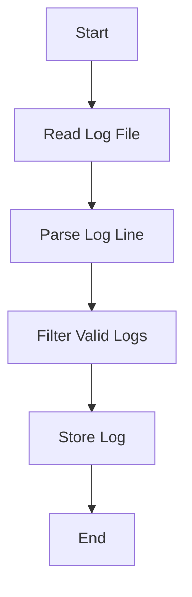
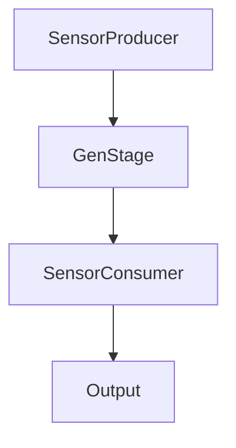

## 30.16. Data Engineering Projects with Elixir

In the realm of data engineering, Elixir stands out as a powerful tool for managing and processing large datasets, as well as for real-time data transformation and analysis. This section delves into how Elixir's unique features, such as its functional programming paradigm, concurrency model, and the OTP framework, make it an ideal choice for tackling the challenges of big data and stream processing.

### Big Data Processing with Elixir

Big data processing involves handling vast amounts of data that traditional data processing software cannot manage efficiently. Elixir, with its robust concurrency model and fault-tolerant design, provides a solid foundation for building scalable and efficient data processing systems.

#### Key Concepts in Big Data Processing

1. **Scalability**: The ability to handle increasing amounts of data by adding resources.
2. **Fault Tolerance**: Ensuring system reliability and availability, even in the face of failures.
3. **Data Parallelism**: Distributing data processing tasks across multiple processors or nodes.

#### Elixir's Strengths in Big Data Processing

- **Concurrency**: Elixir's lightweight processes allow for massive concurrency, making it easier to parallelize data processing tasks.
- **Fault Tolerance**: The OTP framework provides tools for building resilient systems that can recover from failures.
- **Distributed Computing**: Elixir's ability to run on the BEAM VM, which supports distributed computing, allows for the creation of distributed data processing pipelines.

#### Implementing a Big Data Processing Pipeline

Let's explore how to implement a big data processing pipeline using Elixir. We'll focus on a simple example of processing log files to extract meaningful insights.

```elixir
defmodule LogProcessor do
  # Function to read log files and process each line
  def process_logs(file_path) do
    File.stream!(file_path)
    |> Stream.map(&parse_log_line/1)
    |> Stream.filter(&valid_log?/1)
    |> Enum.each(&store_log/1)
  end

  # Function to parse a log line
  defp parse_log_line(line) do
    # Assume log lines are in "timestamp level message" format
    [timestamp, level, message] = String.split(line, " ", parts: 3)
    %{timestamp: timestamp, level: level, message: message}
  end

  # Function to check if a log entry is valid
  defp valid_log?(log) do
    log.level in ["INFO", "WARN", "ERROR"]
  end

  # Function to store a valid log entry
  defp store_log(log) do
    # Store log in a database or send to a monitoring system
    IO.inspect(log, label: "Storing log")
  end
end

# Usage
LogProcessor.process_logs("path/to/logfile.log")
```

In this example, we use Elixir's `Stream` module to process log files efficiently. The pipeline reads log lines, parses them, filters out invalid entries, and stores the valid logs. This approach leverages Elixir's functional programming capabilities to create a clean and efficient data processing pipeline.

#### Visualizing the Big Data Processing Pipeline



**Diagram Description**: This flowchart illustrates the steps involved in processing log files using Elixir. The process starts with reading the log file, parsing each line, filtering valid logs, and finally storing them.

### Stream Processing with Elixir

Stream processing involves real-time data transformation and analysis, allowing for immediate insights and actions based on incoming data. Elixir's concurrency model and the GenStage library make it well-suited for building stream processing applications.

#### Key Concepts in Stream Processing

1. **Real-Time Processing**: Handling data as it arrives, with minimal latency.
2. **Backpressure**: Managing the flow of data to prevent overwhelming the system.
3. **Event-Driven Architecture**: Reacting to data events as they occur.

#### Elixir's Strengths in Stream Processing

- **GenStage**: A library for building data processing pipelines with backpressure support.
- **Flow**: Built on top of GenStage, Flow provides higher-level abstractions for parallel data processing.
- **Concurrency**: Elixir's processes allow for handling multiple data streams concurrently.

#### Implementing a Stream Processing Application

Let's build a simple stream processing application using GenStage to process real-time data from a sensor network.

```elixir
defmodule SensorProducer do
  use GenStage

  def start_link(initial_state) do
    GenStage.start_link(__MODULE__, initial_state, name: __MODULE__)
  end

  def init(initial_state) do
    {:producer, initial_state}
  end

  def handle_demand(demand, state) when demand > 0 do
    # Simulate sensor data generation
    events = Enum.map(1..demand, fn _ -> %{temperature: :rand.uniform(100)} end)
    {:noreply, events, state}
  end
end

defmodule SensorConsumer do
  use GenStage

  def start_link() do
    GenStage.start_link(__MODULE__, :ok, name: __MODULE__)
  end

  def init(:ok) do
    {:consumer, :ok}
  end

  def handle_events(events, _from, state) do
    Enum.each(events, fn event ->
      IO.inspect(event, label: "Processing event")
    end)
    {:noreply, [], state}
  end
end

# Start the producer and consumer
{:ok, producer} = SensorProducer.start_link(0)
{:ok, consumer} = SensorConsumer.start_link()

# Connect the producer and consumer
GenStage.sync_subscribe(consumer, to: producer)
```

In this example, we define a `SensorProducer` that generates random temperature data and a `SensorConsumer` that processes the data. The `GenStage` library handles the flow of data between the producer and consumer, ensuring backpressure is managed effectively.

#### Visualizing the Stream Processing Architecture



**Diagram Description**: This flowchart represents the architecture of a stream processing application using GenStage. The `SensorProducer` generates data, which is processed by the `SensorConsumer`, with GenStage managing the data flow.

### Outcomes of Using Elixir for Data Engineering

By leveraging Elixir's strengths in concurrency and fault tolerance, data engineering projects can achieve:

- **Improved Data Workflows**: Streamlined data processing pipelines that handle large volumes of data efficiently.
- **Faster Insights**: Real-time data processing enables quicker decision-making and responsiveness to data events.
- **Scalable Solutions**: Elixir's ability to handle distributed computing allows for scaling data processing systems as needed.

### Try It Yourself

To deepen your understanding, try modifying the code examples provided:

- **Log Processor**: Add additional log levels or implement a more complex parsing logic.
- **Stream Processing**: Introduce additional stages in the GenStage pipeline, such as data transformation or aggregation.

### References and Further Reading

- [Elixir Lang](https://elixir-lang.org/) - Official Elixir website for language documentation and resources.
- [GenStage](https://hexdocs.pm/gen_stage/GenStage.html) - Documentation for the GenStage library.
- [Flow](https://hexdocs.pm/flow/Flow.html) - Documentation for the Flow library.

### Knowledge Check

- What are the key benefits of using Elixir for big data processing?
- How does GenStage help manage backpressure in stream processing applications?
- What are some potential modifications you could make to the provided code examples?

### Embrace the Journey

Remember, this is just the beginning. As you progress, you'll build more complex and interactive data processing systems. Keep experimenting, stay curious, and enjoy the journey!

## Quiz: Data Engineering Projects with Elixir



### What is a key benefit of using Elixir for big data processing?

- [x] Concurrency and fault tolerance
- [ ] Object-oriented design
- [ ] Limited scalability
- [ ] High memory usage

> **Explanation:** Elixir's concurrency model and fault tolerance make it ideal for big data processing.

### Which library in Elixir is used for building data processing pipelines with backpressure support?

- [x] GenStage
- [ ] Phoenix
- [ ] Ecto
- [ ] Plug

> **Explanation:** GenStage is specifically designed for building data processing pipelines with backpressure support.

### What is the primary role of the SensorProducer in the stream processing example?

- [x] To generate random temperature data
- [ ] To consume and process data
- [ ] To store data in a database
- [ ] To handle user input

> **Explanation:** The SensorProducer generates random temperature data for processing.

### How does Elixir's concurrency model benefit stream processing applications?

- [x] Allows handling multiple data streams concurrently
- [ ] Increases memory usage
- [ ] Limits scalability
- [ ] Reduces fault tolerance

> **Explanation:** Elixir's concurrency model allows for handling multiple data streams concurrently, which is beneficial for stream processing.

### What is the purpose of the `Stream` module in Elixir?

- [x] To process data efficiently using functional programming
- [ ] To manage database connections
- [ ] To handle HTTP requests
- [ ] To create user interfaces

> **Explanation:** The `Stream` module is used for efficient data processing using functional programming techniques.

### What is a common use case for stream processing?

- [x] Real-time data transformation and analysis
- [ ] Batch processing of historical data
- [ ] Static website generation
- [ ] Image rendering

> **Explanation:** Stream processing is commonly used for real-time data transformation and analysis.

### Which Elixir feature supports distributed computing for big data processing?

- [x] BEAM VM
- [ ] Ecto
- [ ] Phoenix
- [ ] Plug

> **Explanation:** The BEAM VM supports distributed computing, which is beneficial for big data processing.

### What is backpressure in the context of stream processing?

- [x] Managing the flow of data to prevent overwhelming the system
- [ ] Increasing the speed of data processing
- [ ] Reducing data redundancy
- [ ] Enhancing data security

> **Explanation:** Backpressure involves managing the flow of data to prevent overwhelming the system.

### How can you modify the log processor example to handle additional log levels?

- [x] Add new conditions in the `valid_log?/1` function
- [ ] Change the file path in `process_logs/1`
- [ ] Modify the `store_log/1` function
- [ ] Remove the `parse_log_line/1` function

> **Explanation:** To handle additional log levels, you can add new conditions in the `valid_log?/1` function.

### True or False: Elixir's functional programming paradigm is beneficial for building scalable data processing systems.

- [x] True
- [ ] False

> **Explanation:** Elixir's functional programming paradigm, combined with its concurrency model, is beneficial for building scalable data processing systems.


