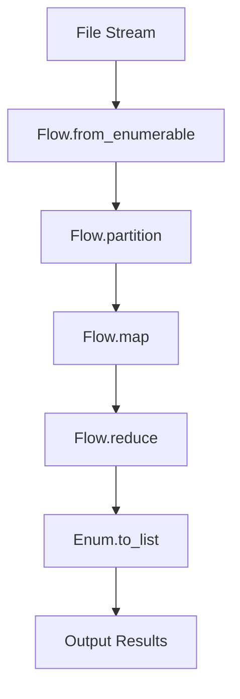
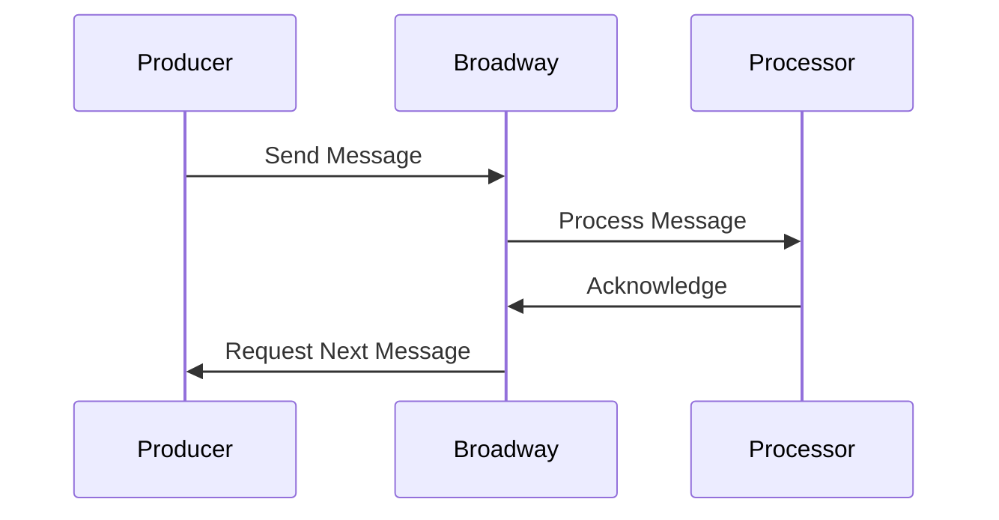

## 30.16. Data Engineering Projects with Elixir

In today's data-driven world, the ability to efficiently manage and process vast amounts of data is crucial. Elixir, with its functional programming paradigm and concurrency model, offers powerful tools for tackling data engineering challenges. This section explores how Elixir can be leveraged for big data processing and stream processing, leading to improved data workflows and faster insights.

### Big Data Processing

Big data processing involves handling large volumes of data that traditional data processing applications cannot manage. Elixir's capabilities make it a strong candidate for such tasks.

#### Understanding Big Data in Elixir

Elixir's concurrency model, built on the Erlang VM (BEAM), allows for efficient parallel processing, which is essential for big data tasks. The language's emphasis on immutability and functional programming ensures that data transformations are predictable and side-effect-free.

#### Key Concepts

- **Concurrency**: Elixir's lightweight processes enable concurrent data processing, allowing multiple data operations to occur simultaneously.
- **Scalability**: The ability to scale horizontally by distributing processes across nodes in a cluster.
- **Fault Tolerance**: Built-in mechanisms for handling failures gracefully, ensuring data processing tasks are resilient.

#### Tools and Libraries

- **Flow**: A library for parallel data processing, built on top of GenStage, which provides a framework for building data processing pipelines.
- **GenStage**: A specification for exchanging data between stages in a pipeline, enabling backpressure and efficient resource utilization.
- **Broadway**: A library for building data ingestion and processing pipelines, integrating with message brokers and data sources.

#### Implementing Big Data Processing

Let's explore a practical example of processing large datasets using Elixir.

```elixir
defmodule DataProcessor do
  use Flow

  def process_large_dataset(file_path) do
    file_path
    |> File.stream!()
    |> Flow.from_enumerable()
    |> Flow.partition()
    |> Flow.map(&process_line/1)
    |> Flow.reduce(fn -> %{} end, &aggregate_results/2)
    |> Enum.to_list()
  end

  defp process_line(line) do
    # Process each line of the file
    String.split(line, ",")
  end

  defp aggregate_results(result, line_data) do
    # Aggregate data from each line
    Map.update(result, line_data, 1, &(&1 + 1))
  end
end

# Usage
results = DataProcessor.process_large_dataset("large_data.csv")
IO.inspect(results)
```

In this example, we use `Flow` to process a large CSV file. The file is streamed line by line, processed concurrently, and results are aggregated.

#### Visualizing the Data Flow


```mermaid
graph TD;
    A[File Stream] --> B[Flow.from_enumerable];
    B --> C[Flow.partition];
    C --> D[Flow.map];
    D --> E[Flow.reduce];
    E --> F[Enum.to_list];
    F --> G[Output Results];
```

**Figure 1**: The data flow through the processing pipeline, from file streaming to result aggregation.

### Stream Processing

Stream processing involves real-time data transformation and analysis, enabling immediate insights from continuous data streams.

#### Key Concepts

- **Real-Time Processing**: Handling data as it arrives, with minimal latency.
- **Event-Driven Architecture**: Reacting to data changes and events in real-time.
- **Backpressure**: Managing data flow to prevent overwhelming the system.

#### Tools and Libraries

- **GenStage**: Provides the foundation for building stages that can produce, consume, and transform data.
- **Broadway**: Facilitates building robust data pipelines with support for batching, retries, and fault tolerance.

#### Implementing Stream Processing

Consider a scenario where we process real-time data from a message queue.

```elixir
defmodule StreamProcessor do
  use Broadway

  def start_link(_opts) do
    Broadway.start_link(__MODULE__,
      name: __MODULE__,
      producer: [
        module: {BroadwayRabbitMQ.Producer, queue: "data_queue"}
      ],
      processors: [
        default: [concurrency: 10]
      ],
      batchers: [
        default: [batch_size: 100]
      ]
    )
  end

  def handle_message(_, message, _) do
    # Process each message
    IO.inspect(message.data)
    message
  end

  def handle_batch(_, messages, _, _) do
    # Process a batch of messages
    IO.inspect(Enum.map(messages, & &1.data))
    messages
  end
end

# Start the processor
{:ok, _} = StreamProcessor.start_link([])
```

This example demonstrates a stream processing application using `Broadway` to consume messages from a RabbitMQ queue, process them concurrently, and handle batches.

#### Visualizing Stream Processing


```mermaid
sequenceDiagram
    participant Producer
    participant Broadway
    participant Processor
    Producer->>Broadway: Send Message
    Broadway->>Processor: Process Message
    Processor->>Broadway: Acknowledge
    Broadway->>Producer: Request Next Message
```

**Figure 2**: The sequence of operations in stream processing, from message production to processing and acknowledgment.

### Outcomes

By leveraging Elixir for big data and stream processing, organizations can achieve:

- **Improved Data Workflows**: Efficiently manage and process data pipelines, reducing bottlenecks and improving throughput.
- **Faster Insights**: Real-time processing enables immediate analysis and decision-making, crucial for time-sensitive applications.

### Try It Yourself

Experiment with the provided examples by:

- Modifying the data processing logic to handle different data formats.
- Integrating additional data sources, such as databases or external APIs.
- Implementing custom error handling and retry mechanisms.

### Knowledge Check

- How does Elixir's concurrency model benefit big data processing?
- What are the advantages of using GenStage for stream processing?
- How can you handle backpressure in a data pipeline?

### Conclusion

Elixir's unique features make it an excellent choice for data engineering projects, particularly in big data and stream processing domains. By understanding and applying the concepts and tools discussed, you can build scalable, efficient data workflows that deliver timely insights.

## Quiz Time!



### What is a key benefit of using Elixir for big data processing?

- [x] Concurrency and scalability
- [ ] Object-oriented design
- [ ] Inheritance and polymorphism
- [ ] Low-level memory management

> **Explanation:** Elixir's concurrency model and scalability make it ideal for big data processing.

### Which library is used for building data ingestion and processing pipelines in Elixir?

- [ ] Ecto
- [x] Broadway
- [ ] Phoenix
- [ ] Plug

> **Explanation:** Broadway is designed for building data ingestion and processing pipelines.

### What is the purpose of the `Flow` library in Elixir?

- [ ] To manage HTTP requests
- [x] To perform parallel data processing
- [ ] To handle database connections
- [ ] To build web applications

> **Explanation:** Flow is used for parallel data processing in Elixir.

### In stream processing, what does backpressure help manage?

- [x] Data flow
- [ ] Memory allocation
- [ ] CPU usage
- [ ] Disk space

> **Explanation:** Backpressure helps manage the data flow to prevent system overload.

### How does GenStage facilitate stream processing?

- [x] By providing a framework for exchanging data between stages
- [ ] By handling HTTP requests
- [x] By enabling backpressure
- [ ] By managing database connections

> **Explanation:** GenStage provides a framework for exchanging data between stages and enables backpressure.

### What is a key outcome of using Elixir for stream processing?

- [x] Real-time data insights
- [ ] Improved memory management
- [ ] Simplified UI design
- [ ] Enhanced graphics rendering

> **Explanation:** Elixir's stream processing capabilities enable real-time data insights.

### Which tool is used for parallel data processing in Elixir?

- [x] Flow
- [ ] Plug
- [x] GenStage
- [ ] Phoenix

> **Explanation:** Flow and GenStage are used for parallel data processing in Elixir.

### What does the `Broadway` library integrate with for data ingestion?

- [x] Message brokers
- [ ] Web servers
- [ ] File systems
- [ ] Graphics libraries

> **Explanation:** Broadway integrates with message brokers for data ingestion.

### How does Elixir's immutability benefit data processing?

- [x] Ensures predictable data transformations
- [ ] Allows direct memory manipulation
- [ ] Simplifies UI design
- [ ] Enhances graphics rendering

> **Explanation:** Immutability ensures predictable data transformations in Elixir.

### True or False: Elixir's concurrency model is based on the Actor model.

- [x] True
- [ ] False

> **Explanation:** Elixir's concurrency model is based on the Actor model, which is implemented by the BEAM VM.



Remember, this is just the beginning. As you delve deeper into data engineering with Elixir, you'll uncover more sophisticated techniques and tools. Keep experimenting, stay curious, and enjoy the journey!
