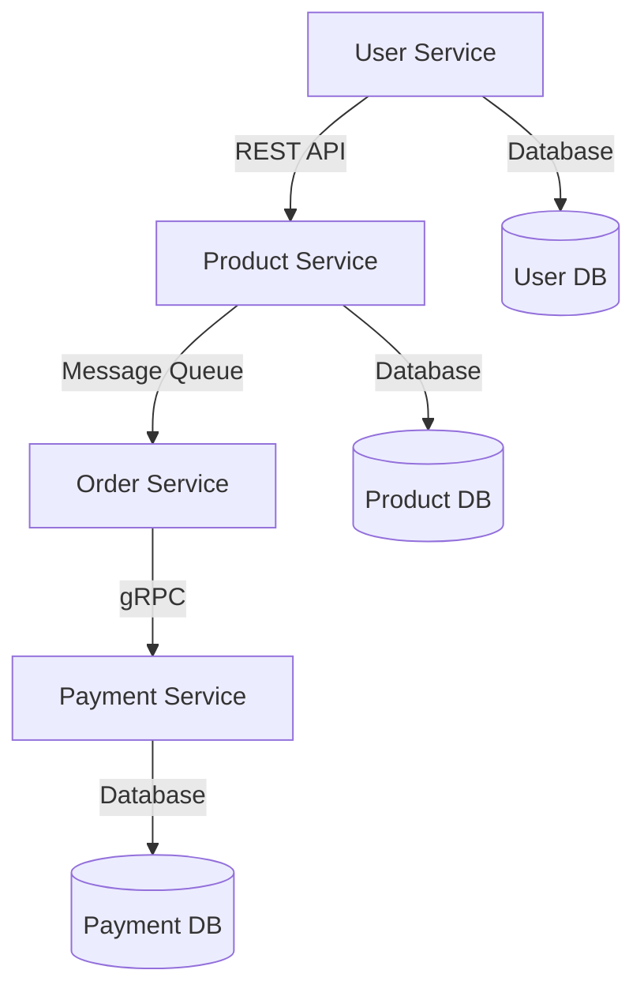

## 30.2. Developing a Microservices Architecture

In today's rapidly evolving software landscape, the microservices architecture has emerged as a powerful paradigm for building scalable, maintainable, and flexible applications. This section delves into the development of a microservices architecture using Elixir, a functional programming language known for its concurrency and fault-tolerance capabilities. We'll explore architecture design, communication strategies, benefits, and the tools and platforms that facilitate microservices development.

### Architecture Design

#### Breaking Down Monoliths into Smaller Services

The transition from a monolithic architecture to microservices involves decomposing a large, tightly-coupled application into smaller, independent services. Each microservice is responsible for a specific business capability and can be developed, deployed, and scaled independently.

**Key Steps in Decomposition:**

1. **Identify Business Capabilities:** Start by identifying distinct business capabilities within your application. Each capability should align with a microservice.

2. **Define Service Boundaries:** Clearly define the boundaries of each service. This involves understanding the data and functionality each service will own and manage.

3. **Design for Independence:** Ensure that services are loosely coupled and can operate independently. This involves minimizing dependencies and ensuring that services communicate through well-defined interfaces.

4. **Implement Data Decentralization:** Each microservice should manage its own data, promoting autonomy and reducing the risk of data-related bottlenecks.

5. **Consider Domain-Driven Design (DDD):** Use DDD principles to guide the decomposition process, focusing on bounded contexts and aggregates.

**Example:**

Consider a monolithic e-commerce application. You might break it down into the following microservices:

- **User Service:** Manages user accounts and authentication.
- **Product Service:** Handles product catalog and inventory.
- **Order Service:** Processes orders and manages order history.
- **Payment Service:** Manages payment processing and transactions.

### Communication Strategies

Microservices need to communicate with each other to fulfill business processes. Choosing the right communication strategy is crucial for the performance and reliability of your architecture.

#### Using REST APIs

REST (Representational State Transfer) is a popular choice for microservices communication due to its simplicity and stateless nature. It uses HTTP protocols and is well-suited for synchronous communication.

**Advantages:**

- **Simplicity:** Easy to implement and understand.
- **Statelessness:** Each request from a client contains all the information needed to process the request.
- **Scalability:** Can be easily scaled horizontally.

**Considerations:**

- **Latency:** Network latency can impact performance.
- **Error Handling:** Requires robust error handling mechanisms.

**Example:**

```elixir
defmodule ProductService do
  use Plug.Router

  plug :match
  plug :dispatch

  get "/products/:id" do
    product = fetch_product(conn.params["id"])
    send_resp(conn, 200, Jason.encode!(product))
  end

  defp fetch_product(id) do
    # Fetch product from database or cache
  end
end
```

#### Message Queues

Message queues enable asynchronous communication between services, allowing them to decouple and operate independently. This is particularly useful for tasks that do not require an immediate response.

**Advantages:**

- **Decoupling:** Services can operate independently.
- **Resilience:** Messages can be retried in case of failures.
- **Scalability:** Can handle high volumes of messages.

**Considerations:**

- **Complexity:** Requires additional infrastructure and management.
- **Latency:** May introduce delays due to message queuing.

**Example:**

```elixir
defmodule OrderService do
  def place_order(order_details) do
    # Publish order to message queue
    :ok = MessageQueue.publish("orders", order_details)
  end
end
```

#### gRPC

gRPC is a high-performance, open-source RPC framework that uses HTTP/2 for transport and Protocol Buffers for serialization. It is well-suited for inter-service communication in microservices architectures.

**Advantages:**

- **Performance:** Efficient binary serialization and HTTP/2 support.
- **Strong Typing:** Enforces strict contracts between services.
- **Streaming:** Supports bi-directional streaming.

**Considerations:**

- **Complexity:** Requires understanding of Protocol Buffers and gRPC tooling.
- **Compatibility:** May require additional effort to integrate with existing systems.

**Example:**

```elixir
defmodule PaymentService do
  use GRPC.Server, service: PaymentService.Service

  def process_payment(request, _stream) do
    # Process payment logic
    {:ok, %PaymentResponse{status: :success}}
  end
end
```

### Benefits of Microservices

Adopting a microservices architecture offers several benefits:

- **Scalability:** Services can be scaled independently based on demand.
- **Flexibility:** Allows for the use of different technologies and languages for different services.
- **Resilience:** Faults in one service do not impact the entire system.
- **Faster Deployment:** Smaller, independent services can be deployed more frequently.
- **Improved Maintenance:** Easier to understand, develop, and maintain smaller codebases.

### Tools and Platforms

To effectively develop and manage microservices, several tools and platforms are available:

#### Docker for Containerization

Docker is a platform that enables developers to package applications into containers—standardized executable components that combine application source code with the operating system libraries and dependencies required to run that code in any environment.

**Benefits:**

- **Consistency:** Ensures that software runs the same in development and production.
- **Isolation:** Containers are isolated from each other, improving security and stability.
- **Portability:** Containers can run on any system that supports Docker.

**Example:**

```dockerfile
# Dockerfile for Elixir microservice
FROM elixir:1.12

WORKDIR /app

COPY . .

RUN mix deps.get
RUN mix compile

CMD ["mix", "phx.server"]
```

#### Kubernetes for Orchestration

Kubernetes is an open-source platform designed to automate deploying, scaling, and operating application containers. It is particularly useful for managing microservices architectures.

**Benefits:**

- **Scalability:** Automatically scales services based on demand.
- **Self-Healing:** Automatically replaces failed containers.
- **Load Balancing:** Distributes network traffic to maintain a stable system.

**Example:**

```yaml
# Kubernetes deployment for Elixir microservice
apiVersion: apps/v1
kind: Deployment
metadata:
  name: product-service
spec:
  replicas: 3
  selector:
    matchLabels:
      app: product-service
  template:
    metadata:
      labels:
        app: product-service
    spec:
      containers:
      - name: product-service
        image: product-service:latest
        ports:
        - containerPort: 4000
```

### Elixir's Unique Features for Microservices

Elixir, built on the Erlang VM (BEAM), offers several unique features that make it an excellent choice for microservices:

- **Concurrency:** Elixir's lightweight processes and message-passing model enable efficient handling of concurrent operations.
- **Fault Tolerance:** The "let it crash" philosophy and robust supervision trees ensure system resilience.
- **Scalability:** Elixir's ability to handle large numbers of concurrent connections makes it ideal for scalable microservices.
- **Hot Code Upgrades:** Allows for updating running systems without downtime, facilitating continuous deployment.

### Design Considerations

When designing a microservices architecture, consider the following:

- **Service Granularity:** Determine the appropriate size and scope of each service.
- **Data Management:** Decide on data storage strategies, including database per service or shared databases.
- **Security:** Implement robust authentication, authorization, and data protection mechanisms.
- **Monitoring and Logging:** Ensure comprehensive monitoring and logging to track service health and performance.
- **Testing:** Implement thorough testing strategies, including unit, integration, and end-to-end tests.

### Differences and Similarities with Other Patterns

Microservices can be confused with other architectural patterns such as service-oriented architecture (SOA). While both involve breaking down applications into services, microservices emphasize smaller, independently deployable units and often use lightweight protocols like HTTP/REST, whereas SOA may use heavier protocols like SOAP.

### Try It Yourself

To solidify your understanding, try the following exercises:

1. **Decompose a Monolith:** Take a simple monolithic application and break it down into microservices. Identify service boundaries and implement communication using REST APIs.

2. **Implement a Message Queue:** Set up a message queue using RabbitMQ or Kafka and implement asynchronous communication between two services.

3. **Deploy with Docker and Kubernetes:** Containerize a microservice using Docker and deploy it on a Kubernetes cluster. Experiment with scaling and load balancing.

### Visualizing Microservices Architecture

Below is a diagram illustrating a typical microservices architecture with Elixir:



**Diagram Description:** This diagram represents a microservices architecture where the User Service communicates with the Product Service via REST API. The Product Service sends messages to the Order Service through a message queue, and the Order Service communicates with the Payment Service using gRPC. Each service manages its own database.

### Knowledge Check

- What are the key steps in decomposing a monolithic application into microservices?
- How do REST APIs and message queues differ in terms of communication strategies?
- What are the benefits of using Docker and Kubernetes in a microservices architecture?
- How does Elixir's concurrency model benefit microservices development?

### Summary

Developing a microservices architecture with Elixir offers numerous advantages, including improved scalability, flexibility, and resilience. By leveraging Elixir's unique features and adopting best practices in architecture design and communication strategies, you can build robust and efficient microservices systems. Remember, the journey to mastering microservices is ongoing, so keep experimenting, learning, and refining your skills.

## Quiz: Developing a Microservices Architecture



### What is the primary goal of decomposing a monolithic application into microservices?

- [x] To create smaller, independent services that can be developed, deployed, and scaled independently.
- [ ] To increase the complexity of the application.
- [ ] To reduce the number of services in the application.
- [ ] To centralize data management.

> **Explanation:** The primary goal of decomposing a monolithic application into microservices is to create smaller, independent services that can be developed, deployed, and scaled independently, improving flexibility and maintainability.

### Which communication strategy is best suited for asynchronous communication between microservices?

- [ ] REST APIs
- [x] Message Queues
- [ ] gRPC
- [ ] Direct Database Access

> **Explanation:** Message queues are best suited for asynchronous communication between microservices as they allow services to operate independently and handle high volumes of messages.

### What is a key advantage of using gRPC for microservices communication?

- [ ] It uses plain text for communication.
- [x] It supports efficient binary serialization and HTTP/2.
- [ ] It requires no additional tooling.
- [ ] It is only suitable for synchronous communication.

> **Explanation:** gRPC supports efficient binary serialization and HTTP/2, making it a high-performance choice for microservices communication.

### How does Docker benefit microservices architecture?

- [x] It provides consistency and portability by packaging applications into containers.
- [ ] It eliminates the need for orchestration.
- [ ] It requires applications to be monolithic.
- [ ] It only works with Elixir applications.

> **Explanation:** Docker benefits microservices architecture by providing consistency and portability, allowing applications to run the same in any environment.

### What is the role of Kubernetes in microservices architecture?

- [x] It automates deploying, scaling, and operating application containers.
- [ ] It replaces the need for Docker.
- [ ] It is used for developing microservices.
- [ ] It is a database management system.

> **Explanation:** Kubernetes automates deploying, scaling, and operating application containers, making it essential for managing microservices architectures.

### Which Elixir feature is particularly beneficial for handling concurrent operations in microservices?

- [ ] Object-Oriented Programming
- [x] Lightweight processes and message-passing model
- [ ] Static Typing
- [ ] Manual Memory Management

> **Explanation:** Elixir's lightweight processes and message-passing model are particularly beneficial for handling concurrent operations in microservices.

### What is a common pitfall when designing microservices?

- [x] Overly fine-grained services leading to increased complexity.
- [ ] Using REST APIs for communication.
- [ ] Implementing data decentralization.
- [ ] Ensuring services are loosely coupled.

> **Explanation:** A common pitfall when designing microservices is creating overly fine-grained services, which can lead to increased complexity and management challenges.

### How does Elixir's "let it crash" philosophy contribute to microservices resilience?

- [x] It encourages building systems that can recover from failures automatically.
- [ ] It prevents any service from crashing.
- [ ] It requires manual intervention for recovery.
- [ ] It discourages the use of supervision trees.

> **Explanation:** Elixir's "let it crash" philosophy encourages building systems that can recover from failures automatically, contributing to microservices resilience.

### What is a benefit of using Domain-Driven Design (DDD) in microservices?

- [x] It helps define clear service boundaries and align services with business capabilities.
- [ ] It eliminates the need for communication between services.
- [ ] It requires all services to share a single database.
- [ ] It focuses on technical implementation details.

> **Explanation:** Domain-Driven Design (DDD) helps define clear service boundaries and align services with business capabilities, making it beneficial for microservices design.

### True or False: Microservices architectures are inherently more secure than monolithic architectures.

- [ ] True
- [x] False

> **Explanation:** Microservices architectures are not inherently more secure than monolithic architectures. Security must be explicitly addressed through robust authentication, authorization, and data protection mechanisms.


