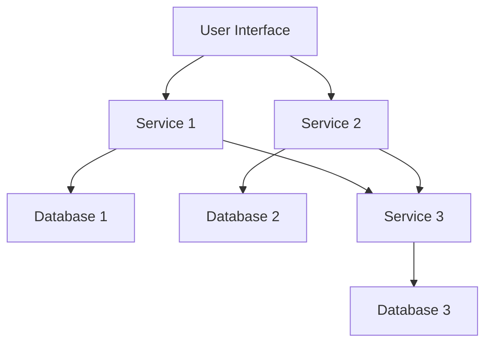

## 30.2. Developing a Microservices Architecture

In the modern era of software development, microservices architecture has emerged as a dominant paradigm for building scalable, maintainable, and flexible applications. This approach contrasts sharply with traditional monolithic architectures, offering numerous advantages, especially when implemented using a powerful language like Elixir. In this section, we will delve into the core aspects of developing a microservices architecture, focusing on breaking down monoliths, communication strategies, and leveraging tools such as Docker and Kubernetes.

### Introduction to Microservices Architecture

Microservices architecture is a design pattern that structures an application as a collection of loosely coupled services. Each service is fine-grained and addresses a specific business capability. This architecture promotes the development of independently deployable services, enabling teams to work on different parts of the application simultaneously.

#### Key Characteristics of Microservices

- **Decentralized Governance**: Each service can be developed and deployed independently.
- **Polyglot Persistence**: Services can use different databases and storage technologies.
- **Resilience**: Failure in one service does not affect the entire system.
- **Scalability**: Services can be scaled independently based on demand.

### Architecture Design

#### Breaking Down Monoliths into Smaller Services

The transition from a monolithic architecture to microservices involves decomposing the application into smaller, manageable services. This process requires careful planning and a deep understanding of the application's domain.

1. **Identify Boundaries**: Start by identifying the domain boundaries within your application. Each domain can potentially become a separate microservice.
2. **Define Service Responsibilities**: Clearly define the responsibilities of each service. Avoid overlapping functionalities to maintain the independence of services.
3. **Data Management**: Decide on how data will be managed across services. Consider using a shared database or separate databases for each service.
4. **Inter-Service Communication**: Plan how services will communicate with each other. This could be through REST APIs, message queues, or gRPC.

**Diagram: Microservices Architecture**


```mermaid
graph TD;
    A[User Interface] --> B[Service 1];
    A --> C[Service 2];
    B --> D[Database 1];
    C --> E[Database 2];
    B --> F[Service 3];
    C --> F;
    F --> G[Database 3];
```

*Caption: A simple representation of a microservices architecture with multiple services interacting with their respective databases.*

### Communication Strategies

Effective communication between services is crucial in a microservices architecture. Elixir provides several options for inter-service communication, each with its own set of advantages and trade-offs.

#### Using REST APIs

REST (Representational State Transfer) is a popular choice for inter-service communication due to its simplicity and widespread adoption.

- **Advantages**: Easy to implement and understand, stateless communication, and supports a wide range of data formats.
- **Disadvantages**: Can become complex with increased service interactions, lacks built-in support for asynchronous communication.

**Example: Implementing a Simple REST API in Elixir**

```elixir
defmodule MyAppWeb.Router do
  use MyAppWeb, :router

  pipeline :api do
    plug :accepts, ["json"]
  end

  scope "/api", MyAppWeb do
    pipe_through :api

    get "/items", ItemController, :index
    post "/items", ItemController, :create
  end
end
```

#### Message Queues

Message queues provide asynchronous communication, allowing services to send and receive messages without waiting for a response.

- **Advantages**: Decouples services, supports asynchronous processing, and enhances system resilience.
- **Disadvantages**: Introduces complexity in message handling and requires additional infrastructure.

**Example: Using RabbitMQ for Message Queuing**

```elixir
defmodule MyApp.Messaging do
  use AMQP

  def start_link do
    {:ok, connection} = Connection.open("amqp://localhost")
    {:ok, channel} = Channel.open(connection)

    Queue.declare(channel, "my_queue", durable: true)
    Basic.consume(channel, "my_queue", nil, no_ack: true)

    receive do
      {:basic_deliver, payload, _meta} ->
        IO.puts("Received message: #{payload}")
    end
  end
end
```

#### gRPC

gRPC is a high-performance, open-source RPC framework that uses HTTP/2 for transport and Protocol Buffers for serialization.

- **Advantages**: Supports bi-directional streaming, efficient serialization, and strong typing.
- **Disadvantages**: Requires more setup compared to REST, and has a steeper learning curve.

**Example: Defining a gRPC Service in Elixir**

```elixir
defmodule MyApp.GRPC.Service do
  use GRPC.Service, name: "myapp.MyService"

  rpc :GetItem, MyApp.GetItemRequest, MyApp.GetItemResponse
end
```

### Benefits of Microservices

Adopting a microservices architecture offers several benefits, particularly in terms of scalability, flexibility, and maintainability.

- **Improved Scalability**: Services can be scaled independently, allowing for more efficient resource utilization.
- **Flexibility**: Teams can choose the best technologies and frameworks for each service.
- **Easier Maintenance**: Smaller codebases are easier to manage and understand, reducing the complexity of updates and bug fixes.

### Tools and Platforms

To effectively manage and deploy microservices, several tools and platforms can be leveraged. Docker and Kubernetes are among the most popular choices.

#### Docker for Containerization

Docker enables the packaging of applications and their dependencies into containers, ensuring consistency across different environments.

- **Advantages**: Simplifies deployment, enhances portability, and supports microservices architecture.
- **Disadvantages**: Requires learning container management and orchestration.

**Example: Dockerfile for an Elixir Application**

```dockerfile
FROM elixir:1.12-alpine

WORKDIR /app

COPY . .

RUN mix local.hex --force && \
    mix local.rebar --force && \
    mix deps.get && \
    mix compile

CMD ["mix", "phx.server"]
```

#### Kubernetes for Orchestration

Kubernetes automates the deployment, scaling, and management of containerized applications, making it an ideal choice for orchestrating microservices.

- **Advantages**: Automates scaling and failover, supports rolling updates, and manages service discovery.
- **Disadvantages**: Steep learning curve and requires significant setup.

**Example: Kubernetes Deployment for an Elixir Service**

```yaml
apiVersion: apps/v1
kind: Deployment
metadata:
  name: myapp
spec:
  replicas: 3
  selector:
    matchLabels:
      app: myapp
  template:
    metadata:
      labels:
        app: myapp
    spec:
      containers:
      - name: myapp
        image: myapp:latest
        ports:
        - containerPort: 4000
```

### Elixir's Unique Features for Microservices

Elixir, with its functional programming paradigm and concurrency model, offers unique advantages for building microservices.

- **Concurrency**: Elixir's lightweight processes and the Actor model allow for efficient handling of concurrent operations.
- **Fault Tolerance**: The "Let it crash" philosophy and OTP framework enhance the resilience of microservices.
- **Scalability**: Elixir's ability to handle large numbers of connections makes it well-suited for scalable microservices.

### Design Considerations

When designing a microservices architecture, several considerations must be taken into account to ensure a successful implementation.

- **Service Granularity**: Determine the appropriate size and scope of each service to balance independence and complexity.
- **Data Management**: Decide on a strategy for data consistency and integrity across services.
- **Security**: Implement security measures to protect data in transit and at rest, and ensure proper authentication and authorization.
- **Monitoring and Logging**: Set up comprehensive monitoring and logging to track service health and performance.

### Differences and Similarities with Other Patterns

Microservices architecture is often compared to other architectural patterns, such as service-oriented architecture (SOA) and monolithic architecture. While microservices share some similarities with SOA, such as service decomposition and communication over a network, they differ in their emphasis on independent deployment and polyglot persistence. Unlike monolithic architecture, microservices promote the separation of concerns and flexibility in technology choices.

### Try It Yourself

To gain hands-on experience with microservices in Elixir, try modifying the provided code examples. Experiment with different communication strategies, such as switching from REST to gRPC, or implementing a message queue using a different broker like Kafka. Observe how these changes impact the system's performance and resilience.

### Conclusion

Developing a microservices architecture using Elixir offers numerous benefits, including improved scalability, flexibility, and maintainability. By leveraging Elixir's unique features and adopting effective communication strategies, you can build robust and efficient microservices. Remember, this is just the beginning. As you progress, you'll discover more advanced techniques and patterns to enhance your architecture. Keep experimenting, stay curious, and enjoy the journey!

## Quiz Time!



### What is a key characteristic of microservices architecture?

- [x] Decentralized Governance
- [ ] Centralized Database
- [ ] Single Deployment Unit
- [ ] Monolithic Codebase

> **Explanation:** Microservices architecture is characterized by decentralized governance, allowing each service to be developed and deployed independently.

### Which communication strategy is known for supporting asynchronous communication?

- [ ] REST APIs
- [x] Message Queues
- [ ] SOAP
- [ ] gRPC

> **Explanation:** Message queues support asynchronous communication, allowing services to send and receive messages without waiting for a response.

### What is an advantage of using Docker in microservices architecture?

- [x] Simplifies deployment
- [ ] Requires no learning
- [ ] Eliminates need for orchestration
- [ ] Increases code complexity

> **Explanation:** Docker simplifies deployment by packaging applications and their dependencies into containers, ensuring consistency across environments.

### Which tool is commonly used for orchestrating containerized applications?

- [ ] Docker
- [x] Kubernetes
- [ ] Jenkins
- [ ] Ansible

> **Explanation:** Kubernetes is a popular tool for orchestrating containerized applications, automating deployment, scaling, and management.

### What is a benefit of using Elixir for microservices?

- [x] Concurrency
- [ ] Lack of libraries
- [ ] High memory usage
- [ ] Complex syntax

> **Explanation:** Elixir's concurrency model and lightweight processes make it well-suited for handling concurrent operations in microservices.

### Which of the following is a disadvantage of using REST APIs for inter-service communication?

- [x] Lacks built-in support for asynchronous communication
- [ ] Supports a wide range of data formats
- [ ] Stateless communication
- [ ] Easy to implement

> **Explanation:** REST APIs lack built-in support for asynchronous communication, which can be a disadvantage in certain scenarios.

### What is a common challenge when breaking down a monolith into microservices?

- [x] Identifying domain boundaries
- [ ] Centralizing service responsibilities
- [ ] Increasing codebase size
- [ ] Reducing team collaboration

> **Explanation:** Identifying domain boundaries is a common challenge when transitioning from a monolithic architecture to microservices.

### Which serialization format is used by gRPC?

- [ ] JSON
- [x] Protocol Buffers
- [ ] XML
- [ ] YAML

> **Explanation:** gRPC uses Protocol Buffers for serialization, offering efficient and compact data representation.

### What is a key benefit of using message queues in microservices?

- [x] Enhances system resilience
- [ ] Simplifies synchronous processing
- [ ] Requires no additional infrastructure
- [ ] Increases service coupling

> **Explanation:** Message queues enhance system resilience by decoupling services and supporting asynchronous processing.

### True or False: Microservices architecture promotes the use of a single database for all services.

- [ ] True
- [x] False

> **Explanation:** Microservices architecture often involves polyglot persistence, where services can use different databases and storage technologies.


