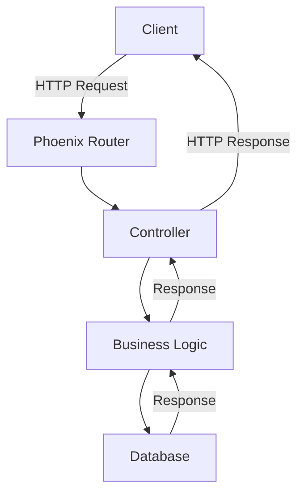
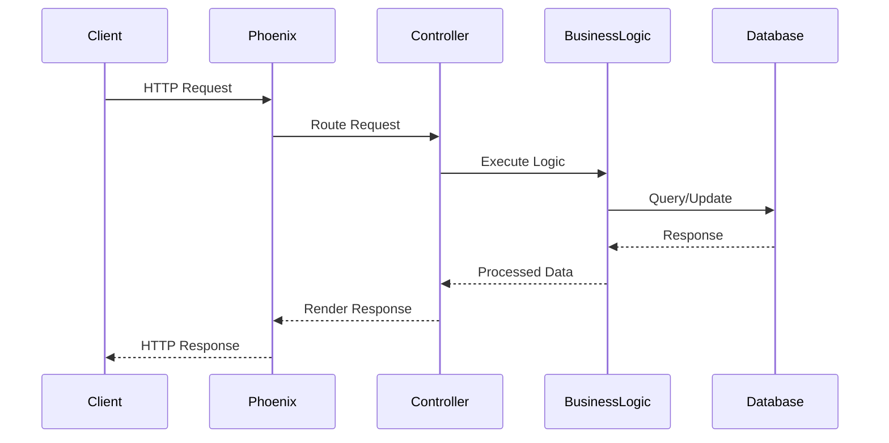

## 30.3. Implementing Scalable APIs

In today's digital landscape, building scalable APIs is crucial for applications that need to handle high traffic and provide seamless user experiences. Elixir, with its functional programming paradigm and robust concurrency model, is an excellent choice for developing scalable APIs. In this section, we will explore the key concepts, strategies, and tools necessary to implement scalable APIs using Elixir.

### Understanding Scalability

Scalability refers to the ability of a system to handle increased load without compromising performance. For APIs, this means efficiently managing a large number of requests per second while maintaining low latency and high availability. Achieving scalability involves optimizing various aspects of the system, including database interactions, caching, and load distribution.

### Performance Goals

When implementing scalable APIs, it's essential to set clear performance goals. These goals will guide your optimization efforts and help you measure success. Common performance goals for scalable APIs include:

- **Handling thousands of requests per second**: Your API should be able to process a high volume of requests concurrently without degradation in performance.
- **Minimal latency**: Ensure that response times remain low, even under heavy load.
- **High availability**: The API should be resilient to failures and maintain uptime.

### Key Concepts in Elixir for Scalability

Elixir offers several features that make it well-suited for building scalable APIs:

- **Concurrency**: Elixir's lightweight processes and the Actor model allow for efficient handling of concurrent requests.
- **Fault Tolerance**: The "Let It Crash" philosophy and OTP (Open Telecom Platform) provide mechanisms for building resilient systems.
- **Immutability**: Immutable data structures reduce the risk of race conditions and make concurrent programming more manageable.

### Optimizations for Scalable APIs

To achieve scalability, you need to optimize various components of your API. Here are some strategies to consider:

#### Efficient Database Queries

Database interactions are often a bottleneck in API performance. To optimize database queries:

- **Use Ecto for Query Optimization**: Ecto is Elixir's database wrapper and query generator. It provides a powerful DSL for building efficient queries. Use Ecto's query composition features to minimize database load.

```elixir
# Example of an efficient Ecto query
def get_users_with_posts do
  from(u in User,
    join: p in assoc(u, :posts),
    preload: [posts: p]
  )
  |> Repo.all()
end
```

- **Indexing**: Ensure that your database tables are properly indexed to speed up query execution.
- **Connection Pooling**: Use connection pooling to manage database connections efficiently. Tools like `DBConnection` can help with this.

#### Caching Strategies

Caching can significantly reduce the load on your API by storing frequently accessed data in memory. Consider the following caching strategies:

- **In-Memory Caching with ETS**: Elixir's ETS (Erlang Term Storage) allows for fast, in-memory data storage. Use ETS for caching data that doesn't change frequently.

```elixir
# Example of using ETS for caching
defmodule Cache do
  def start_link do
    :ets.new(:my_cache, [:set, :public, :named_table])
  end

  def put(key, value) do
    :ets.insert(:my_cache, {key, value})
  end

  def get(key) do
    case :ets.lookup(:my_cache, key) do
      [{^key, value}] -> {:ok, value}
      [] -> :error
    end
  end
end
```

- **HTTP Caching**: Implement HTTP caching headers to allow clients to cache responses and reduce server load.

#### Load Testing

Load testing is crucial to ensure that your API can handle the expected traffic. Use tools like JMeter or Gatling to simulate load and identify bottlenecks.

- **JMeter**: A popular open-source tool for load testing. It allows you to create test plans and simulate multiple users accessing your API.

- **Gatling**: A powerful load testing tool that provides detailed reports and metrics. It is particularly useful for testing APIs with high concurrency.

### Real-World Impact

Implementing scalable APIs has a significant impact on real-world applications. By optimizing performance and ensuring scalability, you can:

- **Serve high-traffic applications**: Handle a large number of concurrent users without performance degradation.
- **Improve user experience**: Provide fast and reliable responses, leading to higher user satisfaction.
- **Reduce infrastructure costs**: Efficiently utilize resources, reducing the need for additional hardware.

### Case Study: Building a Scalable API with Elixir

Let's walk through a case study of building a scalable API using Elixir. We'll cover the architecture, implementation, and optimization strategies.

#### Architecture Overview

Our API will be a simple user management system with endpoints for creating, retrieving, updating, and deleting users. We'll use Phoenix, a web framework for Elixir, to handle HTTP requests.



#### Implementation

1. **Setting Up Phoenix**: Start by creating a new Phoenix project.

```bash
mix phx.new user_management --no-ecto
cd user_management
```

2. **Define Routes**: In `lib/user_management_web/router.ex`, define the routes for the API.

```elixir
scope "/api", UserManagementWeb do
  pipe_through :api

  resources "/users", UserController, except: [:new, :edit]
end
```

3. **Create Controller**: Implement the controller actions in `lib/user_management_web/controllers/user_controller.ex`.

```elixir
defmodule UserManagementWeb.UserController do
  use UserManagementWeb, :controller

  def index(conn, _params) do
    users = UserManagement.list_users()
    render(conn, "index.json", users: users)
  end

  def create(conn, %{"user" => user_params}) do
    with {:ok, %User{} = user} <- UserManagement.create_user(user_params) do
      conn
      |> put_status(:created)
      |> render("show.json", user: user)
    end
  end

  # Additional actions for show, update, delete...
end
```

4. **Business Logic**: Implement the business logic in a separate module, `lib/user_management.ex`.

```elixir
defmodule UserManagement do
  alias UserManagement.Repo
  alias UserManagement.User

  def list_users do
    Repo.all(User)
  end

  def create_user(attrs \\ %{}) do
    %User{}
    |> User.changeset(attrs)
    |> Repo.insert()
  end

  # Additional functions for update, delete...
end
```

5. **Database Schema**: Define the database schema using Ecto.

```elixir
defmodule UserManagement.User do
  use Ecto.Schema
  import Ecto.Changeset

  schema "users" do
    field :name, :string
    field :email, :string

    timestamps()
  end

  def changeset(user, attrs) do
    user
    |> cast(attrs, [:name, :email])
    |> validate_required([:name, :email])
  end
end
```

#### Optimization Strategies

- **Database Indexing**: Ensure that the `users` table is indexed on frequently queried fields, such as `email`.
- **Caching**: Use ETS to cache user data that doesn't change frequently.
- **Load Testing**: Use JMeter to simulate load and identify performance bottlenecks.

### Visualizing API Scalability

To better understand the scalability of our API, let's visualize the flow of requests and the role of different components.



### Knowledge Check

- **What are the key performance goals for scalable APIs?**
- **How can you optimize database queries in Elixir?**
- **What are some caching strategies you can use in Elixir?**
- **Why is load testing important for scalable APIs?**

### Try It Yourself

Experiment with the code examples provided in this section. Try modifying the API to include additional features, such as user authentication or role-based access control. Use load testing tools to simulate different traffic patterns and observe how your API performs.

### Conclusion

Implementing scalable APIs with Elixir involves optimizing various components, including database interactions, caching, and load distribution. By leveraging Elixir's concurrency model and functional programming paradigm, you can build APIs that handle high traffic with minimal latency. Remember, scalability is an ongoing process that requires continuous monitoring and optimization.

## Quiz: Implementing Scalable APIs



### What is a key performance goal for scalable APIs?

- [x] Handling thousands of requests per second
- [ ] Reducing the number of API endpoints
- [ ] Increasing the size of the database
- [ ] Minimizing the number of developers

> **Explanation:** A key performance goal for scalable APIs is to handle thousands of requests per second efficiently.

### Which Elixir feature helps in handling concurrent requests?

- [x] Lightweight processes
- [ ] Mutable data structures
- [ ] Global variables
- [ ] Blocking I/O operations

> **Explanation:** Elixir's lightweight processes and the Actor model allow for efficient handling of concurrent requests.

### What is the purpose of caching in scalable APIs?

- [x] To reduce server load by storing frequently accessed data
- [ ] To increase the size of the database
- [ ] To slow down response times
- [ ] To add more API endpoints

> **Explanation:** Caching reduces server load by storing frequently accessed data in memory, improving performance.

### Which tool can be used for load testing APIs?

- [x] JMeter
- [ ] Git
- [ ] Docker
- [ ] Postman

> **Explanation:** JMeter is a popular tool for load testing APIs, allowing you to simulate multiple users accessing your API.

### What is the role of ETS in Elixir?

- [x] In-memory data storage
- [ ] Database indexing
- [ ] Network communication
- [ ] File system management

> **Explanation:** ETS (Erlang Term Storage) is used for fast, in-memory data storage in Elixir.

### Why is database indexing important for scalable APIs?

- [x] To speed up query execution
- [ ] To increase the size of the database
- [ ] To slow down response times
- [ ] To add more API endpoints

> **Explanation:** Database indexing is important because it speeds up query execution, improving API performance.

### What is the "Let It Crash" philosophy in Elixir?

- [x] Building resilient systems by allowing processes to fail and recover
- [ ] Preventing any process from failing
- [ ] Ignoring errors in the system
- [ ] Disabling error logging

> **Explanation:** The "Let It Crash" philosophy involves building resilient systems by allowing processes to fail and recover gracefully.

### How can you optimize database queries in Elixir?

- [x] Using Ecto's query composition features
- [ ] Increasing the number of database connections
- [ ] Using global variables
- [ ] Disabling caching

> **Explanation:** Ecto's query composition features allow for building efficient database queries in Elixir.

### What is the benefit of using connection pooling?

- [x] Efficiently managing database connections
- [ ] Increasing the size of the database
- [ ] Slowing down response times
- [ ] Adding more API endpoints

> **Explanation:** Connection pooling helps in efficiently managing database connections, improving performance.

### True or False: Load testing is only necessary during the initial development phase.

- [ ] True
- [x] False

> **Explanation:** Load testing is an ongoing process that should be conducted regularly to ensure scalability and performance.



Remember, building scalable APIs is a journey that involves continuous learning and improvement. Keep experimenting, stay curious, and enjoy the process of creating robust and efficient systems with Elixir!
