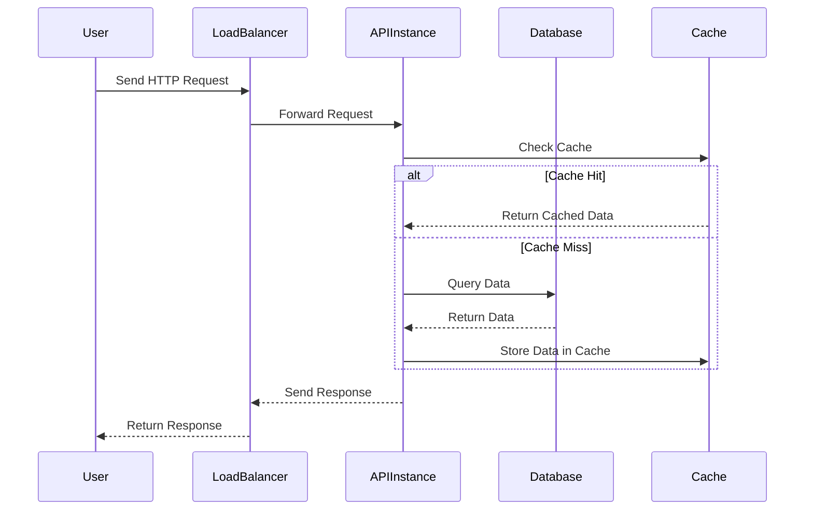

## 30.3. Implementing Scalable APIs

In today's digital landscape, building scalable APIs is crucial for handling high traffic and ensuring minimal latency. This section delves into strategies and techniques for implementing scalable APIs using Elixir, a language renowned for its concurrency and fault tolerance. We'll explore performance goals, optimizations, and real-world impacts, providing you with the tools to serve thousands of requests per second efficiently.

### Performance Goals

When designing scalable APIs, it's essential to establish clear performance goals. These goals will guide your architectural decisions and optimizations. Here are some key objectives:

- **Handling Thousands of Requests per Second:** Aim to support a high volume of concurrent requests without degradation in performance.
- **Minimal Latency:** Ensure that responses are delivered quickly, enhancing the user experience.
- **Efficient Resource Utilization:** Optimize CPU, memory, and network usage to reduce operational costs.
- **Fault Tolerance:** Build systems that can gracefully handle failures and recover without significant downtime.

### Optimizations

To achieve these performance goals, a range of optimizations can be applied at different levels of the stack. Let's explore some of the most effective strategies.

#### Efficient Database Queries

Database performance is often a bottleneck in API scalability. Here are some techniques to optimize database interactions:

- **Indexing:** Ensure that your database tables are appropriately indexed to speed up query execution.
- **Query Optimization:** Use tools like `EXPLAIN` in SQL to analyze and optimize query plans.
- **Connection Pooling:** Use connection pools to manage database connections efficiently, reducing the overhead of establishing new connections.
- **Caching:** Implement caching strategies to store frequently accessed data in memory, reducing the need for repetitive database queries.

#### Caching Strategies

Caching is a powerful technique to enhance API performance. Here are some caching strategies to consider:

- **In-Memory Caching:** Use Elixir's ETS (Erlang Term Storage) for fast, in-memory data storage.
- **HTTP Caching:** Leverage HTTP headers like `Cache-Control` and `ETag` to enable client-side caching.
- **Distributed Caching:** Use tools like Redis or Memcached for distributed caching across multiple nodes.

#### Using ETS for In-Memory Data

ETS is a built-in Elixir feature that provides fast, concurrent access to in-memory data. Here's how you can use ETS to improve API performance:

```elixir
defmodule MyApp.Cache do
  @table :my_cache

  def start_link do
    :ets.new(@table, [:set, :public, :named_table])
    {:ok, self()}
  end

  def put(key, value) do
    :ets.insert(@table, {key, value})
  end

  def get(key) do
    case :ets.lookup(@table, key) do
      [{^key, value}] -> {:ok, value}
      [] -> :error
    end
  end
end
```

In this example, we create a simple ETS-based cache module. The `start_link` function initializes an ETS table, and the `put` and `get` functions provide basic caching operations.

#### Load Testing

Before deploying your API, it's crucial to conduct load testing to identify potential bottlenecks and ensure scalability. Tools like JMeter and Gatling can simulate high traffic and measure your API's performance under load.

- **JMeter:** A widely-used open-source tool for load testing. It allows you to create complex test scenarios and analyze performance metrics.
- **Gatling:** A powerful tool for simulating high loads on your API. It provides detailed reports and supports scripting in Scala for advanced test scenarios.

### Real-World Impact

Implementing scalable APIs has a significant impact on real-world applications. Here are some benefits:

- **High Traffic Handling:** Scalable APIs can support millions of users, ensuring that your application remains responsive during peak times.
- **Reduced Latency:** Optimized APIs deliver fast responses, improving user satisfaction and engagement.
- **Cost Efficiency:** Efficient resource utilization reduces infrastructure costs, allowing you to scale economically.
- **Business Growth:** With a robust API, your application can support new features and integrations, driving business growth.

### Case Study: Building a Scalable API with Elixir

To illustrate these concepts, let's walk through a case study of building a scalable API using Elixir.

#### Project Overview

We'll build a simple API for a fictional e-commerce platform. The API will handle product listings, customer orders, and inventory management. Our goal is to support thousands of concurrent users with minimal latency.

#### Architecture

We'll use the following architecture:

- **Phoenix Framework:** For building the API endpoints and handling HTTP requests.
- **PostgreSQL Database:** For storing product and order data.
- **ETS for Caching:** To cache frequently accessed data, such as product details.
- **Load Balancer:** To distribute incoming requests across multiple API instances.

#### Implementation

Let's start by setting up a basic Phoenix application:

```bash
mix phx.new ecommerce_api --no-html --no-webpack
cd ecommerce_api
mix ecto.create
```

Next, we'll define a simple schema for products:

```elixir
defmodule EcommerceApi.Products.Product do
  use Ecto.Schema
  import Ecto.Changeset

  schema "products" do
    field :name, :string
    field :price, :decimal
    field :stock, :integer

    timestamps()
  end

  def changeset(product, attrs) do
    product
    |> cast(attrs, [:name, :price, :stock])
    |> validate_required([:name, :price, :stock])
  end
end
```

We'll then create a controller to handle product-related API requests:

```elixir
defmodule EcommerceApiWeb.ProductController do
  use EcommerceApiWeb, :controller

  alias EcommerceApi.Products
  alias EcommerceApi.Products.Product

  def index(conn, _params) do
    products = Products.list_products()
    json(conn, products)
  end

  def create(conn, %{"product" => product_params}) do
    with {:ok, %Product{} = product} <- Products.create_product(product_params) do
      conn
      |> put_status(:created)
      |> put_resp_header("location", Routes.product_path(conn, :show, product))
      |> json(product)
    end
  end
end
```

In this controller, we define actions for listing and creating products. The `index` action retrieves all products, while the `create` action adds a new product to the database.

#### Caching with ETS

To improve performance, we'll cache product data using ETS:

```elixir
defmodule EcommerceApi.Cache do
  @table :product_cache

  def start_link do
    :ets.new(@table, [:set, :public, :named_table])
    {:ok, self()}
  end

  def put_product(product) do
    :ets.insert(@table, {product.id, product})
  end

  def get_product(id) do
    case :ets.lookup(@table, id) do
      [{^id, product}] -> {:ok, product}
      [] -> :error
    end
  end
end
```

We'll modify the `ProductController` to use this cache:

```elixir
defmodule EcommerceApiWeb.ProductController do
  use EcommerceApiWeb, :controller

  alias EcommerceApi.Products
  alias EcommerceApi.Products.Product
  alias EcommerceApi.Cache

  def show(conn, %{"id" => id}) do
    case Cache.get_product(id) do
      {:ok, product} -> json(conn, product)
      :error ->
        with {:ok, product} <- Products.get_product(id) do
          Cache.put_product(product)
          json(conn, product)
        end
    end
  end
end
```

In the `show` action, we first check the cache for the product. If it's not found, we retrieve it from the database and store it in the cache.

#### Load Testing

Finally, we'll perform load testing using JMeter. Here's a basic test plan:

1. **Create a Thread Group:** Simulate multiple users accessing the API.
2. **Add HTTP Requests:** Define requests for listing and creating products.
3. **Configure Listeners:** Collect performance metrics and visualize the results.

### Visualizing API Architecture

To better understand the architecture of our scalable API, let's visualize it using a sequence diagram.


```mermaid
sequenceDiagram
    participant User
    participant LoadBalancer
    participant APIInstance
    participant Database
    participant Cache

    User->>LoadBalancer: Send HTTP Request
    LoadBalancer->>APIInstance: Forward Request
    APIInstance->>Cache: Check Cache
    alt Cache Hit
        Cache-->>APIInstance: Return Cached Data
    else Cache Miss
        APIInstance->>Database: Query Data
        Database-->>APIInstance: Return Data
        APIInstance->>Cache: Store Data in Cache
    end
    APIInstance-->>LoadBalancer: Send Response
    LoadBalancer-->>User: Return Response
```

This diagram illustrates the flow of a typical API request, highlighting the role of the load balancer, API instances, database, and cache.

### Conclusion

Implementing scalable APIs with Elixir involves a combination of efficient database interactions, caching strategies, and load testing. By leveraging Elixir's concurrency model and tools like ETS, you can build APIs that handle high traffic with minimal latency. Remember, scalability is a journey, not a destination. Continuously monitor and optimize your API to meet evolving demands.

### Key Takeaways

- Set clear performance goals to guide your API design.
- Optimize database queries and use caching to enhance performance.
- Leverage Elixir's built-in tools, like ETS, for fast in-memory data access.
- Conduct load testing to identify bottlenecks and ensure scalability.
- Visualize your architecture to understand data flow and identify optimization opportunities.

### Embrace the Journey

Building scalable APIs is an ongoing process. As you implement these strategies, you'll gain insights into your application's performance and identify new opportunities for improvement. Stay curious, experiment with different techniques, and enjoy the journey of creating robust, high-performance APIs.

## Quiz Time!



### What is a key performance goal when implementing scalable APIs?

- [x] Handling thousands of requests per second
- [ ] Reducing the number of API endpoints
- [ ] Increasing the size of the database
- [ ] Minimizing the number of developers

> **Explanation:** A key performance goal is to handle thousands of requests per second to ensure scalability.

### Which tool can be used for load testing APIs?

- [x] JMeter
- [ ] Git
- [ ] Docker
- [ ] Kubernetes

> **Explanation:** JMeter is a tool commonly used for load testing APIs.

### What is ETS in Elixir?

- [x] Erlang Term Storage
- [ ] Elixir Testing Suite
- [ ] Elixir Transaction System
- [ ] Erlang Thread Scheduler

> **Explanation:** ETS stands for Erlang Term Storage, used for in-memory data storage in Elixir.

### What is the purpose of caching in APIs?

- [x] To reduce the need for repetitive database queries
- [ ] To increase the number of API endpoints
- [ ] To slow down response times
- [ ] To decrease the number of users

> **Explanation:** Caching reduces the need for repetitive database queries, enhancing performance.

### Which Elixir framework is used for building API endpoints?

- [x] Phoenix
- [ ] Rails
- [ ] Django
- [ ] Spring

> **Explanation:** Phoenix is the Elixir framework used for building API endpoints.

### What is a benefit of using a load balancer in API architecture?

- [x] Distributing incoming requests across multiple instances
- [ ] Increasing the complexity of the system
- [ ] Reducing the number of servers
- [ ] Slowing down response times

> **Explanation:** A load balancer distributes incoming requests across multiple instances, enhancing scalability.

### What is the role of `EXPLAIN` in SQL?

- [x] To analyze and optimize query plans
- [ ] To delete database tables
- [ ] To create new databases
- [ ] To encrypt data

> **Explanation:** `EXPLAIN` is used to analyze and optimize query plans in SQL.

### Which caching strategy involves storing data in memory?

- [x] In-Memory Caching
- [ ] HTTP Caching
- [ ] Disk Caching
- [ ] Cloud Caching

> **Explanation:** In-Memory Caching involves storing data in memory for fast access.

### What is a common bottleneck in API scalability?

- [x] Database performance
- [ ] Number of API endpoints
- [ ] Number of developers
- [ ] Size of the codebase

> **Explanation:** Database performance is often a bottleneck in API scalability.

### True or False: Scalability is a one-time achievement.

- [ ] True
- [x] False

> **Explanation:** Scalability is an ongoing process, requiring continuous monitoring and optimization.


