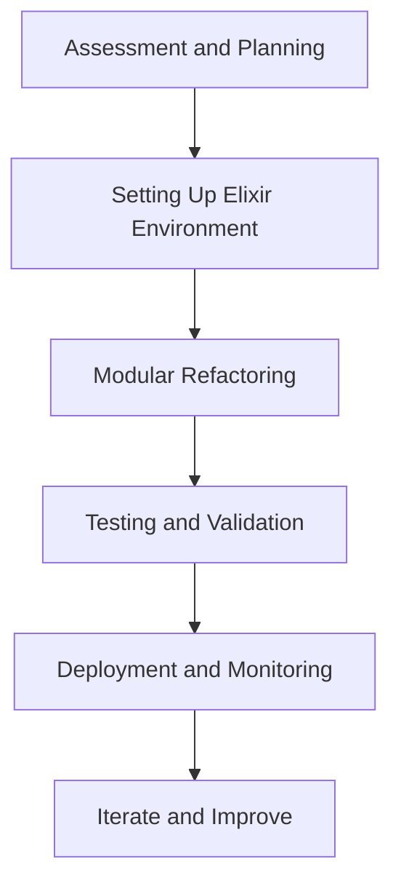

## 30.4. Refactoring a Legacy System to Elixir

Refactoring a legacy system to Elixir can be a transformative journey, offering enhanced performance, reduced resource usage, and greater reliability. This comprehensive guide will walk you through the process, from understanding the need for refactoring to implementing a successful migration strategy. We'll explore interoperability techniques and examine the outcomes of transitioning to Elixir.

### Understanding the Need for Refactoring

Before embarking on a refactoring journey, it's crucial to understand why a legacy system needs to be refactored. Legacy systems often suffer from issues such as:

- **Technical Debt**: Accumulated shortcuts and outdated practices that hinder maintainability.
- **Performance Bottlenecks**: Inefficient code that leads to slow response times and high resource consumption.
- **Scalability Limitations**: Inability to handle increased load or user demand.
- **Security Vulnerabilities**: Outdated security practices that expose the system to threats.
- **Lack of Modern Features**: Missing functionalities that are standard in modern applications.

Refactoring to Elixir addresses these issues by leveraging its functional programming paradigm, concurrency model, and robust ecosystem.

### Migration Strategy

#### Gradual Replacement vs. Complete Rewrite

One of the first decisions in refactoring is choosing between a gradual replacement and a complete rewrite. Each approach has its pros and cons:

- **Gradual Replacement**:
  - **Pros**: Lower risk, continuous delivery of value, easier rollback.
  - **Cons**: Longer timeline, potential for temporary complexity.
  
- **Complete Rewrite**:
  - **Pros**: Clean slate, opportunity to redesign architecture.
  - **Cons**: High risk, potential for scope creep, longer time before value delivery.

**Recommendation**: For most projects, a gradual replacement is advisable. It allows for iterative improvements and minimizes disruption to the business.

#### Steps in the Migration Process

1. **Assessment and Planning**:
   - Conduct a thorough assessment of the existing system.
   - Identify critical components and dependencies.
   - Develop a detailed migration plan with timelines and milestones.

2. **Setting Up the Elixir Environment**:
   - Install Elixir and its dependencies.
   - Set up development, testing, and production environments.
   - Familiarize the team with Elixir's syntax and conventions.

3. **Modular Refactoring**:
   - Break down the system into smaller, manageable modules.
   - Prioritize modules based on business impact and technical complexity.
   - Refactor each module incrementally, ensuring compatibility with the legacy system.

4. **Testing and Validation**:
   - Implement comprehensive testing strategies, including unit, integration, and acceptance tests.
   - Validate the functionality of each refactored module before deployment.

5. **Deployment and Monitoring**:
   - Deploy refactored modules to production incrementally.
   - Monitor performance and user feedback.
   - Iterate and improve based on real-world usage.

### Interoperability

Interoperability is a key consideration when refactoring a legacy system. It's essential to ensure that new Elixir components can communicate effectively with existing systems.

#### Using APIs for Integration

APIs are a powerful tool for achieving interoperability. They allow different systems to communicate using standardized protocols.

- **RESTful APIs**: Ideal for stateless interactions and widely supported across platforms.
- **GraphQL**: Offers flexibility in querying data and is suitable for complex data structures.
- **gRPC**: Provides high-performance communication using Protocol Buffers.

**Example**: Implementing a RESTful API in Elixir using Phoenix Framework.

```elixir
defmodule MyAppWeb.Router do
  use MyAppWeb, :router

  pipeline :api do
    plug :accepts, ["json"]
  end

  scope "/api", MyAppWeb do
    pipe_through :api

    get "/legacy_data", LegacyController, :index
  end
end

defmodule MyAppWeb.LegacyController do
  use MyAppWeb, :controller

  def index(conn, _params) do
    legacy_data = LegacySystem.get_data()
    json(conn, legacy_data)
  end
end
```

#### Data Synchronization

Data synchronization ensures consistency between legacy and new systems. Techniques include:

- **Database Replication**: Keeping databases in sync using replication tools.
- **Event Sourcing**: Capturing changes as events and replaying them in the new system.
- **Batch Processing**: Periodically transferring data in batches.

#### Handling Legacy Code

In some cases, it's necessary to maintain parts of the legacy code. Strategies include:

- **Encapsulation**: Wrapping legacy code in Elixir modules to abstract complexity.
- **Interfacing**: Using ports or NIFs (Native Implemented Functions) to interface with legacy code.

### Outcomes of Refactoring to Elixir

Refactoring a legacy system to Elixir can yield significant benefits:

- **Enhanced Performance**: Elixir's lightweight processes and efficient concurrency model improve performance.
- **Reduced Resource Usage**: Elixir's functional nature leads to more efficient code, reducing CPU and memory usage.
- **Greater Reliability**: Elixir's "let it crash" philosophy and robust error handling enhance system reliability.
- **Improved Scalability**: Elixir's ability to handle millions of concurrent connections makes it ideal for scalable applications.
- **Modern Features**: Access to Elixir's rich ecosystem and modern libraries enables the implementation of new features.

### Visualizing the Migration Process

Below is a flowchart illustrating the migration process from a legacy system to Elixir:



**Description**: This flowchart represents the sequential steps involved in migrating a legacy system to Elixir, emphasizing the iterative nature of the process.

### Knowledge Check

- **Question**: What are the main benefits of refactoring a legacy system to Elixir?
- **Challenge**: Implement a simple API in Elixir that interfaces with a legacy system.

### Try It Yourself

Experiment with the provided code example by modifying the API endpoint to fetch different data from the legacy system. Consider adding error handling and logging to enhance the API's robustness.

### Conclusion

Refactoring a legacy system to Elixir is a strategic decision that can lead to significant improvements in performance, reliability, and scalability. By following a structured migration strategy and leveraging Elixir's powerful features, you can transform your legacy system into a modern, efficient application.

**Remember, this is just the beginning. As you progress, you'll build more complex and interactive systems. Keep experimenting, stay curious, and enjoy the journey!**

## Quiz: Refactoring a Legacy System to Elixir



### What is a primary advantage of using Elixir for refactoring legacy systems?

- [x] Enhanced performance and scalability
- [ ] Increased complexity
- [ ] Higher resource usage
- [ ] Limited concurrency

> **Explanation:** Elixir offers enhanced performance and scalability due to its efficient concurrency model and lightweight processes.

### Which migration strategy involves replacing parts of the system incrementally?

- [x] Gradual replacement
- [ ] Complete rewrite
- [ ] Big bang approach
- [ ] Immediate overhaul

> **Explanation:** Gradual replacement involves incrementally refactoring parts of the system, reducing risk and allowing continuous delivery of value.

### What is a common method for ensuring interoperability between Elixir and legacy systems?

- [x] Using APIs
- [ ] Ignoring legacy components
- [ ] Direct database access
- [ ] Manual data entry

> **Explanation:** APIs provide a standardized way for Elixir components to communicate with legacy systems, ensuring interoperability.

### Which of the following is NOT a benefit of refactoring to Elixir?

- [ ] Enhanced performance
- [ ] Greater reliability
- [x] Increased technical debt
- [ ] Improved scalability

> **Explanation:** Refactoring to Elixir reduces technical debt by modernizing the codebase and improving maintainability.

### What is the "let it crash" philosophy in Elixir?

- [x] Allowing processes to fail and restart automatically
- [ ] Preventing all errors at any cost
- [ ] Ignoring errors completely
- [ ] Manually handling every exception

> **Explanation:** The "let it crash" philosophy involves allowing processes to fail and restart automatically, enhancing system reliability.

### Which tool is commonly used for high-performance communication in Elixir?

- [x] gRPC
- [ ] SOAP
- [ ] FTP
- [ ] SMTP

> **Explanation:** gRPC provides high-performance communication using Protocol Buffers, making it suitable for Elixir applications.

### What is a key consideration when refactoring a legacy system?

- [x] Assessing critical components and dependencies
- [ ] Ignoring existing architecture
- [ ] Rushing the process
- [ ] Avoiding testing

> **Explanation:** Assessing critical components and dependencies is crucial for planning a successful refactoring strategy.

### What is the role of testing in the migration process?

- [x] Validating functionality and ensuring quality
- [ ] Slowing down the process
- [ ] Adding unnecessary complexity
- [ ] Avoiding errors

> **Explanation:** Testing validates the functionality of refactored modules and ensures the quality of the migration process.

### Which of the following is a benefit of modular refactoring?

- [x] Easier management and testing of components
- [ ] Increased code complexity
- [ ] Longer development time
- [ ] Higher risk of failure

> **Explanation:** Modular refactoring allows for easier management and testing of components, reducing complexity and risk.

### True or False: A complete rewrite is always the best strategy for refactoring legacy systems.

- [ ] True
- [x] False

> **Explanation:** A complete rewrite is not always the best strategy due to its high risk and potential for scope creep. A gradual replacement is often more advisable.


