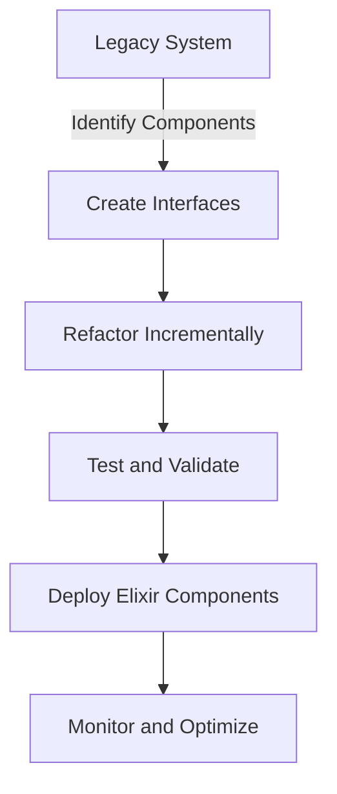

## 30.4. Refactoring a Legacy System to Elixir

Refactoring a legacy system to Elixir can be a transformative journey for any organization, offering the promise of improved performance, scalability, and maintainability. This process, however, requires a strategic approach that balances the need for innovation with the realities of existing infrastructure. In this guide, we'll explore the key aspects of migrating a legacy system to Elixir, including migration strategies, interoperability considerations, and the potential outcomes of such a transformation.

### Understanding Legacy Systems

Before diving into the refactoring process, it's crucial to understand what constitutes a legacy system. Typically, these are systems that have been in operation for several years, often built with outdated technologies or methodologies. They may suffer from issues such as poor performance, high maintenance costs, and difficulty in adapting to new business requirements.

#### Challenges of Legacy Systems

- **Technical Debt**: Accumulated shortcuts and outdated practices that hinder performance and scalability.
- **Complexity**: Over time, systems become convoluted, making them difficult to understand and modify.
- **Skill Gaps**: Legacy technologies may not be well-known among newer developers, leading to a scarcity of expertise.
- **Integration Issues**: Difficulty in integrating with modern systems or technologies.

### Why Elixir?

Elixir, with its functional programming paradigm and robust concurrency model, is an excellent choice for modernizing legacy systems. Built on the Erlang VM, Elixir offers:

- **Scalability**: Designed to handle a large number of concurrent connections efficiently.
- **Fault Tolerance**: The "let it crash" philosophy ensures systems can recover gracefully from errors.
- **Maintainability**: Elixir's syntax and functional nature promote clean, maintainable code.
- **Performance**: Optimized for low-latency, high-throughput applications.

### Migration Strategy

When planning a migration to Elixir, it's essential to choose a strategy that aligns with your organization's goals and constraints. Here, we discuss two primary approaches: gradual replacement and complete rewrite.

#### Gradual Replacement

Gradual replacement involves incrementally refactoring parts of the legacy system while keeping it operational. This approach minimizes risk and allows for continuous delivery of value.

- **Advantages**:
  - Reduced risk by maintaining system functionality during migration.
  - Easier to test and validate changes incrementally.
  - Allows for learning and adaptation throughout the process.

- **Disadvantages**:
  - May take longer to complete the migration.
  - Requires careful management of interfaces between new and old components.

**Example Workflow**:

1. **Identify Critical Components**: Determine which parts of the system would benefit most from refactoring.
2. **Create Interfaces**: Develop APIs or other interfaces to allow new Elixir components to interact with legacy parts.
3. **Refactor Incrementally**: Gradually replace components, starting with those that are most isolated or have the least dependencies.
4. **Test and Validate**: Continuously test the system to ensure new components work seamlessly with existing ones.

#### Complete Rewrite

A complete rewrite involves rebuilding the entire system in Elixir from scratch. This approach can be beneficial if the legacy system is too outdated or complex to refactor effectively.

- **Advantages**:
  - Opportunity to redesign the system architecture for optimal performance and scalability.
  - Eliminates technical debt and outdated practices entirely.
  - Allows for the adoption of modern design patterns and technologies.

- **Disadvantages**:
  - Higher initial risk and cost.
  - Requires significant resources and time.
  - Potential for disruption if not managed carefully.

**Example Workflow**:

1. **Requirements Gathering**: Thoroughly document the existing system's functionality and desired improvements.
2. **Design New Architecture**: Plan a new system architecture that leverages Elixir's strengths.
3. **Develop in Stages**: Build the new system in stages, focusing on core functionalities first.
4. **Parallel Testing**: Run the new system alongside the legacy system to compare performance and correctness.
5. **Cutover Plan**: Develop a detailed plan for switching from the legacy system to the new Elixir-based system.

### Interoperability

During the migration process, ensuring interoperability between Elixir components and legacy systems is crucial. This can be achieved through several techniques:

#### Using APIs

APIs serve as a bridge between Elixir and legacy systems, allowing for seamless communication and data exchange.

- **RESTful APIs**: Commonly used for web-based interactions, RESTful APIs can facilitate communication between Elixir and legacy systems.
- **gRPC**: A high-performance, language-agnostic RPC framework that can be used for more efficient communication.

#### Message Queues

Message queues like RabbitMQ or Kafka can decouple Elixir components from legacy systems, allowing for asynchronous communication.

- **Benefits**:
  - Increased resilience and fault tolerance.
  - Improved scalability by decoupling components.
  - Flexibility in handling different message formats and protocols.

#### Data Synchronization

Data synchronization ensures that both Elixir and legacy systems have access to up-to-date information.

- **Techniques**:
  - **Database Replication**: Use database replication to keep data consistent across systems.
  - **ETL Processes**: Extract, transform, and load data between systems to ensure consistency.

### Outcomes of Migrating to Elixir

Migrating a legacy system to Elixir can yield several significant benefits:

#### Enhanced Performance

Elixir's concurrency model and efficient use of resources lead to improved system performance, particularly in high-load scenarios.

#### Reduced Resource Usage

Elixir's lightweight processes and efficient memory management can reduce the overall resource consumption of the system.

#### Greater Reliability

Elixir's fault-tolerant design and robust error handling increase the reliability and uptime of the system.

#### Improved Maintainability

Elixir's functional programming paradigm and clean syntax promote maintainable code, reducing the long-term cost of system maintenance.

### Code Example: Refactoring a Legacy Component

Let's consider a simple example of refactoring a legacy component to Elixir. Suppose we have a legacy system written in Java that processes user registrations. We'll refactor this component to Elixir.

#### Legacy Java Code

```java
public class UserRegistration {
    public void registerUser(String username, String email) {
        // Validate input
        if (username == null || email == null) {
            throw new IllegalArgumentException("Username and email must not be null");
        }
        // Simulate saving to database
        System.out.println("User registered: " + username + ", " + email);
    }
}
```

#### Refactored Elixir Code

```elixir
defmodule UserRegistration do
  def register_user(username, email) when is_binary(username) and is_binary(email) do
    # Validate input
    if username == "" or email == "" do
      {:error, "Username and email must not be empty"}
    else
      # Simulate saving to database
      IO.puts("User registered: #{username}, #{email}")
      {:ok, "User registered successfully"}
    end
  end

  def register_user(_, _), do: {:error, "Invalid input"}
end
```

**Key Changes**:

- **Pattern Matching**: Used to ensure inputs are strings.
- **Error Handling**: Returns tuples for success and error, a common Elixir pattern.
- **Immutability**: Elixir functions are pure and do not modify state.

### Visualizing the Migration Process

Below is a diagram illustrating the migration process from a legacy system to Elixir:


```mermaid
flowchart TD
    A[Legacy System] -->|Identify Components| B[Create Interfaces]
    B --> C[Refactor Incrementally]
    C --> D[Test and Validate]
    D --> E[Deploy Elixir Components]
    E --> F[Monitor and Optimize]
```

**Diagram Description**: This flowchart represents the gradual replacement strategy for migrating a legacy system to Elixir. It starts with identifying critical components, creating interfaces, refactoring incrementally, testing, deploying, and finally monitoring and optimizing the new system.

### Knowledge Check

- **Question**: What are the primary benefits of refactoring a legacy system to Elixir?
- **Exercise**: Refactor a small component of a legacy system you are familiar with to Elixir, focusing on using Elixir's pattern matching and error handling.

### Embrace the Journey

Remember, refactoring a legacy system to Elixir is a journey that requires careful planning and execution. It's an opportunity to modernize your infrastructure and leverage the power of Elixir to build scalable, reliable, and maintainable systems. Stay curious, experiment with different approaches, and enjoy the process of transformation!

### References and Further Reading

- [Elixir Official Website](https://elixir-lang.org/)
- [Erlang and Elixir Ecosystem](https://www.erlang.org/)
- [Functional Programming Concepts](https://en.wikipedia.org/wiki/Functional_programming)

## Quiz Time!



### What is a key advantage of using Elixir for refactoring legacy systems?

- [x] Scalability and fault tolerance
- [ ] High memory usage
- [ ] Complexity in syntax
- [ ] Lack of community support

> **Explanation:** Elixir is known for its scalability and fault tolerance, making it an excellent choice for refactoring legacy systems.

### What is the "let it crash" philosophy in Elixir?

- [x] A design approach that allows systems to recover from errors automatically
- [ ] A method to intentionally crash systems for testing
- [ ] A debugging technique
- [ ] A way to handle exceptions manually

> **Explanation:** The "let it crash" philosophy allows Elixir systems to recover from errors automatically, enhancing reliability.

### Which of the following is a benefit of gradual replacement in migration?

- [x] Reduced risk and continuous delivery of value
- [ ] Complete elimination of technical debt immediately
- [ ] Faster migration process
- [ ] No need for testing

> **Explanation:** Gradual replacement reduces risk and allows for continuous delivery of value by maintaining system functionality during migration.

### How can APIs facilitate interoperability between Elixir and legacy systems?

- [x] By serving as a bridge for seamless communication and data exchange
- [ ] By replacing the need for data synchronization
- [ ] By eliminating the need for message queues
- [ ] By directly modifying legacy code

> **Explanation:** APIs serve as a bridge between Elixir and legacy systems, enabling seamless communication and data exchange.

### What is a disadvantage of a complete rewrite strategy?

- [x] Higher initial risk and cost
- [ ] Opportunity to redesign the system architecture
- [ ] Elimination of technical debt
- [ ] Adoption of modern design patterns

> **Explanation:** A complete rewrite involves higher initial risk and cost, making it a more resource-intensive strategy.

### Which technique can decouple Elixir components from legacy systems?

- [x] Message queues like RabbitMQ or Kafka
- [ ] Direct database queries
- [ ] Synchronous API calls
- [ ] Hardcoded connections

> **Explanation:** Message queues decouple Elixir components from legacy systems, allowing for asynchronous communication.

### What is a common Elixir pattern for error handling?

- [x] Returning tuples for success and error
- [ ] Using exceptions for all errors
- [ ] Ignoring errors
- [ ] Logging errors without handling

> **Explanation:** Returning tuples for success and error is a common pattern in Elixir for handling errors gracefully.

### Which of the following is NOT a challenge of legacy systems?

- [x] Modern design patterns
- [ ] Technical debt
- [ ] Complexity
- [ ] Skill gaps

> **Explanation:** Modern design patterns are not a challenge of legacy systems; they are often used in modernizing them.

### What is the primary focus of the gradual replacement strategy?

- [x] Incrementally refactoring parts of the legacy system
- [ ] Rebuilding the entire system from scratch
- [ ] Eliminating all technical debt immediately
- [ ] Ignoring existing infrastructure

> **Explanation:** The gradual replacement strategy focuses on incrementally refactoring parts of the legacy system to minimize risk.

### True or False: Elixir's functional programming paradigm promotes maintainable code.

- [x] True
- [ ] False

> **Explanation:** Elixir's functional programming paradigm promotes maintainable code by encouraging clean and concise syntax.




