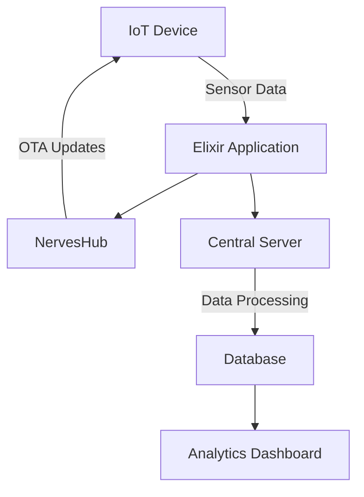

## 30.5. Designing an IoT Platform with Nerves

In this section, we will delve into the process of designing an Internet of Things (IoT) platform using the Nerves framework in Elixir. Nerves is a powerful tool for building embedded systems with Elixir, allowing developers to run Elixir directly on devices like Raspberry Pi. We'll explore hardware integration, data collection, remote management, and scalability, providing you with the knowledge to build robust IoT solutions.

### Introduction to Nerves

Nerves is an open-source platform that allows developers to build and deploy embedded systems using Elixir. It provides a streamlined way to create firmware for devices, leveraging the power of the BEAM virtual machine for concurrency and fault tolerance. Nerves is particularly well-suited for IoT applications due to its ability to handle real-time data processing and its robust support for hardware integration.

### Hardware Integration

#### Running Elixir on Devices

One of the key features of Nerves is its ability to run Elixir directly on hardware devices. This is achieved by creating a minimal Linux-based operating system tailored for the target hardware, such as Raspberry Pi, BeagleBone, or custom boards. Nerves provides a set of tools and libraries to facilitate this process, including:

- **Nerves System**: A base system image that includes the Linux kernel, Erlang runtime, and essential libraries.
- **Nerves Toolchain**: A cross-compilation toolchain for building Elixir applications for the target hardware.
- **Nerves Firmware**: A mechanism for packaging and deploying firmware updates to devices.

#### Example: Setting Up a Raspberry Pi with Nerves

Let's walk through the process of setting up a Raspberry Pi to run an Elixir application using Nerves.

```elixir
# Install the Nerves Bootstrap
mix archive.install hex nerves_bootstrap

# Create a new Nerves project
mix nerves.new my_nerves_project

# Navigate to the project directory
cd my_nerves_project

# Configure the target hardware (e.g., Raspberry Pi 3)
export MIX_TARGET=rpi3

# Fetch dependencies
mix deps.get

# Build the firmware
mix firmware

# Burn the firmware to an SD card
mix firmware.burn
```

This example demonstrates the basic steps to create a Nerves project, configure it for a Raspberry Pi, and deploy the firmware. The `MIX_TARGET` environment variable specifies the target hardware, and `mix firmware.burn` writes the firmware to an SD card for booting the Raspberry Pi.

### Data Collection

#### Gathering Sensor Data

IoT devices often need to collect data from various sensors, such as temperature, humidity, or motion sensors. Nerves provides libraries and tools to interface with hardware peripherals and gather sensor data efficiently.

#### Example: Reading Sensor Data with Elixir

Consider a scenario where we need to read temperature data from a sensor connected to a Raspberry Pi. We can use the `Circuits.GPIO` library to interface with the GPIO pins.

```elixir
defmodule SensorReader do
  use GenServer

  alias Circuits.GPIO

  def start_link(pin) do
    GenServer.start_link(__MODULE__, pin, name: __MODULE__)
  end

  def init(pin) do
    {:ok, gpio} = GPIO.open(pin, :input)
    schedule_read()
    {:ok, %{gpio: gpio}}
  end

  def handle_info(:read_sensor, state) do
    temperature = read_temperature(state.gpio)
    IO.puts("Temperature: #{temperature}°C")
    schedule_read()
    {:noreply, state}
  end

  defp read_temperature(gpio) do
    # Simulate reading temperature from a sensor
    :rand.uniform(100)
  end

  defp schedule_read() do
    Process.send_after(self(), :read_sensor, 1000)
  end
end
```

In this example, we define a `SensorReader` module that uses a GenServer to periodically read temperature data from a sensor. The `Circuits.GPIO` library is used to interact with the GPIO pins, and the `Process.send_after/3` function schedules periodic sensor readings.

### Remote Management

#### Updating Firmware Over the Air

Remote management is a crucial aspect of IoT platforms, allowing developers to update firmware and manage devices without physical access. Nerves supports over-the-air (OTA) updates, enabling seamless firmware upgrades.

#### Example: Implementing OTA Updates

To implement OTA updates, we can use the `NervesHub` service, which provides a secure and scalable platform for managing Nerves devices.

```elixir
# Add NervesHub to your project
defp deps do
  [
    {:nerves_hub, "~> 0.1"}
  ]
end

# Configure NervesHub in config.exs
config :nerves_hub,
  device: [
    identifier: "my_device",
    firmware_path: "/path/to/firmware"
  ]

# Deploy firmware updates
mix nerves_hub.deploy
```

This example shows how to integrate NervesHub into a Nerves project for OTA updates. The `nerves_hub` library is added as a dependency, and the device configuration is specified in `config.exs`. The `mix nerves_hub.deploy` command deploys firmware updates to connected devices.

### Scalability

#### Handling Large Fleets of Devices

Scalability is a critical consideration for IoT platforms, especially when managing large fleets of devices. Nerves, combined with Elixir's concurrency model, provides a robust foundation for building scalable IoT solutions.

#### Example: Managing Device Fleets with Elixir

To manage a large number of devices, we can leverage Elixir's concurrency features, such as GenServers and Supervisors, to handle communication and coordination.

```elixir
defmodule DeviceManager do
  use Supervisor

  def start_link(_) do
    Supervisor.start_link(__MODULE__, :ok, name: __MODULE__)
  end

  def init(:ok) do
    children = [
      {DeviceWorker, []}
    ]

    Supervisor.init(children, strategy: :one_for_one)
  end
end

defmodule DeviceWorker do
  use GenServer

  def start_link(_) do
    GenServer.start_link(__MODULE__, :ok, name: __MODULE__)
  end

  def init(:ok) do
    {:ok, %{}}
  end

  def handle_call({:register_device, device_id}, _from, state) do
    {:reply, :ok, Map.put(state, device_id, :registered)}
  end
end
```

In this example, we define a `DeviceManager` supervisor that manages a pool of `DeviceWorker` GenServers. Each `DeviceWorker` is responsible for handling communication with a specific device, allowing us to scale the system to handle a large number of devices efficiently.

### Visualizing IoT Architecture with Nerves

To better understand the architecture of an IoT platform built with Nerves, let's visualize the components and their interactions using a Mermaid.js diagram.



**Diagram Description:** This diagram illustrates the flow of data and interactions in a Nerves-based IoT platform. IoT devices collect sensor data and send it to an Elixir application running on the device. The application communicates with NervesHub for OTA updates and transmits data to a central server for processing and storage. The processed data is then visualized on an analytics dashboard.

### Knowledge Check

Before we conclude, let's reinforce our understanding with a few questions:

- How does Nerves facilitate running Elixir on hardware devices?
- What libraries are used for interfacing with sensors in Nerves?
- How can OTA updates be implemented in a Nerves project?
- What strategies can be employed to manage large fleets of IoT devices?

### Conclusion

Designing an IoT platform with Nerves and Elixir offers a powerful combination of concurrency, fault tolerance, and scalability. By leveraging Nerves' capabilities for hardware integration, data collection, remote management, and scalability, developers can build robust and efficient IoT solutions. Remember, this is just the beginning. As you progress, you'll discover more advanced techniques and patterns to enhance your IoT applications. Keep experimenting, stay curious, and enjoy the journey!

## Quiz: Designing an IoT Platform with Nerves



### What is Nerves primarily used for in Elixir?

- [x] Building and deploying embedded systems
- [ ] Creating web applications
- [ ] Managing databases
- [ ] Designing user interfaces

> **Explanation:** Nerves is an open-source platform for building and deploying embedded systems using Elixir.

### Which library is used for GPIO interaction in Nerves?

- [x] Circuits.GPIO
- [ ] Phoenix
- [ ] Ecto
- [ ] Plug

> **Explanation:** Circuits.GPIO is a library used for interacting with GPIO pins in Nerves projects.

### How can firmware updates be deployed over the air in Nerves?

- [x] Using NervesHub
- [ ] Through SSH
- [ ] By manually updating each device
- [ ] Using FTP

> **Explanation:** NervesHub is a service that provides secure and scalable OTA updates for Nerves devices.

### What is the purpose of the `MIX_TARGET` environment variable?

- [x] To specify the target hardware for a Nerves project
- [ ] To set the Elixir version
- [ ] To configure the database connection
- [ ] To define the application environment

> **Explanation:** The `MIX_TARGET` environment variable specifies the target hardware for which the Nerves project is being built.

### Which Elixir feature is leveraged for managing large fleets of IoT devices?

- [x] Concurrency features like GenServers and Supervisors
- [ ] Phoenix Channels
- [ ] Ecto Schemas
- [ ] Plug Middleware

> **Explanation:** Elixir's concurrency features, such as GenServers and Supervisors, are used to manage large fleets of IoT devices efficiently.

### What is the role of the `DeviceManager` module in the example?

- [x] To supervise and manage device communication
- [ ] To handle database operations
- [ ] To render web pages
- [ ] To process sensor data

> **Explanation:** The `DeviceManager` module supervises and manages communication with IoT devices using GenServers.

### How is sensor data typically collected in a Nerves application?

- [x] Using libraries like Circuits.GPIO
- [ ] Through HTTP requests
- [ ] By reading from a database
- [ ] Using WebSockets

> **Explanation:** Sensor data is typically collected using libraries like Circuits.GPIO, which interface with hardware peripherals.

### What is the primary benefit of using Nerves for IoT applications?

- [x] Real-time data processing and robust hardware support
- [ ] Simplified web development
- [ ] Enhanced database management
- [ ] Improved user interface design

> **Explanation:** Nerves provides real-time data processing capabilities and robust support for hardware integration, making it ideal for IoT applications.

### Which tool is used to create a new Nerves project?

- [x] mix nerves.new
- [ ] mix phx.new
- [ ] mix ecto.new
- [ ] mix plug.new

> **Explanation:** The `mix nerves.new` command is used to create a new Nerves project.

### True or False: Nerves can only be used with Raspberry Pi devices.

- [ ] True
- [x] False

> **Explanation:** Nerves can be used with various hardware platforms, including Raspberry Pi, BeagleBone, and custom boards.




