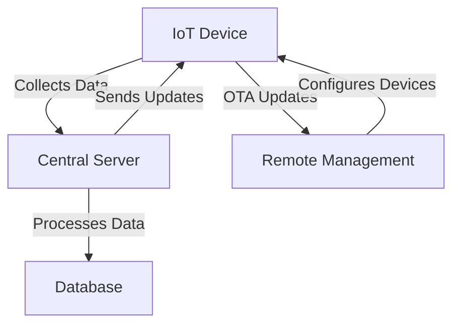

## 30.5. Designing an IoT Platform with Nerves

In the rapidly evolving world of the Internet of Things (IoT), building a robust and scalable platform is crucial for managing a vast array of connected devices. Elixir, with its concurrency model and fault-tolerant capabilities, combined with the Nerves framework, offers a powerful solution for developing IoT systems. This guide will walk you through the essential components of designing an IoT platform using Nerves, focusing on hardware integration, data collection, remote management, and scalability.

### Introduction to Nerves and IoT

Nerves is a framework for building embedded software with Elixir. It leverages the power of the BEAM (Erlang Virtual Machine) to provide a reliable and efficient environment for IoT applications. By running Elixir directly on devices like Raspberry Pi, developers can harness the language's strengths in handling concurrent processes and building fault-tolerant systems.

#### Key Features of Nerves

- **Minimal Footprint**: Nerves creates minimal firmware images, optimized for embedded systems.
- **Cross-Compilation**: Easily compile Elixir applications for various hardware targets.
- **Robust Networking**: Built-in support for Wi-Fi, Ethernet, and cellular connections.
- **OTA Updates**: Securely update firmware over the air.

### Hardware Integration

One of the first steps in designing an IoT platform is integrating with hardware devices. Nerves supports a wide range of hardware, including Raspberry Pi, BeagleBone, and other ARM-based systems.

#### Running Elixir on Raspberry Pi

To get started with Nerves on a Raspberry Pi, follow these steps:

1. **Set Up Your Development Environment**

   Ensure you have Elixir and Nerves installed on your machine. Use the following commands to install Nerves:

   ```bash
   mix archive.install hex nerves_bootstrap
   ```

2. **Create a New Nerves Project**

   Use the `mix nerves.new` command to create a new project:

   ```bash
   mix nerves.new my_iot_device
   cd my_iot_device
   ```

3. **Configure for Raspberry Pi**

   Modify the `mix.exs` file to specify the target hardware:

   ```elixir
   defp deps do
     [
       {:nerves, "~> 1.7", runtime: false},
       {:nerves_runtime, "~> 0.11"},
       {:nerves_pack, "~> 0.4"},
       {:nerves_system_rpi, "~> 1.13", runtime: false}
     ]
   end
   ```

4. **Build and Deploy**

   Build the firmware and deploy it to the Raspberry Pi:

   ```bash
   mix deps.get
   mix firmware
   mix firmware.burn
   ```

   Insert the SD card into the Raspberry Pi and power it on.

#### Interfacing with Sensors and Actuators

Nerves provides libraries like `circuits_gpio` and `circuits_i2c` for interfacing with sensors and actuators. Here's an example of reading data from a temperature sensor using GPIO:

```elixir
alias Circuits.GPIO

{:ok, pin} = GPIO.open(4, :input)

def read_temperature(pin) do
  GPIO.read(pin)
end
```

### Data Collection

Collecting and transmitting data from devices is a core functionality of any IoT platform. With Elixir and Nerves, you can efficiently gather sensor data and send it to a central server for analysis.

#### Gathering Sensor Data

Use Elixir's powerful pattern matching and concurrency features to handle data collection efficiently. Here's an example of gathering data from multiple sensors:

```elixir
defmodule SensorCollector do
  use GenServer

  def start_link(_) do
    GenServer.start_link(__MODULE__, %{}, name: __MODULE__)
  end

  def init(state) do
    schedule_reading()
    {:ok, state}
  end

  def handle_info(:read_sensors, state) do
    temperature = read_temperature()
    humidity = read_humidity()
    IO.puts("Temperature: #{temperature}, Humidity: #{humidity}")
    schedule_reading()
    {:noreply, state}
  end

  defp schedule_reading do
    Process.send_after(self(), :read_sensors, 5_000)
  end
end
```

#### Transmitting Data to a Central Server

Use protocols like MQTT or HTTP to transmit data. Here's an example of sending data using HTTP:

```elixir
def send_data(temperature, humidity) do
  payload = %{temperature: temperature, humidity: humidity}
  HTTPoison.post("http://central-server.com/data", Jason.encode!(payload), [{"Content-Type", "application/json"}])
end
```

### Remote Management

Managing devices remotely is essential for IoT platforms, allowing for firmware updates and configuration changes without physical access.

#### Over-the-Air (OTA) Updates

Nerves supports OTA updates, enabling you to update device firmware securely. Use the `nerves_firmware_ssh` library to facilitate this process.

1. **Add the Dependency**

   Update your `mix.exs` file:

   ```elixir
   defp deps do
     [
       {:nerves_firmware_ssh, "~> 0.4"}
     ]
   end
   ```

2. **Configure SSH Keys**

   Generate SSH keys and configure them for secure access.

3. **Deploy Updates**

   Use the following command to deploy updates:

   ```bash
   mix firmware.push
   ```

#### Managing Device Configurations

Use Elixir's configuration management capabilities to manage device settings. Here's an example of dynamically updating configuration:

```elixir
defmodule ConfigManager do
  def update_config(new_config) do
    Application.put_env(:my_iot_device, :config, new_config)
  end
end
```

### Scalability

Handling a large fleet of devices requires careful consideration of scalability and security.

#### Secure Communication

Ensure all communications between devices and servers are encrypted. Use libraries like `ssl` and `tls` for secure connections.

#### Load Balancing and Fault Tolerance

Leverage Elixir's built-in support for distributed systems to scale your IoT platform. Use `GenServer` and `Supervisor` to manage processes and ensure fault tolerance.

### Visualizing the IoT Architecture

Below is a diagram that illustrates the architecture of an IoT platform using Nerves:


```mermaid
graph TD;
    A[IoT Device] -->|Collects Data| B[Central Server];
    B -->|Processes Data| C[Database];
    B -->|Sends Updates| A;
    A -->|OTA Updates| D[Remote Management];
    D -->|Configures Devices| A;
```

**Diagram Description**: This diagram shows the flow of data from IoT devices to a central server, where data is processed and stored. The server also manages OTA updates and device configurations.

### Knowledge Check

**Question**: What are the benefits of using Elixir and Nerves for IoT development?

- **Answer**: Elixir and Nerves provide a robust environment for IoT development, offering features like concurrency, fault tolerance, minimal footprint, and OTA updates.

### Try It Yourself

Experiment with the code examples provided in this guide. Try modifying the sensor data collection interval or implementing additional sensors. Consider integrating a new communication protocol for data transmission.

### Conclusion

Designing an IoT platform with Nerves and Elixir provides a powerful combination of reliability, scalability, and ease of use. By leveraging Elixir's strengths and the Nerves framework, you can build an efficient and secure IoT system capable of managing a large fleet of devices.

Remember, this is just the beginning. As you progress, you'll discover more advanced techniques and optimizations. Keep experimenting, stay curious, and enjoy the journey!

## Quiz Time!



### What is the primary advantage of using Nerves for IoT development?

- [x] Minimal firmware footprint
- [ ] High memory usage
- [ ] Limited hardware support
- [ ] Complex configuration

> **Explanation:** Nerves creates minimal firmware images optimized for embedded systems, making it ideal for IoT development.

### Which Elixir feature is crucial for handling concurrent processes in IoT applications?

- [x] GenServer
- [ ] ETS
- [ ] Enum
- [ ] Supervisor

> **Explanation:** GenServer is an Elixir feature that provides a generic server process, crucial for managing concurrent tasks in IoT applications.

### How can you securely update firmware on IoT devices using Nerves?

- [x] Over-the-Air (OTA) updates
- [ ] Manual updates
- [ ] USB flash drive
- [ ] SD card swapping

> **Explanation:** Nerves supports OTA updates, allowing secure firmware updates without physical access to the device.

### What library can be used for interfacing with GPIO in Nerves?

- [x] Circuits.GPIO
- [ ] Phoenix
- [ ] Ecto
- [ ] Plug

> **Explanation:** Circuits.GPIO is a library used for interfacing with GPIO pins in Nerves applications.

### Which protocol is commonly used for transmitting data from IoT devices to a central server?

- [x] MQTT
- [ ] FTP
- [ ] SMTP
- [ ] POP3

> **Explanation:** MQTT is a lightweight messaging protocol commonly used for transmitting data from IoT devices to servers.

### What is the role of a Supervisor in an Elixir IoT application?

- [x] Managing process lifecycle and fault tolerance
- [ ] Storing data
- [ ] Rendering web pages
- [ ] Compiling code

> **Explanation:** Supervisors manage the lifecycle of processes and ensure fault tolerance in Elixir applications.

### How can you manage device configurations dynamically in an IoT platform?

- [x] Using Elixir's Application environment
- [ ] Hardcoding values
- [ ] Using XML files
- [ ] Manual configuration

> **Explanation:** Elixir's Application environment allows dynamic management of device configurations.

### What is a key consideration when scaling an IoT platform?

- [x] Secure communication
- [ ] Increasing device size
- [ ] Reducing device count
- [ ] Limiting data collection

> **Explanation:** Secure communication is crucial when scaling an IoT platform to ensure data integrity and privacy.

### Which Elixir library is used for HTTP requests in IoT applications?

- [x] HTTPoison
- [ ] Phoenix
- [ ] Ecto
- [ ] Plug

> **Explanation:** HTTPoison is a popular Elixir library for making HTTP requests, often used in IoT applications for data transmission.

### True or False: Nerves can only be used with Raspberry Pi.

- [ ] True
- [x] False

> **Explanation:** Nerves supports a variety of hardware platforms, including Raspberry Pi, BeagleBone, and other ARM-based systems.



---
