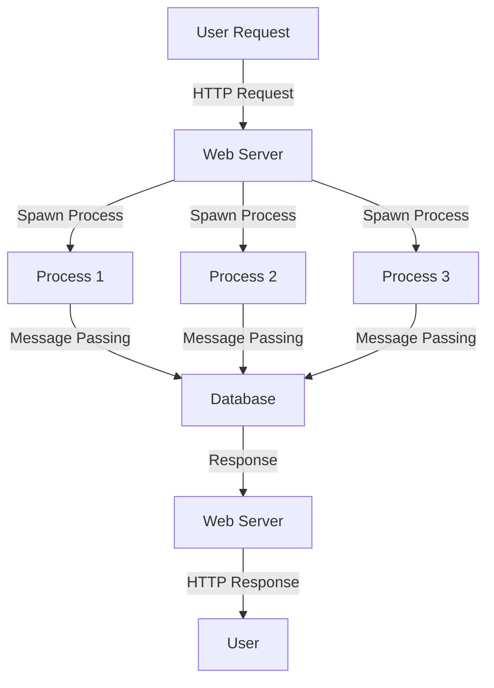

## 30.6. High-Concurrency Web Applications

In today's digital landscape, the demand for high-concurrency web applications is ever-growing. Whether it's social media platforms, real-time dashboards, or live streaming services, users expect seamless and responsive experiences even under heavy loads. Elixir, with its robust concurrency model and the power of the BEAM VM, is uniquely positioned to meet these demands. In this section, we'll explore how to leverage Elixir's features to build high-concurrency web applications, focusing on the concurrency model, use cases, and success metrics.

### Concurrency Model

Elixir's concurrency model is built on the BEAM VM, which is designed to handle millions of lightweight processes efficiently. This model is inspired by the actor model, where each process is isolated and communicates with others through message passing. This architecture provides several advantages:

- **Fault Tolerance**: Processes are isolated, so a failure in one doesn't affect others.
- **Scalability**: The ability to spawn millions of processes allows for scalable applications.
- **Responsiveness**: Non-blocking operations ensure that applications remain responsive.

#### Leveraging BEAM's Lightweight Processes

The BEAM VM's ability to handle lightweight processes is a cornerstone of Elixir's concurrency model. Each process in Elixir is a separate entity with its own memory space, which allows for true parallelism. Here's a simple example of spawning processes in Elixir:

```elixir
defmodule ConcurrencyExample do
  def start_processes do
    for i <- 1..10 do
      spawn(fn -> process_task(i) end)
    end
  end

  defp process_task(i) do
    IO.puts("Process #{i} is running")
    :timer.sleep(1000)
    IO.puts("Process #{i} has finished")
  end
end

ConcurrencyExample.start_processes()
```

In this example, we spawn ten processes, each executing a task independently. The `spawn/1` function creates a new process, and the task is defined in the `process_task/1` function. This demonstrates how Elixir can handle multiple tasks concurrently.

#### OTP and Concurrency

The Open Telecom Platform (OTP) is a set of libraries and design principles for building concurrent applications. OTP provides abstractions like GenServer, Supervisor, and Application, which simplify the development of fault-tolerant systems.

- **GenServer**: A generic server process that abstracts common patterns for process communication.
- **Supervisor**: A process that monitors other processes and restarts them if they fail.
- **Application**: A component that encapsulates the entire application lifecycle.

Here's an example of a simple GenServer:

```elixir
defmodule Counter do
  use GenServer

  # Client API
  def start_link(initial_value) do
    GenServer.start_link(__MODULE__, initial_value, name: __MODULE__)
  end

  def increment do
    GenServer.cast(__MODULE__, :increment)
  end

  def get_value do
    GenServer.call(__MODULE__, :get_value)
  end

  # Server Callbacks
  def init(initial_value) do
    {:ok, initial_value}
  end

  def handle_cast(:increment, state) do
    {:noreply, state + 1}
  end

  def handle_call(:get_value, _from, state) do
    {:reply, state, state}
  end
end

{:ok, _} = Counter.start_link(0)
Counter.increment()
IO.puts("Counter value: #{Counter.get_value()}")
```

In this example, the `Counter` module is a GenServer that maintains a counter state. It provides functions to increment the counter and retrieve its value. The GenServer handles asynchronous messages with `handle_cast/2` and synchronous messages with `handle_call/3`.

### Use Cases

High-concurrency web applications are essential in various domains. Let's explore some common use cases where Elixir's concurrency model shines:

#### Social Media Platforms

Social media platforms require handling a massive number of concurrent users, real-time updates, and interactions. Elixir's ability to manage millions of processes makes it ideal for building scalable social media applications.

#### Real-Time Dashboards

Real-time dashboards provide users with live data updates. Elixir's concurrency model ensures that data streams are processed efficiently, delivering timely updates to users without lag.

#### Live Streaming Services

Live streaming services demand high throughput and low latency. Elixir's non-blocking operations and fault-tolerant design make it well-suited for handling the complexities of live streaming.

### Success Metrics

When building high-concurrency web applications, it's crucial to define success metrics to evaluate performance and user experience. Here are some key metrics to consider:

- **High Uptime**: The application should be available and responsive at all times, even under heavy loads.
- **Responsive Interfaces**: Users should experience minimal latency and smooth interactions.
- **Scalability**: The application should handle increasing numbers of users and data without degradation in performance.

### Visualizing Elixir's Concurrency Model

To better understand Elixir's concurrency model, let's visualize the process interactions using a Mermaid.js diagram:



This diagram illustrates how a web server handles user requests by spawning multiple processes. Each process communicates with a database through message passing, and the results are sent back to the user.

### Design Considerations

When designing high-concurrency web applications with Elixir, consider the following:

- **Process Isolation**: Ensure that processes are isolated to prevent failures from affecting the entire system.
- **Supervision Trees**: Use supervision trees to manage process lifecycles and recover from failures.
- **Load Balancing**: Distribute workloads evenly across processes to optimize resource utilization.
- **Monitoring and Logging**: Implement monitoring and logging to track performance and diagnose issues.

### Elixir Unique Features

Elixir offers several unique features that enhance its concurrency capabilities:

- **Immutable Data**: Elixir's immutable data structures prevent shared mutable state, reducing the risk of race conditions.
- **Pattern Matching**: Pattern matching simplifies process communication and data handling.
- **Hot Code Swapping**: Elixir supports hot code swapping, allowing you to update running applications without downtime.

### Differences and Similarities

Elixir's concurrency model is often compared to other languages like Node.js and Go. While Node.js uses an event-driven model and Go uses goroutines, Elixir's process-based model provides superior fault tolerance and scalability.

### Try It Yourself

To deepen your understanding, try modifying the code examples provided. Experiment with different numbers of processes, implement additional GenServer callbacks, or integrate a database for persistent storage. This hands-on approach will help solidify your knowledge of Elixir's concurrency model.

### Knowledge Check

- **Question**: What are the key advantages of Elixir's concurrency model?
- **Exercise**: Implement a GenServer that manages a list of tasks, allowing tasks to be added, removed, and listed.

### Embrace the Journey

Remember, mastering high-concurrency web applications with Elixir is a journey. As you progress, you'll build more complex and scalable systems. Keep experimenting, stay curious, and enjoy the journey!

## Quiz: High-Concurrency Web Applications



### What is a key advantage of Elixir's concurrency model?

- [x] Fault tolerance
- [ ] Shared mutable state
- [ ] Blocking operations
- [ ] Single-threaded execution

> **Explanation:** Elixir's concurrency model is based on the actor model, which provides fault tolerance through process isolation.

### Which OTP component is responsible for monitoring processes?

- [ ] GenServer
- [x] Supervisor
- [ ] Application
- [ ] Task

> **Explanation:** A Supervisor is an OTP component that monitors other processes and restarts them if they fail.

### What is the purpose of the `spawn/1` function in Elixir?

- [x] To create a new process
- [ ] To terminate a process
- [ ] To send a message to a process
- [ ] To block a process

> **Explanation:** The `spawn/1` function is used to create a new process in Elixir.

### How does Elixir handle process communication?

- [x] Message passing
- [ ] Shared memory
- [ ] Global variables
- [ ] Direct function calls

> **Explanation:** Elixir processes communicate through message passing, which ensures isolation and fault tolerance.

### Which of the following is a use case for high-concurrency web applications?

- [x] Real-time dashboards
- [ ] Static websites
- [ ] Single-user applications
- [ ] Command-line tools

> **Explanation:** Real-time dashboards require handling multiple concurrent connections and data streams, making them a suitable use case for high-concurrency web applications.

### What is the role of a GenServer in Elixir?

- [x] To abstract common patterns for process communication
- [ ] To manage application lifecycle
- [ ] To monitor processes
- [ ] To handle HTTP requests

> **Explanation:** A GenServer is a generic server process that abstracts common patterns for process communication and state management.

### Which feature of Elixir prevents shared mutable state?

- [x] Immutable data
- [ ] Global variables
- [ ] Thread locks
- [ ] Synchronized blocks

> **Explanation:** Elixir's immutable data structures prevent shared mutable state, reducing the risk of race conditions.

### What is a success metric for high-concurrency web applications?

- [x] High uptime
- [ ] Low user engagement
- [ ] High latency
- [ ] Frequent downtime

> **Explanation:** High uptime is a critical success metric for high-concurrency web applications, ensuring availability and responsiveness.

### Which diagramming tool is used to visualize Elixir's concurrency model in this guide?

- [x] Mermaid.js
- [ ] UML
- [ ] Graphviz
- [ ] PlantUML

> **Explanation:** Mermaid.js is used in this guide to create diagrams that visualize Elixir's concurrency model.

### True or False: Elixir supports hot code swapping.

- [x] True
- [ ] False

> **Explanation:** Elixir supports hot code swapping, allowing updates to running applications without downtime.



By understanding and applying these concepts, you'll be well-equipped to build high-concurrency web applications with Elixir. Keep exploring and pushing the boundaries of what's possible with this powerful language!
