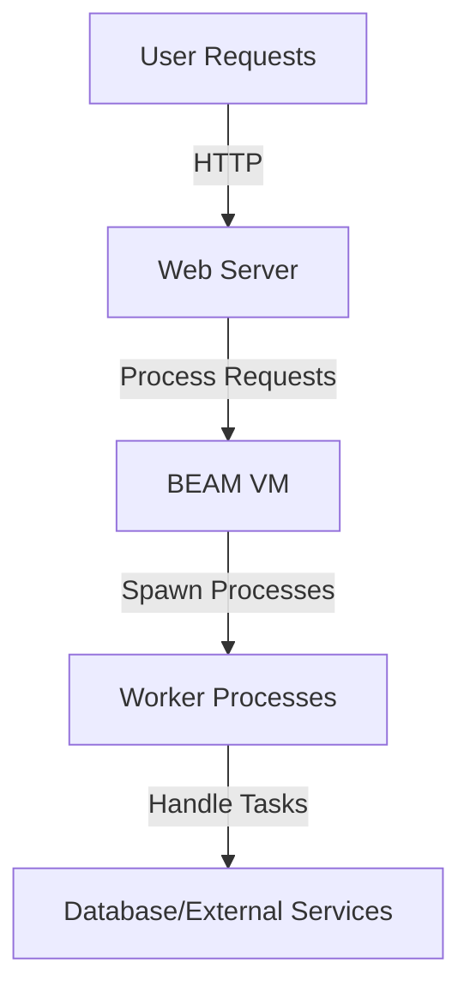

## 30.6. High-Concurrency Web Applications

In today's digital age, the demand for high-concurrency web applications has surged. Applications like social media platforms, real-time dashboards, and live streaming services require systems that can handle massive numbers of simultaneous connections while maintaining responsive interfaces. Elixir, with its robust concurrency model and the BEAM virtual machine, offers a powerful solution for building such applications.

### Understanding the Concurrency Model

Elixir's concurrency model is built on the foundations of the BEAM VM, which allows it to handle millions of lightweight processes efficiently. This capability is crucial for developing high-concurrency web applications. Let's delve deeper into the components that make this possible.

#### Leveraging BEAM's Lightweight Processes

The BEAM VM, originally designed for Erlang, is renowned for its ability to manage numerous concurrent processes. Unlike traditional operating system threads, BEAM processes are lightweight and isolated, allowing for efficient scheduling and execution.

- **Isolation:** Each process in BEAM has its own memory space, preventing issues like shared state corruption and making it easier to write fault-tolerant applications.
- **Preemptive Scheduling:** BEAM uses a preemptive scheduler to ensure that all processes get a fair share of CPU time, preventing any single process from monopolizing resources.
- **Message Passing:** Processes communicate via message passing, which is both safe and efficient. This model eliminates the need for locks, reducing complexity and potential deadlocks.

#### Code Example: Creating a Simple Process

```elixir
defmodule ConcurrencyExample do
  def start do
    spawn(fn -> loop(0) end)
  end

  defp loop(count) do
    IO.puts("Process count: #{count}")
    Process.sleep(1000)
    loop(count + 1)
  end
end

# Start the process
ConcurrencyExample.start()
```

In this example, we create a simple process that counts indefinitely. Notice how we use `spawn/1` to initiate the process, demonstrating the ease with which Elixir handles concurrency.

### Use Cases for High-Concurrency Applications

High-concurrency web applications are prevalent in various domains. Here are some notable use cases:

#### Social Media Platforms

Social media platforms require the ability to handle thousands of simultaneous user interactions, such as posting updates, liking content, and messaging.

- **Real-Time Notifications:** Elixir's concurrency model allows for efficient handling of real-time notifications, ensuring users receive updates promptly.
- **Scalable Chat Systems:** With Elixir, you can build scalable chat systems that support numerous concurrent users without performance degradation.

#### Real-Time Dashboards

Real-time dashboards provide users with live data updates, often used in financial services, logistics, and monitoring systems.

- **Data Streaming:** Elixir's processes can manage continuous data streams, updating dashboards in real-time without latency issues.
- **Event Processing:** By leveraging GenStage and Flow, Elixir can efficiently process and visualize large volumes of events.

#### Live Streaming Services

Live streaming services demand low-latency and high-throughput systems to deliver seamless video and audio streams.

- **Concurrent Video Streams:** Elixir can manage multiple video streams concurrently, ensuring smooth playback for all users.
- **Scalable Infrastructure:** The ability to scale processes dynamically allows for handling peak loads during popular events.

### Success Metrics for High-Concurrency Applications

When building high-concurrency web applications, it's essential to define success metrics to evaluate performance and user satisfaction.

#### High Uptime

- **Reliability:** Ensure your application maintains high availability, minimizing downtime and ensuring continuous service.
- **Fault Tolerance:** Implement supervisory strategies to recover from failures quickly, maintaining system stability.

#### Responsive Interfaces Under Heavy Loads

- **Low Latency:** Optimize your application to deliver fast response times, even under heavy user loads.
- **Efficient Resource Utilization:** Monitor and manage system resources to prevent bottlenecks and ensure smooth operation.

### Best Practices for Developing High-Concurrency Web Applications

Building high-concurrency applications in Elixir requires adhering to best practices to maximize performance and maintainability.

#### Design for Fault Tolerance

- **Supervision Trees:** Use supervision trees to manage process lifecycles and recover from failures automatically.
- **Let It Crash Philosophy:** Embrace the "let it crash" philosophy by designing processes that can fail and restart without affecting the overall system.

#### Optimize Process Communication

- **Message Passing:** Ensure efficient message passing between processes to avoid bottlenecks and latency issues.
- **Process Pooling:** Implement process pools to manage resource-intensive tasks and distribute load effectively.

#### Monitor and Scale

- **Telemetry and Monitoring:** Use telemetry tools to monitor application performance and identify potential issues.
- **Dynamic Scaling:** Design your application to scale dynamically, adding or removing processes based on demand.

### Visualizing High-Concurrency Architectures

To better understand how high-concurrency architectures work, let's visualize a typical Elixir application using Mermaid.js.


```mermaid
graph TD;
    A[User Requests] -->|HTTP| B[Web Server];
    B -->|Process Requests| C[BEAM VM];
    C -->|Spawn Processes| D[Worker Processes];
    D -->|Handle Tasks| E[Database/External Services];
```

**Diagram Description:** This diagram illustrates the flow of user requests through a high-concurrency Elixir application. The web server receives requests and delegates them to the BEAM VM, which spawns worker processes to handle tasks and interact with databases or external services.

### Try It Yourself: Experimenting with Concurrency

To gain hands-on experience with Elixir's concurrency model, try modifying the code example provided earlier. Experiment with different sleep intervals or spawn multiple processes to observe how Elixir manages concurrency.

### References and Further Reading

- [Elixir Official Documentation](https://elixir-lang.org/docs.html)
- [BEAM VM and Concurrency](https://erlang.org/doc/reference_manual/processes.html)
- [Designing for Scalability with Erlang/OTP](https://www.oreilly.com/library/view/designing-for-scalability/9781449361556/)

### Knowledge Check

- **What are the key components of Elixir's concurrency model?**
- **How does the BEAM VM manage process scheduling?**
- **What are some common use cases for high-concurrency web applications?**
- **Why is fault tolerance important in high-concurrency applications?**

### Embrace the Journey

Remember, mastering high-concurrency web applications with Elixir is a continuous journey. Keep experimenting, stay curious, and enjoy the process of building scalable and responsive systems. As you progress, you'll gain deeper insights into the power of Elixir and the BEAM VM.

## Quiz Time!



### What is a key feature of the BEAM VM that supports high concurrency?

- [x] Lightweight processes
- [ ] Shared memory
- [ ] Global locks
- [ ] Thread pooling

> **Explanation:** BEAM VM supports high concurrency through lightweight processes, which are efficient and isolated.

### Which Elixir feature allows processes to communicate safely?

- [x] Message passing
- [ ] Shared state
- [ ] Global variables
- [ ] Mutex locks

> **Explanation:** Elixir processes communicate via message passing, which is safe and avoids shared state issues.

### What is a common use case for high-concurrency applications?

- [x] Real-time dashboards
- [ ] Static websites
- [ ] Batch processing
- [ ] Single-threaded applications

> **Explanation:** Real-time dashboards require high concurrency to handle continuous data updates efficiently.

### How does Elixir handle process failures?

- [x] Supervision trees
- [ ] Global error handlers
- [ ] Process locks
- [ ] Manual restarts

> **Explanation:** Elixir uses supervision trees to manage process lifecycles and recover from failures automatically.

### What is a benefit of using the "let it crash" philosophy?

- [x] Simplifies error handling
- [ ] Increases code complexity
- [ ] Requires manual intervention
- [ ] Prevents process restarts

> **Explanation:** The "let it crash" philosophy simplifies error handling by allowing processes to fail and restart automatically.

### Which tool can be used to monitor Elixir application performance?

- [x] Telemetry
- [ ] Global variables
- [ ] Mutex locks
- [ ] Manual logging

> **Explanation:** Telemetry is used to monitor Elixir application performance and identify potential issues.

### What is an advantage of using process pools?

- [x] Efficient task distribution
- [ ] Increased memory usage
- [ ] Slower response times
- [ ] Manual process management

> **Explanation:** Process pools efficiently distribute tasks and manage resource-intensive operations.

### Which diagramming tool is used to visualize Elixir architectures?

- [x] Mermaid.js
- [ ] Graphviz
- [ ] UML
- [ ] AutoCAD

> **Explanation:** Mermaid.js is used to create diagrams for visualizing Elixir architectures in this guide.

### What is a success metric for high-concurrency applications?

- [x] High uptime
- [ ] Low memory usage
- [ ] Single-threaded execution
- [ ] Manual process restarts

> **Explanation:** High uptime is a critical success metric, ensuring continuous service availability.

### True or False: Elixir processes share memory space.

- [ ] True
- [x] False

> **Explanation:** Elixir processes do not share memory space; each process has its own isolated memory.


