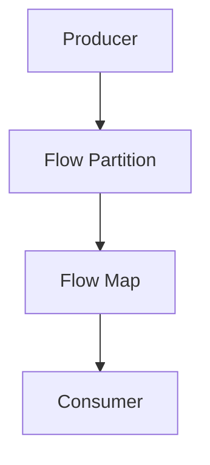

## 30.7. Event-Driven Systems with GenStage and Flow

In the world of software engineering, event-driven systems have become a cornerstone for building scalable and efficient applications. Elixir, with its robust concurrency model and functional programming paradigm, offers powerful tools like GenStage and Flow to facilitate the creation of such systems. In this section, we will delve into the concepts, applications, and benefits of using GenStage and Flow to build event-driven systems in Elixir.

### Introduction to Event-Driven Systems

Event-driven systems are architectures where the flow of the program is determined by events such as user actions, sensor outputs, or messages from other programs. These systems are particularly useful for real-time analytics, ETL (Extract, Transform, Load) processes, and job processing. They allow for efficient resource utilization and scalability, making them ideal for handling large volumes of data.

### Understanding GenStage

GenStage is a specification and computational flow for Elixir that allows you to build data pipelines with backpressure. It is designed to handle the flow of data between stages, where each stage can be a producer, consumer, or both. This model is particularly useful for processing streams of data in a controlled manner, ensuring that no stage is overwhelmed by too much data at once.

#### Key Concepts of GenStage

- **Producer**: A stage that emits data.
- **Consumer**: A stage that receives data.
- **Producer-Consumer**: A stage that both emits and receives data.
- **Backpressure**: A mechanism to control the flow of data, ensuring that producers do not overwhelm consumers.

#### Code Example: Basic GenStage Setup

Let's start with a simple example of setting up a GenStage pipeline with a producer and a consumer.

```elixir
defmodule Producer do
  use GenStage

  def start_link(initial) do
    GenStage.start_link(__MODULE__, initial, name: __MODULE__)
  end

  def init(initial) do
    {:producer, initial}
  end

  def handle_demand(demand, state) when demand > 0 do
    events = Enum.to_list(state..(state + demand - 1))
    {:noreply, events, state + demand}
  end
end

defmodule Consumer do
  use GenStage

  def start_link() do
    GenStage.start_link(__MODULE__, :ok, name: __MODULE__)
  end

  def init(:ok) do
    {:consumer, :ok}
  end

  def handle_events(events, _from, state) do
    Enum.each(events, fn event -> IO.inspect(event) end)
    {:noreply, [], state}
  end
end

{:ok, producer} = Producer.start_link(0)
{:ok, consumer} = Consumer.start_link()

GenStage.sync_subscribe(consumer, to: producer)
```

In this example, the `Producer` generates a sequence of numbers, and the `Consumer` simply prints them out. The `handle_demand` function in the producer ensures that it only generates as many numbers as requested by the consumer, demonstrating backpressure in action.

### Introducing Flow

Flow is built on top of GenStage and provides a higher-level abstraction for working with data streams. It is particularly useful for parallelizing computations and processing large datasets efficiently.

#### Key Features of Flow

- **Parallel Processing**: Flow automatically parallelizes computations across multiple stages.
- **Partitioning**: Data can be partitioned across different stages for more efficient processing.
- **Windowing**: Flow supports windowing operations, allowing you to group data into windows for batch processing.

#### Code Example: Using Flow for Parallel Processing

Let's see how Flow can be used to process a large dataset in parallel.

```elixir
alias Experimental.Flow

data = 1..1000

Flow.from_enumerable(data)
|> Flow.map(&(&1 * 2))
|> Flow.partition()
|> Flow.reduce(fn -> 0 end, &(&1 + &2))
|> Enum.to_list()
|> IO.inspect()
```

In this example, we create a flow from an enumerable range of numbers, double each number, partition the data for parallel processing, and then reduce it to a sum. The result is printed out, demonstrating how Flow can efficiently handle large datasets.

### Applications of GenStage and Flow

GenStage and Flow are particularly well-suited for applications that require real-time data processing, such as:

- **Real-Time Analytics**: Processing and analyzing data as it arrives, providing immediate insights.
- **ETL Processes**: Extracting, transforming, and loading data from various sources into a data warehouse.
- **Job Processing**: Managing and executing background jobs in a scalable manner.

### Benefits of Using GenStage and Flow

- **Scalability**: Easily scale your application by adding more stages or increasing the parallelism of existing stages.
- **Efficiency**: Optimize resource utilization by controlling the flow of data and processing it in parallel.
- **Fault Tolerance**: Leverage Elixir's robust concurrency model to build resilient systems that can recover from failures.

### Visualizing GenStage and Flow

To better understand how GenStage and Flow work together, let's visualize a simple data pipeline using Mermaid.js.



In this diagram, the producer generates data, which is then partitioned and processed in parallel by Flow, before being consumed by the consumer. This illustrates the flow of data through the pipeline and the role of each component.

### Design Considerations

When designing event-driven systems with GenStage and Flow, consider the following:

- **Data Volume**: Ensure that your system can handle the expected volume of data without overwhelming any stage.
- **Latency**: Minimize latency by optimizing the flow of data and reducing bottlenecks.
- **Error Handling**: Implement robust error handling to gracefully recover from failures and maintain system stability.

### Elixir Unique Features

Elixir's unique features, such as its lightweight processes and robust concurrency model, make it particularly well-suited for building event-driven systems. The BEAM VM, on which Elixir runs, provides excellent support for concurrent and distributed applications, allowing you to build scalable and fault-tolerant systems.

### Differences and Similarities with Other Patterns

While GenStage and Flow are specific to Elixir, similar patterns can be found in other languages and frameworks, such as Akka Streams in Scala or Reactive Streams in Java. However, Elixir's functional programming paradigm and lightweight processes offer unique advantages in terms of simplicity and performance.

### Try It Yourself

To get hands-on experience with GenStage and Flow, try modifying the code examples provided. Experiment with different data sources, transformations, and parallelism settings to see how they affect the performance and behavior of your system.

### Knowledge Check

- What are the key components of a GenStage pipeline?
- How does Flow enhance the capabilities of GenStage?
- What are some common applications of event-driven systems in Elixir?

### Conclusion

Building event-driven systems with GenStage and Flow in Elixir allows you to create scalable, efficient data pipelines for a variety of applications. By leveraging Elixir's unique features and robust concurrency model, you can design systems that are both performant and resilient. Remember, this is just the beginning. As you continue to explore and experiment with GenStage and Flow, you'll discover even more possibilities for building powerful event-driven systems.

## Quiz: Event-Driven Systems with GenStage and Flow



### What is the primary purpose of GenStage in Elixir?

- [x] To build data pipelines with backpressure
- [ ] To manage database connections
- [ ] To handle HTTP requests
- [ ] To create user interfaces

> **Explanation:** GenStage is designed to build data pipelines with backpressure, allowing for controlled data flow between stages.

### Which of the following is a key feature of Flow?

- [x] Parallel Processing
- [ ] Database Management
- [ ] User Authentication
- [ ] File I/O

> **Explanation:** Flow provides parallel processing capabilities, allowing computations to be distributed across multiple stages.

### What is backpressure in the context of GenStage?

- [x] A mechanism to control the flow of data
- [ ] A method for encrypting data
- [ ] A technique for optimizing memory usage
- [ ] A way to manage user sessions

> **Explanation:** Backpressure is a mechanism to control the flow of data, ensuring that producers do not overwhelm consumers.

### How does Flow enhance GenStage's capabilities?

- [x] By providing higher-level abstractions for working with data streams
- [ ] By adding support for HTTP requests
- [ ] By integrating with external databases
- [ ] By offering user interface components

> **Explanation:** Flow enhances GenStage by providing higher-level abstractions for working with data streams, including parallel processing and partitioning.

### What is a common application of event-driven systems in Elixir?

- [x] Real-Time Analytics
- [ ] Static Website Hosting
- [ ] Image Editing
- [ ] Video Playback

> **Explanation:** Real-time analytics is a common application of event-driven systems, allowing for immediate insights from incoming data.

### Which Elixir feature makes it particularly well-suited for event-driven systems?

- [x] Lightweight processes and robust concurrency model
- [ ] Built-in support for SQL databases
- [ ] Extensive GUI libraries
- [ ] Native support for JavaScript

> **Explanation:** Elixir's lightweight processes and robust concurrency model make it well-suited for building event-driven systems.

### What is the role of a consumer in a GenStage pipeline?

- [x] To receive and process data
- [ ] To generate data
- [ ] To manage user sessions
- [ ] To handle network requests

> **Explanation:** A consumer in a GenStage pipeline receives and processes data emitted by producers.

### What does partitioning in Flow allow you to do?

- [x] Distribute data across different stages for efficient processing
- [ ] Encrypt data for secure transmission
- [ ] Manage user authentication
- [ ] Optimize memory usage

> **Explanation:** Partitioning in Flow allows you to distribute data across different stages for more efficient processing.

### How can you minimize latency in a GenStage pipeline?

- [x] By optimizing the flow of data and reducing bottlenecks
- [ ] By increasing the number of producers
- [ ] By using more complex data structures
- [ ] By adding more consumers

> **Explanation:** Minimizing latency involves optimizing the flow of data and reducing bottlenecks in the pipeline.

### True or False: GenStage and Flow are specific to Elixir and have no counterparts in other languages.

- [ ] True
- [x] False

> **Explanation:** While GenStage and Flow are specific to Elixir, similar patterns exist in other languages, such as Akka Streams in Scala or Reactive Streams in Java.


