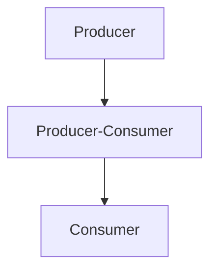

## 30.7. Event-Driven Systems with GenStage and Flow

In this section, we will explore the concepts and applications of event-driven systems using Elixir's GenStage and Flow libraries. These tools are essential for building efficient, scalable, and fault-tolerant data processing pipelines. We will delve into the core principles of event-driven architecture, how GenStage and Flow facilitate these principles, and practical use cases such as real-time analytics and ETL processes.

### Introduction to Event-Driven Systems

Event-driven systems are designed to respond to events or changes in state. These systems are highly decoupled, allowing for greater flexibility and scalability. In Elixir, event-driven systems are particularly powerful due to the language's concurrency model and the robustness of the BEAM virtual machine.

**Key Concepts:**

- **Event Producers and Consumers:** Producers generate events, while consumers process them.
- **Backpressure:** A mechanism to handle the flow of data between producers and consumers, ensuring that systems do not become overwhelmed.
- **Scalability:** The ability to handle increasing loads by distributing tasks across multiple nodes or processes.

### Understanding GenStage

GenStage is a specification and set of tools for building event-driven data processing pipelines in Elixir. It provides a way to define stages that can act as producers, consumers, or both.

#### Key Features of GenStage

- **Backpressure Management:** GenStage allows consumers to request data at their own pace, preventing overload.
- **Flexibility:** Stages can be composed in various ways to create complex processing pipelines.
- **Concurrency:** Leverages Elixir's lightweight processes for concurrent data processing.

#### Basic GenStage Architecture

A GenStage pipeline consists of three main components:

1. **Producer:** Generates data or events.
2. **Consumer:** Processes the data or events.
3. **Producer-Consumer:** Acts as both a producer and a consumer, transforming data as it passes through.

```elixir
defmodule MyProducer do
  use GenStage

  def start_link(initial) do
    GenStage.start_link(__MODULE__, initial, name: __MODULE__)
  end

  def init(initial) do
    {:producer, initial}
  end

  def handle_demand(demand, state) do
    events = Enum.to_list(1..demand)
    {:noreply, events, state}
  end
end

defmodule MyConsumer do
  use GenStage

  def start_link() do
    GenStage.start_link(__MODULE__, :ok, name: __MODULE__)
  end

  def init(:ok) do
    {:consumer, :the_state_does_not_matter}
  end

  def handle_events(events, _from, state) do
    for event <- events do
      IO.inspect(event)
    end
    {:noreply, [], state}
  end
end
```

### Introducing Flow

Flow builds on top of GenStage to provide a higher-level abstraction for data processing. It is designed for working with large volumes of data in parallel and distributed environments.

#### Key Features of Flow

- **Parallel Processing:** Automatically distributes work across available cores.
- **Batch Processing:** Efficiently handles large datasets by processing them in chunks.
- **Integration with GenStage:** Seamlessly integrates with GenStage for complex pipelines.

#### Basic Flow Example

```elixir
alias Experimental.Flow

Flow.from_enumerable(1..1000)
|> Flow.map(&(&1 * 2))
|> Flow.filter(&rem(&1, 2) == 0)
|> Flow.reduce(fn -> 0 end, &(&1 + &2))
|> Enum.to_list()
```

### Building Data Pipelines with GenStage and Flow

Data pipelines are essential for processing streams of data efficiently. GenStage and Flow provide the tools to build robust pipelines that can handle real-time data processing, ETL tasks, and more.

#### Designing a Data Pipeline

1. **Define the Stages:** Identify the producers, consumers, and any intermediate stages.
2. **Implement Backpressure:** Ensure that each stage can handle data at its own pace.
3. **Optimize for Scalability:** Use Flow to distribute tasks across multiple cores or nodes.

#### Example: Real-Time Analytics Pipeline

```elixir
defmodule AnalyticsProducer do
  use GenStage

  def start_link() do
    GenStage.start_link(__MODULE__, 0)
  end

  def init(counter) do
    {:producer, counter}
  end

  def handle_demand(demand, counter) do
    events = Enum.to_list(counter..(counter + demand - 1))
    {:noreply, events, counter + demand}
  end
end

defmodule AnalyticsProcessor do
  use GenStage

  def start_link() do
    GenStage.start_link(__MODULE__, :ok)
  end

  def init(:ok) do
    {:producer_consumer, :ok}
  end

  def handle_events(events, _from, state) do
    processed_events = Enum.map(events, &(&1 * 2))
    {:noreply, processed_events, state}
  end
end

defmodule AnalyticsConsumer do
  use GenStage

  def start_link() do
    GenStage.start_link(__MODULE__, :ok)
  end

  def init(:ok) do
    {:consumer, :ok}
  end

  def handle_events(events, _from, state) do
    Enum.each(events, &IO.inspect(&1))
    {:noreply, [], state}
  end
end

{:ok, producer} = AnalyticsProducer.start_link()
{:ok, processor} = AnalyticsProcessor.start_link()
{:ok, consumer} = AnalyticsConsumer.start_link()

GenStage.sync_subscribe(consumer, to: processor)
GenStage.sync_subscribe(processor, to: producer)
```

### Applications of Event-Driven Systems

Event-driven systems are applicable in various domains, including:

- **Real-Time Analytics:** Processing and analyzing data as it arrives.
- **ETL Processes:** Extracting, transforming, and loading data efficiently.
- **Job Processing:** Managing and executing tasks in a scalable manner.

### Benefits of Using GenStage and Flow

- **Efficient Resource Utilization:** By managing backpressure, systems can use resources more effectively.
- **Scalability:** Easily scale applications by adding more nodes or processes.
- **Fault Tolerance:** Built on Elixir's robust concurrency model, these systems are inherently fault-tolerant.

### Visualizing GenStage and Flow

Let's visualize a simple GenStage pipeline:


```mermaid
graph TD;
    A[Producer] --> B[Producer-Consumer]
    B --> C[Consumer]
```

**Diagram Explanation:** This diagram illustrates a basic GenStage pipeline with a producer generating data, a producer-consumer transforming the data, and a consumer processing the final output.

### Try It Yourself

Experiment with the provided examples by:

- Modifying the range of numbers processed in the `AnalyticsProducer`.
- Changing the transformation logic in the `AnalyticsProcessor`.
- Adding additional stages to the pipeline for more complex processing.

### References and Further Reading

- [Elixir GenStage Documentation](https://hexdocs.pm/gen_stage/GenStage.html)
- [Elixir Flow Documentation](https://hexdocs.pm/flow/Flow.html)
- [Event-Driven Architecture on Wikipedia](https://en.wikipedia.org/wiki/Event-driven_architecture)

### Knowledge Check

- What are the main components of a GenStage pipeline?
- How does backpressure work in GenStage?
- What are the benefits of using Flow for data processing?

### Embrace the Journey

Remember, this is just the beginning. As you delve deeper into event-driven systems with GenStage and Flow, you'll discover the power of Elixir's concurrency model in building scalable and efficient applications. Keep experimenting, stay curious, and enjoy the journey!

## Quiz Time!



### What is the primary purpose of GenStage in Elixir?

- [x] To build event-driven data processing pipelines
- [ ] To manage database connections
- [ ] To handle HTTP requests
- [ ] To create user interfaces

> **Explanation:** GenStage is designed to facilitate the creation of event-driven data processing pipelines in Elixir.

### How does backpressure work in GenStage?

- [x] Consumers request data at their own pace
- [ ] Producers send data as fast as possible
- [ ] Data is processed in a fixed time interval
- [ ] All data is processed in parallel

> **Explanation:** In GenStage, backpressure allows consumers to request data at their own pace, preventing overload.

### Which of the following is a key feature of Flow?

- [x] Parallel processing
- [ ] Managing database migrations
- [ ] Handling user authentication
- [ ] Creating web sockets

> **Explanation:** Flow is designed for parallel processing of large volumes of data.

### What is a common application of event-driven systems?

- [x] Real-time analytics
- [ ] Static website hosting
- [ ] File storage
- [ ] Image rendering

> **Explanation:** Event-driven systems are often used for real-time analytics, where data needs to be processed as it arrives.

### In a GenStage pipeline, what role does a producer-consumer play?

- [x] It acts as both a producer and a consumer
- [ ] It only generates data
- [ ] It only processes data
- [ ] It stores data

> **Explanation:** A producer-consumer in GenStage acts as both a producer and a consumer, transforming data as it passes through.

### What is the benefit of using backpressure in data pipelines?

- [x] Prevents system overload
- [ ] Increases data redundancy
- [ ] Reduces data accuracy
- [ ] Speeds up data transmission

> **Explanation:** Backpressure prevents system overload by allowing consumers to process data at their own pace.

### Which Elixir feature does Flow leverage for its operations?

- [x] Lightweight processes
- [ ] Synchronous I/O
- [ ] Global variables
- [ ] Static typing

> **Explanation:** Flow leverages Elixir's lightweight processes to perform parallel data processing.

### What is an advantage of using GenStage for job processing?

- [x] Scalability
- [ ] Increased latency
- [ ] Reduced concurrency
- [ ] Complex setup

> **Explanation:** GenStage provides scalability, making it suitable for job processing where tasks can be distributed across multiple nodes.

### What is the role of a consumer in a GenStage pipeline?

- [x] Processes data
- [ ] Generates data
- [ ] Transforms data
- [ ] Stores data

> **Explanation:** In a GenStage pipeline, a consumer processes the data it receives.

### True or False: Flow can only be used with GenStage.

- [ ] True
- [x] False

> **Explanation:** While Flow is built on top of GenStage, it can be used independently for parallel and distributed data processing.


