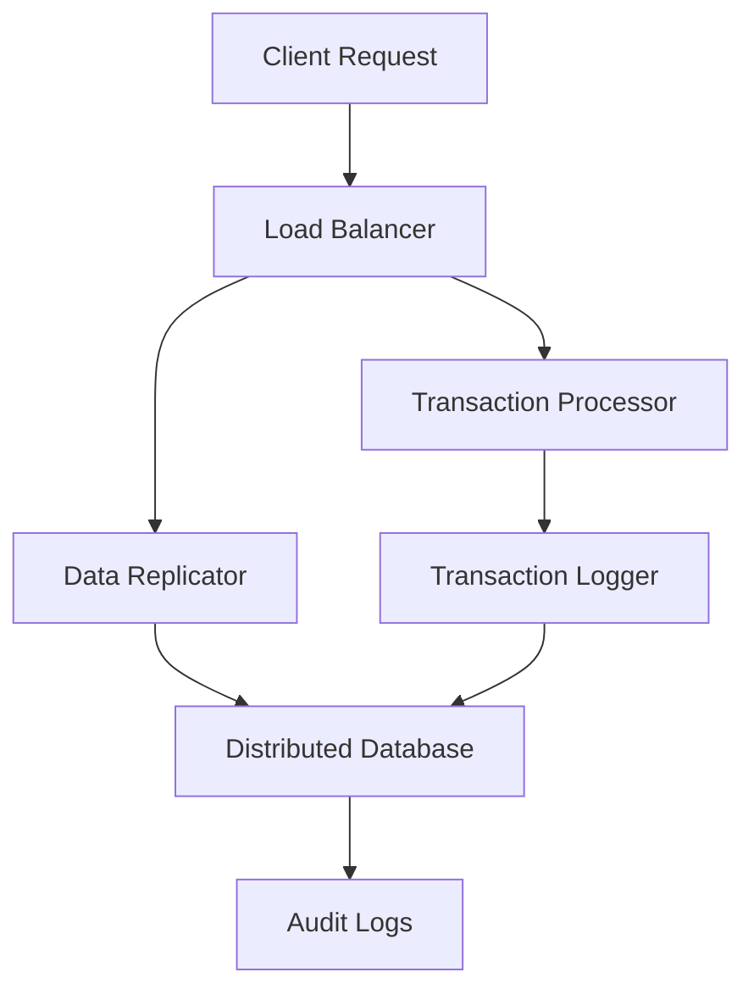

## 30.8. Fault-Tolerant Systems in Finance

In the world of finance, where transactions are the lifeblood of operations, ensuring fault tolerance is not just a luxury—it's a necessity. Financial systems must handle vast amounts of data, process transactions consistently, and maintain zero data loss, all while adhering to stringent regulatory standards. Elixir, with its robust concurrency model and fault-tolerant design, is an ideal choice for building such systems. In this section, we will explore how to leverage Elixir's features to create resilient financial applications.

### Understanding Fault Tolerance in Finance

Fault tolerance refers to a system's ability to continue operating properly in the event of the failure of some of its components. In finance, this means ensuring that transactions are processed accurately and data integrity is maintained, even in the face of hardware failures, network issues, or software bugs.

#### Critical Requirements

1. **Zero Data Loss**: Financial systems must ensure that no data is lost during processing. This involves maintaining transaction logs and using distributed databases to replicate data across multiple nodes.
   
2. **Consistent Transaction Processing**: Transactions must be processed in a consistent manner, ensuring that all operations are completed successfully or rolled back in case of failure.

3. **Regulatory Compliance**: Financial systems must comply with various regulatory standards, which often require robust security measures and reliable data handling.

### Elixir Solutions for Fault Tolerance

Elixir provides several features and patterns that are particularly well-suited for building fault-tolerant systems in finance. Let's explore some of these solutions.

#### Supervision Trees

Supervision trees are a core concept in Elixir's OTP (Open Telecom Platform) framework. They provide a hierarchical structure for managing processes, allowing you to define how your application should respond to failures.

**Key Concepts:**

- **Supervisors**: These are processes that monitor other processes, known as workers. If a worker process crashes, the supervisor can restart it according to a predefined strategy.
  
- **Restart Strategies**: Supervisors can be configured with different restart strategies, such as `:one_for_one`, `:one_for_all`, or `:rest_for_one`, depending on the desired behavior when a process fails.

**Example:**

```elixir
defmodule FinanceApp.Supervisor do
  use Supervisor

  def start_link(init_arg) do
    Supervisor.start_link(__MODULE__, init_arg, name: __MODULE__)
  end

  def init(_init_arg) do
    children = [
      {FinanceApp.TransactionProcessor, []},
      {FinanceApp.DataReplicator, []}
    ]

    Supervisor.init(children, strategy: :one_for_one)
  end
end
```

In this example, we define a supervisor that manages two worker processes: `TransactionProcessor` and `DataReplicator`. The `:one_for_one` strategy ensures that if one process crashes, only that process is restarted.

#### Transaction Logs

Transaction logs are essential for maintaining data integrity and ensuring zero data loss. By logging each transaction, you can recover from failures and ensure that all operations are eventually completed.

**Implementation Tips:**

- Use Elixir's `Logger` module to record transaction details.
- Store logs in a distributed database to ensure they are available even if a node fails.
- Implement a mechanism to replay logs and recover from failures.

**Example:**

```elixir
defmodule FinanceApp.TransactionLogger do
  require Logger

  def log_transaction(transaction) do
    Logger.info("Transaction logged: #{inspect(transaction)}")
    # Store the transaction in a distributed database
    :ok
  end
end
```

#### Distributed Databases

Distributed databases are crucial for ensuring data availability and fault tolerance. By replicating data across multiple nodes, you can ensure that your system remains operational even if one or more nodes fail.

**Popular Choices:**

- **Cassandra**: Known for its high availability and scalability.
- **Riak**: Offers strong consistency and fault tolerance.
- **PostgreSQL with Citus**: Provides horizontal scaling and distributed capabilities.

**Integration with Elixir:**

Elixir provides several libraries for interacting with distributed databases, such as `Ecto` for PostgreSQL and `Cassandrax` for Cassandra. These libraries offer a convenient way to manage database connections and perform operations.

**Example:**

```elixir
defmodule FinanceApp.Repo do
  use Ecto.Repo,
    otp_app: :finance_app,
    adapter: Ecto.Adapters.Postgres
end
```

### Compliance with Regulatory Standards

Compliance is a critical aspect of financial systems. Elixir's features can help you meet regulatory requirements for security and reliability.

#### Security Measures

- **Data Encryption**: Use libraries like `Comeonin` and `Argon2` for encrypting sensitive data.
- **Secure Communication**: Implement SSL/TLS for secure data transmission.

#### Reliability

- **Audit Logs**: Maintain detailed logs of all operations for auditing purposes.
- **Access Controls**: Implement role-based access controls to ensure that only authorized users can perform certain actions.

### Visualizing Fault-Tolerant Architectures

To better understand how these components fit together, let's visualize a fault-tolerant architecture for a financial system using Mermaid.js.



**Diagram Description:**

- **Client Request**: Represents incoming requests from clients.
- **Load Balancer**: Distributes requests across multiple instances of the application.
- **Transaction Processor**: Handles transaction processing and ensures consistency.
- **Data Replicator**: Replicates data across nodes to ensure availability.
- **Transaction Logger**: Logs transactions for recovery and auditing.
- **Distributed Database**: Stores data in a fault-tolerant manner.
- **Audit Logs**: Maintains logs for compliance and auditing.

### Try It Yourself

To gain a deeper understanding of these concepts, try modifying the code examples provided. For instance, experiment with different restart strategies in the supervision tree or implement a simple transaction log using a distributed database.

### Knowledge Check

- What are the key components of a fault-tolerant system in finance?
- How can supervision trees help in building resilient applications?
- Why are transaction logs important for data integrity?

### Summary

In this section, we've explored how to build fault-tolerant systems in finance using Elixir. By leveraging supervision trees, transaction logs, and distributed databases, you can create applications that are resilient, reliable, and compliant with regulatory standards. Remember, building fault-tolerant systems is an ongoing process that requires careful planning and continuous improvement.

## Quiz: Fault-Tolerant Systems in Finance



### What is a key requirement for fault-tolerant systems in finance?

- [x] Zero data loss
- [ ] High latency
- [ ] Inconsistent transaction processing
- [ ] Manual error recovery

> **Explanation:** Zero data loss is crucial to ensure data integrity and reliability in financial systems.

### Which Elixir feature is used to manage process failures?

- [x] Supervision trees
- [ ] GenServer
- [ ] Task
- [ ] Agent

> **Explanation:** Supervision trees are used to monitor and restart processes in case of failure.

### What is the purpose of transaction logs in financial systems?

- [x] To maintain data integrity and ensure zero data loss
- [ ] To increase system latency
- [ ] To reduce system complexity
- [ ] To store user preferences

> **Explanation:** Transaction logs help maintain data integrity by recording all transactions, allowing for recovery in case of failure.

### Which database is known for high availability and scalability?

- [x] Cassandra
- [ ] MySQL
- [ ] SQLite
- [ ] MongoDB

> **Explanation:** Cassandra is known for its high availability and scalability, making it suitable for distributed systems.

### What is a common strategy for ensuring secure communication in financial systems?

- [x] Implementing SSL/TLS
- [ ] Using plain text transmission
- [ ] Disabling encryption
- [ ] Storing passwords in plain text

> **Explanation:** SSL/TLS is used to secure data transmission and protect against eavesdropping.

### What is the role of a load balancer in a fault-tolerant architecture?

- [x] To distribute requests across multiple instances
- [ ] To store transaction logs
- [ ] To encrypt data
- [ ] To replicate data

> **Explanation:** A load balancer distributes incoming requests across multiple instances to ensure availability and reliability.

### How can Elixir help in meeting regulatory compliance?

- [x] By providing robust security measures and reliable data handling
- [ ] By increasing system complexity
- [ ] By reducing data integrity
- [ ] By disabling logging

> **Explanation:** Elixir's features support robust security measures and reliable data handling, aiding in regulatory compliance.

### What is the benefit of using distributed databases in financial systems?

- [x] Ensuring data availability and fault tolerance
- [ ] Increasing system latency
- [ ] Reducing data integrity
- [ ] Storing data in a single location

> **Explanation:** Distributed databases replicate data across nodes, ensuring availability and fault tolerance.

### Which Elixir library is commonly used for encrypting sensitive data?

- [x] Comeonin
- [ ] Logger
- [ ] Ecto
- [ ] Phoenix

> **Explanation:** Comeonin is a library used for encrypting sensitive data in Elixir applications.

### True or False: Supervision trees can only restart all processes when a failure occurs.

- [ ] True
- [x] False

> **Explanation:** Supervision trees can be configured with different restart strategies, such as `:one_for_one`, which restarts only the failed process.



Remember, this is just the beginning. As you progress, you'll build more complex and interactive financial systems. Keep experimenting, stay curious, and enjoy the journey!
