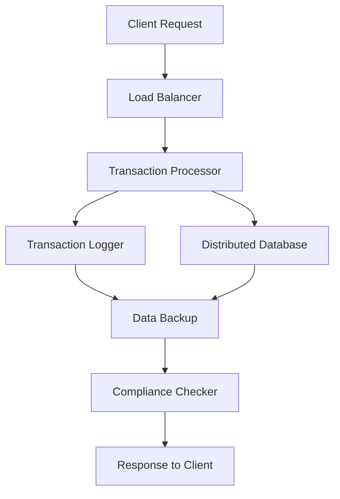

## 30.8. Fault-Tolerant Systems in Finance

In the fast-paced world of finance, fault tolerance is not just a luxury—it's a necessity. Financial systems must be robust, ensuring zero data loss and consistent transaction processing, even in the face of failures. Elixir, with its strong foundation in the Erlang VM and OTP (Open Telecom Platform), offers powerful tools and design patterns to build fault-tolerant systems. This section explores how Elixir can be leveraged to create resilient financial systems, ensuring compliance with regulatory standards and maintaining high reliability.

### Critical Requirements for Financial Systems

Before diving into Elixir solutions, let's outline the critical requirements for financial systems:

- **Zero Data Loss:** Financial systems must ensure that no data is lost during transactions. This requires robust data storage and backup mechanisms.
- **Consistent Transaction Processing:** Transactions must be processed consistently, ensuring atomicity, consistency, isolation, and durability (ACID properties).
- **High Availability:** Systems must be available 24/7, with minimal downtime.
- **Security and Compliance:** Financial systems must adhere to strict security and regulatory standards, such as GDPR, PCI DSS, and others.
- **Scalability:** The ability to handle increasing loads without performance degradation.

### Elixir Solutions for Fault Tolerance

Elixir offers several features and design patterns that make it ideal for building fault-tolerant systems:

#### Supervision Trees

Supervision trees are a fundamental concept in Elixir for building fault-tolerant systems. They provide a hierarchical structure for managing processes, ensuring that failures are isolated and recovery is automatic.

```elixir
defmodule FinancialApp.Supervisor do
  use Supervisor

  def start_link(init_arg) do
    Supervisor.start_link(__MODULE__, init_arg, name: __MODULE__)
  end

  def init(_init_arg) do
    children = [
      {FinancialApp.TransactionProcessor, []},
      {FinancialApp.DataBackup, []}
    ]

    Supervisor.init(children, strategy: :one_for_one)
  end
end
```

In this example, the `FinancialApp.Supervisor` manages two child processes: `TransactionProcessor` and `DataBackup`. If either process crashes, the supervisor will restart it, ensuring continuous operation.

#### Transaction Logs

Transaction logs are critical for ensuring zero data loss and consistent transaction processing. By logging each transaction, systems can recover from failures and ensure data integrity.

```elixir
defmodule FinancialApp.TransactionLogger do
  @log_file "transaction_log.txt"

  def log_transaction(transaction) do
    File.write(@log_file, "#{inspect(transaction)}\n", [:append])
  end
end
```

This simple transaction logger appends each transaction to a log file. In a real-world application, you would use a more robust logging mechanism, potentially integrating with distributed databases.

#### Distributed Databases

Distributed databases, such as Cassandra or Riak, provide high availability and fault tolerance by replicating data across multiple nodes. Elixir's concurrency model makes it well-suited for interacting with distributed databases.

```elixir
defmodule FinancialApp.Database do
  use GenServer

  def start_link(_) do
    GenServer.start_link(__MODULE__, %{}, name: __MODULE__)
  end

  def init(state) do
    {:ok, state}
  end

  def handle_call({:write, key, value}, _from, state) do
    # Simulate writing to a distributed database
    {:reply, :ok, Map.put(state, key, value)}
  end

  def handle_call({:read, key}, _from, state) do
    {:reply, Map.get(state, key), state}
  end
end
```

This GenServer simulates interactions with a distributed database. In practice, you would use a library like Ecto to interface with a real database.

### Compliance and Security

Ensuring compliance with regulatory standards is critical in financial systems. Elixir provides several tools and libraries to help meet these requirements:

- **Encryption:** Use libraries like `Comeonin` and `Argon2` for secure password hashing and encryption.
- **Secure Communication:** Implement SSL/TLS for secure data transmission.
- **Access Control:** Use libraries like `Guardian` for authentication and authorization.

### Visualizing Fault Tolerance in Elixir

To better understand how these components work together, let's visualize a typical fault-tolerant architecture in Elixir:


```mermaid
graph TD;
    A[Client Request] --> B[Load Balancer];
    B --> C[Transaction Processor];
    C --> D[Transaction Logger];
    C --> E[Distributed Database];
    D --> F[Data Backup];
    E --> F;
    F --> G[Compliance Checker];
    G --> H[Response to Client];
```

**Diagram Description:** This diagram illustrates the flow of a client request through a fault-tolerant financial system built with Elixir. The load balancer distributes requests to transaction processors, which log transactions and interact with a distributed database. Data backup and compliance checks ensure reliability and regulatory adherence.

### Try It Yourself

Experiment with the code examples provided by modifying the supervision strategy or adding additional processes to the supervision tree. Consider implementing a more sophisticated transaction logging mechanism or integrating with a real distributed database.

### Knowledge Check

- What are the key components of a fault-tolerant system in finance?
- How do supervision trees contribute to fault tolerance in Elixir?
- Why are transaction logs important for financial systems?
- What are some compliance considerations for financial systems?

### Key Takeaways

- Elixir's supervision trees and OTP features provide a solid foundation for building fault-tolerant systems.
- Transaction logs and distributed databases are critical for ensuring zero data loss and consistent transaction processing.
- Compliance with regulatory standards is essential for financial systems, and Elixir offers tools to support secure and reliable development.

### Embrace the Journey

Building fault-tolerant systems in finance is a challenging but rewarding endeavor. With Elixir's powerful features and design patterns, you can create robust and reliable systems that meet the demanding requirements of the financial industry. Remember, this is just the beginning. Keep experimenting, stay curious, and enjoy the journey!

## Quiz Time!



### What is the primary purpose of supervision trees in Elixir?

- [x] To manage process lifecycles and ensure fault tolerance
- [ ] To log transactions
- [ ] To handle database interactions
- [ ] To implement encryption

> **Explanation:** Supervision trees manage process lifecycles, ensuring that if a process fails, it is restarted automatically, contributing to fault tolerance.

### Which feature of Elixir is crucial for ensuring zero data loss in financial systems?

- [ ] GenServer
- [x] Transaction logs
- [ ] Pattern matching
- [ ] The pipe operator

> **Explanation:** Transaction logs are crucial for ensuring zero data loss, as they record each transaction, allowing for recovery in case of failure.

### What is a key benefit of using distributed databases in financial systems?

- [x] High availability and fault tolerance
- [ ] Simplified code structure
- [ ] Faster transaction processing
- [ ] Easier compliance with regulations

> **Explanation:** Distributed databases provide high availability and fault tolerance by replicating data across multiple nodes.

### Which Elixir library is commonly used for secure password hashing?

- [ ] Ecto
- [x] Comeonin
- [ ] Phoenix
- [ ] Logger

> **Explanation:** Comeonin is a library used for secure password hashing in Elixir applications.

### What is the role of the `Guardian` library in Elixir?

- [ ] To manage distributed databases
- [x] To handle authentication and authorization
- [ ] To implement supervision trees
- [ ] To log transactions

> **Explanation:** Guardian is used for authentication and authorization in Elixir applications.

### Which regulatory standard might a financial system need to comply with?

- [x] GDPR
- [ ] HTML
- [ ] CSS
- [ ] JSON

> **Explanation:** GDPR is a regulatory standard that financial systems might need to comply with, ensuring data protection and privacy.

### What is the primary goal of fault-tolerant systems in finance?

- [x] To ensure zero data loss and consistent transaction processing
- [ ] To simplify code structure
- [ ] To enhance user interface design
- [ ] To increase transaction speed

> **Explanation:** The primary goal of fault-tolerant systems in finance is to ensure zero data loss and consistent transaction processing.

### Which Elixir feature is used to interact with distributed databases?

- [ ] Supervisor
- [x] GenServer
- [ ] Pipe operator
- [ ] Pattern matching

> **Explanation:** GenServer is used to interact with distributed databases in Elixir applications.

### What is a common strategy for handling failures in Elixir?

- [x] Using supervision trees
- [ ] Ignoring errors
- [ ] Logging all transactions
- [ ] Disabling processes

> **Explanation:** Using supervision trees is a common strategy for handling failures, as they automatically restart failed processes.

### True or False: Elixir's concurrency model is well-suited for building fault-tolerant financial systems.

- [x] True
- [ ] False

> **Explanation:** True. Elixir's concurrency model, based on the Actor model, is well-suited for building fault-tolerant financial systems.


