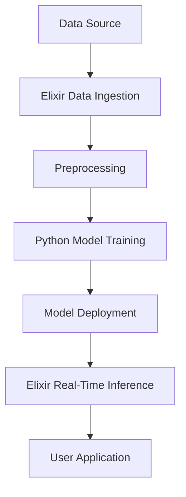

## 30.9. Using Elixir in Machine Learning Projects

As the demand for machine learning (ML) solutions continues to grow, the need for robust, scalable, and efficient systems becomes increasingly important. Elixir, with its functional programming paradigm and powerful concurrency model, offers unique advantages for building ML applications. In this section, we will explore how Elixir can be leveraged in machine learning projects, focusing on real-time inference, efficient data processing, and hybrid approaches with languages like Python.

### Real-Time Inference

Real-time inference involves integrating trained machine learning models into applications to provide instant predictions. This is crucial for applications such as fraud detection, recommendation systems, and real-time analytics.

#### Integrating Trained Models

To integrate trained models into Elixir applications, we can use several approaches:

1. **Using Ports and NIFs**: Elixir can communicate with external processes using ports or Native Implemented Functions (NIFs). This allows us to run models written in other languages, such as Python or C++, and integrate their predictions into Elixir applications.

2. **RESTful APIs**: Deploy the model as a RESTful service and use HTTP clients in Elixir to send data and receive predictions.

3. **gRPC**: Use gRPC for efficient communication between Elixir and the model server, which can be written in any language that supports gRPC.

#### Example: Real-Time Sentiment Analysis

Let's consider a simple example of integrating a sentiment analysis model into an Elixir application using a RESTful API.

```elixir
defmodule SentimentAnalyzer do
  @moduledoc """
  A module for analyzing sentiment using an external RESTful API.
  """

  @api_url "http://localhost:5000/predict"

  @doc """
  Analyzes the sentiment of the given text.

  ## Examples

      iex> SentimentAnalyzer.analyze("I love Elixir!")
      {:ok, "positive"}

  """
  def analyze(text) do
    body = %{text: text} |> Jason.encode!()

    case HTTPoison.post(@api_url, body, [{"Content-Type", "application/json"}]) do
      {:ok, %HTTPoison.Response{status_code: 200, body: body}} ->
        {:ok, Jason.decode!(body)["sentiment"]}

      {:error, %HTTPoison.Error{reason: reason}} ->
        {:error, reason}
    end
  end
end
```

In this example, we define a module `SentimentAnalyzer` that sends a text to a RESTful API and receives the sentiment as a response. The API is assumed to be running a machine learning model that performs sentiment analysis.

#### Try It Yourself

Experiment with the code by modifying the `@api_url` to point to your own sentiment analysis service. You can also try integrating other types of models, such as image classifiers or recommendation engines.

### Data Processing

Efficient data processing is a critical component of any machine learning pipeline. Elixir's concurrency model and functional programming features make it well-suited for handling large datasets.

#### Handling Large Datasets

Elixir provides several tools for processing large datasets efficiently:

1. **Streams**: Use Elixir's `Stream` module for lazy evaluation, which allows you to process large datasets without loading them entirely into memory.

2. **GenStage and Flow**: These libraries provide abstractions for building data processing pipelines with backpressure, ensuring that your application remains responsive even under heavy load.

#### Example: Processing a Large CSV File

Let's look at an example of processing a large CSV file using Elixir's `Stream` module.

```elixir
defmodule CSVProcessor do
  @moduledoc """
  A module for processing large CSV files.
  """

  @doc """
  Processes a CSV file and prints each row.

  ## Examples

      iex> CSVProcessor.process("large_file.csv")
      :ok

  """
  def process(file_path) do
    file_path
    |> File.stream!()
    |> Stream.map(&String.split(&1, ","))
    |> Stream.each(&IO.inspect/1)
    |> Stream.run()
  end
end
```

In this example, we define a module `CSVProcessor` that reads a CSV file line by line, splits each line into columns, and prints the result. The use of `Stream` ensures that we only process one line at a time, making it suitable for large files.

#### Try It Yourself

Modify the `CSVProcessor` module to perform more complex operations, such as filtering rows or aggregating data. You can also try using `GenStage` or `Flow` for more advanced data processing pipelines.

### Hybrid Approaches

While Elixir is powerful, it may not have the same level of support for machine learning libraries as languages like Python. However, we can combine Elixir with Python or other ML languages to leverage the strengths of both ecosystems.

#### Combining Elixir with Python

One common approach is to use Elixir for data processing and orchestration, while delegating model training and inference to Python. This can be achieved using:

1. **Ports and NIFs**: As mentioned earlier, these allow Elixir to communicate with external processes, such as Python scripts.

2. **External Services**: Deploy Python models as services and use Elixir to interact with them via HTTP or gRPC.

#### Example: Hybrid ML Pipeline

Let's consider a hybrid machine learning pipeline where Elixir handles data ingestion and preprocessing, while Python is used for model training and inference.

```elixir
defmodule DataIngestion do
  @moduledoc """
  A module for ingesting and preprocessing data.
  """

  @doc """
  Ingests data from a source and preprocesses it.

  ## Examples

      iex> DataIngestion.ingest("data_source")
      :ok

  """
  def ingest(source) do
    # Simulate data ingestion
    data = File.read!(source)

    # Preprocess data
    preprocessed_data = preprocess(data)

    # Send preprocessed data to Python for training
    send_to_python(preprocessed_data)
  end

  defp preprocess(data) do
    # Perform data preprocessing
    String.upcase(data)
  end

  defp send_to_python(data) do
    # Simulate sending data to a Python script
    IO.puts("Sending data to Python: #{data}")
  end
end
```

In this example, the `DataIngestion` module ingests data from a source, preprocesses it, and sends it to a Python script for further processing. This demonstrates how Elixir can be used to orchestrate a machine learning pipeline.

#### Try It Yourself

Extend the `DataIngestion` module to handle more complex preprocessing tasks, such as feature extraction or normalization. You can also implement the Python script to perform model training and inference.

### Visualizing Elixir's Role in ML Projects

To better understand how Elixir fits into machine learning projects, let's visualize a typical architecture using Mermaid.js.



In this diagram, we see a flow from data ingestion and preprocessing in Elixir to model training in Python. The trained model is then deployed, and Elixir handles real-time inference, providing predictions to the user application.

### References and Further Reading

- [Elixir Streams](https://hexdocs.pm/elixir/Stream.html)
- [GenStage and Flow](https://hexdocs.pm/gen_stage/GenStage.html)
- [HTTPoison](https://hexdocs.pm/httpoison/HTTPoison.html)
- [gRPC](https://grpc.io/)
- [Python Machine Learning Libraries](https://scikit-learn.org/stable/)

### Knowledge Check

1. **What are the benefits of using Elixir for real-time inference?**
   - Discuss the advantages of Elixir's concurrency model for handling real-time predictions.

2. **How can Elixir handle large datasets efficiently?**
   - Explain the role of streams and backpressure in processing large datasets.

3. **What are some hybrid approaches for combining Elixir with Python?**
   - Describe how Elixir and Python can be used together in a machine learning pipeline.

### Summary

In this section, we've explored how Elixir can be used in machine learning projects, focusing on real-time inference, efficient data processing, and hybrid approaches with Python. By leveraging Elixir's strengths in concurrency and functional programming, we can build robust and scalable ML applications. Remember, this is just the beginning. As you continue to explore Elixir's capabilities, you'll discover even more ways to integrate it into your machine learning projects. Keep experimenting, stay curious, and enjoy the journey!

## Quiz: Using Elixir in Machine Learning Projects



### What is a common method for integrating trained models into Elixir applications?

- [x] Using RESTful APIs
- [ ] Using only Elixir's built-in libraries
- [ ] Using Elixir's GenServer
- [ ] Using Elixir's Mix tool

> **Explanation:** RESTful APIs allow Elixir to communicate with models deployed as services, regardless of the language they are written in.

### Which Elixir feature is particularly useful for processing large datasets?

- [x] Streams
- [ ] GenServer
- [ ] Mix
- [ ] ExUnit

> **Explanation:** Streams in Elixir provide lazy evaluation, allowing efficient processing of large datasets without loading them entirely into memory.

### How can Elixir and Python be combined in a machine learning project?

- [x] Using Ports and NIFs
- [ ] Using Elixir's GenStage
- [ ] Using Elixir's Mix tool
- [ ] Using Elixir's ExUnit

> **Explanation:** Ports and NIFs enable Elixir to communicate with external processes, such as Python scripts, allowing for hybrid ML pipelines.

### What is the role of Elixir in a hybrid ML pipeline?

- [x] Data ingestion and preprocessing
- [ ] Model training
- [ ] Model deployment
- [ ] User interface design

> **Explanation:** Elixir is often used for data ingestion and preprocessing due to its concurrency model, while Python handles model training.

### What is a benefit of using gRPC in Elixir ML projects?

- [x] Efficient communication between services
- [ ] Simplified user interface design
- [ ] Enhanced data visualization
- [ ] Improved error handling

> **Explanation:** gRPC provides efficient communication between services, which is beneficial for integrating Elixir with model servers.

### Which Elixir library is used for building data processing pipelines with backpressure?

- [x] GenStage
- [ ] ExUnit
- [ ] Mix
- [ ] Phoenix

> **Explanation:** GenStage provides abstractions for building data processing pipelines with backpressure, ensuring responsiveness under load.

### What is a key advantage of using Elixir for real-time inference?

- [x] Concurrency model
- [ ] Built-in machine learning libraries
- [ ] Extensive data visualization tools
- [ ] Native support for Python

> **Explanation:** Elixir's concurrency model allows for efficient handling of real-time predictions, making it suitable for inference tasks.

### What is an example of a hybrid approach in ML projects?

- [x] Using Elixir for preprocessing and Python for model training
- [ ] Using only Elixir for all ML tasks
- [ ] Using Python for preprocessing and Elixir for model training
- [ ] Using Elixir for data visualization and Python for inference

> **Explanation:** A hybrid approach often involves using Elixir for data preprocessing and orchestration, while Python handles model training and inference.

### How does Elixir's functional programming paradigm benefit ML projects?

- [x] Encourages immutability and pure functions
- [ ] Provides built-in ML algorithms
- [ ] Simplifies user interface design
- [ ] Enhances data visualization

> **Explanation:** Elixir's functional programming paradigm encourages immutability and pure functions, which are beneficial for building reliable and maintainable ML applications.

### True or False: Elixir can only be used for data preprocessing in ML projects.

- [ ] True
- [x] False

> **Explanation:** While Elixir is often used for data preprocessing, it can also handle real-time inference and integration with other ML languages.


